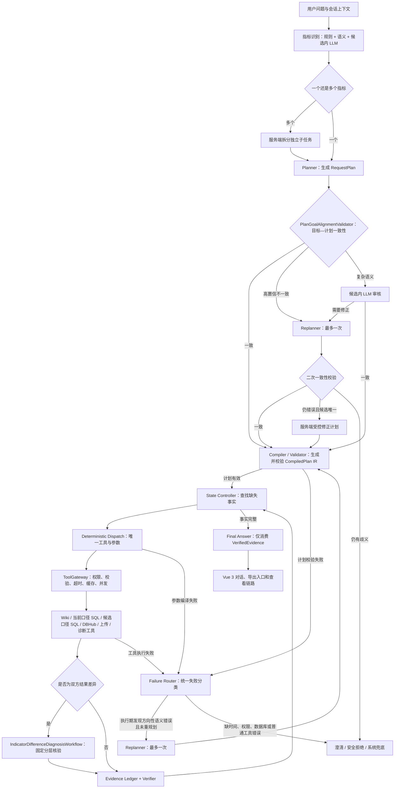

# 医院核心制度指标 Agent

本项目当前采用单一生产技术栈：

```text
Vue 3 + TypeScript
        │ HTTP / SSE
        ▼
Java 17 + Spring Boot 3.5.16 + Spring AI 1.1.8
        ├── core-rules-wiki：规则、医院口径、字段映射和 SQL 规格
        ├── SQLite：账号、会话、Trace、Evidence、审批和运行对象
        ├── DBHub sidecar：只读访问医院 SQL Server
        └── Ollama / DeepSeek API：Planner、候选消歧和最终回答
```

Python FastAPI 运行时、Python 测试、旧原生前端和双栈切流脚本已经退役。旧实现可从 Git 历史恢复，但不在当前源码树中保留第二套可运行实现。部署机不需要 Python，也不需要 MySQL。

## 当前能力

- 指标识别：正式名称/审核同义词规则匹配、本地字符语义召回、候选范围内 LLM 消歧。
- 多指标请求：服务端确定性拆分 2～3 个指标；API 模型最多并发 2，本地 Ollama 串行。
- 指标解释：查询 Wiki 中的定义、公式、分子、分母、本院覆盖口径和版本。
- 指标计算：从 Wiki 读取受控 SQL 规格，确定性生成 SQL，经安全校验后只通过 DBHub 试运行。
- SQL 解释：生成受控 SQL 时同步展示本院生效定义、公式、分子、分母、纳入和排除口径，避免脚本与业务口径脱节。
- 候选口径模拟：对“那根据入区怎么算”等追问，从 Wiki 的已审批候选 profile 中按规则、本地字符语义和候选内 LLM 消歧，复用上一轮指标与统计周期，生成受控 SQL 并只读试运行；未设置失效日期的 profile 按长期有效处理，回答明确标注为模拟口径。
- 目标一致性校验：Planner 之后、IR 编译之前确定性核对原问题与计划；明确区分“根据什么口径算的”这类当前规则追问与“根据入区怎么算”这类候选模拟，复杂语义才调用审核模型，确认不一致时最多 Replan 一次，仍错误且存在唯一安全方向时由服务端生成受控修正计划。
- 多轮上下文：按医院、用户和会话保存当前指标、候选 profile、已解析统计区间及 `RUN_*` 引用；Planner 只返回同名指标而漏掉 `rule_id` 时，会安全复用上一轮已确认身份，“这个口径的 SQL 怎么写”等追问自动沿用上一轮候选口径和结构化范围。
- 小模型稳定性：当 SQL 追问未提供新时间且上一轮指标、周期均已确认时，服务端直接编译 `indicator_sql_prepare` 计划，不再要求本地 8B 重复生成相同 JSON 计划。
- 明细核对：为成功试运行生成短期分子/分母快照，分页查看并导出 Excel。
- 上传比较：分析 `.xlsx` 汇总或逐条明细，输出双方都有、仅系统有、仅文件有及字段差异。
- 结果差异分层诊断：对“用户100、系统98”和上传文件核对自动进入固定 Workflow，依次执行范围预检、实时结构、候选口径、记录集合和数据质量检查；候选口径按分子、分母、指标率分级判断为“完全匹配、部分匹配、未匹配”，完整一致才确认原因，部分一致且有口径证据时标记高度相关并继续核对剩余差异，单个含义不明的数值命中只标记可能相关。
- 通用异常诊断：只处理没有外部对比对象的指标异常、结果偏低或计算错误，不再与结果差异诊断混用。
- 指标实施：草稿、字段映射、SQL 生成、试运行、提交审批、发布和历史恢复。
- 医学术语：标准概念、同义词、医院值映射、审批发布和确定性识别测试。
- 指标监控：计划、历史结果、波动检测、预警确认/关闭/重新诊断。
- 可观测性：单轮 Trace 瀑布图、父子节点、子任务泳道，以及跨运行 p50/p95/p99 和工具/模型统计。
- 按需回答模板：Final Answer 根据已校验意图和输出目标每轮只加载一份独立 Markdown 模板；指标解释、计算结果、文件分析和各类报告使用统一的“结论速览—数据表—口径依据—证据限制”结构，模板编号、版本和契约校验结果写入 Trace。
- 安全 Markdown 展示：Vue 使用不执行 HTML 的内置 Markdown 子集渲染标题、引用摘要、数据表、列表和代码块，不增加前端依赖，也不会执行模型返回的脚本。
- 实时阶段：每条 Agent 回答在标题后保留一个当前状态槽，按 SSE 节点从 LLM、代码、工具和存储阶段排队逐项切换；毫秒级节点设置最短可见时间，避免被同一渲染帧覆盖。完整历史只在“查看链路”中展示，回答结束后显示本轮端到端耗时。
- 完整调试参数：Planner Trace 同时输出模型原文和完整 `RequestPlan`；授权链路中的非敏感输入输出不再按字符数裁剪，凭证、受控 SQL 正文和患者原始行仍保持脱敏。

## Agent 执行架构



LLM 不直接决定工具名，不生成自由执行步骤，不负责 SQL 安全，也不能读取患者级明细。工具和前置依赖来自 Java `CapabilitySpecRegistry`，真正的调用由 `ToolGateway` 阻断或放行。

## 模型

| 模型 ID | 提供方 | 用途 |
|---|---|---|
| `ollama-qwen3` | 本地 Ollama | 4B 本地模型，适合资源受限环境 |
| `ollama-qwen3-8b-thinking` | 本地 Ollama | 8B 思考模式，本地串行调用 |
| `aliyun-qwen3-14b` | 阿里云百炼 OpenAI 兼容 API | Qwen3 14B；默认关闭思考以降低 Planner 延迟 |
| `deepseek-v4-flash` | DeepSeek OpenAI 兼容 API | 较快的在线模型 |
| `deepseek-v4-pro` | DeepSeek OpenAI 兼容 API | 复杂语义和回答组织 |

模型配置集中在 [`application.yml`](backend-java/src/main/resources/application.yml)，提示词集中在 [`backend-java/src/main/resources/prompts`](backend-java/src/main/resources/prompts)。

## 目录

```text
backend-java/                 Java 17 + Spring Boot 3.5 单运行时及测试
frontend-vue/                 Vue 3 + TypeScript 前端
core-rules-wiki/              规则、医院覆盖、映射、SQL 规格和索引
contracts/                    稳定接口与数据契约
evaluations/                  不绑定运行语言的评测用例数据
scripts/
  build-java-vue.ps1          构建包含 Vue 的单 JAR
  start-java-runtime.ps1      不依赖 Python 的启动器
  init_runtime_sqlite.sql     SQLite 运行库参考建表脚本
tools/dbhub/                  DBHub sidecar 配置和启动脚本
docs/                         当前架构、运维记录和历史设计资料
```

## 环境要求

运行环境：

- Java 17。
- Spring Boot 固定为 `3.5.16`，Spring AI 固定为与之兼容的 `1.1.8`。
- DBHub sidecar；只有需要访问医院业务数据时才必须启动。
- Ollama、可访问的 DeepSeek API 或阿里云百炼 API。
- 内嵌 SQLite 运行库，默认路径 `runtime/wiki_agent_runtime.db`。

构建环境另外需要 Node.js/npm 和 Maven。生产 JAR 已包含 Vue 静态资源，部署机不需要 Node.js。

> Spring Boot 3.5.16 是 3.5.x 的最后一个 OSS 版本。当前选择它是为了兼容现有 Java 17
> 部署基线；后续若需要持续社区安全更新，应单独规划 Boot 4 升级，不能只升级 Spring AI。

## 配置

复制示例文件：

```powershell
Copy-Item .\config.example.yaml .\config.yaml
```

至少检查：

- `runtime_db_url`：只支持 `jdbc:sqlite:` 或兼容旧值 `sqlite+pysqlite:///`。
- `admin_password`：不得使用示例占位值。
- `business_db_source_id` 和对应 `dbhub_execute_tool_*`。
- `ollama_base_url`；使用 DeepSeek 时设置 `DEEPSEEK_API_KEY`，使用阿里云百炼时设置 `DASHSCOPE_API_KEY`。
- 百炼默认使用北京公共端点和 `qwen3-14b`；专属 Workspace、其他地域或自定义部署时，分别覆盖 `DASHSCOPE_BASE_URL` 和 `DASHSCOPE_QWEN3_14B_MODEL`。
- 百炼官方 Base URL 已包含 `/v1`，Java 模型注册项固定使用 `/chat/completions` 相对路径，避免 Spring AI 重复拼接 `/v1`。
- 如外部 API 需要本机代理，设置 `java_http_proxy_url`。

真实密码、令牌、医院连接串、运行数据库和日志不得提交到 Git。

## 构建

在项目根目录执行：

```powershell
powershell -NoProfile -ExecutionPolicy Bypass -File .\scripts\build-java-vue.ps1
```

脚本先构建 Vue，再执行 Maven 测试和打包。输出：

```text
backend-java/target/wiki-agent-java-0.1.0-SNAPSHOT.jar
```

## 启动

```powershell
powershell -NoProfile -ExecutionPolicy Bypass -File .\scripts\start-java-runtime.ps1 -Port 8765
```

启动器会：

1. 读取 `config.yaml` 的必要顶层标量并转换为 Java 环境变量。
2. 定位 Java 17。
3. 检查端口是否空闲。
4. 检查 JAR 是否包含 Vue 首页，防止误启动后端-only JAR。
5. 前台启动 Java，不自动结束任何现有进程。

访问：

- 页面：`http://127.0.0.1:8765/`
- 健康：`GET http://127.0.0.1:8765/api/health`
- 运行时：`GET http://127.0.0.1:8765/api/runtime/status`

## 开发测试

```powershell
cd .\backend-java
mvn.cmd -s .\maven-settings.xml test

cd ..\frontend-vue
npm.cmd run type-check
npm.cmd run build
```

`maven-settings.xml` 包含本机 Maven 代理示例，不包含业务凭据；其他环境可删除其中的代理段。

## 主要接口

- `POST /api/auth/hospital/login`：医院人员登录。
- `GET /api/agent/capabilities`：可用模型和 Agent 能力。
- `POST /api/agent/chat`、`POST /api/agent/chat/stream`：同步和 SSE 对话。
- `POST /api/agent/uploads`：上传指标 Excel。
- `GET /api/agent/runs/{trace_id}`：查看单轮完整安全链路。
- `GET /api/agent/runs`、`GET /api/agent/runs/metrics`：运行观察。
- `POST /api/sql-runs/{run_id}/details`：生成或复用指标明细快照。
- `GET /api/sql-runs/{run_id}/details/{denominator|numerator|unmatched}`：分页明细。
- `POST /api/sql-runs/{run_id}/exports`：导出分子分母 Excel。
- `POST /api/sql-runs/{run_id}/upload-comparison-exports`：导出逐条差异表。
- `POST /api/diagnosis-reports/{report_id}/exports`：按诊断报告导出摘要、逐条集合差异和质量异常汇总。
- `GET /api/metadata/overview`、`POST /api/metadata/sync`：元数据工作台。
- `/api/terminology/**`：术语查询、映射和发布。
- `/api/monitoring/**`：指标监控计划、结果和预警。
- `/api/indicator-drafts/**`：指标实施与审批。

## 安全边界

- 规则知识来自 Wiki；SQLite 只保存可变运行数据，不作为规则正文权威源。
- 医院 SQL Server 只能经 DBHub 的固定只读工具访问。
- SQL 由服务端模板生成并二次校验，浏览器和模型不能提交任意 SQL 执行。
- Evidence 和 Trace 不保存密码、令牌、SQL 正文或患者原始行。
- 患者级数据仅存在于短期明细快照和用户确认生成的导出文件中。
- 所有运行数据查询按当前登录医院过滤。

## 文档

- 当前架构：[`docs/architecture/agent-runtime-current.md`](docs/architecture/agent-runtime-current.md)
- 前后端接口对接：[`docs/wiki-project_后端接口对接文档_2026-07-23.md`](docs/wiki-project_后端接口对接文档_2026-07-23.md)（按单接口规范覆盖 65 个业务 API，包含请求/响应参数、示例、鉴权与错误说明）
- Java/Vue 迁移历史：[`docs/migration/java-vue-migration.md`](docs/migration/java-vue-migration.md)
- MySQL 到 Wiki + SQLite 的迁移历史：[`docs/migration/mysql-to-wiki-sqlite.md`](docs/migration/mysql-to-wiki-sqlite.md)
- 项目协作约束：[`agent.md`](agent.md)

`docs/superpowers/` 和旧交接文档用于保留历史决策，不代表当前启动方式；当前部署与开发命令以本 README 为准。
