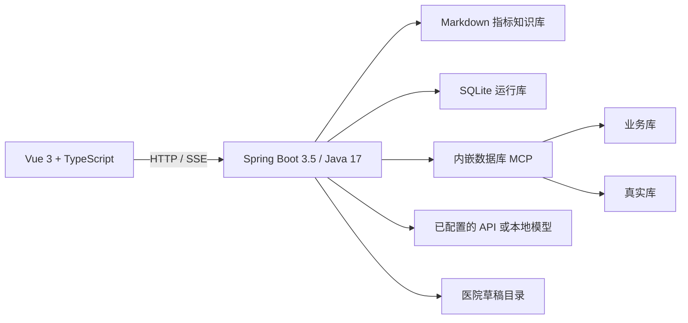

# 医院核心制度指标智能体

面向医院实施人员的核心制度指标核算与异常排查系统。系统以知识库中的指标口径和 SQL 为依据，从业务库抽取数据到真实库，在真实库完成正式计算，并保留初始化校验、数据链路、分子分母明细、异常排查和医院草稿的完整证据。

## 现在能做什么

- **指标核算**：选择一个或多个指标与统计周期，执行初始化校验、数据抽取、真实库快照校验、指标计算和结果汇总。
- **初始化校验**：检查双库连接、缺表、缺字段、无数据、关键字段空值和可安全生成的关联覆盖率；问题只影响关联口径。
- **数据链路**：展示业务表、事件、抽取 SQL、真实库中间表、统计参数表和概览/科室/明细 SQL 的实际流向。
- **结果与明细**：按口径展示分子、分母、结果值、达标状态和数据质量；明细必须重新聚合后与卡片值一致才会返回。
- **特殊指标明细**：支持计数比率、SUM 贡献值、中位数样本、双数据源和两个率比较等不同展示契约。
- **异常排查**：先完成数据结构、事件与抽取、数据可用性三步基础校验，再进入标准模式或自主排查模式。
- **自主排查**：模型按需读取结构化 Wiki、运行证据和受控只读查询；程序负责权限、安全校验、影子试跑和对账。
- **医院草稿**：候选 SQL 通过影子试跑后可保存为医院草稿版本；草稿不参与正式计算，可在“知识库回收与审批”页面查看、重新验证和回收。
- **运行设置**：在页面中维护模型和数据库连接。模型配置即时生效；数据库配置保存后重启服务生效。密钥和密码只保存在本机运行库，不回显、不提交 Git。

## 技术架构


```mermaid
flowchart LR
    UI["Vue 3 + TypeScript"] -->|"HTTP / SSE"| API["Spring Boot 3.5 / Java 17"]
    API --> KB["Markdown 指标知识库"]
    API --> RUNTIME["SQLite 运行库"]
    API --> MCP["内嵌数据库 MCP"]
    MCP --> BIZ["业务库"]
    MCP --> REAL["真实库"]
    API --> LLM["已配置的 API 或本地模型"]
    API --> DRAFT["医院草稿目录"]
```

职责边界：

- 知识库保存指标定义、口径、事件、四类 SQL 和字段说明。
- Java 程序负责口径选择、SQL 渲染、安全校验、数据库执行、对账、Trace 和状态机。
- 模型负责语义理解、解释和自主排查中的下一步建议，不能绕过程序直接修改正式数据。
- 正式指标结果只来自真实库；业务库用于源数据抽取和异常排查取证。

## 主要流程

### 指标核算

```text
确认本次指标清单
→ 数据初始化校验
→ 抽取数据到真实库
→ 真实库本次数据校验
→ 指标计算
→ 汇总结果
```

批量结果按唯一指标汇总覆盖指标、达标、未达标、待确认和数据质量。多口径指标不会重复计入覆盖指标。

### 异常排查

```text
选择指标与统计周期
→ 数据结构校验
→ 事件与抽取校验
→ 数据可用性校验
→ 标准模式 / 自主排查模式
→ 候选 SQL
→ 影子试跑与差异对账
→ 保存医院草稿（人工确认）
```

自主排查只开放五类受控能力：读取 Wiki、读取运行证据、执行指标范围内的只读查询、准备候选 SQL、运行影子试跑。模型不能执行 DML/DDL、访问无关表或保存正式版本。

## 项目目录

```text
frontend-vue/                 Vue 3 对话与实施工作台
backend-java/                 Java 单运行时后端（独立公司仓库）
  src/main/resources/
    knowledge-index/          默认 classpath 知识库
    knowledge-index_backup_20260801_150233/
                              当前本机开发知识库与医院草稿根目录
docs/                         实施计划、验收报告和接口文档
scripts/                      构建、开发启动和验收脚本
runtime/                      本机运行数据（禁止提交）
```

当前开发启动脚本优先使用：

```text
backend-java/src/main/resources/knowledge-index_backup_20260801_150233
```

未显式配置外部知识库时，其他部署环境仍使用 `classpath:knowledge-index`。外部目录一旦配置但不存在，服务会启动失败，不会静默切回另一套知识库。

医院内容位于：

```text
knowledge-index_backup_20260801_150233/
  hospitals/{hospitalId}/
    raw/                       医院原始资料归档
    drafts/{draftId}/          不可变医院草稿
      manifest.json
      entities/
      raw/sql/
      evidence/
```

医院草稿不覆盖根目录公司公版实体，也不会被正式计算自动加载。

## 环境要求

- Windows + PowerShell
- Java 17
- Maven 3.9+
- Node.js 20+ 与 npm
- 可访问的 SQL Server / Oracle（按现场需要配置）
- 可访问的模型 API 或本地 Ollama（按现场需要配置）

前端主要依赖 Vue 3、Pinia、Vue Router、TypeScript 和 Vite；后端使用 Spring Boot、Spring AI、SQLite JDBC、SQL Server JDBC、Oracle JDBC、Apache POI 和 PDFBox。

## 快速启动

### 开发模式

项目根目录执行：

```powershell
powershell -NoProfile -ExecutionPolicy Bypass -File .\scripts\dev-run.ps1 -Port 8765
```

修改 Java 后只增量编译并触发 DevTools 重启：

```powershell
powershell -NoProfile -ExecutionPolicy Bypass -File .\scripts\dev-run.ps1 -Recompile
```

访问：

- 页面：`http://127.0.0.1:8765/`
- 健康检查：`GET http://127.0.0.1:8765/api/health`

### 构建单体 JAR

```powershell
powershell -NoProfile -ExecutionPolicy Bypass -File .\scripts\build-java-vue.ps1
```

脚本先构建 Vue，再使用 `bundle-vue` Profile 打包 Java。输出位于：

```text
backend-java/target/wiki-agent-java-0.1.0-SNAPSHOT.jar
```

启动已打包版本：

```powershell
powershell -NoProfile -ExecutionPolicy Bypass -File .\scripts\start-java-runtime.ps1 -Port 8765
```

## 运行设置

页面右上角齿轮进入“系统设置”。

### 模型

- 可配置显示名称、提供方、模型名称、服务地址、聊天路径、API Key 和思考参数。
- 对话框中选择的模型用于新消息和新建自主排查任务。
- 已经运行中的自主排查冻结创建时的模型，不会中途切换。
- API Key 只写入本机 SQLite，接口不会回显明文。

### 数据库

- 可配置启用状态、驱动、JDBC URL、账号、密码、Schema 和连接池参数。
- 支持保存前测试连接。
- 数据库连接池在服务启动时创建，因此保存后需要重启服务才用于正式链路。
- 密码只写入本机 SQLite，接口不会回显明文。

运行设置数据库默认位于：

```text
backend-java/runtime/wiki_agent_runtime.db
```

该目录已被后端仓库忽略，严禁提交运行数据库、日志、患者导出、API Key、密码或医院连接串。

## 开发验证

前端：

```powershell
Set-Location .\frontend-vue
npm.cmd run type-check
npm.cmd run build
```

后端：

```powershell
Set-Location .\backend-java
mvn.cmd -s .\maven-settings.xml test
```

单体构建：

```powershell
Set-Location ..
powershell -NoProfile -ExecutionPolicy Bypass -File .\scripts\build-java-vue.ps1
```

涉及页面交互、批量核算或异常排查的改动，除自动测试外还应在真实页面保存截图、Trace 和对应验收矩阵。

## 主要页面与接口

页面：

- `/`：指标核算、明细、数据链路和异常排查主界面。
- `/knowledge-review`：医院草稿查看、重新验证、回收与审批准备。

代表性接口：

- `GET /api/health`：服务健康状态。
- `GET /api/agent/capabilities`：当前可用模型与能力。
- `POST /api/agent/chat`、`POST /api/agent/chat/stream`：同步与 SSE 对话。
- `GET /api/agent/sessions`：会话历史。
- `GET /api/kb/rules/{ruleId}/effective`：当前生效口径与数据链路。
- `POST /api/batch-runs`：批量指标核算。
- `/api/sql-runs/**`：分子分母明细、分页和导出。
- `/api/diagnosis/cases/**`：异常排查状态机、自主排查和影子试跑。
- `/api/hospital-drafts/**`：医院草稿查看、校验和回收。
- `/api/settings/runtime`：本机模型与数据库运行设置。
- `/mcp`：后端内嵌数据库 MCP 服务。

具体字段以代码和接口返回为准，不应依据 README 猜测业务参数。

## 安全与正确性底线

- 模型不决定确定性数据事实，不直接连接数据库，不写正式表。
- 通用查询只允许当前指标数据链路中的单条只读 `SELECT` 或 `WITH...SELECT`。
- 候选 SQL 必须通过模板、方言、表范围、输出结构和原 SQL 哈希校验。
- 影子试跑使用隔离对象，不覆盖正式中间表。
- 分子分母明细必须与卡片值重聚合对账；无法证明一致时拒绝返回。
- 初始化校验无法安全生成某项检查时明确标记“无法判断”，不把它伪装成数据库异常。
- 医院草稿必须人工确认；当前阶段不会自动激活为正式医院口径。

## 双仓库协作

本工作区包含两个独立 Git 仓库：

| 目录 | 用途 | 日常目标分支 |
|---|---|---|
| `F:\A-wiki-project` | 个人主仓，包含前端、文档和项目脚本 | `origin/main` |
| `F:\A-wiki-project\backend-java` | 公司后端独立仓 | `origin/test` |

提交时必须分别检查、分别暂存和分别推送。个人主仓不能暂存 `backend-java` 的变化；两个仓库都不能提交运行数据库、构建产物、日志或凭据。

## 相关文档

- [批量结果页面渲染逻辑](docs/batchResults页面展示完整逻辑_2026-08-02.md)
- [本次指标核算与抽屉接口说明](docs/本次指标核算渲染与接口对接说明_2026-08-04.md)
- [异常排查前端交互流程](docs/异常排查-前端交互流程.md)
- [异常排查后端接口契约](docs/异常排查-后端接口契约.md)
- [异常排查状态流转](docs/异常排查-数据结构与状态流转.md)
- [自主异常排查交互重构计划](docs/核心指标自主异常排查交互重构计划_2026-08-06.md)
- [Oracle 知识库 SQL 兼容性实测报告](docs/Oracle知识库SQL兼容性实测报告_2026-08-07.md)
- [项目协作约束](AGENTS.md)

历史方案和验收资料保留在 `docs/` 中；当前启动方式、目录和安全边界以本 README 与实际代码为准。
