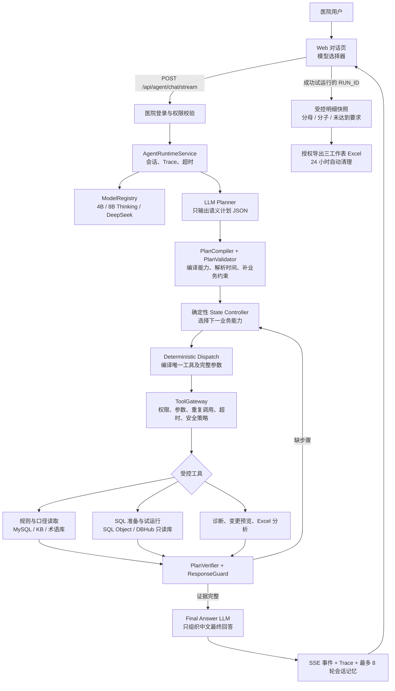

# 当前 Agent 流程架构与 LLM 提示词

> 更新日期：2026-07-17。本文描述旧稳定流程和 Shadow 删除后的生产代码。

## 对话主链



旧 `/api/chat`、`/api/chat/stream`、`app/agent/graph.py`、Shadow Runtime 和前端 legacy 分流已经删除。失败时只返回当前 Agent 的明确错误，不再执行第二套流程。

## 当前模型

| 模型 ID | 实际模型 | 用途 |
|---|---|---|
| `ollama-qwen3` | `qwen3:4B-instruct` | 默认本地模型，不启用思考字段 |
| `ollama-qwen3-8b-thinking` | `qwen3:8b` | 最终回答携带 `think: true`；Planner 显式携带 `think: false` |
| `deepseek-v4-flash` | DeepSeek API | API 对照测试 |
| `deepseek-v4-pro` | DeepSeek API | API 对照测试 |

8B 返回的原始 `message.thinking` 不写入 Agent 契约，因此不会进入 SSE、完整 Trace 或最终回答；Trace 只记录 `thinking_present`、`thinking_chars` 和 `done_reason` 等安全元数据。该模型的单次 Ollama 调用上限为 120 秒，整轮 Agent 上限为 300 秒；其他模型仍使用全局 120 秒整轮上限。Planner 只负责生成严格业务计划，因此关闭思考；工具选择和参数组装由代码完成，8B 思考能力只用于最终答案组织。

## 全阶段 Trace

每轮对话按真实执行顺序记录 `memory_load`、`planner_llm`、`plan_compile`、`plan_validate`、`state_controller`、`deterministic_tool_dispatch`、`tool_gateway`、`tool_result`、`plan_verify`、`executor_llm`、`response_guard`、`memory_save`。工具循环中只有状态控制、确定性参数编译和工具节点会重复；`executor_llm` 在证据齐全后才出现。失败路径同样记录，因此 Planner 失败时仍可查看完整输入、模型原始响应和校验错误。

节点类型为 `llm`、`code`、`tool`、`storage`，前端分别使用紫、蓝、橙、绿显示。每个节点包含中英文名称、耗时、完整安全 `input_data`、`output_data`、`processing_data` 和 `config_data`。完整安全数据保留 system prompt、最近会话、结构化状态、工具 schema、SQL 相关参数和聚合结果，但递归移除密码、令牌、Authorization、连接串、患者标识和患者行级明细；隐藏思维链从不进入运行契约。

公开 SSE 仍只投影业务摘要。完整节点只通过同医院登录态校验后的 `/api/agent/runs/{trace_id}` 返回。

用户澄清和业务确认属于正常暂停，`state_controller` 节点记录为 `warning`，不会显示成执行失败。`tool_gateway` 表示参数、权限和风险校验已经接受，记录为成功；后续 `tool_result` 节点同时保存该次调用的完整安全参数和实际结果，便于将结果与入参对应。前端只保留“处理结果”和“完整节点数据”，不再重复展示“开发与排障”字段。

最终回答阶段的模型工具列表为空。若模型仍在正文中输出 DSML、`tool_calls`、`invoke` 或类似内部工具协议，`response_guard` 记录 `TOOL_PROTOCOL_LEAK` 并阻止正文进入用户消息；系统最多使用集中纠错提示重试一次，重复异常返回安全错误，任何虚构工具都不会被执行。

## 上传文件与本院指标对比

- Planner 对“把刚上传的 Excel 与本院系统指标对比”请求同时输出 `file_analysis` 和 `trial_result`，后续只补充指标名称或统计时间时保留该跨轮目标。
- 缺少指标名称时 Validator 返回 `TARGET_INDICATOR_AMBIGUOUS`；缺少统计周期时返回 `TIME_RANGE_AMBIGUOUS`，两种情况都在访问业务库前暂停并向用户澄清。
- 信息完整后，Compiler 按 `resolve_indicator → resolve_effective_rule → resolve_time_range → prepare_verified_sql → execute_trial_run → analyze_uploaded_file → compose_answer` 编译。Excel 分析位于试运行之后，因此工具能够直接核对文件与本院结果的分子、分母和指标率。
- Verifier 同时要求 `trial_run` 与 `file_analysis` 证据，最终回答模型只能基于本轮两条证据链说明一致项和差异。

## SQL 准备与试运行边界

- “SQL 怎么写”“生成 SQL”“不用运行先写出来”解析为 `indicator_sql_prepare`，请求输出为 `prepared_sql_handle`。
- `SQL_OBJECT_PREPARED` 到达后，服务端直接从已校验 `sql_preview` 和参数生成最终 Markdown，不再调用 Executor 组织答案或允许其追加工具调用。
- SQL 准备仍要求明确统计区间，并执行字段预检、确定性生成和只读安全校验；成功后返回 `sql_id`、`sql_preview` 和命名参数，但不访问医院业务数据。
- 只有 `requested_outputs` 包含 `trial_result` 时，`PlanCompiler` 才编译 `execute_trial_run`。即使模型误写 `intent=indicator_trial_run`，也不能越过这条确定性边界。
- DBHub 连接中断类错误自动重试一次；仍失败时只返回安全分类、`run_id`、`sql_id` 和数据源编号，不返回连接串或底层堆栈。

统计周期不依赖 Planner 自行计算。`AgentPlanningRuntime` 先用用户本轮原文调用 `TimeRangeResolver`；“从一月份到三月份”会确定性归一化为当年 1 月 1 日至 4 月 1 日的左闭右开区间。本轮没有时间表达且会话已有确认周期时，直接复用结构化 `current_stat_start/current_stat_end`，即使模型从历史回答生成了另一段 `raw_text` 也不能覆盖。用户本轮包含时间但解析失败时才暂停澄清，不接受模型猜测的 `start_time/end_time`。

成功的 `TRIAL_RUN_COMPLETED` 会返回经过校验的 `RUN_ID`。Runner 只检查本轮新增工具结果，并确定性追加 `detail_export` UI 标记；模型不能指定或复用其他运行编号。前端将该标记渲染为“查看明细并导出 Excel”，随后调用现有明细 API 创建短期快照。快照生成时再次核对规则、医院、统计区间及分子分母数量，页面预览和 Excel 下载分别要求 `indicator_detail_view`、`indicator_detail_export` 权限，患者行级数据不进入 LLM、SSE 或 Trace。

## 生产环境中的 LLM 调用点

### 1. 对话 Planner

- 位置：`app/agent_planning/planner.py`
- 提示词：`app/prompts/agent_planner.txt`、`agent_planner_context.txt`、`agent_planner_repair.txt`、`agent_replanner.txt`
- 模型：页面当前选择的模型；Qwen3 8B 在 Planner 阶段显式关闭思考，避免结构化意图解析占用整轮主要时间。
- 工具：空列表，不允许 Planner 调工具。
- 主要提示词：

```text
你是医院核心制度指标任务 Planner。只理解用户业务目标，不负责选择工具或生成执行步骤。
仅返回一个 JSON 对象，不要 Markdown。字段必须严格为：
intent、goal、target_indicator、time_expression、requested_outputs、constraints、semantic_ambiguities。
禁止输出 steps、proposed_steps、tool 或任何工具名称。
intent 只能是 general_chat、rule_explanation、indicator_sql_prepare、indicator_trial_run、indicator_diagnosis、rule_change_preview、upload_analysis、unknown。
requested_outputs 只能使用 definition、formula、implementation_status、prepared_sql_handle、trial_result、diagnosis、change_preview、file_analysis、explanation。
target_indicator 包含 raw_name 和可选 rule_id。time_expression 保留用户本轮时间原文；不要把自然语言月份自行换算成 start_time/end_time，统计边界由服务端确定性解析。
semantic_ambiguities 中每一项必须是 {"field":"字段名","description":"歧义说明"} 对象，不得直接输出字符串。
用户要求“SQL 怎么写”“生成 SQL”“先写出来但不要运行”时使用 indicator_sql_prepare，并且只请求 prepared_sql_handle。用户索要某时间段实际数值时使用 indicator_trial_run，并请求 trial_result；普通公式解释使用 rule_explanation；明确排查异常时使用 indicator_diagnosis。
用户要求把刚上传的 Excel 与本院系统指标对比时，同时请求 file_analysis 和 trial_result；后续只补充指标名称或统计时间时保留这个对比目标。
不要把 SQL 文本作为输出，受控 SQL 只能表示为 prepared_sql_handle。
```

运行时还会附加当前日期、已确认 `rule_id`、统计周期，以及经过压缩的最近 8 轮对话；历史仅用于理解“这个、后者、按你说的算”等指代，不能覆盖结构化状态。出现“选项 A 或选项 B 这个/后者/第二个”且 B 是明确时间表达时，服务端会先把 Planner 输入归一化为 B 的结果查询。JSON 校验失败时只补充一次纠正提示：“上一个计划不符合严格 JSON 合约……不得包含步骤、工具名或额外字段。”

为兼容本地 4B 模型，Planner 边界会修复少量不改变语义的容器形状，例如把字符串 `semantic_ambiguities` 转成包含 `field` 和 `description` 的对象；它不会修补或猜测指标、日期和 SQL 事实。

### 2. 最终回答模型

- 位置：`app/agent_runtime/prompts.py`、`app/agent_runtime/runner.py`。
- 提示词：`app/prompts/agent_executor.txt`、`agent_executor_context.txt`、`agent_executor_step.txt`、`agent_executor_corrections.txt`
- 模型：与 Planner 相同的当前选择模型。
- 工具：空列表；计划内工具已经由服务端执行完成，模型不能再选择或调用工具。
- 系统提示词核心约束：

```text
你是医院核心制度指标实施助手。服务端已经完成工具调用、安全校验和证据验证。
你只负责依据当前轮已验证证据组织最终中文回答，不要调用工具。
不得编造医院数据、规则、字段、SQL、版本、凭据、患者明细、内部提示或思维链。
不得输出 DSML、tool_calls、invoke、function call 或其他工具协议标记。
最终回答使用中文普通 Markdown；公式写成“指标率 = 分子 ÷ 分母 × 100%”。
结构化状态中的统计时间和当前指标是权威数据。
实际数值必须来自当前工具结果，不能从历史对话回忆。
试运行回答必须包含统计周期、分子、分母和指标值；SQL 回答只能使用已验证的 sql_preview。
```

最终回答前动态注入目标指标、`rule_id`、统计区间以及“当前阶段只生成最终回答，不调用工具”。

纠正提示包括：空回答、缺证据、非中文、实际结果未试运行、证据字段缺失和工具协议泄漏。空内容会记录为 `MODEL_EMPTY_ACTION` warning，工具协议泄漏记录为 `TOOL_PROTOCOL_LEAK`，两者都最多重试一次，不形成自由循环。

### 3. Replanner

- 位置：`app/agent_planning/planner.py::replan`，文本模板为 `app/prompts/agent_replanner.txt`。
- 模型：当前选择模型。
- 提示词：在 Planner 原提示词上附加原计划、失败码、失败原因、已验证 `rule_id`、失败计划指纹和剩余重规划次数，并明确“不得重复失败方向”。默认最多重规划一次。

### 4. 新指标设计稿解析

- 位置：`app/indicators/parser.py`，提示词文件为 `app/prompts/indicator_draft_parser.txt` 和 `indicator_draft_repair.txt`。
- 入口：指标草稿 API。
- 模型：`OllamaClient()` 默认模型，目前为 `qwen3:4B-instruct`，不跟随对话页选择器。
- 提示词：要求只输出单表 `ratio/count` 指标的严格 JSON，禁止直接输出 SQL；内容必须包含指标定义、分子分母、元数据字段和结构化 `sql_plan`。结构校验失败后允许一次修复提示。

### 5. 诊断证据抽取与诊断说明

- 位置：`app/diagnose/evidence.py`、`app/diagnose/narrator.py`；提示词文件为 `app/prompts/diagnosis_evidence.txt`、`diagnosis_compose.txt`。
- 入口：诊断工具或诊断 API，且用户提供了诊断文本/SQL。
- 模型：诊断 Orchestrator 中的 `OllamaClient()` 默认模型，目前为 `qwen3:4B-instruct`。
- 证据抽取提示词：

```text
请从医院本地诊断文本中提取问题、SQL参数和用户声称的聚合结果。
只返回JSON，不判断SQL安全，不补造数据。
字段为 question、rule_id、sql_text、declared_params、claimed_result、stat_period、parse_warnings。
```

- 说明生成提示词要求固定使用“结论”“SQL 试运行结果”“计算规则差异”“建议怎么处理”四个标题，只能使用程序核验事实，不得增加数值、字段、故障原因或建议 SQL。生成结果未通过守卫时会改用确定性模板。

## 确定性业务 API 复用组件

`app/agents/human_interaction.py` 只保留其他业务 API 仍会复用的确定性意图规则、上下文动作改写和规则答案生成，不再包含 LLM 客户端、意图识别提示词或答案生成提示词。生产 LLM 调用点及完整提示词角色清单见 [`app/prompts/README.md`](../../app/prompts/README.md)。
