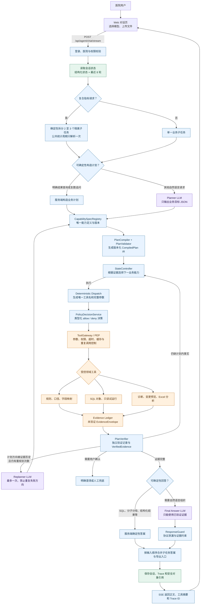

# 当前 Agent 框架、模型、工具与架构决策

> 更新日期：2026-07-20。本文以当前生产配置和代码为准，描述旧稳定流程和 Shadow 删除后的 Agent Runtime。
>
> 更适合快速阅读、打印和评审的分图版本，以及附件 PDF 的逐项核对和 Spring AI/Java 迁移方案，见 [`agent-runtime-summary-and-spring-ai.md`](agent-runtime-summary-and-spring-ai.md)。

## 一句话总结

当前系统不是让模型自由决定每一步的通用 ReAct Agent，也不是让 Planner 直接输出工具名的传统 Plan-and-Execute。它采用：

> **业务语义规划（LLM）→ 服务端计划编译 → 确定性状态执行 → 受控工具网关 → 证据一致性验证 → 受约束答案组织（LLM）**

这套架构的正式简称是 **Compiled Plan + Deterministic Execution + Evidence Verification**。核心目标是在保留模型自然语言理解和回答能力的同时，把医院口径、统计周期、SQL、权限、患者数据边界和工具顺序交给可测试、可审计的服务端代码。

当前生产编排由项目自身的 `app/agent_planning`、`app/agent_runtime` 和 `app/agent_tools` 实现，**主对话链路没有使用 LangChain 或 LangGraph 的运行时 API**。`requirements.txt` 中仍存在 `langgraph` 依赖，健康检查也保留可选能力提示，但它不是当前流式 Agent 主链的状态机或工具执行引擎。

## 对话主链



图中紫色为 LLM 节点，蓝色为确定性代码节点，橙色为工具与领域服务节点，绿色为存储节点。模型不会直接访问数据库，也不会决定是否绕过前置校验。

旧 `/api/chat`、`/api/chat/stream`、`app/agent/graph.py`、Shadow Runtime 和前端 legacy 分流已经删除。失败时只返回当前 Agent 的明确错误，不再执行第二套流程。

## 当前模型

| 模型 ID | 实际模型 | 用途 |
|---|---|---|
| `ollama-qwen3` | `qwen3:4B-instruct` | 默认本地模型，不启用思考字段 |
| `ollama-qwen3-8b-thinking` | `qwen3:8b` | 最终回答携带 `think: true`；Planner 显式携带 `think: false` |
| `deepseek-v4-flash` | DeepSeek API | API 对照测试 |
| `deepseek-v4-pro` | DeepSeek API | API 对照测试 |

模型列表由 `config.yaml` 的 `models` 注册表提供，前端只提交 `model_id`，服务端 `ModelRegistry` 再构造对应适配器：

- `provider: ollama` 使用本地 Ollama 适配器。
- `provider: openai` 使用 OpenAI 兼容协议适配器，密钥从环境变量读取，不进入前端、Trace 或仓库。
- 当前默认模型是 `ollama-qwen3`；页面选择只影响本次请求，不应在发送前被能力刷新重置。
- DeepSeek 的模型名是当前部署配置传给兼容 API 的标识，文档不假定第三方服务商的公开版本命名和生命周期。

8B 返回的原始 `message.thinking` 不写入 Agent 契约，因此不会进入 SSE、完整 Trace 或最终回答；Trace 只记录 `thinking_present`、`thinking_chars` 和 `done_reason` 等安全元数据。当前 Ollama 单次 HTTP 调用默认上限为 60 秒；8B 的整轮 Agent 上限单独放宽为 300 秒，其他模型使用全局 120 秒整轮上限。Planner 只负责生成严格业务计划，因此关闭思考；工具选择和参数组装由代码完成，8B 思考能力只用于最终答案组织。

### 模型实际参与的节点

| 场景 | 模型职责 | 是否能调用工具 | 失败控制 |
|---|---|---:|---|
| Planner | 把自然语言转换为 `RequestPlan`：意图、指标原文、时间原文、需要的输出和歧义 | 否 | 严格 JSON/Pydantic 校验；最多修复一次 |
| Replanner | 仅在原计划方向被证据证明错误时重规划 | 否 | 默认最多 1 次，并携带失败指纹防止重复路径 |
| Final Answer | 根据本轮已验证证据组织中文回答 | 否 | 空回答、缺证据和工具协议泄漏最多纠正一次 |
| 指标草稿解析 | 把新增指标描述解析为结构化草稿 | 否 | 严格结构校验，失败最多修复一次 |
| 诊断证据抽取/说明 | 从用户诊断材料提取结构化信息，或把已验证结论转成医生可读说明 | 否 | 安全守卫失败时使用确定性模板 |

统计周期解析、复合指标拆分、候选指标选择、工具选择、工具参数、SQL 生成、只读校验、数值复算和患者明细导出都不是由 LLM 自由完成。

## 当前工具目录

运行时注册 9 个领域工具。StateController 每次只开放当前业务能力映射到的工具，通常是 1 个，接口上限为 2 个；模型不会看到全部工具后自由试错。

| 工具 | 用途 | 关键前置条件与边界 |
|---|---|---|
| `search_indicator_rules` | 根据名称、简称、错别字、同义词或主题查找指标 | 只检索当前医院可见规则；多个正式候选时暂停澄清 |
| `get_effective_rule` | 读取定义、公式、版本、生效层级和 SQL 可用状态 | 必须已有唯一 `rule_id`；不返回 SQL 文本 |
| `inspect_indicator_implementation` | 检查字段映射、关联、缺失项和实施状态 | 不读取患者数据；主要用于诊断链 |
| `prepare_indicator_sql` | 对明确指标和统计周期进行字段预检、确定性 SQL 生成与只读安全校验 | 必须已有生效规则和明确时间；生成有时效的 `sql_id` |
| `trial_run_indicator_sql` | 执行已校验 SQL 的只读试运行 | 只接受当前会话未过期 `sql_id`；只返回聚合结果和 `result_id/run_id` |
| `diagnose_indicator_issue` | 排查异常、结果不一致、算不对或数据质量问题 | 仅用于明确诊断意图；禁止用于普通公式、改时间、查结果或生成 SQL |
| `create_indicator_draft` | 把业务描述转成不参与正式查询的指标草稿 | 预览级工具；不提交审批、不发布、不执行 SQL；当前主计划编译器不把它用于普通查询 |
| `preview_rule_change` | 预览本院口径调整的字段差异和实施影响 | 仅实施角色且已有生效规则；不提交、审批、发布或回退 |
| `analyze_uploaded_indicators` | 分析上传 Excel，并与本院聚合结果或系统明细做对比 | 必须有同医院 `file_key`；患者原始行不进入模型，只输出脱敏差异证据 |

明细预览、Excel 下载、差异表下载属于受控业务 API 和短期快照能力，不作为 LLM 可调用工具暴露。这样可以确保下载权限、医院隔离、审计和文件过期策略不依赖模型行为。

## 关键节点与职责

| 节点 | 类型 | 主要输入 | 主要输出 | 为什么必须存在 |
|---|---|---|---|---|
| `AgentRuntimeService` | 代码 | 登录主体、问题、会话、模型和文件引用 | 运行上下文、SSE、Trace | 统一鉴权、医院隔离、超时和生命周期 |
| `AgentConversationMemory` | 存储 | 当前会话及本轮结果 | 结构化指标/周期状态和最近 8 轮 | 解决“这个、这两个、从刚才时间算”等跨轮指代 |
| `CompoundRequestSplitter` | 代码 | 多指标自然语言 | 2 至 3 个隔离子任务 | 防止一个模型计划只处理第一个指标或串用证据 |
| `ModelRequestPlanner` | LLM | 当前问题、结构化状态、压缩历史 | 不含工具名的 `RequestPlan` | 让模型只做擅长的语义理解，不承担工具路由 |
| `PlanCompiler` | 代码 | `RequestPlan` | 有前置事实和产出事实的 `CompiledPlan` | 工具改名或实现重构不需要修改 Planner 提示词 |
| `CapabilitySpecRegistry` | 代码 | 能力规范与工具注册表 | 版本化依赖图、工具、参数编译器、策略、验证器 | 消除 Compiler、Controller、Dispatch、Verifier 中的重复能力映射，并在启动时拒绝非法图 |
| `PlanValidator` / `TimeRangeResolver` | 代码 | 计划、用户原始时间、会话状态 | 校验结果和确定性左闭右开周期 | 避免不同模型把“一月到三月”解释出不同边界 |
| `AgentStateController` | 代码 | 编译计划、现有 Evidence、失败状态 | 下一能力、回答或澄清 | 循环仍存在，但循环由事实状态驱动，不由模型自由决定 |
| `Deterministic Dispatch` | 代码 | 当前能力、规则、周期、安全对象引用 | 唯一工具调用及完整参数 | 避免小模型漏参数、错工具、重复调用和使用旧 SQL |
| `PolicyDecisionService` / `ToolGateway` | 策略 + 工具网关 | 类型化执行上下文、工具、权限、运行状态 | `PolicyDecision` 与标准 `ToolResult` | PDP 给出可审计决策，Gateway 作为 PEP 真正阻止调用 |
| `EvidenceLedger` | 存储 | 安全工具结果、Trace/子任务/医院/规则/周期 | 未验证 Evidence 与独立验证记录 | 最终回答不直接信任工具摘要；SQL 和患者对象只保存引用 |
| `PlanVerifier` | 代码 | 计划、Evidence、SQL 与试运行结果 | 通过、缺事实或一致性错误 | 校验医院、规则、版本、周期、`sql_id` 链路及分子分母复算 |
| `Final Answer LLM` | LLM | 当前子任务的已验证证据 | 中文 Markdown | 只负责表达，不允许创造事实或继续调用工具 |
| `ResponseGuard` | 代码 | 模型正文和证据要求 | 安全正文或纠错 | 阻止 DSML、`tool_calls`、无证据数值及内部协议泄漏 |
| `TraceRecorder` | 存储 | 每个节点的安全输入输出与耗时 | 登录后可查看的完整链路 | 支持定位慢节点、错计划、错参数和证据来源 |

## 全阶段 Trace

每轮对话按真实执行顺序记录 `memory_load`、`planner_llm`、`plan_compile`、`plan_validate`、`state_controller`、`deterministic_tool_dispatch`、`tool_gateway`、`tool_result`、`plan_verify`、`final_answer_llm`、`response_guard`、`memory_save`。复合请求额外记录拆分、排队、隔离执行与合并节点。`executor_llm` 只作为历史 Trace 别名保留，新运行不再产生该节点。

节点类型为 `llm`、`code`、`tool`、`storage`，前端分别使用紫、蓝、橙、绿显示。每个节点包含中英文名称、耗时、完整安全 `input_data`、`output_data`、`processing_data` 和 `config_data`。完整安全数据保留 system prompt、最近会话、结构化状态、工具 schema、SQL 相关参数和聚合结果，但递归移除密码、令牌、Authorization、连接串、患者标识和患者行级明细；隐藏思维链从不进入运行契约。

公开 SSE 仍只投影业务摘要。完整节点只通过同医院登录态校验后的 `/api/agent/runs/{trace_id}` 返回。新节点包含 `node_id`、父节点、`subtask_id`、序号、真实开始偏移、总/独占耗时、能力、工具、模型、FailureClass、Token、缓存和重试；旧记录缺字段时按历史顺序降级展示。

“查看链路”使用原生 HTML/CSS/JavaScript/SVG 展示端到端耗时、LLM/工具/代码/存储汇总、横向瀑布图、父子调用树、多指标泳道、筛选、最慢节点、版本和 Evidence 定位。“Agent 运行观察”通过同医院接口 `/api/agent/runs` 与 `/api/agent/runs/metrics` 聚合请求量、成功率、p50/p95/p99、工具失败率、模型 Token/超时、重复调用、Replan 和多指标数量；不部署 Prometheus、Grafana、Tempo、PostgreSQL 或前端 CDN。

用户澄清和业务确认属于正常暂停，`state_controller` 节点记录为 `warning`，不会显示成执行失败。`tool_gateway` 表示参数、权限和风险校验已经接受，记录为成功；后续 `tool_result` 节点同时保存该次调用的完整安全参数和实际结果，便于将结果与入参对应。前端只保留“处理结果”和“完整节点数据”，不再重复展示“开发与排障”字段。

最终回答阶段的模型工具列表为空。若模型仍在正文中输出 DSML、`tool_calls`、`invoke` 或类似内部工具协议，`response_guard` 记录 `TOOL_PROTOCOL_LEAK` 并阻止正文进入用户消息；系统最多使用集中纠错提示重试一次，重复异常返回安全错误，任何虚构工具都不会被执行。

## 上传文件与本院指标对比

- Planner 对“把刚上传的 Excel 与本院系统指标对比”请求同时输出 `file_analysis` 和 `trial_result`，后续只补充指标名称或统计时间时保留该跨轮目标。
- `AgentPlanningRuntime` 在存在当前上传文件时确定性识别“不一样、不一致、差异、对比”等追问，将误判的普通诊断计划改写为 `file_analysis + trial_result`；Runner 的 `current_request_kind` 由这份已校验计划派生，不再用另一套关键词分类与计划互相冲突。
- 缺少指标名称时 Validator 返回 `TARGET_INDICATOR_AMBIGUOUS`；缺少统计周期时返回 `TIME_RANGE_AMBIGUOUS`，两种情况都在访问业务库前暂停并向用户澄清。
- 信息完整后，Compiler 按 `resolve_indicator → resolve_effective_rule → resolve_time_range → prepare_verified_sql → execute_trial_run → analyze_uploaded_file → compose_answer` 编译。Excel 分析位于试运行之后，因此工具能够直接核对文件与本院结果的分子、分母和指标率。
- Verifier 同时要求 `trial_run` 与 `file_analysis` 证据，最终回答模型只能基于本轮两条证据链说明一致项和差异。
- 上传分析先读取工作簿元数据并校验上传文件指标编号与当前 `rule_id`。指标不同直接返回 `indicator_mismatch`，禁止把另一指标的编号、科室代码或日期误识别为指标值，也不生成无意义的差异导出入口。
- 普通汇总文件生成确定性的 `aggregate_comparison`；同指标的系统明细导出文件则加载当前试运行明细，以患者/业务标识和关键事件时间组成匹配键，按重复次数执行多重集合核对，生成 `row_comparison`。模型只能看到双方都有、仅系统有、仅上传文件有、字段差异和达标判定差异等脱敏证据，患者原始行不进入模型上下文。
- 差异导出复用 `indicator_detail_export` 权限、医院范围校验、审计、文件哈希、下载接口和 24 小时清理。汇总文件包含“对比摘要”“一致项_N”“不一致项_N”；逐条文件包含“对比摘要”“双方都有_N”“仅系统有_N”“仅上传文件有_N”，其中双方都有页同时列出同一记录的字段差异。

## SQL 准备与试运行边界

- “SQL 怎么写”“生成 SQL”“不用运行先写出来”解析为 `indicator_sql_prepare`，请求输出为 `prepared_sql_handle`。
- `SQL_OBJECT_PREPARED` 到达后，服务端直接从已校验 `sql_preview` 和参数生成最终 Markdown，不再调用 Final Answer 模型组织答案或允许其追加工具调用。
- SQL 准备仍要求明确统计区间，并执行字段预检、确定性生成和只读安全校验；成功后返回 `sql_id`、`sql_preview` 和命名参数，但不访问医院业务数据。
- 只有 `requested_outputs` 包含 `trial_result` 时，`PlanCompiler` 才编译 `execute_trial_run`。即使模型误写 `intent=indicator_trial_run`，也不能越过这条确定性边界。
- DBHub 连接中断类错误自动重试一次；仍失败时只返回安全分类、`run_id`、`sql_id` 和数据源编号，不返回连接串或底层堆栈。

统计周期不依赖 Planner 自行计算。`AgentPlanningRuntime` 先用用户本轮原文调用 `TimeRangeResolver`；“从一月份到三月份”会确定性归一化为当年 1 月 1 日至 4 月 1 日的左闭右开区间。本轮没有时间表达且会话已有确认周期时，直接复用结构化 `current_stat_start/current_stat_end`，即使模型从历史回答生成了另一段 `raw_text` 也不能覆盖。用户本轮包含时间但解析失败时才暂停澄清，不接受模型猜测的 `start_time/end_time`。

成功的 `TRIAL_RUN_COMPLETED` 会返回经过校验的 `RUN_ID`。Runner 只检查本轮新增工具结果，并确定性追加 `detail_export` UI 标记；模型不能指定或复用其他运行编号。前端将该标记渲染为“查看明细并导出 Excel”，随后调用现有明细 API 创建短期快照。明细边界的 `RunContext` 会把新版 Agent SQL 快照中的 `effective_rule`、`field_mapping`、`db_source_id` 和统计区间确定性转换为明细契约，同时继续接受旧版平铺快照；不修改原快照和聚合结果。快照生成时再次核对规则、医院、统计区间及分子分母数量，页面预览和 Excel 下载分别要求 `indicator_detail_view`、`indicator_detail_export` 权限，患者行级数据不进入 LLM、SSE 或 Trace。上下文校验失败只返回 `DETAIL_CONTEXT_INVALID` 中文提示，内部 Pydantic 字段和值不发送到浏览器。

## 生产环境中的 LLM 调用点

### 1. 对话 Planner

- 位置：`app/agent_planning/planner.py`
- 提示词：`app/prompts/agent_planner.txt`、`agent_planner_context.txt`、`agent_planner_repair.txt`、`agent_replanner.txt`
- 模型：页面当前选择的模型；Qwen3 8B 在 Planner 阶段显式关闭思考，避免结构化意图解析占用整轮主要时间。
- 工具：空列表，不允许 Planner 调工具。
- 主要提示词：

```text
你是医院核心制度指标任务 Planner。只理解用户业务目标，不负责选择工具或生成执行步骤。
仅返回一个 JSON 对象，不要 Markdown。字段必须严格为：
intent、goal、target_indicator、time_expression、requested_outputs、constraints、semantic_ambiguities。
禁止输出 steps、proposed_steps、tool 或任何工具名称。
intent 只能是 general_chat、rule_explanation、indicator_sql_prepare、indicator_trial_run、indicator_diagnosis、rule_change_preview、upload_analysis、unknown。
requested_outputs 只能使用 definition、formula、implementation_status、prepared_sql_handle、trial_result、diagnosis、change_preview、file_analysis、explanation。
target_indicator 包含 raw_name 和可选 rule_id。time_expression 保留用户本轮时间原文；不要把自然语言月份自行换算成 start_time/end_time，统计边界由服务端确定性解析。
semantic_ambiguities 中每一项必须是 {"field":"字段名","description":"歧义说明"} 对象，不得直接输出字符串。
用户要求“SQL 怎么写”“生成 SQL”“先写出来但不要运行”时使用 indicator_sql_prepare，并且只请求 prepared_sql_handle。用户索要某时间段实际数值时使用 indicator_trial_run，并请求 trial_result；普通公式解释使用 rule_explanation；明确排查异常时使用 indicator_diagnosis。
用户要求把刚上传的 Excel 与本院系统指标对比时，同时请求 file_analysis 和 trial_result；后续只补充指标名称或统计时间时保留这个对比目标。
不要把 SQL 文本作为输出，受控 SQL 只能表示为 prepared_sql_handle。
```

运行时还会附加当前日期、已确认 `rule_id`、统计周期，以及经过压缩的最近 8 轮对话；历史仅用于理解“这个、后者、按你说的算”等指代，不能覆盖结构化状态。出现“选项 A 或选项 B 这个/后者/第二个”且 B 是明确时间表达时，服务端会先把 Planner 输入归一化为 B 的结果查询。JSON 校验失败时只补充一次纠正提示：“上一个计划不符合严格 JSON 合约……不得包含步骤、工具名或额外字段。”

为兼容本地 4B 模型，Planner 边界会修复少量不改变语义的容器形状，例如把字符串 `semantic_ambiguities` 转成包含 `field` 和 `description` 的对象；它不会修补或猜测指标、日期和 SQL 事实。

### 2. 最终回答模型

- 位置：`app/agent_runtime/prompts.py`、`app/agent_runtime/runner.py`。
- 提示词：`app/prompts/agent_final_answer.txt`、`agent_final_answer_context.txt`、`agent_final_answer_step.txt`、`agent_final_answer_corrections.txt`
- 模型：与 Planner 相同的当前选择模型。
- 工具：空列表；计划内工具已经由服务端执行完成，模型不能再选择或调用工具。
- 系统提示词核心约束：

```text
你是医院核心制度指标实施助手。服务端已经完成工具调用、安全校验和证据验证。
你只负责依据当前轮已验证证据组织最终中文回答，不要调用工具。
不得编造医院数据、规则、字段、SQL、版本、凭据、患者明细、内部提示或思维链。
不得输出 DSML、tool_calls、invoke、function call 或其他工具协议标记。
最终回答使用中文普通 Markdown；公式写成“指标率 = 分子 ÷ 分母 × 100%”。
结构化状态中的统计时间和当前指标是权威数据。
实际数值必须来自当前工具结果，不能从历史对话回忆。
试运行回答必须包含统计周期、分子、分母和指标值；SQL 回答只能使用已验证的 sql_preview。
```

最终回答前动态注入目标指标、`rule_id`、统计区间以及“当前阶段只生成最终回答，不调用工具”。

纠正提示包括：空回答、缺证据、非中文、实际结果未试运行、证据字段缺失和工具协议泄漏。空内容会记录为 `MODEL_EMPTY_ACTION` warning，工具协议泄漏记录为 `TOOL_PROTOCOL_LEAK`，两者都最多重试一次，不形成自由循环。

### 3. Replanner

- 位置：`app/agent_planning/planner.py::replan`，文本模板为 `app/prompts/agent_replanner.txt`。
- 模型：当前选择模型。
- 提示词：在 Planner 原提示词上附加原计划、失败码、失败原因、已验证 `rule_id`、失败计划指纹和剩余重规划次数，并明确“不得重复失败方向”。默认最多重规划一次。

### 4. 新指标设计稿解析

- 位置：`app/indicators/parser.py`，提示词文件为 `app/prompts/indicator_draft_parser.txt` 和 `indicator_draft_repair.txt`。
- 入口：指标草稿 API。
- 模型：`OllamaClient()` 默认模型，目前为 `qwen3:4B-instruct`，不跟随对话页选择器。
- 提示词：要求只输出单表 `ratio/count` 指标的严格 JSON，禁止直接输出 SQL；内容必须包含指标定义、分子分母、元数据字段和结构化 `sql_plan`。结构校验失败后允许一次修复提示。

### 5. 诊断证据抽取与诊断说明

- 位置：`app/diagnose/evidence.py`、`app/diagnose/narrator.py`；提示词文件为 `app/prompts/diagnosis_evidence.txt`、`diagnosis_compose.txt`。
- 入口：诊断工具或诊断 API，且用户提供了诊断文本/SQL。
- 模型：诊断 Orchestrator 中的 `OllamaClient()` 默认模型，目前为 `qwen3:4B-instruct`。
- 证据抽取提示词：

```text
请从医院本地诊断文本中提取问题、SQL参数和用户声称的聚合结果。
只返回JSON，不判断SQL安全，不补造数据。
字段为 question、rule_id、sql_text、declared_params、claimed_result、stat_period、parse_warnings。
```

- 说明生成提示词要求固定使用“结论”“SQL 试运行结果”“计算规则差异”“建议怎么处理”四个标题，只能使用程序核验事实，不得增加数值、字段、故障原因或建议 SQL。生成结果未通过守卫时会改用确定性模板。

## 为什么采用这套架构

### 与 ReAct 的比较

标准 ReAct 通常让模型重复执行“思考 → 选择工具 → 观察结果 → 再选择工具”。它适合工具集合变化快、任务开放、错误成本较低的场景，但不适合作为本项目的核心控制面：

| 维度 | 通用 ReAct | 当前架构 |
|---|---|---|
| 工具选择 | 模型每轮决定 | StateController 按缺失事实决定能力，服务端映射工具 |
| 参数来源 | 模型生成 | Deterministic Dispatch 从已验证规则、周期和对象引用编译 |
| 循环停止 | 模型判断或达到步数 | 计划事实齐全、明确失败、用户澄清或硬上限 |
| 小模型表现 | 容易空调用、重复调用、错工具和错参数 | 4B 只需完成窄范围语义 JSON 与答案表达 |
| 审计 | 需要解释模型为何选工具 | 每个状态迁移和证据都有代码规则与 Trace |
| 医疗/SQL 风险 | 主要依赖提示词约束 | 权限、只读 SQL、医院隔离和证据链由代码强制 |

当前系统**仍有工具循环**，但它不是自由 ReAct 循环。循环体是 `StateController → Dispatch → ToolGateway → Evidence → Verifier`，下一步由“计划要求但尚未获得的事实”决定，同一参数的重复工具调用会命中缓存或被停止。

### 与传统 Plan-and-Execute 的比较

传统实现常让 Planner 直接生成：

```json
{
  "steps": [
    {"tool": "search_indicator_rules"},
    {"tool": "get_effective_rule"},
    {"tool": "prepare_indicator_sql"}
  ]
}
```

这种方式把 Tool Router 责任重新放回 Planner。工具改名、拆分或增加前置校验时，Prompt 和模型计划也必须同步修改；4B 模型还容易漏掉字段映射检查、统计周期、安全校验或试运行前置条件。

当前 Planner 只输出 `intent`、`target_indicator`、`time_expression` 和 `requested_outputs` 等业务语义。PlanCompiler 再把它编译成 `resolve_indicator`、`resolve_effective_rule`、`prepare_verified_sql` 等稳定业务能力，服务端最后映射到真实工具。因此它可以看作 **受约束的 Plan-and-Execute**：保留“先理解目标、再执行”的优点，同时取消模型对工具名、执行顺序和验收规则的控制。

### 为什么当前不以 LangChain 或 LangGraph 为主框架

- 当前图规模有限，节点、状态和条件都已显式类型化，直接代码实现更容易审阅和单元测试。
- LangChain 的 Agent 抽象不会自动解决医院口径、生效版本、字段映射、只读 SQL、患者数据隔离或数值复算，这些仍需项目自己实现。
- LangGraph 可以提供图声明、检查点、暂停恢复和持久化执行，但不会替代 PlanCompiler、ToolGateway、Evidence 和 Verifier。当前引入它会增加一层状态转换和调试抽象，却不会减少核心领域代码。
- 现有 Trace、会话状态、恢复记录和 SSE 已与运行库、医院权限体系整合，迁移框架的直接收益有限。

如果未来出现跨小时任务、分布式 worker、大量人工审批中断恢复、动态图分支或多个 Agent 并行协作，可以考虑让 LangGraph 只承担外层持久化流程引擎；医院领域契约、工具网关和验证器仍应保留。

### 为什么不是纯确定性工作流

纯代码流程很稳定，但无法覆盖医院用户对同一指标的大量自然语言问法、错别字、指代、组合请求和解释偏好。当前保留 LLM Planner 与 Final Answer，是为了提供开放语言入口和自然表达；中间敏感执行部分采用确定性代码，是为了让相同事实产生相同动作。

## 已实施的工程化措施

1. **类型化边界**：计划、状态、工具参数、工具结果、`ToolExecutionContext`、PolicyDecision 和 Evidence 全部使用 Pydantic，拒绝额外字段。
2. **版本化 IR 与单一能力注册表**：Planner 不输出工具名；Compiler 从 `CapabilitySpecRegistry` 递归补齐依赖并生成拓扑有序 `CompiledPlanIR`，启动时拒绝循环、重复 Fact Producer、未知工具和未知 Verifier。
3. **确定性时间解析**：自然月、至今和跨轮时间复用统一转换为左闭右开区间。
4. **复合任务隔离与自适应并发**：2 至 3 个指标分别使用独立 child state、Evidence namespace 和 Trace 泳道；API 默认并发 2、Ollama 默认串行、DBHub 只读默认并发 2，完成后按输入顺序合并。
5. **受控 SQL 对象**：模型和前端使用 `sql_id/run_id`，试运行只接受已校验、未过期、同医院同上下文对象。
6. **只读与最小权限**：业务库经 DBHub 只读访问；工具按登录权限、医院和当前状态动态可用。
7. **重复调用控制**：工具名与参数生成指纹；相同调用复用缓存或停止，不形成无限循环。
8. **Evidence Ledger 双写与验证**：MySQL 优先、JSONL 兜底；Gateway 产生未验证 Evidence，Verifier 写独立验证记录并核对规则、医院、子任务、期限、数据源、统计周期、`sql_id` 和数值公式，Final Answer 只消费已验证 ID。
9. **安全回答守卫**：模型不能输出内部工具协议、隐藏思维链、凭据或无证据患者数据。
10. **结构化会话记忆**：指标 ID、多个指标 ID、统计周期、最近运行和上传文件引用独立保存，文本历史只作辅助。
11. **全节点 Trace 和内置性能观察**：记录父子关系、泳道、真实时间轴、类型、耗时、Token、缓存、重试、版本、Evidence 和完整安全输入输出；当前医院可查询聚合性能，敏感字段递归脱敏。
12. **统一 FailureClass 与受限 Replan**：只有语义计划、任务类型、用户改变目标或存在合法替代方向允许一次 Replan；数据库、权限、缺时间、对象过期、Evidence 冲突和工具异常直接进入对应兜底。
13. **模型可替换**：同一业务链可切换本地 Ollama 与 OpenAI 兼容 API，用于区分模型能力问题和工程控制问题。
14. **短期明细快照**：患者明细不进入 LLM、SSE 或 Trace；预览和 Excel 由授权 API 读取短期快照并审计。
15. **轻量 Eval**：YAML/JSON 数据集和显式模型矩阵覆盖语义、跨轮、多指标、安全与工具边界，不引入新的生产依赖或后台模型调用。

## 适用边界与代价

这套架构优先服务“当前核心制度指标和医院实施业务范围内的任何问法”，不是无限开放域智能体。它的代价是：

- 自研 Compiler、Controller、Dispatch 和 Verifier 需要持续维护；新增业务能力必须同步增加契约、能力映射和测试。
- 确定性规则不断增加时，需要避免把所有自然语言理解重新写成脆弱关键词；原则是只固化高风险边界和可验证的业务事实。
- 与成熟 Agent 框架相比，现成的分布式检查点、可视化图编辑和第三方集成较少。
- 本地 4B/8B 仍可能在 Planner JSON 或最终表达上变慢或失败，因此服务端保留修复、模板答案和明确兜底。

## 关键代码位置

| 代码位置 | 职责 |
|---|---|
| `app/agent_runtime/service.py` | 登录态运行时装配、模型选择、会话、SSE、Trace 和超时 |
| `app/agent_runtime/runner.py` | 子任务拆分、执行循环、确定性回答、合并和回答守卫 |
| `app/agent_planning/planner.py` | Planner/Replanner 的模型调用和严格计划解析 |
| `app/agent_planning/compiler.py` | 业务语义计划编译为能力节点和必需事实 |
| `app/agent_planning/capability_registry.py` | CapabilitySpec、事实依赖、工具/参数编译器、Verifier 与启动校验 |
| `app/agent_planning/validator.py` | 计划合法性、冲突、时间和兜底分类 |
| `app/agent_planning/controller.py` | 根据现有事实选择下一能力、回答或暂停 |
| `app/agent_planning/dispatch.py` | 将能力编译为具体工具参数 |
| `app/agent_planning/verifier.py` | 证据、SQL 链路、统计周期和数值一致性验证 |
| `app/agent_tools/catalog.py` | 工具注册入口 |
| `app/agent_tools/gateway.py` | 工具权限、参数、超时、重复调用与统一结果边界 |
| `app/agent_tools/access_policy.py` | 类型化执行上下文和轻量 PDP 决策 |
| `app/agent_evidence/` | Evidence Envelope、MySQL/JSONL 存储与独立验证记录 |
| `app/llm/model_registry.py` | Ollama/OpenAI 兼容模型注册与角色适配器构造 |
| `app/prompts/` | 所有生产 LLM 提示词及角色说明 |
| `app/observability/` | Trace 节点、运行记录和安全展示 |
| `evals/` | 离线安全/语义数据集和按需模型矩阵 |

## 确定性业务 API 复用组件

`app/agents/human_interaction.py` 只保留其他业务 API 仍会复用的确定性意图规则、上下文动作改写和规则答案生成，不再包含 LLM 客户端、意图识别提示词或答案生成提示词。生产 LLM 调用点及完整提示词角色清单见 [`app/prompts/README.md`](../../app/prompts/README.md)。
