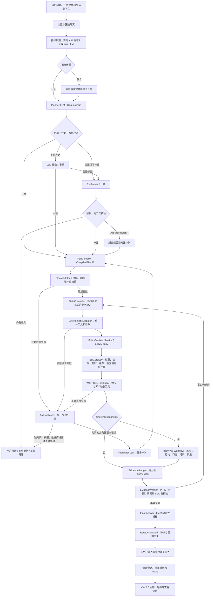

# 当前 Java Agent Runtime 架构

> 更新日期：2026-07-23。本文描述当前唯一生产实现：Java 17 + Spring Boot 3.5.16 + Spring AI 1.1.8 + Vue 3。

## 一句话总结

当前框架是 **Compiled Plan + Deterministic Execution + Evidence Verification**：LLM 理解业务目标，Java 编译和执行计划，工具产生证据，Verifier 校验证据，LLM 最后只负责把已验证事实组织成业务回答。

系统没有使用 LangChain 或 LangGraph，也不让模型进行无限 ReAct 工具循环。

Spring Boot 3.5 与 Spring AI 1.1 是一组受官方兼容关系约束的版本组合。Spring AI 2.0
只支持 Spring Boot 4.0/4.1，因此当前项目不能单独把 Spring AI 升级到 2.x。

## 分层总图



## LLM 参与位置

| 节点 | 做什么 | 明确不做什么 |
|---|---|---|
| Planner | 把自然语言转换为 `RequestPlan`：意图、指标原文、时间原文和输出目标 | 不输出工具名、不写 SQL、不决定执行顺序 |
| 指标候选消歧 | 规则和本地语义无法唯一确认时，从服务端候选 `rule_id` 中选择 | 不得创造候选，不得调用工具 |
| 计划一致性审核 | 仅在 Java 规则无法确定时，审核原问题与计划并从允许的口径 profile 中选择 | 不生成工具步骤、不写 SQL、不审核数据库数值 |
| Replanner | 仅在语义计划或任务类型确实错误时重新规划一次 | 不处理权限、缺时间、数据库和普通工具错误 |
| Final Answer | 根据 `VerifiedEvidence` 组织中文回答 | 不访问数据库、不回忆旧数值、不调用工具 |

新增指标的草稿解析和部分诊断说明也可调用 LLM，但保存、审批、SQL 安全和诊断结论验证仍由 Java 代码完成。

## 关键确定性节点

### HybridIndicatorResolver

依次执行：

1. 正式名称和已审核同义词匹配。
2. 本地字符相似度、包含关系和 n-gram 语义召回。
3. 只有候选接近时才调用当前模型，并限制在候选白名单中。

它只解决“用户说的是哪个指标”，不判断用户意图。

### CapabilitySpecRegistry

这是工具选择的单一事实源。每项业务能力固定声明：

- 需要和产生的 Fact。
- 唯一工具名。
- 参数编译器。
- 完成条件 Verifier。
- 重试策略和回答模式。

Planner 输出业务能力目标，不依赖内部工具名；工具实现改名时不需要让模型重新学习流程。

### PlanGoalAlignmentValidator

Planner 生成 `RequestPlan v2` 后、IR 编译前，Java 先对照用户原话、结构化会话、
已识别指标和 Wiki 候选口径检查目标一致性。“多少、SQL、为什么不一致、按入区”
等高置信表达由代码判断；“根据什么口径算的”固定视为当前规则追问，只有明确
“按入区/首次入区”才进入候选模拟。只有规则无法确定的复杂表达才调用一次计划审核模型。
错误计划最多 Replan 一次，替代计划必须重新校验；8B 仍给出错误计划但候选唯一时，
服务端生成受控修正计划，存在歧义则停止澄清。
进入校验前，Runner 仅在 Planner 指标名称与会话中的已确认名称完全一致、为空或属于明确
指代词时补全缺失的 `rule_id`；用户切换到其他指标时不会套用旧规则。候选口径查询因此始终
基于已确认指标身份，而不依赖小模型是否稳定回填内部编号。

### StateController

Controller 比较计划所需 Fact 与当前 Evidence，只选择下一个缺失能力。它不是一段模型提示词，而是 Java 状态控制代码。

### DeterministicDispatch 与 ToolGateway

Dispatch 根据 CapabilitySpec 生成唯一工具和完整参数。ToolGateway 是真正的策略执行点，负责：

- Pydantic 类似的 Java 类型转换和参数校验。
- 登录主体、医院和工具权限。
- 工具超时和 DBHub 并发限制。
- 相同参数的重复调用检测和缓存复用。
- 成功工具结果的 Evidence 记录。

### EvidenceVerifier

最终回答前验证：

- Evidence 属于当前医院和当前子任务。
- `rule_id`、规则版本和统计周期一致。
- 试运行使用的 `sql_id` 与已校验 SQL 对象一致。
- Evidence 未过期，来源工具和对象引用有效。
- 聚合结果中的分子、分母和百分比可以复算。

## 工具

| 工具 | 作用 | 调用边界 |
|---|---|---|
| `search_indicator_rules` | 搜索 Wiki 指标 | 仅当前医院可见范围 |
| `get_effective_rule` | 读取生效定义、公式和医院覆盖 | 必须有唯一 `rule_id` |
| `inspect_indicator_implementation` | 检查字段映射和实施状态 | 不读取患者数据 |
| `prepare_indicator_sql` | 生成并校验受控 SQL 对象 | 需要规则和明确统计周期 |
| `trial_run_indicator_sql` | 经 DBHub 执行只读聚合试运行 | 仅接受未过期的已校验 `sql_id` |
| `resolve_indicator_caliber` | 从 Wiki 解析已审批候选口径 | 规则 + 本地字符语义；多个近似候选才允许 LLM 消歧 |
| `prepare_indicator_caliber_sql` | 按候选 profile 的字段角色生成受控 SQL | 用户不能提交字段名、参数覆盖或 SQL |
| `trial_run_indicator_caliber_sql` | 经 DBHub 只读试运行候选口径 | 必须保持规则、profile、周期和 SQL 链一致 |
| `diagnose_indicator_issue` | 排查没有外部对比对象的指标异常 | 只用于普通异常诊断 |
| `diagnose_indicator_difference` | 固定执行结果差异分层诊断 | 用户值与系统值、两个结果或上传文件存在对比关系时自动进入 |
| `preview_rule_change` | 预览本院口径变更影响 | 不提交、不审批、不发布 |
| `analyze_uploaded_indicator_file` | 汇总或逐条分析 Excel | 文件必须属于当前医院和会话 |
| `run_implementation_validation` | 固定执行 L1/L4/L5/可选 L6 验收 | 阶段由服务端固定，不由模型选择 |

分子分母明细和差异导出由独立授权接口处理，不把患者级记录作为工具结果发给 LLM。

## 指标差异分层诊断 Workflow

`IndicatorDifferenceDiagnosisWorkflow` 是 `CompiledPlan` 下的确定性能力，不是第二套
Agent，也不由模型自由选择内部步骤。Planner 只生成
`indicator_difference_diagnosis` 和 `difference_diagnosis_report`；Compiler 将目标事实
编译为唯一受控工具，Workflow 固定执行：

```text
诊断范围预检
→ 实时结构核验
→ 执行当前口径
→ 最多试运行 5 个已审批候选口径
→ 核对双方记录集合
→ 执行 Wiki 允许列表数据质量规则
→ 生成诊断报告
```

- 时间优先级为本轮明确时间、文件元数据时间、结构化会话时间；冲突时停止并澄清。
- 结构阻断时不继续访问业务数据；候选结果碰巧相等不能单独证明口径原因。
- 有逐条文件时统计双方都有、仅系统有、仅文件有、字段差异和达标判定差异。
- 只有汇总文件时不得编造具体差异记录；未发现系统异常只表述“当前证据下内部一致”。
- 患者行只进入短期安全明细对象。Trace、Evidence 和诊断报告只保存汇总、编号和指纹。
- 诊断 Excel 通过 `POST /api/diagnosis-reports/{report_id}/exports` 创建，包含诊断摘要、
  逐条集合差异以及允许列表数据质量检查汇总。

## 多指标处理

`CompoundRequestSplitter` 根据已识别指标拆分 2～3 个子任务。每个子任务拥有独立：

- `subtask_id`、请求 ID 和会话子键。
- `AgentRunState`。
- Evidence namespace。
- Trace 泳道。

OpenAI 兼容 API 默认最大并发 2；本地 Ollama 默认并发 1；DBHub 只读查询默认最大并发 2。上传比较、规则变更和存在依赖的步骤保持串行。最终结果严格按用户输入顺序合并，并允许局部失败。

## Replanner 触发规则

Replanner 不是主流程中固定执行的节点。第一触发点位于 Planner 之后、IR 编译之前：
`PlanGoalAlignmentValidator` 发现任务类型或目标口径不一致时，经统一
`AgentFailureRouter` 允许一次 Replan，替代计划二次校验通过后才编译 IR。

执行期的 `PlanValidator`、工具参数编译和工具执行若暴露新的方向性错误，也使用同一
失败分类；但一次 Replan 额度已经消耗后不会再次调用。数据库、权限、Evidence 和普通
工具失败不会被改写成语义重规划。

默认最多一次，仅允许：

- Planner 根本误解用户业务意图。
- 任务类型判断错误。
- 用户在执行中改变主要目标。
- 当前方向失败但存在明确、合法的替代方向。

以下情况不得 Replan：缺统计时间、权限不足、数据库不可用、SQL 对象过期、Evidence 矛盾、普通工具异常和患者明细越权。它们分别进入用户澄清、管理员处理或安全拒绝。

## 模型

| 模型 ID | 运行位置 | 调度特点 |
|---|---|---|
| `ollama-qwen3` | 本地 Ollama，Qwen3 4B | 资源占用较低 |
| `ollama-qwen3-8b-thinking` | 本地 Ollama，Qwen3 8B | Planner 关闭思考，最终回答可启用；串行 |
| `aliyun-qwen3-14b` | 阿里云百炼 API，Qwen3 14B | OpenAI 兼容调用；默认关闭思考，API 子任务最多并发 2 |
| `deepseek-v4-flash` | DeepSeek API | 复合子任务最多并发 2 |
| `deepseek-v4-pro` | DeepSeek API | 复杂语义与回答组织 |

模型列表和超时位于 `backend-java/src/main/resources/application.yml`；所有生产提示词位于 `backend-java/src/main/resources/prompts/`。

## 数据与部署

```text
Spring Boot 单 JAR
├── Vue 3 静态资源
├── core-rules-wiki/             规则权威源
├── runtime/wiki_agent_runtime.db 可变运行数据
├── DBHub sidecar                SQL Server 只读边界
├── Ollama                       本地模型
├── 阿里云百炼 API              可选 Qwen3 14B 在线模型
└── DeepSeek API                 可选在线模型
```

部署不需要 Python、MySQL、Docker、PostgreSQL、Redis、Kafka、Prometheus 或外部 Trace 平台。SQLite 保存账号、会话、审批、Trace、Evidence 和短期对象引用；患者业务数据仍留在医院 SQL Server。

## 为什么不直接采用其他 Agent 框架

### 不采用自由 ReAct

自由 ReAct 适合探索型任务，但 4B/8B 本地模型容易重复调用、选错诊断工具或丢失前置条件。当前架构保留“观察结果后继续”的循环形式，但下一能力由 StateController 决定。

### 不采用 Planner 直接列工具的 Plan-and-Execute

直接输出工具名会把内部重构泄漏给模型，也让提示词承担医疗口径和 SQL 安全规则。当前 Planner 只输出业务目标，Compiler 才把业务目标编译成工具依赖图。

### 不引入 LangGraph、LangChain 或 PydanticAI Runtime

项目已有明确的 IR、状态控制器、工具网关、Evidence 和 Trace 契约。引入通用框架会增加适配层和部署依赖，却不能替代医院隔离、SQL 安全和患者数据边界。当前 Java 实现直接使用 Spring AI 作为模型客户端，编排保持项目自有、可测试的确定性代码。

## 注释和维护规范

所有生产包通过 `package-info.java` 说明职责；核心公开类型、安全边界和复杂业务分支使用中文 Javadoc 或行内注释。生成或修改 Java 代码时必须遵守根目录 `agent.md`：注释解释“为什么”和禁止事项，不为简单语法堆砌无信息注释。
