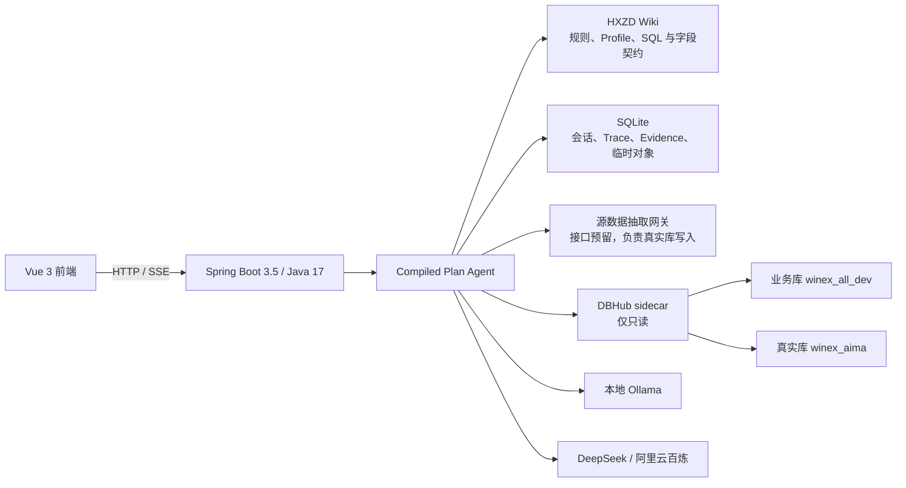
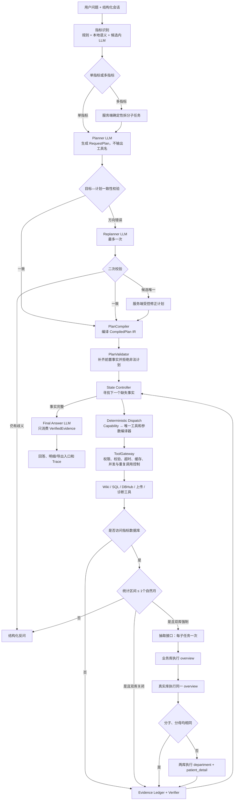

# 核心制度指标 Agent 当前架构

> 权威版本：2026-07-26。本文描述当前 Java 单运行时，不包含已经删除的监控、指标草稿/发布工作台和“全面实施验收”能力。

## 1. 运行组件


```mermaid
flowchart LR
    UI["Vue 3 前端"] -->|"HTTP / SSE"| API["Spring Boot 3.5 / Java 17"]
    API --> AGENT["Compiled Plan Agent"]
    AGENT --> WIKI["HXZD Wiki<br/>规则、Profile、SQL 与字段契约"]
    AGENT --> SQLITE["SQLite<br/>会话、Trace、Evidence、临时对象"]
    AGENT --> EXTRACT["源数据抽取网关<br/>接口预留，负责真实库写入"]
    AGENT --> DBHUB["DBHub sidecar<br/>仅只读"]
    DBHUB --> BUSINESS["业务库 winex_all_dev"]
    DBHUB --> REAL["真实库 winex_aima"]
    AGENT --> OLLAMA["本地 Ollama"]
    AGENT --> ONLINE["DeepSeek / 阿里云百炼"]
```

部署不需要 Python、MySQL、Docker 或额外可观测中间件。

## 2. 主执行链


```mermaid
flowchart TD
    U["用户问题 + 结构化会话"] --> R["指标识别<br/>规则 + 本地语义 + 候选内 LLM"]
    R --> M{"单指标或多指标"}
    M -->|"多指标"| SPLIT["服务端确定性拆分子任务"]
    M -->|"单指标"| P
    SPLIT --> P["Planner LLM<br/>生成 RequestPlan，不输出工具名"]
    P --> ALIGN{"目标—计划一致性校验"}
    ALIGN -->|"一致"| C["PlanCompiler<br/>编译 CompiledPlan IR"]
    ALIGN -->|"方向错误"| RP["Replanner LLM<br/>最多一次"]
    RP --> ALIGN2{"二次校验"}
    ALIGN2 -->|"一致"| C
    ALIGN2 -->|"候选唯一"| FIX["服务端受控修正计划"]
    FIX --> C
    ALIGN2 -->|"仍有歧义"| ASK["结构化反问"]
    C --> V["PlanValidator<br/>补齐前置事实并拒绝非法计划"]
    V --> S["State Controller<br/>寻找下一个缺失事实"]
    S --> D["Deterministic Dispatch<br/>Capability → 唯一工具和参数编译器"]
    D --> G["ToolGateway<br/>权限、校验、超时、缓存、并发与重复调用控制"]
    G --> T["Wiki / SQL / DBHub / 上传 / 诊断工具"]
    T --> DBTASK{"是否访问指标数据库"}
    DBTASK -->|"否"| E
    DBTASK -->|"是"| PERIOD{"统计区间 ≤ 1个自然月"}
    PERIOD -->|"否"| ASK
    PERIOD -->|"是且双库关闭"| E
    PERIOD -->|"是且双库强制"| EX["抽取接口：每子任务一次"]
    EX --> BO["业务库执行 overview"]
    BO --> RO["真实库执行同一 overview"]
    RO --> MATCH{"分子、分母均相同"}
    MATCH -->|"是"| E
    MATCH -->|"否"| DETAILS["两库执行 department + patient_detail"]
    DETAILS --> E
    E["Evidence Ledger + Verifier"]
    E --> S
    S -->|"事实完整"| F["Final Answer LLM<br/>只消费 VerifiedEvidence"]
    F --> OUT["回答、明细/导出入口和 Trace"]
```

状态控制器按事实推进，而不是让模型自由循环。每个 Capability 在注册表中固定声明前置事实、产出事实、实际工具、参数编译器和验证器。循环的作用是让同一个执行器处理不同长度的计划、工具失败、缓存复用和多子任务状态；工具顺序由依赖拓扑决定，不由模型临场选择。

## 3. LLM 节点

| 节点 | 作用 | 明确禁止 |
|---|---|---|
| 指标候选消歧 | 只在规则和本地语义无法唯一确定指标时，从允许列表中选一个 | 不创造指标编号 |
| Planner | 把自然语言整理为意图、指标、时间、输出目标和歧义 | 不输出工具名、不写 SQL |
| 计划一致性审核 | 只在 Java 规则无法判断复杂语义时审核计划是否偏题 | 不访问工具或数据库 |
| Replanner | 只纠正方向性语义错误，最多一次 | 不处理数据库、权限、对象过期或普通工具错误 |
| 候选口径消歧 | 从已审批且可执行的 Profile 允许列表中选择 | 不接受用户字段名、参数或 SQL |
| Final Answer | 按当前意图模板组织已验证证据 | 不回忆旧数值、不调用工具、不补造原因 |

## 4. 工具

| 工具 | 用途 | 执行边界 |
|---|---|---|
| `search_indicator_rules` | 在 HXZD Wiki 中检索指标 | 35 项均可检索 |
| `get_effective_rule` | 读取定义、公式、分子、分母和默认 Profile | 不可执行 Profile 也可解释 |
| `preview_rule_change` | 只读展示口径差异 | 不创建草稿、不审批、不发布 |
| `inspect_indicator_implementation` | 检查 Profile 状态、字段契约和元数据 | 核心 SQL 安全前置检查，不是实施工作台 |
| `prepare_indicator_sql` | 从当前 Profile 生成受控 SQL 对象 | 仅 `executable` Profile |
| `trial_run_indicator_sql` | 禁用抽取时执行现有单库链；强制模式进入双库 Workflow | 先抽取一次，再用相同 SQL/参数严格串行核对两库 |
| `resolve_indicator_caliber` | 解析候选/假设口径 | 只从已审批可执行 Profile 中选择 |
| `prepare_indicator_caliber_sql` | 准备候选口径 SQL | 禁止用户覆盖字段和 SQL |
| `trial_run_indicator_caliber_sql` | 试运行候选口径 | 结果明确标记为模拟口径 |
| `diagnose_indicator_issue` | 诊断无外部对比对象的异常 | 不用于普通计算或日期变更 |
| `diagnose_indicator_difference` | 分层核对外部结果或上传明细差异 | 结构 → 口径 → 记录集合 → 数据质量 |
| `analyze_uploaded_indicators` | 解析 `.xlsx` 汇总或逐条数据 | 文件绑定当前医院和用户 |

## 5. HXZD Wiki 机器契约

知识来源为 35 项原始 Markdown。生成器产出：

- `indexes/rule_index.json`：35 项指标；
- `indexes/profile_index.json`：45 个独立 Profile；
- 每项指标的 `runtime.json`；
- 每个 Profile 独立的 ETL、概览、科室和患者明细 SQL 引用；
- 双库同构状态、两库验证角色、科室比较键、患者业务主键和允许比较字段；
- 字段契约、参数、结果映射、适用范围和阻断原因。

Profile 状态：

| 状态 | 可解释 | 可准备/试运行 SQL | 可明细/导出 |
|---|---:|---:|---:|
| `executable` | 是 | 是 | 仅声明相应 SQL 契约时 |
| `documentation_only` | 是 | 否 | 否 |
| `draft` | 否，不进入生效口径 | 否 | 否 |

Java 不再读取旧 MQSI 规则表，也不把未实现、无 SQL、字段不完整或结果映射不完整的方案提升为可执行。

当前生成契约包含 42 个 `documentation_only` Profile、3 个 `draft` Profile 和 0 个 `executable` Profile。因此当前 35 项均可解释；在字段契约和统一结果列映射完成验证前，SQL 准备、试运行、明细和导出会被安全门禁拒绝。

## 6. Evidence 与安全

- 指标搜索、规则、SQL 准备、试运行和明细必须使用同一 `rule_id + profile_id`。
- Final Answer 只消费 `VerifiedEvidence`。
- SQL 正文、凭证和患者原始行不写入通用 Trace/Evidence。
- 患者明细只保存在短期受权限保护对象中。
- 业务 SQL 只能经服务端模板、字段/元数据预检、只读校验和 DBHub 执行。
- 所有数据库型指标请求使用左闭右开区间，结束时间不得超过开始时间顺延一个自然月。
- 强制双库模式固定执行“抽取一次 → 业务库概览 → 真实库概览”；分子、分母一致时不查询明细。
- 分子或分母不同才执行两库科室和患者明细；仅比例相同不视为一致。
- 双库差异报告只保存安全摘要和两侧运行 ID；逐条差异 Excel 在授权用户确认后从
  两个短期明细快照生成，不在 Trace 或 Evidence 中保存患者行。
- 抽取和双库执行按医院使用进程内信号量串行；抽取失败不得继续查库。
- `SourceExtractionGateway` 当前只定义强类型请求、结果和幂等契约，具体 HTTP 适配器合并前必须保持禁用。
- 数据库验证脚本只从环境变量读取凭据。

## 7. 已永久删除

- `/api/monitoring/**` 及 `/monitoring` 页面；
- 指标草稿、审批、发布和治理工作台接口；
- `/implementation` 页面；
- Agent 的“全面实施验收”意图、IR、工具、模板和 Trace 节点。

历史 SQLite 表不会被主动删除，但当前应用不再初始化或访问。用户再请求“全面实施验收”时，服务端在 Planner 前返回确定性不支持说明。

## 8. 验证

```powershell
cd .\backend-java
mvn.cmd -s .\maven-settings.xml test

cd ..\frontend-vue
npm.cmd run build

cd ..
node .\scripts\build-wiki-from-markdown.mjs --input ".\core-rules-wiki\raw\company\35项核心制度指标完整提取.md" --check
node .\scripts\validate-wiki-contract.mjs
```

CI 使用同样四道门禁。
