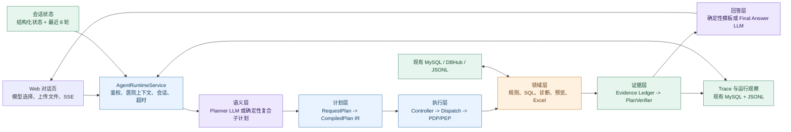
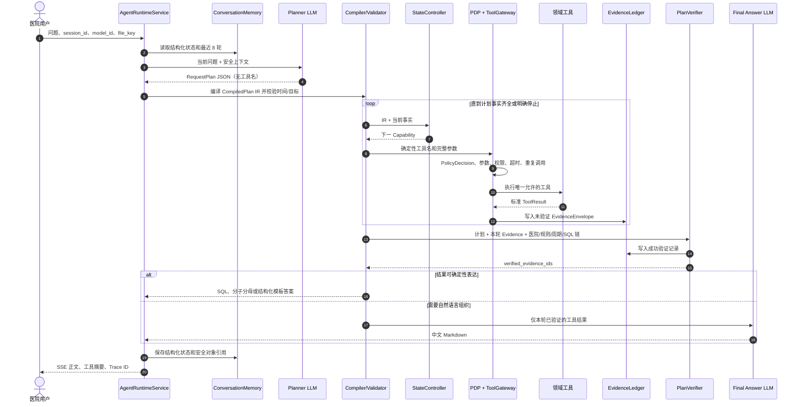
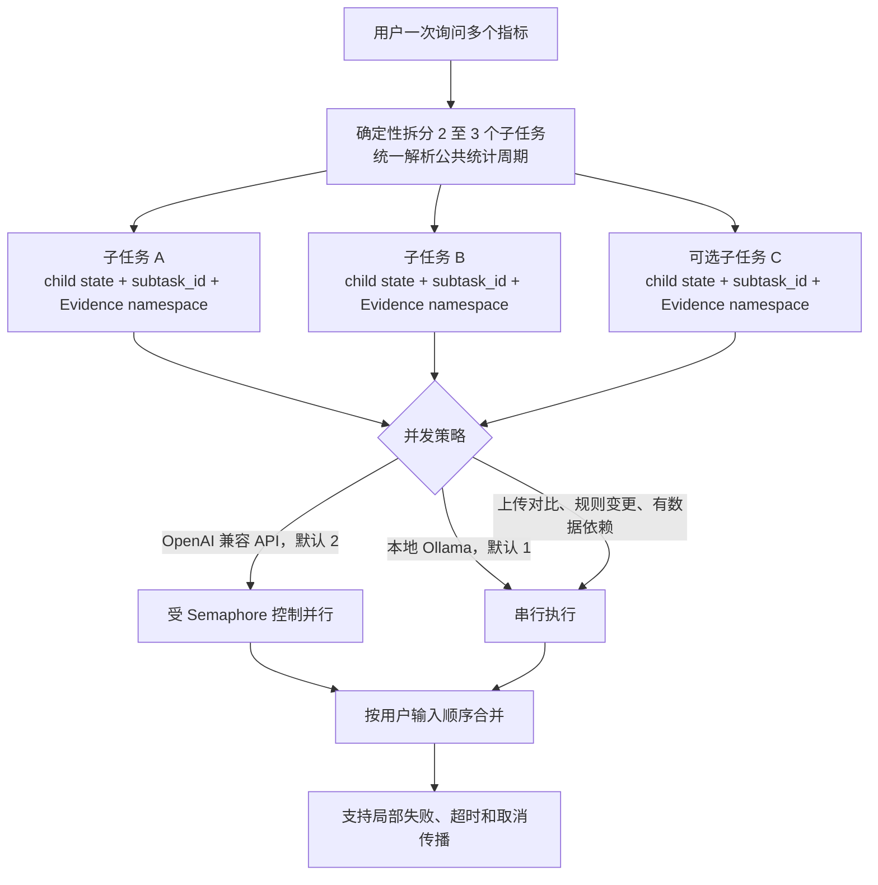
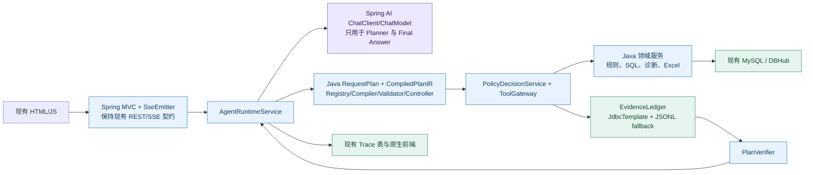

# Agent Runtime 架构总结、PDF 核对与 Spring AI 迁移指南

> 更新日期：2026-07-20
>
> 代码基线：`28fb392` 及其后的当前工作区
>
> 适用范围：当前核心制度指标和医院实施业务范围内的任何问法

## 1. 结论先行

当前系统使用的是项目自研的受控 Agent Runtime，主链路没有使用 LangChain 或 LangGraph 的运行时 API。它也不是让模型自由决定每一步的通用 ReAct，而是：

> **LLM 理解业务目标，服务端编译和执行计划，领域工具提供事实，Verifier 验证证据，LLM 最后只负责组织答案。**

可以把它概括为：

> **Compiled Plan + Deterministic Execution + Evidence Verification**

这套架构特别针对医院指标场景中的规则版本、统计周期、字段映射、只读 SQL、医院隔离、患者数据和审计要求。模型不会直接访问数据库，也不会自行选择 SQL、跳过校验或决定患者明细导出权限。

## 2. 框架分层总图

为了让图在 Markdown 和 A4 PDF 中保持可读，架构拆成“分层总图、单任务时序、复合任务并行”三张图，不再把所有分支压进一张纵向长图。



颜色含义：紫色是 LLM，蓝色是确定性代码，橙色是领域工具，绿色是状态或证据存储。

## 3. 单指标请求的真实执行顺序



需要特别说明：普通单指标请求仍会经过 Planner。服务端跳过 Planner、直接构造 `RequestPlan` 的情况，主要是已经确定的复合指标子任务和少数明确的结构化追问，并不是所有“查询结果”请求都走快速计划。

## 4. 多指标请求的隔离与并行



DBHub 只读查询还有独立的默认并发上限 2。子任务执行期间不修改父状态，合并时只汇总结果、Evidence 引用和 Trace 泳道。

## 5. 当前使用的模型

模型由本机 `config.yaml` 的 `models` 注册表配置，前端只提交 `model_id`，后端 `ModelRegistry` 根据角色构造 Ollama 或 OpenAI 兼容适配器。

| 模型 ID | 当前模型标识 | Provider | Planner | Final Answer | 当前超时特点 |
|---|---|---|---|---|---|
| `ollama-qwen3` | `qwen3:4B-instruct` | Ollama | 无思考模式，生成严格计划 JSON | 普通回答 | 默认单次模型调用 60 秒，整轮 120 秒 |
| `ollama-qwen3-8b-thinking` | `qwen3:8b` | Ollama | 显式 `think: false` | `think: true`，思考内容不进入用户输出 | 单次 120 秒，整轮 300 秒，复合任务串行 |
| `deepseek-v4-flash` | `deepseek-v4-flash` | OpenAI 兼容 API | 结构化计划 | 最终回答 | 使用全局超时，复合任务默认并发 2 |
| `deepseek-v4-pro` | `deepseek-v4-pro` | OpenAI 兼容 API | 结构化计划 | 最终回答 | 使用全局超时，复合任务默认并发 2 |

DeepSeek 名称是当前部署传给兼容 API 的模型标识，不代表本文对第三方公开产品版本或生命周期作出判断。API Key 只从环境变量读取，不进入浏览器、Trace 或仓库。

### 5.1 LLM 真正参与的节点

| LLM 节点 | 做什么 | 不做什么 |
|---|---|---|
| Planner | 把自然语言转换成 `RequestPlan`：意图、指标原文、时间原文、输出目标和歧义 | 不输出工具名、不生成执行步骤、不计算日期边界、不写 SQL |
| Replanner | 仅在允许的语义计划错误、任务类型错误、用户改变目标或存在合法替代方向时重规划一次 | 不处理数据库错误、权限错误、对象过期、缺时间、Evidence 冲突和普通工具异常 |
| Final Answer | 根据当前子任务已验证结果组织中文回答 | 不调用工具、不访问数据库、不从历史回答回忆数值 |
| 指标草稿解析 | 把新增指标描述解析成结构化草稿 | 不发布规则、不执行 SQL |
| 诊断证据抽取/说明 | 提取用户诊断材料或把已验证诊断结论变成业务可读说明 | 不判断 SQL 安全、不补造数据或原因 |

主 Agent 的 Planner、Replanner 和 Final Answer 都收到空工具列表。工具名、调用顺序和参数由服务端代码决定。

## 6. 当前 9 个领域工具

| 工具 | 作用 | 主要边界 |
|---|---|---|
| `search_indicator_rules` | 根据名称、简称、错别字、同义词或主题查指标 | 只查询当前医院可见规则；多候选时澄清 |
| `get_effective_rule` | 获取定义、公式、版本、生效层级和 SQL 状态 | 必须已有唯一 `rule_id`；不返回 SQL 文本 |
| `inspect_indicator_implementation` | 检查字段映射、关联、缺失项和实施状态 | 不读取患者数据；主要服务诊断链 |
| `prepare_indicator_sql` | 字段预检、确定性生成 SQL 和只读安全校验 | 必须有生效规则与明确统计周期；返回短期 `sql_id` |
| `trial_run_indicator_sql` | 执行已校验 SQL 的只读试运行 | 只接受同会话、同医院、未过期的 `sql_id`；返回聚合结果和 `run_id/result_id` |
| `diagnose_indicator_issue` | 排查异常、结果不一致、算不对或数据质量问题 | 不得用于普通公式解释、改时间、查结果或生成 SQL |
| `create_indicator_draft` | 把业务描述转换成预览级指标草稿 | 不提交审批、不发布、不执行 SQL；当前主计划不把它用于普通查询 |
| `preview_rule_change` | 预览本院口径变化和实施影响 | 只预览，不提交、审批、发布或回退 |
| `analyze_uploaded_indicators` | 分析 Excel，并与本院聚合结果或系统明细对比 | 必须是同医院文件；患者原始行不进入 LLM |

明细预览、Excel 导出、差异表下载是受控业务 API，不作为 LLM 工具暴露。这使医院隔离、下载权限、审计和文件过期不依赖模型判断。

## 7. 关键节点

| 节点 | 类型 | 核心职责 |
|---|---|---|
| `AgentRuntimeService` | 代码 | 登录态、医院上下文、模型选择、会话、SSE、Trace、整轮超时 |
| `AgentConversationMemory` | 存储 | 最近 8 轮文本和指标、统计周期、SQL/运行对象等结构化状态 |
| Compound Splitter | 代码 | 拆分多个指标、统一周期、创建隔离 child state |
| `ModelRequestPlanner` | LLM | 输出严格 `RequestPlan` JSON |
| `CapabilitySpecRegistry` | 代码 | 统一声明 Capability、requires、produces、工具、参数编译器、策略、Verifier 和回答模式 |
| `PlanCompiler` | 代码 | 从目标事实递归补依赖，生成拓扑有序、版本化 `CompiledPlan IR` |
| `PlanValidator` / `TimeRangeResolver` | 代码 | 校验目标、冲突和权限边界；把自然时间解析成左闭右开区间 |
| `AgentStateController` | 代码 | 查找尚未满足的事实，决定下一 Capability、回答或澄清 |
| Deterministic Dispatch | 代码 | 从 CapabilitySpec 生成唯一工具和完整参数 |
| `PolicyDecisionService` | 策略 | 输出 allow/deny、原因、用户说明和策略版本 |
| `ToolGateway` | PEP | 真正阻止未授权调用，并负责参数校验、超时、并发、缓存和重复调用控制 |
| `EvidenceLedger` | 存储 | MySQL 优先、JSONL 兜底；保存 EvidenceEnvelope 和验证记录 |
| `PlanVerifier` | 代码 | 验证医院、子任务、规则、周期、SQL 链、有效期和结果指纹 |
| Final Answer | LLM | 只组织已验证的本轮结果 |
| `ResponseGuard` | 代码 | 拦截 DSML、`tool_calls`、内部协议泄漏和无证据数值 |
| `TraceRecorder` | 存储 | 保存安全节点数据、耗时、版本、Evidence、Token、缓存和重试信息 |

## 8. 已实施的工程化措施

1. **类型化合约**：Pydantic 对 RequestPlan、IR、状态、工具参数、ToolResult、PolicyDecision 和 Evidence 拒绝额外字段。
2. **单一能力注册表**：Compiler、Controller、Dispatch 和 Verifier 共用 `CapabilitySpecRegistry`，启动时检查循环、重复 Fact Producer、未知工具和未知 Verifier。
3. **确定性时间**：自然月份、至今和跨轮时间由服务端统一解析，结果使用左闭右开区间。
4. **确定性 SQL 边界**：模型不生成可执行 SQL；SQL 必须经过字段预检、安全校验和短期对象化。
5. **PDP/PEP**：PolicyDecisionService 负责决策，ToolGateway 负责强制执行。
6. **Evidence 链**：成功工具结果生成 Evidence ID；Final Answer 只接收证据 ID 已通过验证、且指纹匹配的本轮 ToolResult。
7. **结构化会话状态**：指代、当前指标、统计周期、最近运行和上传文件引用不只依赖文本历史。
8. **重复调用控制**：工具名和参数生成指纹，相同调用优先复用缓存，异常重复会停止。
9. **复合任务隔离**：每个指标拥有独立 subtask ID、child state、Evidence namespace 和 Trace 泳道。
10. **自适应并行**：API 默认并发 2、本地 Ollama 默认串行、DB 只读默认并发 2；结果仍按用户输入顺序合并。
11. **全阶段 Trace**：记录节点类型、关系、相对开始时间、总/独占耗时、模型、工具、Token、FailureClass、缓存、重试、版本和安全输入输出。
12. **同医院观察接口**：`/api/agent/runs` 和 `/api/agent/runs/metrics` 只查询当前医院的安全摘要。
13. **轻量 Eval**：YAML/JSON 数据集覆盖语义、时间、跨轮、多指标、SQL 边界、上传比较和 Prompt Injection；模型矩阵只在人工运行时调用模型。
14. **轻量部署**：继续使用 FastAPI、现有 MySQL/JSONL/SQLite、DBHub、Ollama/DeepSeek 和原生前端，不增加新的服务或中间件。

## 9. 为什么不直接采用其他 Agent 框架

| 方案 | 优点 | 本项目中的主要问题 | 当前选择 |
|---|---|---|---|
| 通用 ReAct | 开放任务灵活，工具可动态探索 | 4B 容易错工具、漏参数、重复调用；执行路径依赖模型；医疗和 SQL 审计成本高 | 只保留循环概念，不让模型路由工具 |
| 传统 Plan-and-Execute | Planner 与执行分离，复杂任务清晰 | Planner 常直接输出工具名和顺序，工具重构会污染 Prompt；仍可能漏前置条件 | Planner 只输出业务语义，服务端编译 IR |
| LangChain Agent | 模型、工具、记忆组件丰富 | 不能自动解决医院口径、SQL 对象、Evidence 和权限边界；迁移收益小于改造成本 | 不作为主链运行时 |
| LangGraph | 图状态、检查点、暂停恢复和分布式扩展成熟 | 当前图规模有限，现有状态、Trace、SSE 和权限已经集成；引入后仍需保留领域 Compiler/Gateway/Verifier | 当前不使用；出现长时任务或分布式恢复需求时再评估 |
| 纯确定性工作流 | 最稳定、最好测试 | 无法覆盖错别字、指代、组合问法和自然语言解释 | 仅把高风险执行阶段确定性化 |
| 当前架构 | 保留自然语言理解，同时控制工具、SQL、权限和证据 | 自研 IR、Controller、Trace 和 Verifier 需要持续维护 | 与当前医院指标场景最匹配 |

当前系统仍然存在循环：`Controller -> Dispatch -> Gateway -> Tool -> Evidence -> Controller`。区别在于下一步由“计划尚缺什么事实”决定，而不是由模型看完所有工具后自由试错。

## 10. 对附件 PDF 流程图的核对

核对文件：`C:\Users\lenovo\Desktop\实习\agent-runtime-current.pdf`，共 14 页。

### 10.1 正确的部分

- “Compiled Plan + Deterministic Execution + Evidence Verification”的总体定位正确。
- 主链未使用 LangChain/LangGraph 运行时的判断正确。
- Planner、Replanner、Final Answer 是主要 LLM 节点，模型不直接访问数据库，这一点正确。
- 当前 4 个模型 ID、9 个领域工具和主要代码位置与配置一致。
- Capability Registry、PDP/PEP、Evidence Ledger、受控 SQL、结构化会话、复合任务隔离和 Trace 观察的方向正确。
- 本地 Ollama 串行、API 默认并发 2、DBHub 只读并发 2 的描述正确。

### 10.2 需要修正或收窄的部分

| PDF 表述 | 当前代码事实 | 修正建议 |
|---|---|---|
| 明确结果查询可以普遍跳过 Planner | 普通单指标请求仍调用 Planner；确定性计划覆盖复合指标子任务和少数明确追问 | 把分支改成“复合子任务或已识别结构化追问” |
| `PlanVerifier -> Replanner` | 当前 Replan 在失败 ToolResult 进入运行状态后按 FailureClass 判断，不是由 Verifier 直接发起 | 从“允许重规划的失败分类”连接 Replanner；Verifier 失败直接停止并返回安全错误 |
| `VerifiedEvidence` 像一个独立数据类型 | 代码实际类型是 `EvidenceEnvelope` 和 `EvidenceVerification`，成功 ID 写入 `verified_evidence_ids` | 图中改成“EvidenceVerification + verified IDs” |
| Verifier 生成独立成功/拒绝记录 | 当前只持久化成功的 `verified` 记录；拒绝情况抛出安全错误，尚未写 `rejected` 记录 | 标注为当前实现缺口，后续可补齐拒绝审计 |
| Trace 父子调用树像严格嵌套 Span | 当前主要按每个 subtask 的前驱节点串联，`tool_result` 以 `tool_gateway` 为父；它能展示执行关系，但不是完整嵌套调用栈 | 文档称“节点关系树/前驱关系树”更准确 |
| p95 超过基线 | 当前实现按固定配置阈值提示，没有学习或持久化动态基线；错误码名称仍叫 `P95_ABOVE_BASELINE` | 改称“p95 超过固定慢请求阈值” |
| 点击回答中的每个结论定位 Evidence | 当前可以点击 Evidence ID 定位对应节点，但没有把正文每个结论做行内 Evidence 标注 | 收窄为“Evidence ID 定位工具节点” |

### 10.3 版面问题

- 第 2 页主流程图在 A4 上过长、字号太小，不适合打印阅读。
- 多页右下角页码靠近裁切边缘，渲染后出现末位不完整的情况。
- 表格整体清晰，但少数长代码名被强制换行，建议在导出 PDF 时使用更宽页面或减少同页列数。

### 10.4 最终判断

PDF 的架构方向是正确的，可以作为设计说明基础；但不应直接当作完全精确的运行时序图。建议用本文的三张小图替换原第 2 页长图，并按上表修正 5 个实现边界。

## 11. 迁移到 Spring AI / Java 是否可行

可行，但建议把 Spring AI 定位为**模型访问和结构化输出适配层**，不要把当前受控编排改回 Spring AI 的自动工具调用循环。

截至 2026-07-20，Spring AI 官方参考文档显示 2.0.x 对应 Spring Boot 4.0.x/4.1.x；迁移前需要按组织现有 Spring Boot 基线选择匹配版本，而不是在旧 Boot 项目中强行升级。Spring AI 提供统一 `ChatModel`、`ChatClient`、Ollama、OpenAI 兼容模型、结构化输出和工具 API，但医院领域状态机仍应由项目代码保留：

- [Spring AI Getting Started](https://docs.spring.io/spring-ai/reference/getting-started.html)
- [Chat Model API](https://docs.spring.io/spring-ai/reference/api/chatmodel.html)
- [ChatClient API](https://docs.spring.io/spring-ai/reference/api/chatclient.html)
- [Tool Calling](https://docs.spring.io/spring-ai/reference/api/tools.html)
- [Ollama Chat](https://docs.spring.io/spring-ai/reference/api/chat/ollama-chat.html)
- [Observability](https://docs.spring.io/spring-ai/reference/observability/index.html)

### 11.1 Java 目标架构



推荐使用 Java 21、Spring Boot 4.x 与匹配的 Spring AI 2.0.x 开始新工程；如果现有医院 Java 基线仍是 Spring Boot 3.x，则先选择与其兼容的 Spring AI 版本，并把升级 Boot 与迁移 Agent 分成两个项目，避免一次改变两个基础平台。

### 11.2 Python 到 Java 的组件映射

| 当前 Python | Java/Spring 实现 |
|---|---|
| Pydantic `RequestPlan` / `CompiledPlan` | Java `record` + Jackson 严格反序列化 + Jakarta Validation |
| `ModelRegistry` | `ModelClientRegistry`，持有多个 `ChatModel`/`ChatClient` Bean 和角色化 options |
| Ollama Adapter | Spring AI `OllamaChatModel` |
| OpenAI Compatible Adapter | Spring AI `OpenAiChatModel`，配置 DeepSeek base URL 和模型 ID |
| `ModelRequestPlanner` | 独立 Planner `ChatClient`，工具关闭，输出映射为 `RequestPlan` |
| `CapabilitySpecRegistry` | 不可变 `Map<CapabilityId, CapabilitySpec>`；启动时用 `ApplicationRunner` 校验图 |
| `PlanCompiler` | 纯 Java 服务；按 Fact Producer 递归补依赖并拓扑排序 |
| `AgentStateController` | 纯 Java状态机；根据 `Set<FactType>` 选择下一 Capability |
| `PolicyDecisionService` | Spring `@Service`，返回不可变 `PolicyDecision` |
| `ToolGateway` | 自定义 Gateway；不要让 `ToolCallingAdvisor` 自动执行工具 |
| Python 领域 Tool handler | Spring Service 方法 + 每个工具独立输入 DTO、权限和超时 |
| `EvidenceLedger` | `JdbcTemplate`/MyBatis 写现有 MySQL；Jackson JSONL 兜底 |
| `PlanVerifier` | 纯 Java验证器 + 数值复算 + 对象链一致性校验 |
| `AgentConversationMemory` | 继续读写现有会话表，不直接替换成通用 ChatMemory |
| `asyncio.Semaphore` | Java `Semaphore` + 虚拟线程 Executor/CompletableFuture |
| FastAPI SSE | Spring MVC `SseEmitter`；保持现有 SSE event 名称和 JSON 字段 |
| TraceRecorder | 继续写现有 Trace 表和 JSONL；可额外使用 Micrometer Observation，但不是必需条件 |

### 11.3 Spring AI 应该怎么用

1. **Planner ChatClient**：只发送 Planner Prompt 和安全上下文，工具列表为空，把结果严格反序列化成 `RequestPlan`。
2. **Final Answer ChatClient**：只发送已验证的本轮结果，工具列表为空；输出经过现有 ResponseGuard 等价实现。
3. **模型切换**：为 Ollama 与 OpenAI 兼容端点创建不同 `ChatModel`，通过 `model_id` 查注册表，不能让前端提交任意 base URL 或模型名。
4. **Thinking 控制**：Planner 对 Qwen3 8B 显式关闭 thinking；Final Answer 可以开启，但 reasoning 内容只记长度和存在性，不进入 SSE、Trace 正文或持久化会话。
5. **结构化输出**：优先使用严格 JSON + Jackson/Jakarta Validation。Spring AI 原生 structured output 可作为模型支持良好时的优化，不能成为唯一校验；官方文档明确提示不同模型支持差异较大，Ollama reasoning 模型尤其要保留兜底。
6. **关闭自动工具循环**：Spring AI 2.0 的 `ChatClient` 默认会注册 `ToolCallingAdvisor`。本项目应设置 `spring.ai.chat.client.tool-calling.enabled=false`，并且不向 Planner/Final Answer 传工具。工具仍由 Controller 和 ToolGateway 调用。
7. **Observability**：可以利用 Spring Observation 采集模型耗时和 Token，但继续把安全 Trace 写现有表。不要开启工具参数和结果内容的通用观测导出；Spring AI 官方也默认关闭这类敏感内容。

### 11.4 推荐 Java 包结构

```text
com.example.hospital.agent
├── api/                 # REST、SSE、鉴权上下文
├── runtime/             # AgentRuntimeService、Runner、Memory、ResponseGuard
├── planning/            # RequestPlan、IR、Registry、Compiler、Validator、Controller
├── policy/              # PolicyDecisionService、ToolExecutionContext
├── tools/               # ToolGateway、9 个领域工具 DTO 与适配器
├── evidence/            # EvidenceEnvelope、Repository、Ledger、Verifier
├── model/               # ModelClientRegistry、PlannerClient、FinalAnswerClient
├── observability/       # TraceRecorder、runs/metrics 查询
└── config/              # 模型、超时、并发与保留期配置
```

### 11.5 迁移步骤

#### 阶段 0：冻结契约

- 固定当前 API、SSE event、RequestPlan、IR、ToolResult、Evidence、Trace 和错误码 JSON 样例。
- 将现有 `evals/cases.yaml` 作为 Python/Java 共用验收数据。
- 导出当前 9 个工具的输入输出 schema，作为 Java DTO 契约测试。

#### 阶段 1：只迁移模型适配层

- 建立 Spring Boot 工程和 `ModelClientRegistry`。
- 接通 Ollama 4B、Ollama 8B 和 DeepSeek OpenAI 兼容 API。
- 实现 Planner/Final Answer 两个 ChatClient；工具自动调用保持关闭。
- 用同一批 Eval 比较 Python 与 Java 的 RequestPlan 和回答约束。

#### 阶段 2：迁移 IR 和状态控制

- 移植 Java record、Capability Registry、Compiler、TimeRangeResolver、Validator、Controller 和 FailureClass。
- 启动时执行循环、重复 Producer、未知工具和未知 Verifier 检查。
- 先用内存 ToolResult 测试，不连接医院数据库。

#### 阶段 3：迁移 ToolGateway 与领域工具

- 按 read/sql/diagnosis/preview/upload 五类迁移依赖，不创建全局巨大依赖对象。
- 复用现有 MySQL 和 DBHub；SQL 仍只允许确定性生成和只读执行。
- 实现医院、角色、权限、TTL、重复调用和超时测试。

#### 阶段 4：迁移 Evidence、会话和 Trace

- Java 继续读写现有表结构，先双读/双写，再切换权威实现。
- 补齐当前 Python 尚未落库的 rejected EvidenceVerification 审计，再决定是否反向同步 Python。
- 保持 `/api/agent/runs`、`/metrics` 和前端查看链路兼容。

#### 阶段 5：迁移 SSE 和复合并行

- 用 `SseEmitter` 保持现有前端无改造或最小改造。
- 使用虚拟线程 Executor、`Semaphore` 和 `CompletableFuture` 实现 API 并发 2、Ollama 串行、DB 并发 2。
- 验证局部失败、输入顺序、取消传播和临时对象清理。

#### 阶段 6：切换生产入口

- 测试环境可短期同时运行 Python 和 Java 做离线对照，但生产不长期保留双 Runtime。
- 对比同一输入的计划、工具参数、SQL 对象、聚合结果、Evidence 和最终答案。
- 达到基线后一次只切换 Agent API；现有前端、MySQL、DBHub 和下载机制保持不变。
- 观察稳定后删除 Python Agent 进程，避免维护两套主链。

### 11.6 迁移时最容易踩的坑

- Spring AI 自动 ToolCallingAdvisor 被意外启用，导致模型重新获得工具路由权。
- Jackson 默认容忍未知字段，破坏当前 Pydantic `extra=forbid` 边界。
- Java 时间解析把“1 月到 3 月”处理成 3 月 31 日 00:00，而不是 4 月 1 日 00:00 的左闭右开区间。
- Planner 和 Final Answer 共用一个带工具的 ChatClient Builder。
- 使用 Spring ChatMemory 替换结构化医院状态，导致指标、周期和 SQL 对象被文本历史覆盖。
- 直接把 Spring Observability 的 prompt、工具参数或结果打开，泄露医院业务数据。
- WebFlux 与阻塞 JDBC 混用而没有隔离，导致吞吐下降；轻量迁移优先选择 MVC + 虚拟线程。
- Python 与 Java 对空字符串、`null`、枚举、金额/比例精度和 JSON 指纹的序列化规则不一致。

## 12. 最终建议

当前 Python 架构可以继续使用，近期没有为了“采用框架”而立即重写的必要。若医院主技术栈要求 Java，迁移到 Spring AI 是可行的，但正确姿势是：

> **保留自研的 IR、Controller、Policy、ToolGateway、Evidence 和 Verifier，只用 Spring AI 替换模型客户端与结构化输出适配。**

这样能够获得 Java/Spring 的配置、依赖注入、部署和团队维护优势，同时不丢失当前为医院指标场景建立的确定性执行与证据安全边界。
