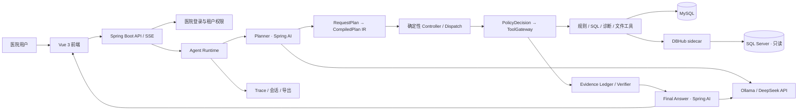

# Java 17 + Spring AI + Vue 3 渐进迁移

> 更新日期：2026-07-22。阶段 0 至阶段 5、业务工作台、单 JAR 构建、真实只读双跑、正式切流、回退演练和稳定观察均已完成。Java 当前是 `8765` 权威运行时并直接提供 Vue 3 页面；FastAPI 保留为显式回退入口。

## 1. 迁移目标与约束

目标是把当前 Python Agent Runtime 全部迁移到 Java，并把原生前端迁移到 Vue 3；迁移过程不能中断现有测试和医院验证。

固定技术选择：

- Java 17、Spring Boot 4.1、Spring AI 2.0、Maven。
- Vue 3、TypeScript、Vite、Vue Router、Pinia。
- 保留现有 MySQL、SQL Server、Ollama、DeepSeek API 和 DBHub sidecar。
- Java 主服务仍通过 DBHub MCP 访问 SQL Server，不引入直连旁路。
- 不增加 Redis、消息队列、工作流服务、Docker 或新的生产数据库。
- Spring AI 只负责模型适配和结构化输出；计划编译、状态控制、策略、工具网关、Evidence 和验证器继续确定性实现。
- 最终将 Vue `dist/` 放入 Spring Boot JAR，生产环境不需要 Node.js 常驻。

## 2. 目标架构



DBHub 与 Java 的关系是“保留外部数据库能力边界”，不是“Java 无法适配数据库”。Java 已实现与 Python 相同的 JSON-RPC、JSON/SSE 响应和行数据提取协议，后续领域工具只依赖这个客户端。

## 3. 渐进切换方式

```text
现有入口
  ├─ 未迁接口 ──────────────> FastAPI（权威）
  └─ 已验收接口 ─> Spring Boot ─> 必要时调用同一 DBHub / MySQL

每个接口：冻结契约 → Java 实现 → 双跑对比 → 单接口切流 → 保留回退 → 删除 Python 实现
```

禁止一次性重写后整体上线。规则、医院口径、统计周期、SQL ID、运行结果与 Trace 必须在双栈期间可比较。

## 4. 阶段计划

### 阶段 0：契约与基础（本批已完成）

- 在 `contracts/migration/v1/` 冻结 Agent 请求、响应、SSE 事件和 DBHub MCP 约定。
- 新建 `backend-java/`，锁定 Java 17、Spring Boot 4.1 和 Spring AI 2.0 BOM。
- Java 提供兼容 `/api/health`、迁移状态接口和 DBHub 数据源接口。
- Java DBHub 客户端兼容 JSON、SSE、`rows/data/structuredContent/content[].text`。
- 新建 `frontend-vue/`，实现医院登录、模型切换、SSE 对话、Excel 上传、证据轨道和 Trace 抽屉。
- Vue 仍代理现有 FastAPI；旧 `web/` 不删除。

### 阶段 1：认证与只读规则（认证、规则子批次已完成）

- 已迁移医院账号、令牌、密码更新、权限读取与医院隔离；Java 与 Python 共用 PBKDF2 和令牌摘要契约，可复用同一 MySQL 会话表。
- 已迁移医院范围内的规则搜索和本院生效口径；医院编号只从认证主体注入，客户端冒充其他医院会返回 403。
- 已增加跨语言密码测试向量、H2 仓储测试和 `scripts/compare_java_python_read_api.py` 双跑脚本。
- 术语概念检索、详情、版本、确定性识别、候选、审批、发布和回退已在阶段 5 子批次迁移，并需在入口切流前使用真实登录会话完成验收。元数据概览与同步也已迁移。
- 当时 Nginx/启动入口暂不切流、FastAPI 仍是权威实现；该历史状态已由 2026-07-22 正式切流取代。

本子批次验收结果：Java 单元与仓储测试 13 项通过，Python 认证契约测试 8 项通过；影子服务使用同一 MySQL 临时会话对“急会诊及时到位率”执行双跑，安全规则字段返回一致。临时会话已清理，`8766` 已停止，现有 `8765` FastAPI 与 `8080` DBHub 未受影响。

### 阶段 2：Agent IR 与工具网关（IR 与网关子批次已完成）

- 已用 Java enum / record 定义 `RequestPlan`、`CompiledPlanIR`、Fact、CapabilitySpec 和 FailureClass，JSON 形状继续采用 `snake_case`。
- 已迁移 PlanCompiler、PlanValidator、StateController 和 DeterministicDispatch；Planner 计划不含工具名，实际工具只能从 CapabilitySpec 取得。
- 时间校验器可直接解析 Planner 已填的 ISO 边界，也可根据当前时钟确定性解析“从26年一月份到现在”“今年”“本月”“1月至3月”等原始表达，不依赖模型计算日期。
- CapabilitySpec 由 Spring Bean 注册，启动时检查循环依赖、重复 Fact Producer、未知工具和未知 Verifier。
- 已迁移不可变 ToolExecutionContext、PolicyDecisionService 与 ToolGateway；登录主体只能由服务端注入，PEP 在参数绑定和工具执行前生效。
- 工具网关已具备参数类型转换、超时、数据库并发 2、调用指纹和成功结果复用；规则读取工具可执行，未迁移工具明确返回 `TOOL_NOT_MIGRATED`。
- 新增认证影子接口 `POST /api/migration/agent/compile`，只展示校验、IR 和第一步决策，不执行任何工具。
- 当时 Agent 影子 Runner、模型调用和 VerifiedEvidence 属于下一子批次；这些能力现已完成并正式切流。

本子批次 Java 测试 22 项通过，覆盖 IR JSON 契约、依赖拓扑、能力环、重复 Fact Producer、未知工具、非法目标、中文时间范围、受控 Dispatch、权限拒绝、参数校验和重复调用缓存。影子编译接口不执行工具，现有 Python 服务未切换。

### 阶段 3：模型与 Evidence（模型与 Evidence 子批次已完成）

- 已使用 Spring AI 2.0 手动构建 Ollama 与 OpenAI 兼容 `ChatModel`，避免多模型自动配置互相覆盖；模型 ID 与现有前端保持一致，配置中保留 Qwen3 4B、Qwen3 8B 思考模式、DeepSeek V4 Flash 和 V4 Pro，API Key 只从环境变量注入且不会出现在能力接口。
- 已新增模型注册表和认证影子接口 `GET /api/migration/agent/capabilities`；本地 Ollama 强制单并发，OpenAI 兼容 API 最多并发 2。
- 已集中 Java 生产提示词到 `backend-java/src/main/resources/prompts/`。Planner 只输出 `RequestPlan`，首次 JSON 不合约时只修复一次；`POST /api/migration/agent/plan` 可执行模型规划、服务端校验和 IR 编译，但明确不执行工具。
- 已建立 `EvidenceEnvelope / EvidenceVerification / VerifiedEvidence` 类型边界，复用 Python 已有 `med_agent_evidence` 和 `med_agent_evidence_verification` 表；MySQL 不可用时写入独立 Java JSONL 兜底。
- ToolGateway 成功后生成未验证 Evidence；SQL、运行对象和明细只保存引用，安全载荷使用固定允许列表。Verifier 独立检查医院、子任务、过期时间、规则、周期、SQL 和结果指纹，并写入 verified/rejected 记录。
- Final Answer 只接受 `List<VerifiedEvidence>`，不注册任何 Spring AI 工具或自动 ToolCallingAdvisor；空回答或工具协议泄漏只允许纠正一次。
- 已新增 `java-agent-runner-v1` 影子执行循环，规则解释请求真实经过 Planner、IR、Controller、Dispatch、ToolGateway、EvidenceVerifier 和 Final Answer。非流式 `/api/migration/agent/chat` 保持冻结响应字段，流式 `/chat/stream` 保持冻结 SSE 事件名。
- Runner 每个成功工具结果都必须取得 Evidence；规则搜索结果会确定性写入当前 `rule_id`。任何未迁移或不可重试工具失败立即停止，不会再次调用同一工具直至触发重复调用保护。
- 新增 `scripts/compare_java_python_agent_rule.py`，可在用户主动启动两个服务并提供现有医院登录 token 后双跑规则解释，比较响应字段、停止原因和步骤数；脚本不打印 token。
- 当前 Java 测试 28 项通过。测试覆盖模型配置、Planner 单次修复、Evidence 允许列表、跨医院拒绝、结果指纹、Final Answer 工具协议防护、规则解释完整工具顺序和 REST 响应形状。
- 当时待迁移一次语义 Replan、ResponseGuard 的确定性模板降级、会话/Trace 持久化和跨模型离线 Eval；这些门禁项现已完成并用于 Java 权威链。

### 阶段 4：SQL、诊断、文件与复合任务（自适应复合任务子批次已完成）

- 已迁移 `inspect_indicator_implementation`、`prepare_indicator_sql` 和 `trial_run_indicator_sql`。Java Runner 可真实完成字段映射预检、医院覆盖 SQL 模板确定性渲染、只读安全校验、私有 SQL 对象保存、执行前上下文指纹复核和 DBHub 聚合试运行。
- SQL 对象继续复用 `med_generated_sql`、`med_agent_sql_object` 和 `med_sql_run_log`。对象绑定医院、用户、登录会话、规则、统计周期、业务数据源和 30 分钟有效期；跨医院、跨用户、跨会话、跨数据源、过期或上下文漂移均拒绝执行。
- DBHub 工具名和数据源 ID 由 `wiki.dbhub.execute-tool/source-id` 配置；Java 不直连 SQL Server。临时连接中断只重试一次，最终回答 Evidence 只保存 `SQL_*` / `RUN_*` 引用及分子、分母、指标率等允许列表字段，不保存 SQL 全文或患者明细。
- 当前医院已有完整 SQL Server 映射的 `MQSI2025_001`、`MQSI2025_005` 可进入试运行；其余指标在字段映射未确认时明确返回 `FIELD_PRECHECK_FAILED`，不会使用标准模板猜测生产字段。
- 本子批次后，Java 测试共 34 项通过，新增覆盖模板渲染、写 SQL 拒绝、缺失映射、SQL 对象租户隔离、SQL 私有保存、DBHub 参数绑定、运行日志、聚合结果和 Runner 全链 VerifiedEvidence。
- 已迁移 `diagnose_indicator_issue` 的确定性三层诊断：L1 校验字段映射、最新元数据和跨表关联；L2 校验定义、公式、零分母保护和本院口径覆盖；L3 只经 DBHub 读取主表行数与字段空值聚合。报告写入现有 `med_index_diagnose_report`，只把脱敏层级结论和 `DR_*` 引用送入 Evidence。
- “诊断发现未通过”属于成功获得的业务结论，返回 `INDICATOR_DIAGNOSED` 并进入最终回答，不会被当成工具异常触发 Replan 或重复调用。DBHub 不可用等诊断结论也不会暴露连接串、密码或内部主机名。
- 当前 Java 测试共 38 项通过，并固定验证 `INDICATOR_DIAGNOSED` 会完成 diagnosis Fact，避免诊断工具重复调用。用户粘贴任意 SQL、双口径实际执行比较和诊断说明 LLM 尚未迁移；在安全执行与证据契约完成前，Java 不接受该类高级诊断输入。
- 已迁移兼容接口 `POST /api/agent/upload` 和 `analyze_uploaded_indicators`。Java 与 Python 共用 `runtime/uploads` 文件编号格式；上传文件绑定登录医院，限制 10MB 原文件、50MB 解压内容、2000 个内部对象、每表 5001 行和 100 列，并拒绝路径穿越、外部关系、跨院读取及旧 `.xls` 二进制格式。
- `.xlsx` 使用 JDK 自带 ZIP + StAX 流式解析，不引入 Apache POI 或新生产依赖。汇总对比只识别严格的分子、分母、指标率别名，可把 Excel 百分比小数按分子分母一致性归一化，避免把指标名称、日期或任意“率”字段误识别成指标值。
- Java 会话记忆现按 `hospital_id + user_id + session_id` 保存最近 8 轮，以及当前规则、统计周期、`RUN_*` 和上传文件引用；MySQL 不可用时使用进程内租户隔离兜底。Planner Prompt 升级为 `java-agent-prompts-v2`，上传文件与系统对比会编译为同一计划中的试运行事实加文件分析事实，服务端仍按固定拓扑先试运行、再比较。
- 汇总文件只返回已确认的系统值、上传值和差值；没有逐条业务标识时明确禁止推测重复记录、ICU 排除、时间算法或字段映射是差异原因。文件内容和患者行不进入 Evidence 或最终回答上下文。
- 当前 Java 测试共 42 项通过，新增覆盖原生 OOXML 解析、百分比归一化、系统结果缺失、跨医院文件拒绝、旧格式拒绝，以及会话历史和结构化上下文的医院隔离恢复。
- 已迁移兼容接口 `POST /api/sql-runs/{run_id}/details`、`GET /api/sql-runs/{run_id}/details/{group}`、`POST /api/sql-runs/{run_id}/exports`、`GET /api/indicator-exports` 和下载接口。Java Runner 在试运行回答中确定性追加 `RUN_*` 明细引用，Final Answer 模型不能指定任意文件或查询。
- Java 明细查询只支持当前已核验的 `urgent_consult_sqlserver` 与 `inpatient_transfer_48h_sqlserver` Profile。字段、表、关联和口径参数来自运行时固化快照，服务端固定构造 SQL、执行只读校验和参数绑定，并只通过 DBHub 查询；不接受客户端 SQL 或模型 SQL。
- 明细快照采用现有 MySQL 索引记录和短期 GZIP JSONL 对象，兼容 Python 已有快照格式。重新取出的分子、分母必须与原聚合运行完全一致，否则以 `DETAIL_COUNT_MISMATCH` 停止，避免把变化后的业务数据错误归到旧结果。
- 明细分页只返回按字段敏感等级脱敏的值；原始患者行不写入 Evidence、Trace、会话或模型输入。Excel 导出需要 `indicator_detail_export` 权限和显式用途确认，输出“统计范围、达到要求、未达到要求”三张表，并防止公式注入、路径穿越、跨院下载、过期文件和摘要篡改。
- Vue 3 已增加明细抽屉、分组分页、口径/来源元数据和确认式下载。该 UI 同时兼容当前 FastAPI 的 `{{detail_export:RUN_*}}` 标记和 Java Runner 的同形标记。
- 当前 Java 测试共 49 项通过，Vue 生产构建通过；新增覆盖两个固定明细 Profile、缺参拒绝、聚合/明细数量一致性、快照复用、患者标识脱敏、权限与租户隔离、显式导出确认，以及原生三工作表 OOXML 回读。
- 已迁移同指标上传明细逐条差异：服务端从同一 `RUN_*` 短期快照读取系统原始行，上传工作簿必须包含指标编号、医院和可匹配的公共业务字段；指标或医院不一致时拒绝比较。
- 逐条匹配按患者/业务标识和关键事件时间组成稳定键，并使用多重集合保留重复记录。安全结果固定报告双方都有、仅系统有、仅上传文件有、字段值不同和达标判定不同的数量；未经数据证明的业务原因仍不允许推测。
- 原始系统行、上传行和匹配行只在服务端比较器及授权导出过程中存在，不写入 ToolResult 安全载荷、Evidence、Trace、会话或模型输入。Final Answer 只能消费允许列表中的计数、字段名称和已确认差异。
- 已新增兼容接口 `POST /api/sql-runs/{run_id}/upload-comparison-exports`。Runner 只在逐条比较成功且用户有导出权限时确定性追加带绑定文件令牌的入口；Vue 3 显式确认后生成“对比摘要、双方都有、仅系统有、仅上传文件有”四工作表 Excel，并复用现有医院隔离、过期、SHA-256 和下载审计。
- 上传逐条差异子批次完成时 Java 测试共 53 项通过，Vue 生产构建和 5 项 Python/Java 迁移契约测试通过；覆盖跨指标拒绝、多重集合交并差、字段/分类差异、安全载荷不含原始行，以及四工作表差异导出回读。
- 已迁移复合任务外层：`CompoundRequestSplitter` 确定性识别 2 至 3 个并列指标、公共统计周期和跨轮复数指代，不让 Planner 或 Final Answer 决定子任务数量。每个子任务创建独立会话、请求 ID、RunState、Evidence namespace 和 Trace 子标识，并继续复用单指标 `AgentRunner`。
- `CompoundAgentRuntime` 使用 Java 17 有界线程池、`invokeAll` 和 `Semaphore` 自适应调度。OpenAI 兼容 API 默认最大并发 2，本地 Ollama 默认并发 1，DBHub 只读默认并发 2；上传对比、规则变更、发布与审批类请求保持串行，不增加任务队列或调度中间件。
- fan-in 始终按用户输入顺序合并；一个子任务失败时保留其他成功结果，整体超时会取消未完成任务。父会话只保存一次合并回答，子状态不会回写父状态。SSE 工具事件携带 `subtask_id`、顺序和 child trace ID，Vue 可从一个回答中解析多个明细/差异导出标记。
- 当前 Java 测试共 58 项通过，Vue 生产构建和 5 项 Python/Java 迁移契约测试通过；新增覆盖确定性拆分、普通单指标不误拆、跨轮复数指代、API 并行上限、Ollama 串行、局部失败与输入顺序合并。
- 已迁移全面实施验收 MVP：仅对用户明确提出的“全面实施验收、上线验收、迁移核对或全链路验收”生效。Planner 仍只输出业务意图；服务端把计划规范化为 `implementation_validation_report`，一个顶层受控工具固定运行 L1 字段映射与来源检查、L4 生效规则对齐、L5 SQL 安全校验与 DBHub 只读试运行，存在当前上传文件时再运行 L6 报表数据核对。
- 阶段状态固定为通过、警告、未通过或跳过。字段缺失、规则不一致、试运行失败和报表差异都进入同一份结构化报告，不触发自由 Replan，也不重新调用已失败路径。最终验收回答由服务端模板生成，不再调用 Final Answer LLM；普通规则解释、查结果、生成 SQL、诊断和文件分析不进入该工作流。
- `validate_indicator_implementation` 只向 Evidence 保存 `IVR_*` 报告引用、阶段状态、规则、周期、`SQL_*` / `RUN_*` 与聚合值允许列表，不保存 SQL 正文或患者明细。Trace 增加 `implementation_validation_l1/l4/l5/l6` 与确定性报告节点，可以独立定位每个验收层级的状态和耗时。
- 当前 Java 测试共 63 项通过；新增覆盖固定阶段顺序、无上传文件时跳过 L6、阶段失败仍输出可审计报告、显式验收短语的服务端计划规范化、单次 Planner 调用和无 Final Answer LLM。
- 保持 SQL ID、rule ID、医院、周期、字段映射版本和 result ID 全链一致。

### 阶段 5：Trace、Vue 完整工作台与切换（运行观察子批次已完成）

- Java Runner 已在真实执行边界记录会话读取、Planner、IR 编译/校验、Controller、确定性 Dispatch、工具结果、Evidence Verifier、Final Answer、回答协议检查和会话保存；复合请求额外记录拆分、独立子任务和按序合并。节点携带父节点、`subtask_id`、真实开始偏移、耗时、类型、能力、工具、模型、FailureClass、缓存与安全输入输出。
- Java 复用现有 `med_agent_trace` / `med_agent_trace_node` 和 Evidence 表，不增加外部服务或数据库；`GET /api/agent/runs/{trace_id}` 只允许当前登录医院读取。密码、认证令牌、SQL 正文和患者原始行不进入 Trace，`SQL_*`、`RUN_*` 与 Evidence ID 等安全对象引用保留。
- Vue Trace 抽屉已增加中英文节点名、类型/状态筛选、耗时分类、瀑布条、子任务泳道、最慢节点、完整安全输入输出和 Evidence 来源。旧 Python Trace 缺少新字段时仍可按原顺序显示。
- 已迁移 `GET /api/agent/runs` 与 `GET /api/agent/runs/metrics`：所有过滤和聚合先固定当前登录医院，再按时间、状态、模型、工具与 FailureClass 缩小范围；接口不返回用户原文、完整上下文、SQL 或患者数据。
- Vue 新增 `/runs`“Agent 运行观察”，展示请求量、成功/未完成率、平均与 p50/p95/p99、按日请求趋势、工具/模型表现、复合请求、重复调用停止率和 Replan 率，并可下钻到同医院单轮链路。
- 慢请求、慢 LLM、工具失败率和模型超时率阈值保存在现有 `application.yml`；页面只做轻量提示，不引入告警服务。保留期清理在每 100 次新运行后最多删除 1000 条过期 Trace，不增加 Scheduler、消息队列或中间件。
- 当前 Java 测试共 59 项、Python/Java 迁移契约 5 项、Vue 生产构建通过；覆盖 Trace 安全字段、节点增强、运行聚合、保留期清理和跨医院拒绝，现有 Runner/SSE 事件保持兼容。
- 已迁移 `GET /api/metadata/overview` 与 `POST /api/metadata/sync`。医院范围只取认证主体，客户端不能切换到未配置数据库；业务库结构只经 DBHub 的固定 `INFORMATION_SCHEMA` SQL 读取，不接受客户端 SQL，不直连 SQL Server。
- Java 元数据同步保存现有 `med_metadata_snapshot/table/column/sync_log`，全库采集表目录，但列信息只采集 `med_field_mapping` 中已确认映射依赖的表；结构差异与受影响指标完全由代码计算。同步另写入 `metadata_sync_dbhub` Trace 节点，输入输出不包含 SQL 正文或患者数据。
- Vue 新增 `/metadata` 工作台，显示加载、空快照、同步成功、DBHub 失败、结构变化和受影响指标，并提供对话、运行观察之间的导航。当前 Java 测试共 67 项且 Vue 生产构建通过。
- 已迁移医学术语只读 MVP：`GET /api/terminology/concepts`、概念详情、发布版本和 `POST /api/terminology/test` 均由 Java 读取现有 MySQL 表，医院范围只取认证主体。标准化完全由代码完成，保持最长词优先、本院优先、歧义拒绝、禁用/相关词阻断 SQL 的既有契约，不调用 LLM。
- Vue 新增 `/terminology` 工作台，覆盖概念检索、类型筛选、同义词安全标记、本院编码、指标引用、发布历史和确定性识别测试；没有术语数据和识别歧义时均可降级展示。
- 本子批次完成后 Java 全量测试共 71 项、Python/Java 迁移契约 5 项及 Vue 生产构建通过；新增覆盖概念筛选、标准化、歧义拒绝和跨医院访问拒绝。
- 已迁移独立管理员会话和术语治理写链。Java 不把管理员 token 当作医院身份：公司级词条只需管理员会话，医院级候选与映射必须同时提交当前医院会话并通过范围检查。候选、批准、映射版本、发布和回退均在事务内写入审计；发布前阻止未审核公司词，相同快照复用已有版本，恢复只替换公司投影而不删除医院本地映射。
- Vue 术语页新增管理员维护模式、候选词和映射表单、逐条审批、发布与历史恢复。管理员密码仅通过 `WIKI_ADMIN_PASSWORD` 提供，仓库默认 `CHANGE_ME` 会被服务端拒绝，不形成可用默认密码。
- 本子批次完成后 Java 全量测试共 79 项、Python/Java 迁移契约 5 项及 Vue 生产构建通过；新增覆盖管理员 token 签发/撤销、占位密码拒绝、候选冲突、医院范围、映射版本、发布复用与恢复。
- 待迁移：真实环境双跑验收以及正式切流。
- Vue 构建产物已通过 `bundle-vue` Maven Profile 进入 Spring Boot JAR。`scripts/build-java-vue.ps1` 在构建机依次执行 npm 和 Maven，部署机不需要 Node.js 常驻；Spring MVC 只对已登记的 Vue History 路由回退到 `index.html`，不会吞掉 `/api/**` 错误。
- 一键脚本已在 Windows PowerShell 5.1 兼容模式下实跑通过，可识别当前仅显示为 `java version "17"` 的早期 JDK 17；构建后 Java 测试共 80 项通过，JAR 已核验包含 Vue 的 `index.html`、JS 和 CSS 三类入口资源。
- 已迁移监控治理和审阅子集：Java 复用 `med_indicator_run_plan`、`med_index_run_result`、`med_indicator_alert`，提供计划新增/修改/启停、结果列表/详情以及预警列表/确认/关闭。所有入口必须同时通过独立管理员会话和当前医院会话，医院编号由服务端复核，不能用管理员 token 越权读取其他医院。
- Vue 新增 `/monitoring` 工作台，展示计划、结果和预警，且明确说明手动运行、定时扫描和自动诊断仍属于 Python 权威运行时。该边界避免在调度租约、幂等运行键和诊断链尚未完成 Java 契约迁移前产生双执行。
- 本子批次完成后 Java 全量测试共 84 项、Vue 生产构建通过；新增覆盖双会话认证、跨医院拒绝、下次运行时间计算、结果医院隔离和预警状态流转。
- 已迁移监控实际执行：手工运行与到期计划统一复用 Java ToolGateway 中的生效规则、受控 SQL 准备和 DBHub 只读试运行工具，成功结果保存 `RUN_*`、口径版本、统计周期和允许列表聚合值，失败只保存安全错误码与说明。
- `MonitoringPeriodResolver` 确定性处理最近完整日/月和显式 `开始~结束` 周期；日期型结束值转换为下一日零点，保持左闭右开。`MonitoringWaveDetector` 独立计算环比/同比，只有绝对变化率严格超过计划阈值才预警，无样本和基线不足具有独立结论码。
- Java 到期扫描复用 MySQL 计划租约和稳定 `run_key`，同一计划/周期只能形成一个调度结果；不同计划按顺序执行并允许局部失败，单个计划异常不会阻止后续计划。异常波动会自动调用已迁移三层诊断，人工也可通过预警接口重新诊断。
- 自动扫描由 `MONITORING_SCHEDULER_ENABLED` 控制且默认 `false`，从而保证影子期 Python 调度仍为唯一权威。手工运行不受此开关影响；正式切换监控入口时才在 Java 进程开启，并同时停用 Python 调度。
- Vue `/monitoring` 已增加可选周期“立即运行”、Java 调度状态和“重新诊断”。若仍连接不提供 Java 调度状态的旧 FastAPI，页面会降级显示 unavailable，不影响原计划、结果和预警操作。
- 本子批次完成后 Java 全量测试共 92 项、Vue 生产构建和单 JAR 打包通过；新增覆盖默认周期、显式日期边界、基线周期、严格阈值、无样本、SQL 对象受控状态、运行结果持久化、医院鉴权和调度开关。
- 已迁移指标实施任务治理子集：Java 复用 `med_indicator_draft` 和 `med_indicator_draft_version`，按医院登录范围提供任务列表、详情和版本读取。通用编辑字段采用固定允许列表和 `expected_version` 乐观锁，动态 SQL 列名只能来自服务端白名单。
- 任何设计字段编辑都会把状态退回 `requirements_pending`，并清除 `current_sql`、`sql_params`、`sql_id`、`trial_result` 和 `trial_draft_version`；因此旧版本 SQL 或试运行结果不能被误用于新设计。取数要求确认只允许进入 `metadata_pending`，提交审批只接受与当前版本一致的成功试运行证据。
- Java 实施 API 只信任医院 token 中的 `hospital_id` 和 `user_id`。客户端传入其他医院会返回 403，兼容请求体中的 `actor_id` 不参与审计归属。Vue `/implementation` 展示阶段进度、可编辑规则、字段要求和现有映射/SQL/试运行证据，移动端降级为单列。
- 本子批次完成后 Java 全量测试共 96 项、Vue 生产构建通过；新增覆盖医院隔离、伪造操作者忽略、JSON 字段回读、乐观锁冲突、编辑失效旧证据、取数要求状态和试运行证据新鲜度。
- 已迁移指标实施完整执行链：字段建议只查询当前医院、已确认主表的最近元数据列，确认时逐项复核医院、数据库、表和字段，缺失字段、跨表字段或快照外字段均被拒绝。草稿 SQL 不接受客户端文本，而是由固定操作符集合的 `sql_plan` 和确认映射确定性编译成 SQL Server 聚合查询，再经参数完整性与只读安全校验后通过 DBHub sidecar 执行。
- 试运行把 `sql_id`、`run_id`、统计周期、DBHub 来源、分子、分母和指标值绑定到当前草稿版本。只有当前版本成功证据可以提交；任何设计修改仍会清除整条旧证据链。管理员批准/驳回必须同时验证独立管理员会话和当前医院会话，正式规则、不可变规则版本、字段映射和草稿状态在一个 MySQL 事务中提交。
- 本院新增指标发布到 `med_index_hospital_defined`，基于国标的本院口径发布到 `med_index_hospital_custom`；本院新增指标历史恢复不会覆盖旧快照，而是创建新的递增版本并同步恢复字段映射。Vue `/implementation` 已提供字段候选选择、SQL 生成、DBHub 试运行、审批、驳回和版本恢复。本子批次定向 Java 测试 6 项、Java 编译、Vue 生产构建及单 JAR 打包通过。
- 已实现正式切流前的轻量只读双跑：`contracts/migration/v1/cutover-suite.json` 冻结必需功能和样例，`scripts/cutover_readiness.py` 对两个运行时核对健康、功能清单、模型注册、规则安全字段、元数据、指标实施任务、术语、监控计划和可选 Agent 完成契约。报告只含安全摘要，不保存认证令牌、SQL 正文或患者数据。
- 医院会话使用共用运行库，可同时访问双栈；管理员会话由各运行时独立签发，因此脚本分别接受 `MIGRATION_PYTHON_ADMIN_TOKEN` 与 `MIGRATION_JAVA_ADMIN_TOKEN`，避免错误复用进程内令牌。未运行 Agent 或缺少任一管理员令牌会形成跳过项，不能作为正式权威切流报告。
- Java 配置新增 `MIGRATION_AUTHORITY_RUNTIME`、`MIGRATION_CUTOVER_APPROVED` 和 `MIGRATION_READINESS_REPORT_ID`。默认值保持 Python 权威；若要求 Java 权威但没有显式批准或报告编号，Spring Boot 在启动阶段直接拒绝。`scripts/start-java-runtime.ps1` 还会验证报告 schema、零失败、零跳过、状态和 24 小时有效期，并要求 `-ConfirmCutover`；它不会结束占用端口的现有服务。
- `scripts/start-python-runtime.ps1` 提供前台回退入口，同样不会抢占端口。由此切流与回退都是可审计的人工操作，不由代码提交、应用自检或模型自动触发。
- 2026-07-22 使用最终 JAR 完成真实双跑门禁：12 项通过、0 项失败、0 项跳过，报告 `CUTOVER_20260722T023503Z`。Java 正式接管 `8765` 后，Vue 首页、医院登录、规则解释和 DBHub 受控 SQL 试运行均通过。
- 回退演练实际停止 Java 并在同一 `8765` 恢复 FastAPI，约 41.13 秒后健康检查、登录、规则查询、解释和试运行全部通过；随后使用同一未过期门禁报告恢复 Java 权威运行时。FastAPI 回退代码和启动器继续保留。
- DeepSeek 在本机网络下需要现有 HTTP 代理。`scripts/java_runtime_launcher.py` 从 `config.yaml` 的可选 `java_http_proxy_url` 生成 JVM 代理参数，同时把 localhost、DBHub、MySQL 和 Ollama 保持为直连；凭据不会写入启动日志或门禁报告。
- Planner 可能删除指标名中的空格、虚词或主语。Java 规则读取仅在普通精确/包含搜索无结果后，使用去空白、去“的”的包含式归一化兜底；空结果由 StateController 立即停止，不会重复搜索到最大步骤。
- 保留一版 FastAPI 回退窗口，稳定后再删除 Python 生产入口和旧 `web/`。

## 5. 当前目录与命令

```text
contracts/migration/       跨语言冻结契约
backend-java/              Spring Boot 迁移服务
frontend-vue/              Vue 3 迁移前端
app/ + web/                当前权威实现，迁移完成前保留
```

```powershell
# Java 影子服务
cd F:\A-wiki-project\backend-java
$env:WIKI_RUNTIME_DB_PASSWORD = "<本机 MySQL 密码>"
$env:DBHUB_SOURCE_ID_WIN60_QA_991827 = "win60_qa_991827"
$env:DBHUB_EXECUTE_TOOL_WIN60_QA_991827 = "execute_sql_win60_qa_991827"
mvn -s maven-settings.xml test
mvn -s maven-settings.xml spring-boot:run

# Vue 开发验证（FastAPI 需运行在 8765）
cd F:\A-wiki-project\frontend-vue
npm install
npm run dev

# 整体验证 Java 影子链（另一个终端先启动 8766）
$env:VITE_API_TARGET = "http://127.0.0.1:8766"
npm run dev

# 两个服务均已由用户启动后，手工双跑规则解释（token 不会被脚本打印）
cd F:\A-wiki-project
python scripts\compare_java_python_agent_rule.py --token <医院登录令牌> --model-id deepseek-v4-flash

# 完整只读验收（Python/Java 管理员令牌必须分别登录取得）
$env:MIGRATION_HOSPITAL_ID = 'hospital_001'
$env:MIGRATION_HOSPITAL_TOKEN = '<医院登录令牌>'
$env:MIGRATION_PYTHON_ADMIN_TOKEN = '<Python 管理员令牌>'
$env:MIGRATION_JAVA_ADMIN_TOKEN = '<Java 管理员令牌>'
python scripts\cutover_readiness.py --include-agent

# 报告零失败、零跳过后仍需人工显式确认；此命令前台运行，不停止原服务
powershell -ExecutionPolicy Bypass -File .\scripts\start-java-runtime.ps1 `
  -Mode Authority -ReadinessReport .\runtime\cutover-readiness.json -ConfirmCutover

# Java 回退后，在已确认空闲的 8765 端口恢复 Python
powershell -ExecutionPolicy Bypass -File .\scripts\start-python-runtime.ps1
```

当前本机已使用 Temurin `17.0.19+10` 构建和运行，不需要 Java 21。下载包 SHA-256 已与 Adoptium 元数据核对；旧 `F:\kaifa\jdk` 仍保留为环境级回退，启动器和构建脚本在未显式设置 `JAVA_HOME` 时优先选择 `F:\kaifa\temurin17\jdk-17*`。

## 6. 每阶段验收门槛

- REST/SSE JSON 字段、状态码、中文失败语义保持兼容。
- 未登录、跨医院、无权限和额外身份字段必须被拒绝。
- SQL Server 始终只经 DBHub 使用已校验只读 SQL。
- 同一规则、医院和周期的分子、分母、指标率、SQL ID 与结果 ID 一致。
- Trace 能定位实际 LLM、代码、工具和存储节点，不伪造未发生节点。
- Vue 覆盖加载、空状态、成功、失败、权限失效和移动端布局。
- 每个已切流接口都有可执行的单接口回退方式。
