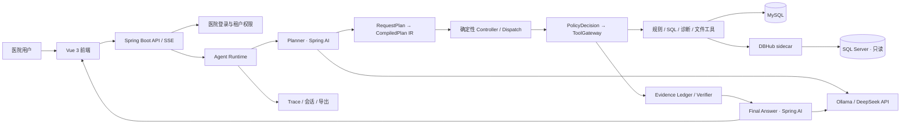

# Java 17 + Spring AI + Vue 3 渐进迁移

> 更新日期：2026-07-22。阶段 0、阶段 1、阶段 2、阶段 3，以及阶段 4 的受控 SQL、三层诊断、上传汇总/逐条对比和指标明细导出子批次已完成。FastAPI 仍是权威运行时，Java 服务只在 `8766` 影子端口验证兼容性，Vue 开发服务器仍调用 `8765` 的现有 Agent 接口。

## 1. 迁移目标与约束

目标是把当前 Python Agent Runtime 全部迁移到 Java，并把原生前端迁移到 Vue 3；迁移过程不能中断现有测试和医院验证。

固定技术选择：

- Java 17、Spring Boot 4.1、Spring AI 2.0、Maven。
- Vue 3、TypeScript、Vite、Vue Router、Pinia。
- 保留现有 MySQL、SQL Server、Ollama、DeepSeek API 和 DBHub sidecar。
- Java 主服务仍通过 DBHub MCP 访问 SQL Server，不引入直连旁路。
- 不增加 Redis、消息队列、工作流服务、Docker 或新的生产数据库。
- Spring AI 只负责模型适配和结构化输出；计划编译、状态控制、策略、工具网关、Evidence 和验证器继续确定性实现。
- 最终将 Vue `dist/` 放入 Spring Boot JAR，生产环境不需要 Node.js 常驻。

## 2. 目标架构



DBHub 与 Java 的关系是“保留外部数据库能力边界”，不是“Java 无法适配数据库”。Java 已实现与 Python 相同的 JSON-RPC、JSON/SSE 响应和行数据提取协议，后续领域工具只依赖这个客户端。

## 3. 渐进切换方式

```text
现有入口
  ├─ 未迁接口 ──────────────> FastAPI（权威）
  └─ 已验收接口 ─> Spring Boot ─> 必要时调用同一 DBHub / MySQL

每个接口：冻结契约 → Java 实现 → 双跑对比 → 单接口切流 → 保留回退 → 删除 Python 实现
```

禁止一次性重写后整体上线。规则、医院口径、统计周期、SQL ID、运行结果与 Trace 必须在双栈期间可比较。

## 4. 阶段计划

### 阶段 0：契约与基础（本批已完成）

- 在 `contracts/migration/v1/` 冻结 Agent 请求、响应、SSE 事件和 DBHub MCP 约定。
- 新建 `backend-java/`，锁定 Java 17、Spring Boot 4.1 和 Spring AI 2.0 BOM。
- Java 提供兼容 `/api/health`、迁移状态接口和 DBHub 数据源接口。
- Java DBHub 客户端兼容 JSON、SSE、`rows/data/structuredContent/content[].text`。
- 新建 `frontend-vue/`，实现医院登录、模型切换、SSE 对话、Excel 上传、证据轨道和 Trace 抽屉。
- Vue 仍代理现有 FastAPI；旧 `web/` 不删除。

### 阶段 1：认证与只读规则（认证、规则子批次已完成）

- 已迁移医院账号、令牌、密码更新、权限读取与医院隔离；Java 与 Python 共用 PBKDF2 和令牌摘要契约，可复用同一 MySQL 会话表。
- 已迁移医院范围内的规则搜索和本院生效口径；医院编号只从认证主体注入，客户端冒充其他医院会返回 403。
- 已增加跨语言密码测试向量、H2 仓储测试和 `scripts/compare_java_python_read_api.py` 双跑脚本。
- 待迁移术语和只读元数据接口，并在入口切流前使用真实登录会话完成验收。
- Nginx/启动入口暂不切流；FastAPI 仍是权威实现。

本子批次验收结果：Java 单元与仓储测试 13 项通过，Python 认证契约测试 8 项通过；影子服务使用同一 MySQL 临时会话对“急会诊及时到位率”执行双跑，安全规则字段返回一致。临时会话已清理，`8766` 已停止，现有 `8765` FastAPI 与 `8080` DBHub 未受影响。

### 阶段 2：Agent IR 与工具网关（IR 与网关子批次已完成）

- 已用 Java enum / record 定义 `RequestPlan`、`CompiledPlanIR`、Fact、CapabilitySpec 和 FailureClass，JSON 形状继续采用 `snake_case`。
- 已迁移 PlanCompiler、PlanValidator、StateController 和 DeterministicDispatch；Planner 计划不含工具名，实际工具只能从 CapabilitySpec 取得。
- 时间校验器可直接解析 Planner 已填的 ISO 边界，也可根据当前时钟确定性解析“从26年一月份到现在”“今年”“本月”“1月至3月”等原始表达，不依赖模型计算日期。
- CapabilitySpec 由 Spring Bean 注册，启动时检查循环依赖、重复 Fact Producer、未知工具和未知 Verifier。
- 已迁移不可变 ToolExecutionContext、PolicyDecisionService 与 ToolGateway；登录主体只能由服务端注入，PEP 在参数绑定和工具执行前生效。
- 工具网关已具备参数类型转换、超时、数据库并发 2、调用指纹和成功结果复用；规则读取工具可执行，未迁移工具明确返回 `TOOL_NOT_MIGRATED`。
- 新增认证影子接口 `POST /api/migration/agent/compile`，只展示校验、IR 和第一步决策，不执行任何工具。
- Agent 影子 Runner、模型调用和 VerifiedEvidence 属于下一子批次，尚未切流。

本子批次 Java 测试 22 项通过，覆盖 IR JSON 契约、依赖拓扑、能力环、重复 Fact Producer、未知工具、非法目标、中文时间范围、受控 Dispatch、权限拒绝、参数校验和重复调用缓存。影子编译接口不执行工具，现有 Python 服务未切换。

### 阶段 3：模型与 Evidence（模型与 Evidence 子批次已完成）

- 已使用 Spring AI 2.0 手动构建 Ollama 与 OpenAI 兼容 `ChatModel`，避免多模型自动配置互相覆盖；模型 ID 与现有前端保持一致，配置中保留 Qwen3 4B、Qwen3 8B 思考模式、DeepSeek V4 Flash 和 V4 Pro，API Key 只从环境变量注入且不会出现在能力接口。
- 已新增模型注册表和认证影子接口 `GET /api/migration/agent/capabilities`；本地 Ollama 强制单并发，OpenAI 兼容 API 最多并发 2。
- 已集中 Java 生产提示词到 `backend-java/src/main/resources/prompts/`。Planner 只输出 `RequestPlan`，首次 JSON 不合约时只修复一次；`POST /api/migration/agent/plan` 可执行模型规划、服务端校验和 IR 编译，但明确不执行工具。
- 已建立 `EvidenceEnvelope / EvidenceVerification / VerifiedEvidence` 类型边界，复用 Python 已有 `med_agent_evidence` 和 `med_agent_evidence_verification` 表；MySQL 不可用时写入独立 Java JSONL 兜底。
- ToolGateway 成功后生成未验证 Evidence；SQL、运行对象和明细只保存引用，安全载荷使用固定允许列表。Verifier 独立检查医院、子任务、过期时间、规则、周期、SQL 和结果指纹，并写入 verified/rejected 记录。
- Final Answer 只接受 `List<VerifiedEvidence>`，不注册任何 Spring AI 工具或自动 ToolCallingAdvisor；空回答或工具协议泄漏只允许纠正一次。
- 已新增 `java-agent-runner-v1` 影子执行循环，规则解释请求真实经过 Planner、IR、Controller、Dispatch、ToolGateway、EvidenceVerifier 和 Final Answer。非流式 `/api/migration/agent/chat` 保持冻结响应字段，流式 `/chat/stream` 保持冻结 SSE 事件名。
- Runner 每个成功工具结果都必须取得 Evidence；规则搜索结果会确定性写入当前 `rule_id`。任何未迁移或不可重试工具失败立即停止，不会再次调用同一工具直至触发重复调用保护。
- 新增 `scripts/compare_java_python_agent_rule.py`，可在用户主动启动两个服务并提供现有医院登录 token 后双跑规则解释，比较响应字段、停止原因和步骤数；脚本不打印 token。
- 当前 Java 测试 28 项通过。测试覆盖模型配置、Planner 单次修复、Evidence 允许列表、跨医院拒绝、结果指纹、Final Answer 工具协议防护、规则解释完整工具顺序和 REST 响应形状。
- 待迁移：一次语义 Replan、ResponseGuard 的确定性模板降级、会话/Trace 持久化和跨模型离线 Eval；完成前不会把聊天入口切到 Java。

### 阶段 4：SQL、诊断、文件与复合任务（上传逐条差异子批次已完成）

- 已迁移 `inspect_indicator_implementation`、`prepare_indicator_sql` 和 `trial_run_indicator_sql`。Java Runner 可真实完成字段映射预检、医院覆盖 SQL 模板确定性渲染、只读安全校验、私有 SQL 对象保存、执行前上下文指纹复核和 DBHub 聚合试运行。
- SQL 对象继续复用 `med_generated_sql`、`med_agent_sql_object` 和 `med_sql_run_log`。对象绑定医院、用户、登录会话、规则、统计周期、业务数据源和 30 分钟有效期；跨医院、跨用户、跨会话、跨数据源、过期或上下文漂移均拒绝执行。
- DBHub 工具名和数据源 ID 由 `wiki.dbhub.execute-tool/source-id` 配置；Java 不直连 SQL Server。临时连接中断只重试一次，最终回答 Evidence 只保存 `SQL_*` / `RUN_*` 引用及分子、分母、指标率等允许列表字段，不保存 SQL 全文或患者明细。
- 当前医院已有完整 SQL Server 映射的 `MQSI2025_001`、`MQSI2025_005` 可进入试运行；其余指标在字段映射未确认时明确返回 `FIELD_PRECHECK_FAILED`，不会使用标准模板猜测生产字段。
- 本子批次后，Java 测试共 34 项通过，新增覆盖模板渲染、写 SQL 拒绝、缺失映射、SQL 对象租户隔离、SQL 私有保存、DBHub 参数绑定、运行日志、聚合结果和 Runner 全链 VerifiedEvidence。
- 已迁移 `diagnose_indicator_issue` 的确定性三层诊断：L1 校验字段映射、最新元数据和跨表关联；L2 校验定义、公式、零分母保护和本院口径覆盖；L3 只经 DBHub 读取主表行数与字段空值聚合。报告写入现有 `med_index_diagnose_report`，只把脱敏层级结论和 `DR_*` 引用送入 Evidence。
- “诊断发现未通过”属于成功获得的业务结论，返回 `INDICATOR_DIAGNOSED` 并进入最终回答，不会被当成工具异常触发 Replan 或重复调用。DBHub 不可用等诊断结论也不会暴露连接串、密码或内部主机名。
- 当前 Java 测试共 38 项通过，并固定验证 `INDICATOR_DIAGNOSED` 会完成 diagnosis Fact，避免诊断工具重复调用。用户粘贴任意 SQL、双口径实际执行比较和诊断说明 LLM 尚未迁移；在安全执行与证据契约完成前，Java 不接受该类高级诊断输入。
- 已迁移兼容接口 `POST /api/agent/upload` 和 `analyze_uploaded_indicators`。Java 与 Python 共用 `runtime/uploads` 文件编号格式；上传文件绑定登录医院，限制 10MB 原文件、50MB 解压内容、2000 个内部对象、每表 5001 行和 100 列，并拒绝路径穿越、外部关系、跨院读取及旧 `.xls` 二进制格式。
- `.xlsx` 使用 JDK 自带 ZIP + StAX 流式解析，不引入 Apache POI 或新生产依赖。汇总对比只识别严格的分子、分母、指标率别名，可把 Excel 百分比小数按分子分母一致性归一化，避免把指标名称、日期或任意“率”字段误识别成指标值。
- Java 会话记忆现按 `hospital_id + user_id + session_id` 保存最近 8 轮，以及当前规则、统计周期、`RUN_*` 和上传文件引用；MySQL 不可用时使用进程内租户隔离兜底。Planner Prompt 升级为 `java-agent-prompts-v2`，上传文件与系统对比会编译为同一计划中的试运行事实加文件分析事实，服务端仍按固定拓扑先试运行、再比较。
- 汇总文件只返回已确认的系统值、上传值和差值；没有逐条业务标识时明确禁止推测重复记录、ICU 排除、时间算法或字段映射是差异原因。文件内容和患者行不进入 Evidence 或最终回答上下文。
- 当前 Java 测试共 42 项通过，新增覆盖原生 OOXML 解析、百分比归一化、系统结果缺失、跨医院文件拒绝、旧格式拒绝，以及会话历史和结构化上下文的医院隔离恢复。
- 已迁移兼容接口 `POST /api/sql-runs/{run_id}/details`、`GET /api/sql-runs/{run_id}/details/{group}`、`POST /api/sql-runs/{run_id}/exports`、`GET /api/indicator-exports` 和下载接口。Java Runner 在试运行回答中确定性追加 `RUN_*` 明细引用，Final Answer 模型不能指定任意文件或查询。
- Java 明细查询只支持当前已核验的 `urgent_consult_sqlserver` 与 `inpatient_transfer_48h_sqlserver` Profile。字段、表、关联和口径参数来自运行时固化快照，服务端固定构造 SQL、执行只读校验和参数绑定，并只通过 DBHub 查询；不接受客户端 SQL 或模型 SQL。
- 明细快照采用现有 MySQL 索引记录和短期 GZIP JSONL 对象，兼容 Python 已有快照格式。重新取出的分子、分母必须与原聚合运行完全一致，否则以 `DETAIL_COUNT_MISMATCH` 停止，避免把变化后的业务数据错误归到旧结果。
- 明细分页只返回按字段敏感等级脱敏的值；原始患者行不写入 Evidence、Trace、会话或模型输入。Excel 导出需要 `indicator_detail_export` 权限和显式用途确认，输出“统计范围、达到要求、未达到要求”三张表，并防止公式注入、路径穿越、跨院下载、过期文件和摘要篡改。
- Vue 3 已增加明细抽屉、分组分页、口径/来源元数据和确认式下载。该 UI 同时兼容当前 FastAPI 的 `{{detail_export:RUN_*}}` 标记和 Java Runner 的同形标记。
- 当前 Java 测试共 49 项通过，Vue 生产构建通过；新增覆盖两个固定明细 Profile、缺参拒绝、聚合/明细数量一致性、快照复用、患者标识脱敏、权限与租户隔离、显式导出确认，以及原生三工作表 OOXML 回读。
- 已迁移同指标上传明细逐条差异：服务端从同一 `RUN_*` 短期快照读取系统原始行，上传工作簿必须包含指标编号、医院和可匹配的公共业务字段；指标或医院不一致时拒绝比较。
- 逐条匹配按患者/业务标识和关键事件时间组成稳定键，并使用多重集合保留重复记录。安全结果固定报告双方都有、仅系统有、仅上传文件有、字段值不同和达标判定不同的数量；未经数据证明的业务原因仍不允许推测。
- 原始系统行、上传行和匹配行只在服务端比较器及授权导出过程中存在，不写入 ToolResult 安全载荷、Evidence、Trace、会话或模型输入。Final Answer 只能消费允许列表中的计数、字段名称和已确认差异。
- 已新增兼容接口 `POST /api/sql-runs/{run_id}/upload-comparison-exports`。Runner 只在逐条比较成功且用户有导出权限时确定性追加带绑定文件令牌的入口；Vue 3 显式确认后生成“对比摘要、双方都有、仅系统有、仅上传文件有”四工作表 Excel，并复用现有医院隔离、过期、SHA-256 和下载审计。
- 当前 Java 测试共 53 项通过，Vue 生产构建和 5 项 Python/Java 迁移契约测试通过；新增覆盖跨指标拒绝、多重集合交并差、字段/分类差异、安全载荷不含原始行，以及四工作表差异导出回读。
- 待迁移：全面实施验收和复合任务拆分/并行。
- 保持 SQL ID、rule ID、医院、周期、字段映射版本和 result ID 全链一致。
- 使用 Java 17 有界线程池、`CompletableFuture` 和 `Semaphore` 实现自适应复合并行；Ollama 默认串行。

### 阶段 5：Trace、Vue 完整工作台与切换

- 迁移会话、Trace 查询、运行观察、审批、实施、监控、元数据和术语页面。
- Vue 构建产物进入 Spring Boot JAR。
- 完成全量契约、Eval、安全和回归对比后，Java 成为权威运行时。
- 保留一版 FastAPI 回退窗口，稳定后再删除 Python 生产入口和旧 `web/`。

## 5. 当前目录与命令

```text
contracts/migration/       跨语言冻结契约
backend-java/              Spring Boot 迁移服务
frontend-vue/              Vue 3 迁移前端
app/ + web/                当前权威实现，迁移完成前保留
```

```powershell
# Java 影子服务
cd F:\A-wiki-project\backend-java
$env:WIKI_RUNTIME_DB_PASSWORD = "<本机 MySQL 密码>"
$env:DBHUB_SOURCE_ID_WIN60_QA_991827 = "win60_qa_991827"
$env:DBHUB_EXECUTE_TOOL_WIN60_QA_991827 = "execute_sql_win60_qa_991827"
mvn -s maven-settings.xml test
mvn -s maven-settings.xml spring-boot:run

# Vue 开发验证（FastAPI 需运行在 8765）
cd F:\A-wiki-project\frontend-vue
npm install
npm run dev

# 两个服务均已由用户启动后，手工双跑规则解释（token 不会被脚本打印）
cd F:\A-wiki-project
python scripts\compare_java_python_agent_rule.py --token <医院登录令牌> --model-id deepseek-v4-flash
```

当前本机 JDK 17 可以继续开发，不需要为了迁移先下载 Java 21。现有 JDK 是较早的 17.0 初始构建，正式部署前应升级到最新 Java 17 安全补丁，但不改变语言级别。

## 6. 每阶段验收门槛

- REST/SSE JSON 字段、状态码、中文失败语义保持兼容。
- 未登录、跨医院、无权限和额外身份字段必须被拒绝。
- SQL Server 始终只经 DBHub 使用已校验只读 SQL。
- 同一规则、医院和周期的分子、分母、指标率、SQL ID 与结果 ID 一致。
- Trace 能定位实际 LLM、代码、工具和存储节点，不伪造未发生节点。
- Vue 覆盖加载、空状态、成功、失败、权限失效和移动端布局。
- 每个已切流接口都有可执行的单接口回退方式。
