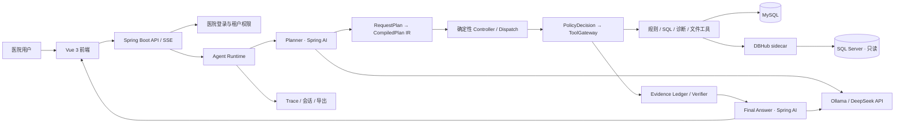

# Java 17 + Spring AI + Vue 3 渐进迁移

> 更新日期：2026-07-21。当前处于第 0 阶段“契约冻结与双栈基础”。FastAPI 仍是权威运行时，Java 服务只在 `8766` 影子端口验证兼容性，Vue 开发服务器仍调用 `8765` 的现有接口。

## 1. 迁移目标与约束

目标是把当前 Python Agent Runtime 全部迁移到 Java，并把原生前端迁移到 Vue 3；迁移过程不能中断现有测试和医院验证。

固定技术选择：

- Java 17、Spring Boot 4.1、Spring AI 2.0、Maven。
- Vue 3、TypeScript、Vite、Vue Router、Pinia。
- 保留现有 MySQL、SQL Server、Ollama、DeepSeek API 和 DBHub sidecar。
- Java 主服务仍通过 DBHub MCP 访问 SQL Server，不引入直连旁路。
- 不增加 Redis、消息队列、工作流服务、Docker 或新的生产数据库。
- Spring AI 只负责模型适配和结构化输出；计划编译、状态控制、策略、工具网关、Evidence 和验证器继续确定性实现。
- 最终将 Vue `dist/` 放入 Spring Boot JAR，生产环境不需要 Node.js 常驻。

## 2. 目标架构



DBHub 与 Java 的关系是“保留外部数据库能力边界”，不是“Java 无法适配数据库”。Java 已实现与 Python 相同的 JSON-RPC、JSON/SSE 响应和行数据提取协议，后续领域工具只依赖这个客户端。

## 3. 渐进切换方式

```text
现有入口
  ├─ 未迁接口 ──────────────> FastAPI（权威）
  └─ 已验收接口 ─> Spring Boot ─> 必要时调用同一 DBHub / MySQL

每个接口：冻结契约 → Java 实现 → 双跑对比 → 单接口切流 → 保留回退 → 删除 Python 实现
```

禁止一次性重写后整体上线。规则、医院口径、统计周期、SQL ID、运行结果与 Trace 必须在双栈期间可比较。

## 4. 阶段计划

### 阶段 0：契约与基础（本批已完成）

- 在 `contracts/migration/v1/` 冻结 Agent 请求、响应、SSE 事件和 DBHub MCP 约定。
- 新建 `backend-java/`，锁定 Java 17、Spring Boot 4.1 和 Spring AI 2.0 BOM。
- Java 提供兼容 `/api/health`、迁移状态接口和 DBHub 数据源接口。
- Java DBHub 客户端兼容 JSON、SSE、`rows/data/structuredContent/content[].text`。
- 新建 `frontend-vue/`，实现医院登录、模型切换、SSE 对话、Excel 上传、证据轨道和 Trace 抽屉。
- Vue 仍代理现有 FastAPI；旧 `web/` 不删除。

### 阶段 1：认证与只读规则

- 迁移医院账号、令牌、权限与医院隔离。
- 迁移规则搜索、生效口径、术语和只读元数据接口。
- Java 与 Python 针对同一请求做响应契约和医院隔离对比。
- Nginx/启动入口只把通过验收的只读路径切到 Java。

### 阶段 2：Agent IR 与工具网关

- 用 Java sealed interface / record 定义 `RequestPlan`、`CompiledPlanIR`、Fact、CapabilitySpec 和 FailureClass。
- 迁移 PlanCompiler、PlanValidator、StateController、DeterministicDispatch。
- 用 Spring Bean 注册 CapabilitySpec，启动时检查循环依赖、重复 Fact Producer、未知工具和未知 Verifier。
- 迁移 PolicyDecisionService 与 ToolGateway；登录主体只能由服务端注入。

### 阶段 3：模型与 Evidence

- 使用 Spring AI 适配 Ollama 和 OpenAI 兼容的 DeepSeek；模型注册表仍从配置读取。
- Planner 只输出业务语义结构，不能输出工具名；Final Answer 只消费 VerifiedEvidence。
- 迁移 Evidence Ledger、独立验证记录、一次语义 Replan 和 ResponseGuard。
- 用同一离线 Eval 比较 Qwen 4B、Qwen 8B 与 DeepSeek。

### 阶段 4：SQL、诊断、文件与复合任务

- 迁移受控 SQL 准备、只读试运行、明细导出、异常诊断和 Excel 对比。
- 保持 SQL ID、rule ID、医院、周期、字段映射版本和 result ID 全链一致。
- 使用 Java 17 有界线程池、`CompletableFuture` 和 `Semaphore` 实现自适应复合并行；Ollama 默认串行。

### 阶段 5：Trace、Vue 完整工作台与切换

- 迁移会话、Trace 查询、运行观察、审批、实施、监控、元数据和术语页面。
- Vue 构建产物进入 Spring Boot JAR。
- 完成全量契约、Eval、安全和回归对比后，Java 成为权威运行时。
- 保留一版 FastAPI 回退窗口，稳定后再删除 Python 生产入口和旧 `web/`。

## 5. 当前目录与命令

```text
contracts/migration/       跨语言冻结契约
backend-java/              Spring Boot 迁移服务
frontend-vue/              Vue 3 迁移前端
app/ + web/                当前权威实现，迁移完成前保留
```

```powershell
# Java 影子服务
cd F:\A-wiki-project\backend-java
mvn -s maven-settings.xml test
mvn -s maven-settings.xml spring-boot:run

# Vue 开发验证（FastAPI 需运行在 8765）
cd F:\A-wiki-project\frontend-vue
npm install
npm run dev
```

当前本机 JDK 17 可以继续开发，不需要为了迁移先下载 Java 21。现有 JDK 是较早的 17.0 初始构建，正式部署前应升级到最新 Java 17 安全补丁，但不改变语言级别。

## 6. 每阶段验收门槛

- REST/SSE JSON 字段、状态码、中文失败语义保持兼容。
- 未登录、跨医院、无权限和额外身份字段必须被拒绝。
- SQL Server 始终只经 DBHub 使用已校验只读 SQL。
- 同一规则、医院和周期的分子、分母、指标率、SQL ID 与结果 ID 一致。
- Trace 能定位实际 LLM、代码、工具和存储节点，不伪造未发生节点。
- Vue 覆盖加载、空状态、成功、失败、权限失效和移动端布局。
- 每个已切流接口都有可执行的单接口回退方式。
