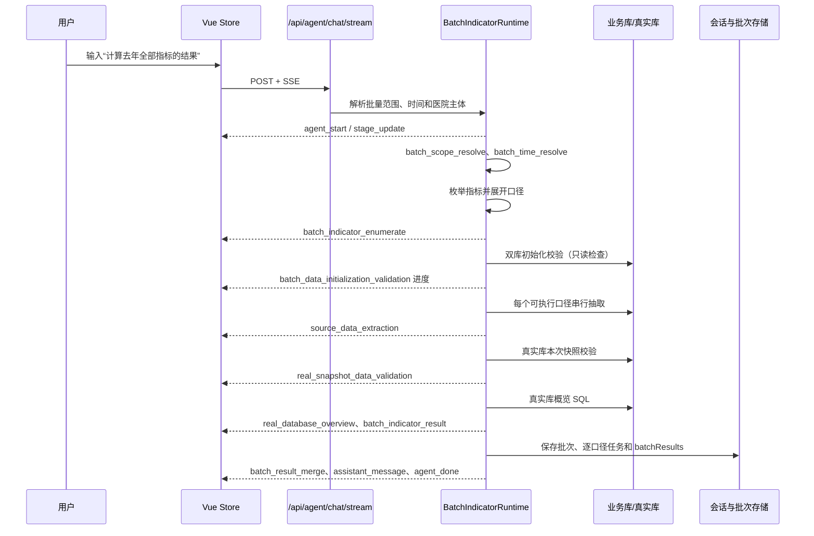

# “本次指标核算”渲染与接口对接说明

> 适用范围：`frontend-vue` 当前批量计算结果页。本文描述的是现有代码真实行为，供前端实现、联调和排错使用。批量结果的正式数据只来自真实库；初始化校验、抽取、概览 SQL 和 Trace 仅提供过程证据。

## 1. 页面中的位置和渲染条件

一次批量请求会形成一条 assistant 消息。`AgentChatView.vue` 对每条消息按以下顺序渲染：

1. 消息头：角色、运行状态、当前阶段和耗时。
2. `ExecutionPanel`：消息存在运行节点、运行中，或存在 `executionRef` 时显示，标题为“本次指标核算”。
3. 普通 Markdown 回答：只有 assistant 消息没有 `batchResults` 时显示。
4. `BatchExecutiveSummary`：assistant 消息收到至少一条 `batchResults` 后显示批量指标卡片、汇总、重点关注和报告入口。

因此，批量计算时的视觉顺序是：

```text
assistant 消息头
  ↓
本次指标核算（运行节点时间线）
  ↓
指标结果汇总（BatchExecutiveSummary）
```

代码位置：

- [AgentChatView.vue](../frontend-vue/src/views/AgentChatView.vue)：消息条件渲染、节点抽屉和结果组件挂载。
- [ExecutionPanel.vue](../frontend-vue/src/components/ExecutionPanel.vue)：本次指标核算节点列表。
- [BatchExecutiveSummary.vue](../frontend-vue/src/components/BatchExecutiveSummary.vue)：批量结果汇总和完整报告。

## 2. 从用户输入到页面的完整链路

### 2.1 用户发送请求

前端 `useAgentStore.send()` 创建一条 user 消息和一条空的 running assistant 消息，然后向后端发送：

```http
POST /api/agent/chat/stream
Authorization: Bearer guest
Content-Type: application/json

{
  "query": "计算去年全部指标的结果",
  "sessionId": "当前会话ID",
  "modelId": "当前选择的模型ID",
  "fileKey": "可选上传文件Key"
}
```

响应是 `text/event-stream`。浏览器端逐个读取 SSE 块，并将 `event` 和 JSON 数据交给 `store.applyEvent()`。

### 2.2 后端批量运行阶段

`BatchIndicatorRuntime.run()` 的主要顺序如下。以下节点会写入 Trace，也会通过 SSE 推送可见阶段：



### 2.3 后端实际产生的关键事件

| 事件 | 主要字段 | 前端处理 |
|---|---|---|
| `agent_start` | `traceId`、`status`、`batch` | 建立运行上下文，显示“准备运行”。 |
| `stage_update` | `traceId`、`nodeName`、`nodeType`、`status`、`message`、`completed`、`total`、`phase` | 创建或更新 `executionNodes`，更新顶部阶段文字和节点进度。 |
| `batch_indicator_result` | 见第 3 节 | 生成/替换一张指标口径结果卡。 |
| `assistant_message` | `message`、`status`、`batchRunId` | 普通文字回答；有 `batchResults` 时页面主体优先显示卡片。 |
| `agent_done` | `status`、`stopReason`、`batchRunId` | 结束运行，更新 assistant 消息为完成或失败。 |
| `agent_error` | `message`、`status=failed` | 显示运行失败，保留已收到的过程节点和卡片。 |

`traceId` 会在任何事件到达时写入 assistant 消息。`batch_indicator_result.batchRunId` 到达后，消息建立：

```json
{
  "executionRef": {
    "batchRunId": "BATCH_xxx",
    "traceId": "TRACE_xxx"
  }
}
```

## 3. `batch_indicator_result` 卡片载荷

SSE 实时载荷和会话持久化载荷使用同一组字段。前端类型定义在 `stores/agent.ts` 的 `BatchIndicatorResult`。

```json
{
  "batchRunId": "BATCH_xxx",
  "ruleId": "HXZD-001-001",
  "ruleName": "患者入院48小时内转科的比例",
  "profileId": "推荐方案（公版）",
  "profileLabel": "推荐方案（公版）",
  "status": "SUCCESS",
  "done": 17,
  "total": 43,
  "resultValue": 2.4,
  "numeratorCount": 10,
  "denominatorCount": 417,
  "sampleCount": 417,
  "targetValue": 60,
  "targetDirection": ">=",
  "unit": "percentage",
  "calculationDisplay": "10 / 417 × 100%",
  "statStart": "2025-01-01 00:00:00",
  "statEnd": "2026-01-01 00:00:00",
  "runId": "mras-HXZD-001-001",
  "dataFreshness": "fresh",
  "qualityStatus": "NORMAL",
  "overviewSqlHash": "sha256...",
  "detailKind": "COUNT_RATIO",
  "detailContractVersion": "v1"
}
```

失败或无样本时，`resultValue`、分子或分母可能为空，同时保留：

- `status`：`SUCCESS`、`NO_SAMPLE`、`FAILED`。
- `errorCode`、`errorMessage`：可安全展示的原因。
- `dataFreshness`：例如 `extraction_failed_stale` 表示结果来自旧快照。

前端按 `ruleId + profileId` 原地替换重复推送，避免同一口径出现重复卡片；不同 `profileId` 保留为同一指标下的多口径行。

## 4. `ExecutionPanel` 的节点如何生成

### 4.1 节点模型

```ts
interface ExecutionNode {
  id: string
  nodeName: string
  nodeType: string
  label: string
  category: 'llm' | 'rule' | 'data' | 'verification' | 'summary' | 'failure'
  status: 'running' | 'success' | 'warning' | 'failed'
  durationMs?: number
  toolName?: string
  modelId?: string
  subtaskId?: string
  occurrence: number
  repeatCount?: number
  successCount?: number
  warningCount?: number
  failedCount?: number
  progressCompleted?: number
  progressTotal?: number
  indicatorCount?: number
  profileCount?: number
  errorCode?: string
  errorMessage?: string
}
```

### 4.2 分类和合并规则

`stores/agent.ts` 的 `appendExecutionNode()` 会：

- 将 `source_data_extraction`、`real_snapshot_data_validation`、`batch_indicator` 归到 `data`。
- 将 `batch_data_initialization_validation` 归到 `data`，但页面用“数据基础检查”作为分类文字。
- 将失败状态归到 `failure`；非预期的 `FAILED` 批量结果还会追加一个“系统异常”节点。
- 同一阶段的多个口径事件合并成一个节点，`repeatCount`、`successCount`、`failedCount` 表示内部重复次数。
- `repeatCount` 只用于前端计算阶段摘要，不应直接显示成“×43”。

### 4.3 阶段文案

`ExecutionPanel.nodeLabel()` 根据 `nodeName` 和当前消息的 `batchResults` 动态生成：

| 节点 | 页面文案含义 |
|---|---|
| `batch_indicator_enumerate` | “确认本次指标清单：N 个指标 / M 个口径” |
| `batch_data_initialization_validation` | “数据初始化校验：M 个口径已检查”；运行中显示检查对象进度。 |
| `source_data_extraction` | “抽取数据到真实库：完成数/需抽取数”，补充真实库直查和初始化跳过数量。 |
| `real_snapshot_data_validation` | “真实库计算前校验：通过数/总数”，区分抽取结果、真实库直查和初始化跳过。 |
| `batch_indicator` | “M 个口径已处理（成功 / 无样本 / 未实现 / 失败）”。 |
| `batch_result_merge` | 批次结果汇总。 |

节点右侧同时显示耗时和状态：执行中、已完成、需关注、有失败项或系统异常。

## 5. 批量结果摘要的数据处理

### 5.1 指标和口径去重

`BatchExecutiveSummary` 接收到的是口径行数组，不一定等于指标数：

- `profileTotal = results.length`：口径总数。
- 按 `ruleId` 分组后的 `total`：覆盖指标数。
- 同一指标多个口径合并为一张指标卡，卡内保留多条口径行。
- 公版/推荐方案优先作为正式状态来源；备选口径不自动替换正式口径。

### 5.2 达标、未达标、待确认

程序读取 `resultValue`、`targetValue` 和 `targetDirection`：

- `SUCCESS` 且满足目标方向：达标。
- `SUCCESS` 但不满足目标方向：未达标。
- 无目标值、无方向、`NO_SAMPLE` 或失败：待确认。

指标级状态由正式公版口径决定；多个口径不会重复计入“覆盖指标”。

### 5.3 数据质量

当前摘要的质量判断是指标级：

- `qualityAbnormal`：正式口径 `status !== SUCCESS`，或 `dataFreshness === extraction_failed_stale`。
- `qualityNormal = 覆盖指标数 - qualityAbnormal`。
- `PROFILE_NOT_IMPLEMENTED` 不作为系统异常；“无法判断”的初始化证据也不会自动把指标判为异常。

页面显示为“数据质量（正/异）”，具体数量动态计算，不写死。

### 5.4 重点关注

`attentionItems` 按失败、无样本/数据质量、待确认、未达标排序；`visibleAttentionItems` 默认最多展示 5 条，防止大量无样本项淹没真正故障。完整列表仍存在于报告和“查看全部指标”抽屉中。

点击重点项不会打开 Trace 抽屉，而是发起一个批次事实绑定的排查动作，见第 8 节。

## 6. 结果卡片的按需接口

### 6.1 读取口径

用户点击指标行的“口径”或“数据链路”时，调用：

```http
GET /api/kb/rules/{ruleId}/effective?profileId={profileId}&statStart={start}&statEnd={end}
Authorization: Bearer guest
```

后端从当前用户医院范围读取生效知识库实体，并追加 `dataFlow`。不执行数据库查询。

口径面板读取实体中的定义、统计口径、分子、分母、公式、结果单位、监测意义和数据来源。

数据链路面板读取 `dataFlow`：

```json
{
  "templateType": "DIRECT_TO_TARGET",
  "templateLabel": "业务表 → 指标中间表 → 统计",
  "status": "complete",
  "warnings": [],
  "primaryTables": ["INPATIENT_ENCOUNTER"],
  "parameterTables": ["MRAS_TARGET_DEFINITION"],
  "nodes": [
    {
      "id": "business-tables",
      "sequence": 1,
      "title": "上游业务表",
      "nodeType": "TABLE",
      "databaseRole": "BUSINESS",
      "tableNames": ["INPATIENT_ENCOUNTER"],
      "tableDescriptions": {"INPATIENT_ENCOUNTER": "住院患者就诊"}
    },
    {
      "id": "source-extract-sql",
      "sequence": 2,
      "title": "源表抽取 SQL",
      "nodeType": "SOURCE_EXTRACT_SQL",
      "databaseRole": "SYNC",
      "sql": "...",
      "parameters": ["startTime", "endTime"]
    },
    {
      "id": "target-table",
      "sequence": 3,
      "title": "指标中间表",
      "nodeType": "TABLE",
      "databaseRole": "REAL",
      "tableNames": ["MRAS_BUSINESS_FIRSTVISIT"]
    },
    {
      "id": "overview-sql",
      "sequence": 4,
      "title": "概览统计 SQL",
      "nodeType": "OVERVIEW_SQL",
      "databaseRole": "REAL",
      "sql": "...",
      "primaryTables": ["MRAS_BUSINESS_FIRSTVISIT"],
      "parameterTables": ["MRAS_TARGET_DEFINITION"]
    }
  ],
  "edges": [{"from": "business-tables", "to": "source-extract-sql", "label": "读取"}]
}
```

链路类型由程序确定性生成：`EVENT_TO_TARGET`、`DIRECT_TO_TARGET`、`DIRECT_REAL_QUERY` 或 `INCOMPLETE`。生成过程只读知识库和 SQL 血缘，不调用模型、不查数据库。

### 6.2 查询明细

用户点击“明细”或切换分子/分母/特殊分组时，调用：

```http
GET /api/kb/rules/{ruleId}/details?
  group=denominator&
  batchRunId=BATCH_xxx&
  start=2025-01-01 00:00:00&
  end=2026-01-01 00:00:00&
  profileId=...&
  page=1&
  pageSize=50
Authorization: Bearer guest
```

`fetchIndicatorDetails()` 强制带 `batchRunId`、统计时间和口径，后端必须将明细绑定回这次批次；缺少批次上下文时前端直接显示“无法查询与原卡片绑定的明细”。

常见返回字段：

| 字段 | 用途 |
|---|---|
| `rows`、`page`、`pageSize`、`rowCount` | 当前页数据和分页。 |
| `cardNumerator`、`cardDenominator` | 卡片原始分子、分母。 |
| `detailNumerator`、`detailDenominator` | 明细重新聚合出的数量。 |
| `snapshotId`、`snapshotReused` | 明细快照和是否复用。 |
| `sqlSource` | 本次明细使用的 SQL 来源标识。 |
| `overviewSqlHash` | 与卡片概览 SQL 的绑定校验。 |
| `detailKind` | `COUNT_RATIO`、`SUM_CONTRIBUTION`、`MEDIAN_SAMPLE`、`DUAL_SOURCE`、`RATE_COMPARISON`。 |

前端根据 `detailKind` 选择不同组件：普通分子分母、贡献值、样本中位数、双数据源或两率比较。

## 7. 历史消息和切换会话恢复

### 7.1 持久化内容

批量结束时后端保存两类信息：

1. `BatchJobStore`：批次状态、医院、用户、总数、成功/无样本/失败数、统计窗口、`traceId` 和任务快照。
2. `AgentConversationMemory`：assistant 文本和 `batchResults` JSON。`batchResults` 与 SSE 卡片载荷同形态，只用于恢复页面，不作为模型历史上下文。

### 7.2 恢复流程

历史消息接口：

```http
GET /api/agent/sessions/{sessionId}/messages
```

前端把持久化 `batchResults` 转成 `BatchIndicatorResult`，从其中提取 `batchRunId`，建立 `executionRef`。此时卡片可以立即显示，但运行节点尚未加载。

用户展开“本次指标核算”时，`ExecutionPanel` 触发 `restore`：

1. `GET /api/agent/batches/{batchRunId}` 读取批次并取得 `job.traceId`。
2. `GET /api/agent/runs/{traceId}` 读取完整 Trace。
3. `executionNodesFromTrace()` 将 Trace 节点重新聚合为前端节点。
4. 页面恢复节点时间线；不重新执行指标、不重新查询数据库。

如果批次或 Trace 不存在，`executionRestoreStatus='expired'`，页面保留指标卡片并显示“运行证据已过期”，不能显示成空白或重新计算。

## 8. 摘要区域的交互动作

### 8.1 重点指标排查

点击重点关注项后，`BatchExecutiveSummary` 发出：

```ts
{
  action: 'inspect_indicator',
  batchRunId: 'BATCH_xxx',
  indicatorId: 'HXZD-001-001',
  profileId: '可选口径ID'
}
```

`AgentChatView.sendSummaryAction()` 调用：

```http
POST /api/agent/actions/inspect-indicator
```

后端按 `batchRunId + indicatorId + profileId` 读取已保存事实，返回审计号、事实和解释答案。前端追加一条 user/assistant 消息，回答显示在对话流中，不打开右侧 Trace 抽屉。

### 8.2 批次确认清单和质量核查

底部快捷按钮分别发出：

```ts
{ action: 'batch_confirmation_checklist', batchRunId }
{ action: 'batch_data_quality_review', batchRunId }
```

调用：

```http
POST /api/agent/actions/analyze-batch
```

响应中的 `displayPrompt` 和 `answer` 被追加成新的对话消息。它们只读取批次事实，不重新计算。

### 8.3 完整报告

点击“查看全部 N 个指标”或“查看完整报告”时：

1. 打开右侧报告抽屉。
2. 首次打开调用 `POST /api/batch-runs/{batchRunId}/reports` 创建报告快照。
3. 抽屉展示总体情况和所有指标卡片。
4. 点击下载调用：

```http
GET /api/batch-reports/{reportId}/download?format=docx
GET /api/batch-reports/{reportId}/download?format=pdf
GET /api/batch-reports/{reportId}/download?format=xlsx
```

报告快照只在当前页面缓存；下载完成后前端使用 Blob 创建临时下载链接。

## 9. 前端对接必须遵守的约定

### 9.1 不要把口径数当指标数

- `batchResults.length` 是口径行数。
- `new Set(batchResults.map(item => item.ruleId)).size` 才是指标数。
- 口径卡片必须按 `ruleId` 分组，行内按 `profileId` 区分。

### 9.2 不要用 `repeatCount` 做业务展示

`repeatCount` 是时间线合并后的内部计数。要显示业务单位，应使用节点提供的 `indicatorCount`、`profileCount`、`progressCompleted`、`progressTotal` 和 `batchResults` 动态计算。

### 9.3 不要在点击明细时重新运行概览

明细请求必须带 `batchRunId`、口径和统计窗口；后端以批次快照和 SQL 哈希做绑定校验。结果卡片只读真实库正式结果。

### 9.4 不要让模型决定事实

口径、分子、分母、数据质量和达标状态由程序和批次事实决定。模型只用于用户主动点击后的解释和建议，不能补写 SQL、改变结果或自动替换正式口径。

### 9.5 敏感数据处理以当前组件为准

节点抽屉的 `redact()` 会过滤提示词、鉴权信息、密码、token、患者字段、原始 rows 等内容；SQL、参数和错误在相应折叠区展示。若实施人员需要患者级明细，应使用有权限的明细/导出接口，不应直接把原始 Trace 全量塞入页面。

## 10. 联调验收清单

- 输入批量问题后，在首个口径完成前能看到“本次指标核算”，而不是等全部结果。
- 初始化校验节点显示阶段进度，完成后可以点击打开右侧节点抽屉。
- 抽取和真实库快照节点按口径合并，不出现 43 张同类阶段卡。
- 第一张 `batch_indicator_result` 到达后显示指标摘要；全部结果到达后覆盖指标和口径数闭合。
- 点击“口径”只请求知识库；点击“数据链路”不查数据库；点击“明细”才请求批次绑定明细。
- 切换会话后卡片先恢复，展开“本次指标核算”再懒加载批次和 Trace。
- Trace 过期时卡片不消失，明确显示运行证据过期。
- 初始化节点抽屉可显示校验分类、SQL、参数、真实库本次数据校验和过滤器。
- 报告抽屉首次打开只创建一个快照，重复打开复用当前页面快照。

