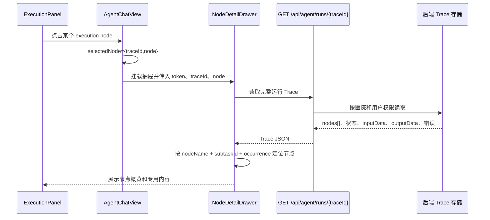

# “本次指标核算”节点与右侧抽屉交互说明

本文专门描述节点时间线和右侧抽屉，配合《本次指标核算渲染与接口对接说明》使用。

## 1. 组件关系

```text
AgentChatView
├─ ExecutionPanel                         本次指标核算
│   └─ emit('select', ExecutionNode)
│       └─ AgentChatView.openNode()
│           └─ NodeDetailDrawer            右侧节点详情抽屉
├─ BatchExecutiveSummary                  批量指标汇总
│   ├─ IndicatorResultCards                指标卡片
│   │   ├─ 口径 → GET /api/kb/rules/{id}/effective
│   │   ├─ 数据链路 → 同一接口返回 dataFlow
│   │   └─ 明细 → GET /api/kb/rules/{id}/details
│   └─ 完整报告 → BatchExecutiveSummary 自己打开右侧报告抽屉
└─ DetailDrawer                            指标明细导出抽屉（另一条明细链路）
```

当前节点抽屉和报告抽屉是两种不同用途：

- **节点详情抽屉**：看过程、Trace、校验 SQL、初始化分类、真实库快照校验。
- **完整报告抽屉**：看所有指标的业务结果、报告总体情况和下载按钮。

## 2. 点击节点的完整时序

### 2.1 实时运行时



### 2.2 初始化节点的特殊轮询

如果节点是 `batch_data_initialization_validation`：

- 首次加载前先显示 fallback 摘要，避免等待接口时空白。
- Trace 返回后读取 `outputData`。
- 每 2.5 秒重新请求同一个 Trace，直到用户关闭抽屉或组件销毁。
- 轮询失败不清空上一次成功数据。
- 该节点用于展示初始化报告，不能把轮询次数当成重新执行校验。

普通节点不轮询，只读取一次。

## 3. `NodeDetailDrawer` 通用区域

抽屉顶部：

| 区域 | 数据来源 | 展示 |
|---|---|---|
| 标题 | 传入的 `ExecutionNode.label` | 节点名称。 |
| 状态 | Trace `status`，无 Trace 时回退到节点状态 | 已完成、失败、需关注等。 |
| 耗时 | Trace `durationMs` | 小于 1000ms 显示毫秒，否则显示秒。 |
| 模型/工具 | Trace `modelId` 或 `toolName` | 没有时显示 `—`。 |
| 子任务 | Trace `subtaskId` | 批次口径通常是 `REQ_xxx:batch:N`。 |

### 3.1 普通节点

非初始化节点依次显示：

1. **处理概览**：`processingSummary`、`nodeName`、`nodeId`、能力、数据/运行引用。
2. **异常信息**：节点失败或 Trace 有错误码/错误消息时显示。
3. **输入参数**：折叠，读取 Trace `inputData`。
4. **输出参数**：折叠，读取 Trace `outputData`。
5. 参数尚未写入时显示“实时摘要仍可查看”。

### 3.2 数据脱敏

`redact()` 在页面层过滤以下键：

- `prompt`、`authorization`、`password`、`secret`、`token`。
- 患者字段、`messages`、`raw_rows`、`rows`。
- 数组最多保留前 50 项，后续显示“其余 N 项已收起”。

因此“完整 Trace”不是数据库原始 JSON 的无条件直出；页面只展示经过前端过滤的数据。

## 4. 初始化校验节点专用内容

初始化节点的 Trace `outputData` 来自 `InitializationValidationReport.toTraceOutput()`，主要字段：

```json
{
  "batchRunId": "BATCH_xxx",
  "qualityStatus": "NORMAL | WARNING | PARTIAL_BLOCKED | ALL_BLOCKED",
  "indicatorCount": 35,
  "profileCount": 43,
  "runnableCount": 38,
  "noSampleCount": 1,
  "blockedCount": 4,
  "skippedCount": 0,
  "missingTableCount": 0,
  "missingColumnCount": 0,
  "emptySourceCount": 1,
  "nullFieldCount": 464,
  "joinGapCount": 179,
  "unsupportedCount": 113,
  "distinctNullFieldCount": 28,
  "distinctJoinGapCount": 14,
  "distinctUnsupportedCount": 36,
  "businessConnected": true,
  "realConnected": true,
  "durationMs": 42000,
  "reused": false,
  "statStart": "2025-01-01 00:00:00",
  "statEnd": "2026-01-01 00:00:00",
  "realDataStatus": "等待本次抽取",
  "profiles": [],
  "items": []
}
```

### 4.1 顶部汇总区

页面先显示：

- 质量状态：正常、有警告、部分阻断、全部阻断。
- 口径数、可继续、无样本、被阻断、未实现/跳过。
- 缺表、缺字段、无数据。
- 确定影响、可能影响、仅影响展示、无法判断。
- 业务库/真实库连接状态、本次实查未复用、耗时。

注意：`nullFieldCount`、`joinGapCount`、`unsupportedCount` 是检查条目数；`distinctNullFieldCount` 等是去重后的物理对象数。页面同时保留“涉及口径数”和“检查条数”，不能把 464 误读为 464 个不同字段。

### 4.2 筛选器

初始化详情提供三个本地筛选器，不会发新请求：

- 搜索：指标编码、指标名称、口径、表名、字段名。
- 数据库：全部、业务库、真实库。
- 问题类型：全部、缺表、缺字段、无数据、空值率、关联覆盖率、未完成检查。

筛选只作用于已加载的 `outputData.items`；刷新 Trace 后会重新应用筛选条件。

### 4.3 三级折叠层级

```text
影响等级
  → 指标/口径
    → 问题类型
      → 字段、数量、原因、SQL
```

影响等级固定为：

| 分组 | 含义 |
|---|---|
| 确定影响计算 | 已阻断或本次窗口无样本。 |
| 可能影响结果 | 空值、关联缺口或空表可能改变结果，但当前继续计算。 |
| 仅影响明细展示 | 姓名等展示字段异常，没有证据改变分子分母。 |
| 无法判断 | 程序无法安全生成该检查，不等于数据异常。 |

每个指标/口径行显示：

- `ruleId`、指标名称、口径名称。
- 本次统计窗口源记录数；无法安全生成时显示“本次窗口数据量未能安全生成”。
- 问题类型数量和原始证据数量。

展开问题项后显示：

- 业务库/真实库。
- 表、字段、字段中文名。
- 字段作用：统计时间、分子判定、分母范围、表关联、分组、去重或明细展示。
- 全表基础质量还是本次统计窗口。
- 实际数量、空值数/总数/比例、匹配数/未匹配数/覆盖率。
- 影响判断、原因、错误码、修复建议。

### 4.4 查看校验 SQL

每条有 SQL 的检查项都有一个折叠区“查看校验 SQL”。展开后显示：

- SQL 用途：初始化阶段只读聚合探针，不是正式指标 SQL。
- 数据库角色。
- 执行耗时。
- 返回行数。
- 实际 SQL。
- 参数。
- 原始数据库错误摘要（如果有）。

校验 SQL来源于 `BatchDataInitializationValidator` 对知识库 SQL 解析后生成的 `COUNT_BIG`、空值统计或关联覆盖探针。它不修改数据，也不执行清表和同步。

### 4.5 真实库本次数据校验

初始化详情底部有一个独立折叠分组，内容来自同一 Trace 中的 `real_snapshot_data_validation` 子节点：

- `一致 N`：业务库源行数和真实库写入行数一致。
- `失败 N`：行数不一致、真实库为空或查询失败。
- `等待 N`：抽取尚未完成。

每条快照校验显示：指标/口径、目标表、业务库源行数、真实库写入行数、状态、原因和校验 SQL。它与初始化前检查不是同一件事：前置阶段只检查真实库结构，抽取后才检查本次快照数据。

### 4.6 指标执行定位

点击某个初始化问题里的指标编码时，组件在已加载的 Trace 节点中查找对应 `batch_indicator` 节点，并在抽屉底部显示：

- 该指标执行状态。
- 口径。
- 耗时。
- 执行节点输出。

这是本地 Trace 定位，不会重新请求指标明细，也不会重新计算。

### 4.7 技术原始数据

抽屉底部有默认折叠的“技术原始数据（实施排查用）”：

- 完整初始化输出。
- SQL、参数、数量、耗时和错误。
- 经过 `redact()` 后的页面可见版本。

普通业务人员不需要展开；实施人员用于复现、审计和定位程序解析问题。

## 5. 关闭、加载失败和过期状态

| 状态 | 页面行为 |
|---|---|
| 正在加载 | 抽屉显示“正在读取节点参数…”。 |
| Trace 404/权限失败 | 保留 fallback 摘要，显示“详细入出参暂不可读取”。 |
| 初始化轮询失败 | 保留最后一次成功的初始化数据，不清空页面。 |
| 没有节点详情 | 普通节点显示“实时摘要仍可查看”。 |
| 批次/Trace 过期 | `ExecutionPanel` 显示“运行证据已过期”，结果卡片仍保留。 |
| 用户点击背景或关闭按钮 | 只关闭抽屉，不改变批次、卡片和数据库状态。 |

## 6. 完整报告右侧抽屉

“查看全部 N 个指标”和“查看完整报告”打开的是 `BatchExecutiveSummary` 自己的报告抽屉，不是 `NodeDetailDrawer`。

### 6.1 打开和数据来源

- 第一次打开调用 `POST /api/batch-runs/{batchRunId}/reports`。
- 返回 `BatchReportSnapshot`，包含 `reportId`、版本、草稿/正式状态、统计窗口、数量汇总和任务数据。
- 同一页面再次打开直接复用 `reportSnapshot`，不重复创建快照。

### 6.2 报告内容

1. 报告标题、医院/统计窗口/批次号。
2. 下载 Word、PDF、Excel和打印预览。
3. 总体情况：覆盖指标、达标、未达标、待确认、数据质量正/异。
4. 各指标明细：复用 `IndicatorResultCards`，每项仍可点口径、数据链路和明细。

存在待确认或异常项时，报告状态保持草稿；这不影响用户查看和下载。

## 7. 指标卡片内的三类点击

### 7.1 口径

- 读取当前生效实体。
- 不查业务库或真实库。
- 显示定义、分子、分母、公式、单位、来源等。

### 7.2 数据链路

- 与口径共用 `/effective` 接口返回的数据。
- 显示上游表、抽取脚本、目标中间表、参数表、概览 SQL、科室 SQL和患者 SQL。
- SQL 默认折叠；可执行脚本的数据库/schema/时间参数一并显示。
- `INCOMPLETE` 只显示配置不完整和警告，不猜测不存在的链路。

### 7.3 明细

- 第一次点击调用批次绑定的 `/details` 接口。
- 默认查询 `denominator`，普通比率可切换 `numerator` 和 `unmatched`。
- SUM、中位数、双数据源、两率比较由 `detailKind` 选择专用 renderer。
- 支持分页，每页默认 50 条。
- 若服务端重聚合出的分子/分母与卡片数不一致，接口应返回错误，前端显示错误而不是展示错误明细。

## 8. 前端联调字段和状态建议

### 8.1 建议的最小状态

```ts
type BatchViewState = {
  messageId: string
  batchRunId?: string
  traceId?: string
  messageStatus: 'running' | 'complete' | 'failed'
  executionRestoreStatus?: 'idle' | 'loading' | 'ready' | 'expired'
  executionNodes: ExecutionNode[]
  batchResults: BatchIndicatorResult[]
  selectedNode?: ExecutionNode
  reportSnapshot?: BatchReportSnapshot
}
```

### 8.2 不应混用的三个 ID

| ID | 含义 |
|---|---|
| `traceId` | 一次 assistant Agent 运行的 Trace，节点抽屉使用。 |
| `batchRunId` | 一次批量指标计算的持久化批次，卡片、明细、报告和批次恢复使用。 |
| `runId` | 单个指标/明细快照或 SQL 运行引用，不等于整批次。 |

### 8.3 事件合并规则

- `stage_update` 更新过程节点，不生成指标卡。
- `batch_indicator_result` 更新 `batchResults`。
- `assistant_message` 更新文字回答，不覆盖已累积卡片。
- `agent_done` 只结束运行状态，不清空 `executionNodes` 或 `batchResults`。

## 9. 推荐联调顺序

1. 先用固定批量请求验证 SSE 能收到 `traceId`、初始化阶段和第一张 `batch_indicator_result`。
2. 验证 `ExecutionPanel` 在运行中立即出现，节点合并后数量稳定。
3. 点击初始化节点，确认 `/api/agent/runs/{traceId}` 能返回 `outputData.items`。
4. 抽屉中筛选数据库和问题类型，展开一条 SQL，确认不执行修改语句。
5. 点击指标卡的口径、数据链路、明细，分别检查三个接口和加载状态。
6. 切换历史会话，验证卡片先恢复、展开核算节点后再读取批次和 Trace。
7. 打开完整报告，确认报告创建一次、下载格式正确、关闭后不影响原消息。

