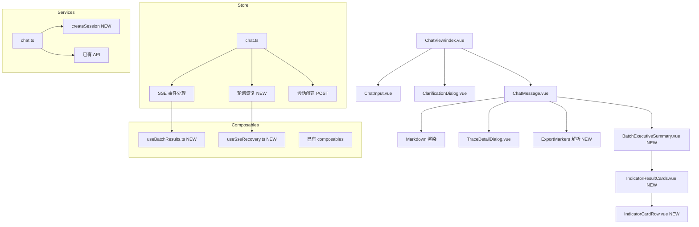

# ChatView 会话流程修复方案

> **状态**：草案，等待审阅
> **日期**：2026-08-02
> **依据**：`当前会话流程_前端对接文档_2026-08-02.md` 和 `batchResults页面展示完整逻辑_2026-08-02.md`

---

## 1. 概述

本文档基于两条会议流程文档与当前 `src/views/ChatView/` 代码的全面对比分析，梳理出 12 个待修复问题，并按改动范围和依赖关系分为四个阶段。

### 1.1 整体架构



---

## 2. 分阶段实施计划

### 阶段一：类型与基础设施（前置依赖）

> 所有阶段均依赖此阶段。仅做类型和配置修正，不改业务逻辑。

#### 2.1 补充 `batch_indicator_result` SSE 事件类型

**文件**：`src/types/chat.ts`

在 `SSE_EVENT` 常量中新增：

```typescript
BATCH_INDICATOR_RESULT: 'batch_indicator_result',
```

新增 `BatchIndicatorResultEvent` 接口：

```typescript
export interface BatchIndicatorResultEvent extends SseEventBase {
  event: typeof SSE_EVENT.BATCH_INDICATOR_RESULT;
  step: number;
  batchRunId: string;
  ruleId: string;
  ruleName: string;
  profileId?: string;
  profileLabel?: string;
  status: 'SUCCESS' | 'NO_SAMPLE' | 'FAILED';
  done: number;
  total: number;
  resultValue?: number;
  numeratorCount?: number;
  denominatorCount?: number;
  sampleCount?: number;
  targetValue?: number | string;
  targetDirection?: string;
  unit?: string;
  calculationDisplay?: string;
  statStart?: string;
  statEnd?: string;
  runId?: string;
  dataFreshness?: string;
  qualityStatus?: 'NORMAL' | 'ABNORMAL';
  errorCode?: string;
  errorMessage?: string;
  overviewSqlHash?: string;
  detailKind?: string;
  detailContractVersion?: string;
}
```

加入 `SseEvent` 联合类型。

#### 2.2 修正 `capabilities` 响应中的默认模型字段

**文件**：`src/stores/chat.ts` 和 `src/types/chat.ts`

根据后端实际返回，`capabilities` 同时包含 `model`（顶层后端默认）和 `defaultModel`（可被运维覆盖）。当前代码已正确使用 `defaultModel`，无需修改。但需确认 `capabilities.model` 是否被代码引用——当前未被引用，保留现状即可。

> **结论**：此条无需修改，后端返回了正确的 `defaultModel` 字段。

#### 2.3 SSE 解析增强：兼容 `\r\n\r\n` 分帧

**文件**：`src/utils/sse.ts`

当前 `fetchSseStream()` 使用 `\n\n` 分割帧。文档 §5.1 明确说 "以空行（`\n\n` 或 `\r\n\r\n`）分帧"。需要先对 buffer 做 `\r\n` → `\n` 的归一化处理。

```typescript
// 在 split('\n\n') 之前增加：
buffer = buffer.replace(/\r\n/g, '\n');
```

---

### 阶段二：SSE 事件处理修复（核心逻辑）

#### 2.4 新增 `batch_indicator_result` 事件处理

**文件**：`src/stores/chat.ts`

在 `handleSseEvent()` 的 switch 中新增 case：

```typescript
case SSE_EVENT.BATCH_INDICATOR_RESULT: {
  const item: BatchResultItem = {
    ruleId: event.ruleId,
    ruleName: event.ruleName,
    status: event.status,
    done: event.done,
    total: event.total,
    batchRunId: event.batchRunId,
    profileId: event.profileId,
    profileLabel: event.profileLabel,
    resultValue: event.resultValue,
    numeratorCount: event.numeratorCount,
    denominatorCount: event.denominatorCount,
    sampleCount: event.sampleCount,
    unit: event.unit,
    targetValue: event.targetValue,
    targetDirection: event.targetDirection,
    calculationDisplay: event.calculationDisplay,
    statStart: event.statStart,
    statEnd: event.statEnd,
    runId: event.runId,
    dataFreshness: event.dataFreshness,
    qualityStatus: event.qualityStatus,
    overviewSqlHash: event.overviewSqlHash,
    detailKind: event.detailKind,
    detailContractVersion: event.detailContractVersion,
    errorCode: event.errorCode,
    errorMessage: event.errorMessage,
  };

  if (!message.batchResults) {
    message.batchResults = [];
  }

  // 按 (ruleId, profileId) 去重替换（文档 §5.4）
  const key = `${item.ruleId}::${item.profileId ?? ''}`;
  const existingIndex = message.batchResults.findIndex(
    (r) => `${r.ruleId}::${r.profileId ?? ''}` === key,
  );
  if (existingIndex >= 0) {
    message.batchResults[existingIndex] = item;
  } else {
    message.batchResults.push(item);
  }
  break;
}
```

#### 2.5 修复 `agent_done` 按 `stopReason` 区分终态

**文件**：`src/stores/chat.ts`

```typescript
case SSE_EVENT.AGENT_DONE: {
  const isCompleted = event.status === AGENT_STATUS.COMPLETED;
  const isClarification = event.stopReason === STOP_REASON.CLARIFICATION
    || message.clarification != null;

  if (isCompleted || isClarification) {
    message.status = MESSAGE_STATUS.COMPLETED;
    // 文档 §7.1: stopReason=clarification 时显示"等待你选择"
    if (isClarification && !message.content) {
      message.content = event.message || '等待你选择';
    }
  } else {
    message.status = MESSAGE_STATUS.ERROR;
    message.errorMessage = event.message || '运行失败';
  }

  message.stepCount = event.stepCount;
  message.currentStage = undefined;

  // 文档 §7.1: 内容为空时显示兜底文案
  if (!message.content && !message.batchResults?.length) {
    message.content = '本轮处理已结束，但没有返回可展示的业务回答。';
  }

  isStreaming.value = false;
  break;
}
```

#### 2.6 修复 `clarification_required` 写入 `message` 内容

**文件**：`src/stores/chat.ts`

```typescript
case SSE_EVENT.CLARIFICATION_REQUIRED: {
  message.clarification = event.clarification;
  // 文档 §5.3: 写入 message 字段到回答内容
  message.content = event.message || '';
  message.status = MESSAGE_STATUS.COMPLETED;
  message.currentStage = undefined;
  isStreaming.value = false;
  break;
}
```

#### 2.7 修复 `assistant_message` 事件中 stage_update 字段映射

**文件**：`src/stores/chat.ts`

文档 §5.3 显示 `stage_update` 携带 `nodeName`、`nodeType`、`status`、`message`、`durationMs`、`subtaskId`。当前代码仅映射了 `message` → `currentStage`。需要追加 `durationMs` 和 `subtaskId` 的映射以支持阶段耗时展示。

```typescript
case SSE_EVENT.STAGE_UPDATE: {
  message.currentStage = event.message;
  // 追加阶段耗时和分组信息（文档 §5.3）
  if (event.durationMs != null) {
    message.currentStageDurationMs = event.durationMs;
  }
  if (event.subtaskId) {
    message.currentSubtaskId = event.subtaskId;
  }
  break;
}
```

> `ChatMessage` 类型需要增加 `currentStageDurationMs?: number` 和 `currentSubtaskId?: string` 字段。

---

### 阶段三：会话生命周期修复

#### 2.8 新增 `POST /api/agent/sessions` 调用

**文件**：`src/services/chat.ts`、`src/stores/chat.ts`、`src/views/ChatView/composables/useChatView.ts`

在 `services/chat.ts` 新增：

```typescript
export async function createSession(): Promise<{ sessionId: string }> {
  const response = await request('/agent/sessions', { method: 'POST' });
  if (!response.ok) {
    throw new Error(`创建会话失败: ${response.status}`);
  }
  return response.json();
}
```

在 `stores/chat.ts` 新增 `createNewSession()` action，替换 `createPendingSession()`：

```typescript
async function createNewSession(): Promise<string | null> {
  const { sessionId } = await createSession();
  backendSessionId.value = sessionId;

  const session: ChatSession = {
    id: sessionId,
    title: '新对话',
    messages: [],
    createdAt: Date.now(),
    updatedAt: Date.now(),
  };
  sessions.value.unshift(session);
  currentSessionId.value = sessionId;
  return sessionId;
}
```

在 `useChatView.ts` 的 `handleCreateSession()` 中调用 `chatStore.createNewSession()` 替代前端临时 ID：

```typescript
async function handleCreateSession() {
  chatStore.resetToNewChat();
  try {
    await chatStore.createNewSession();
  } catch (error) {
    errorMessage.value = error instanceof Error ? error.message : '创建会话失败';
    showError.value = true;
    // 创建失败回退到无会话状态
    return;
  }
  router.push({ name: 'Chat', params: { sessionId: chatStore.currentSessionId! } });
}
```

同时，在 `sendMessage()` 中移除对 `createPendingSession()` 的调用，改为检查 `backendSessionId` 是否存在，不存在时自动调用 `createNewSession()`。

#### 2.9 `isStreaming` 按 sessionId 隔离

**文件**：`src/stores/chat.ts`

将 `isStreaming` 从 `ref<boolean>` 改为 `ref<Record<string, boolean>>({})`，或更简单地，在下一次发送消息时检查 `isStreaming && currentSessionId === activeStreamSessionId`：

方案：新增 `activeStreamSessionId` 追踪正在流式的 sessionId：

```typescript
const isStreaming = ref(false);
const activeStreamSessionId = ref<string | null>(null);

// 在 sendMessage 中：
isStreaming.value = true;
activeStreamSessionId.value = currentSessionId.value;

// 在 handleSseEvent 的 AGENT_DONE/AGENT_ERROR/CLARIFICATION_REQUIRED 中：
isStreaming.value = false;
activeStreamSessionId.value = null;

// 在 stopStreaming 中：
isStreaming.value = false;
activeStreamSessionId.value = null;
```

`ChatInput` 的 `disabled` prop 需要同时检查 `isStreaming` 和 `activeStreamSessionId === currentSessionId`。

---

### 阶段四：SSE 断线轮询恢复

#### 2.10 新增轮询恢复机制

**文件**：新增 `src/views/ChatView/composables/useSseRecovery.ts`，修改 `src/stores/chat.ts`

**核心逻辑**（文档 §7.2）：

```typescript
// useSseRecovery.ts 伪代码
export function useSseRecovery() {
  const chatStore = useChatStore();
  const pollTimers = new Map<string, ReturnType<typeof setInterval>>();
  const POLL_INTERVAL_MS = 2000;
  const MAX_WAIT_MS = 30 * 60 * 1000; // 30 分钟

  function startPolling(sessionId: string, messageBeforeCount: number, assistantMessageId: string) {
    const startTime = Date.now();
    
    const timer = setInterval(async () => {
      // 超时检查
      if (Date.now() - startTime > MAX_WAIT_MS) {
        stopPolling(sessionId);
        chatStore.updateAssistantMessage(assistantMessageId, {
          status: MESSAGE_STATUS.ERROR,
          errorMessage: '后台计算等待超时，请稍后从历史对话重新打开结果。',
        });
        return;
      }

      try {
        const messages = await getSessionMessages(sessionId);
        // 消息数量达到本轮前数量+2 且最后一条为 assistant 时停止
        if (messages.length >= messageBeforeCount + 2 && 
            messages[messages.length - 1].role === 'assistant') {
          stopPolling(sessionId);
          // 整体替换为历史消息
          await chatStore.loadSessionMessages(sessionId);
        }
      } catch {
        // 轮询失败静默继续
      }
    }, POLL_INTERVAL_MS);

    pollTimers.set(sessionId, timer);
  }

  function stopPolling(sessionId: string) {
    const timer = pollTimers.get(sessionId);
    if (timer) {
      clearInterval(timer);
      pollTimers.delete(sessionId);
    }
  }

  onUnmounted(() => {
    pollTimers.forEach((timer) => clearInterval(timer));
    pollTimers.clear();
  });

  return { startPolling, stopPolling };
}
```

**在 `stores/chat.ts` 的 `onError` 回调中触发**（文档 §7.2）：

```typescript
onError: (error) => {
  const msg = currentSession.value?.messages.find(m => m.id === assistantMessageId);
  // 已有 traceId 或批次卡片 → 进入轮询而非直接标记失败
  if (msg && (msg.traceId || (msg.batchResults && msg.batchResults.length > 0))) {
    updateAssistantMessage(assistantMessageId, {
      currentStage: '实时连接已结束，后台仍在继续计算，正在等待最终结果写入…',
    });
    // 不标记失败，保持 running 状态
    // 触发轮询（在 ChatView 层面通过事件通知）
  } else {
    updateAssistantMessage(assistantMessageId, {
      status: MESSAGE_STATUS.ERROR,
      errorMessage: error.message,
    });
  }
  isStreaming.value = false;
},
```

由于 store 不应直接持有定时器，轮询逻辑放在 [`useChatView.ts`](src/views/ChatView/composables/useChatView.ts:1) 中，通过回调或事件通信。简化实现：在 `sendMessage` 的 `onError` 中 emit 一个事件，由 `useChatView` 监听到后调用 `useSseRecovery.startPolling()`。

---

### 阶段五：Markdown 导出标记解析

#### 2.11 解析和隐藏导出标记

**文件**：`src/utils/markdown.ts`

新增 `parseExportMarkers()` 函数：

```typescript
const EXPORT_MARKER_REGEX = /\{\{(detail_export|upload_comparison_export|diagnosis_export):([^}]+)\}\}/g;

export interface ParsedExportMarker {
  type: 'detail_export' | 'upload_comparison_export' | 'diagnosis_export';
  params: string[]; // 按冒号分割后的参数
  rawText: string;
  index: number;
}

export function parseExportMarkers(content: string): {
  cleanContent: string;
  markers: ParsedExportMarker[];
} {
  const markers: ParsedExportMarker[] = [];
  let match: RegExpExecArray | null;
  
  EXPORT_MARKER_REGEX.lastIndex = 0;
  while ((match = EXPORT_MARKER_REGEX.exec(content)) !== null) {
    markers.push({
      type: match[1] as ParsedExportMarker['type'],
      params: match[2].split(':'),
      rawText: match[0],
      index: match.index,
    });
  }

  const cleanContent = content.replace(EXPORT_MARKER_REGEX, '');
  return { cleanContent, markers };
}
```

**在 `ChatMessage.vue` 中使用**：

```typescript
const { cleanContent, markers } = computed(() => {
  if (isUser.value || !props.message.content) {
    return { cleanContent: props.message.content, markers: [] };
  }
  return parseExportMarkers(props.message.content);
});

const renderedContent = computed(() => {
  if (isUser.value) return cleanContent.value;
  return renderMarkdown(cleanContent.value);
});
```

模板中在消息气泡下方渲染 `markers` 为操作按钮（权限受控）：

```vue
<div v-if="markers.length > 0" class="message-export-actions">
  <v-btn v-for="marker in markers" :key="marker.index" 
    size="small" variant="tonal" color="primary"
    @click="handleExportAction(marker)">
    导出明细
  </v-btn>
</div>
```

> `handleExportAction` 的具体实现（调用 POST /api/sql-runs/{runId}/exports 等）后续按需补充，此阶段先完成标记过滤。

---

### 阶段六：澄清对话框增强

#### 2.12 选项筛选和 `indicator:all` 互斥

**文件**：`src/views/ChatView/components/ClarificationDialog.vue`

**筛选**：在选项列表上方新增一个 `v-text-field`，当 `groupedOptions` 总选项数超过 8 时显示本地搜索输入。

```typescript
const filterText = ref('');
const showFilter = computed(() => {
  if (!props.clarification) return false;
  return props.clarification.options.length > 8;
});

const filteredGroupedOptions = computed(() => {
  if (!filterText.value) return groupedOptions.value;
  const keyword = filterText.value.toLowerCase();
  return groupedOptions.value
    .map(([group, options]) => [
      group,
      options.filter(
        (opt) =>
          opt.label.toLowerCase().includes(keyword) ||
          opt.description.toLowerCase().includes(keyword),
      ),
    ])
    .filter(([, options]) => options.length > 0);
});
```

**互斥**：`indicator:all` 被选中时清空其他选项；选中其他选项时取消 `indicator:all`。

```typescript
function toggleOption(value: string) {
  if (value === 'indicator:all') {
    if (selectedOptions.value.includes('indicator:all')) {
      selectedOptions.value = [];
    } else {
      selectedOptions.value = ['indicator:all'];
    }
  } else {
    // 移除 indicator:all
    selectedOptions.value = selectedOptions.value.filter(v => v !== 'indicator:all');
    const idx = selectedOptions.value.indexOf(value);
    if (idx >= 0) {
      selectedOptions.value.splice(idx, 1);
    } else {
      selectedOptions.value.push(value);
    }
  }
}
```

> 注意：当前模板中多选使用 `v-checkbox` 的 `v-model="selectedOptions"` 双向绑定，改为使用 `:model-value` + `@update:model-value` 调用 `toggleOption`。

---

### 阶段七：批量结果 UI 渲染（最大改动）

> 以 `batchResults页面展示完整逻辑_2026-08-02.md` 为基准，遵循当前项目的 Vuetify + Tailwind + Composition API 风格实现。

#### 2.13 新增 `useBatchResults.ts` Composable

**文件**：新增 `src/views/ChatView/composables/useBatchResults.ts`

提供以下计算逻辑（文档第二篇 §5-§9）：

| 导出 | 说明 |
|------|------|
| `indicatorGroups` | 按 `ruleId` 分组的 `Map<string, BatchResultItem[]>` |
| `summary` | 覆盖指标数/达标/未达标/待确认/数据质量（正/异）/口径数/batchRunId/统计周期 |
| `attentionItems` | 全部需重点关注的项（按优先级+ruleId 排序） |
| `visibleAttention` | 最多 5 项，跨类别各取一项后补足 |
| `isOfficial(result)` | 判断是否正式口径（名称含"公版/推荐方案/默认"） |
| `getFormal(group)` | 取指标组中第一条正式口径 |
| `calculateOutcome(item)` | 单口径达标状态：'reached' / 'not_reached' / 'failed' / 'no_sample' / 'pending' |
| `calculateIndicatorOutcome(group)` | 指标级达标状态 |
| `calculateQuality(item)` | 单口径数据质量 |
| `calculateSummaryQuality(item)` | 摘要级数据质量 |

**达标计算核心逻辑**（文档第二篇 §6）：

```typescript
function calculateOutcome(item: BatchResultItem): Outcome {
  if (item.status === 'FAILED') return 'failed';
  if (item.status === 'NO_SAMPLE') return 'no_sample';

  const result = toNumber(item.resultValue);
  const target = toNumber(item.targetValue);
  const direction = item.targetDirection;

  if (result == null || target == null || !direction) return 'pending';

  if (direction.includes('<')) {
    const met = direction.includes('=') ? result <= target : result < target;
    return met ? 'reached' : 'not_reached';
  }
  if (direction.includes('>')) {
    const met = direction.includes('=') ? result >= target : result > target;
    return met ? 'reached' : 'not_reached';
  }
  // 其他方向按等于判断
  return result === target ? 'reached' : 'not_reached';
}
```

#### 2.14 新增 `BatchExecutiveSummary.vue` 组件

**文件**：新增 `src/views/ChatView/components/BatchExecutiveSummary.vue`

**Props**：`batchResults: BatchResultItem[]`、`batchRunId?: string`

**渲染结构**（遵循 Vuetify + SCSS）：

```
┌─────────────────────────────────────────┐
│ 📊 本次指标核算结果                      │
│                                         │
│ 覆盖指标：35  达标：20  未达标：8  待确认：7 │
│ 数据质量：正常 32 / 异常 3              │
│ 口径数：43                               │
│ 统计周期：2026-01-01 至 2026-03-31       │
│                                         │
│ [生成待确认清单] [哪些未达标可能是数据问题]  │
│ [导出完整调研报告 Word]                   │
│                                         │
│ ⚠ 需重点关注（5/12）                     │
│ ┌───────────────────────────────────┐   │
│ │ 计算异常: 指标A - 数据源未能完成   │   │
│ │ 无可用样本: 指标B                 │   │
│ │ ...                              │   │
│ └───────────────────────────────────┘   │
│                                         │
│ [查看完整报告]                            │
└─────────────────────────────────────────┘
```

**关键实现要点**：
- 摘要统计使用 `useBatchResults` 的 `summary` 输出
- 关注列表使用 `visibleAttention`
- 三个快捷操作按钮调用 `POST /api/agent/actions/analyze-batch`（确认清单/质量检查）和报告下载
- 点击关注项触发 `inspect_indicator` 动作

#### 2.15 新增 `IndicatorResultCards.vue` 组件

**文件**：新增 `src/views/ChatView/components/IndicatorResultCards.vue`

**Props**：`batchResults: BatchResultItem[]`、`showFull?: boolean`（默认为 false，仅展示关注项对应的卡片）

按 `ruleId` 分组，每组渲染一张卡片：

```
┌─────────────────────────────────────────┐
│ 急会诊及时到位率 (HXZD-003-001)  ✅ 计算成功 │
│                                         │
│ ★ 推荐方案（公版） 达标 96.3%            │
│   分子 258 / 分母 268                    │
│   目标 ≥90%  统计期 2026Q1  质量：正常    │
│                                         │
│   ● 备选方案  未达标 82.1%               │
│   分子 220 / 分母 268                    │
│                                         │
│ 系统建议：正式口径已达标，保存报告持续观察  │
│                                         │
│ [口径] [数据链路] [明细]                   │
└─────────────────────────────────────────┘
```

**关键实现要点**：
- 按 `detailKind` 展示不同类型（COUNT_RATIO/MEDIAN_SAMPLE/DUAL_SOURCE/RATE_COMPARISON）
- `recommendedItem` 选择规则：成功正式口径 → 第一条成功 → 正式口径 → 第一条
- 每行展示达标状态和数据质量
- 系统建议按条件分支生成固定文案

#### 2.16 新增 `IndicatorCardRow.vue` 子组件

**文件**：新增 `src/views/ChatView/components/IndicatorCardRow.vue`

**Props**：`item: BatchResultItem`、`isRecommended: boolean`

单口径数据行的渲染，根据 `detailKind` 适配表头和数值展示。

#### 2.17 修改 `ChatMessage.vue` 集成批量结果

**文件**：`src/views/ChatView/components/ChatMessage.vue`

在 Markdown 渲染前增加分支判断（文档第二篇 §4）：

```vue
<!-- 批量结果卡片（优先级高于 Markdown 文本） -->
<BatchExecutiveSummary
  v-if="!isUser && message.batchResults && message.batchResults.length > 0"
  :batch-results="message.batchResults"
  :batch-run-id="message.batchResults[0]?.batchRunId"
/>

<!-- Markdown 渲染（无批量结果时） -->
<div v-else-if="!isUser" ...>
```

**移除重复渲染**：同一条消息中，Markdown 回答和批量卡片不会同时展示。

---

### 阶段八：报告抽屉和详情（后续）

> 此阶段为完整报告、明细查询等功能的实现，因改动量极大且涉及多个后端接口（§8、第二篇 §12-§15），建议作为独立批次实施。本次方案文档仅勾勒接口。

---

## 3. 文件变更汇总

| 文件 | 操作 | 阶段 |
|------|------|------|
| `src/types/chat.ts` | 修改：新增 BATCH_INDICATOR_RESULT 枚举、BatchIndicatorResultEvent、currentStageDurationMs/currentSubtaskId | 一 |
| `src/utils/sse.ts` | 修改：兼容 \r\n 分帧 | 一 |
| `src/stores/chat.ts` | 修改：新增 batch_indicator_result 处理、agent_done 逻辑、clarification_required 内容写入、createNewSession、sendMessage 轮询触发、isStreaming 隔离 | 二/三/四 |
| `src/services/chat.ts` | 修改：新增 createSession() | 三 |
| `src/utils/markdown.ts` | 修改：新增 parseExportMarkers() | 五 |
| `src/views/ChatView/components/ClarificationDialog.vue` | 修改：筛选输入框、indicator:all 互斥 | 六 |
| `src/views/ChatView/composables/useBatchResults.ts` | **新增**：批量结果计算逻辑 | 七 |
| `src/views/ChatView/components/BatchExecutiveSummary.vue` | **新增**：批量摘要组件（≤250行） | 七 |
| `src/views/ChatView/components/IndicatorResultCards.vue` | **新增**：指标卡片列表组件（≤250行） | 七 |
| `src/views/ChatView/components/IndicatorCardRow.vue` | **新增**：单口径行组件（≤200行） | 七 |
| `src/views/ChatView/components/ChatMessage.vue` | 修改：集成批量结果渲染 + 导出标记 | 五/七 |
| `src/views/ChatView/composables/useSseRecovery.ts` | **新增**：SSE 断线轮询 | 四 |
| `src/views/ChatView/composables/useChatView.ts` | 修改：handleCreateSession 调后端 + 接入轮询 | 三/四 |
| `src/views/ChatView/index.vue` | 修改：引入 useSseRecovery | 四 |
| `src/views/ChatView/components/ChatInput.vue` | 修改：disabled 检查 activeStreamSessionId | 三 |

---

## 4. 样式文件规范

所有新增组件的样式遵循 `B08-vue-template-simplicity.md` 优先级：

1. **Vuetify 组件 props**（color、variant、density 等）
2. **Vuetify Utility Classes**（d-flex、ga-2、text-body-2 等）
3. **Tailwind CSS 4**（flex、gap-2、text-sm 等）
4. **自定义 SCSS**（仅在以上无法满足时）

样式文件放置在 `src/views/ChatView/components/styles/` 或 `src/views/ChatView/styles/` 下，组件内通过 `@use` 引入。

---

## 5. 验证检查清单

修复完成后，按 `A11-verification-gate.md` 执行：

- [ ] `npm run lint` 0 warning
- [ ] `npm run typecheck` 通过
- [ ] 新增 `.vue` 文件行数 ≤ 250 行（`A09-vue-component-size-limit.md`）
- [ ] import 使用 `@/` 别名（`B02-import-style.md`）
- [ ] 无魔法字符串（`B03-no-magic-strings.md`）

---

## 6. 待澄清问题

在阶段七实现前，以下问题需要确认：

1. **快捷操作的接口就绪情况**：`POST /api/agent/actions/analyze-batch`（确认清单/质量检查）和 `POST /api/batch-runs/{batchRunId}/reports`（报告快照）是否已部署？如果未就绪，快捷操作按钮应先 disabled 并显示 tooltip。
2. **指标排查 `inspect_indicator` 接口**：`POST /api/agent/actions/inspect-indicator` 的请求体中 `indicatorId` 对应 `ruleId` 还是其他标识？
3. **明细查询接口**：`POST /api/sql-runs/{runId}/details` 返回的 `snapshotId` 和列定义格式如何？
4. **报告下载接口**：`GET /api/batch-reports/{reportId}/download?format=docx|pdf|xlsx` 是否返回 `Content-Disposition` 头？

---

## 7. 风险点

| # | 风险 | 缓解措施 |
|---|------|----------|
| 1 | `useBatchResults.ts` 达标计算逻辑复杂，与后端可能存在偏差 | 严格按文档第二篇 §6 的算法实现，后续后端统一输出后替换 |
| 2 | 新增 4 个 Vue SFC + 2 个 composable，文件行数可能超标 | 按 A09 规则细粒度拆分，每个 SFC ≤ 250 行 |
| 3 | 轮询机制增加全局状态复杂度 | 使用 `useSseRecovery` composable 封装，自动在 `onUnmounted` 清理 |
| 4 | 批量卡片 UI 涉及多种 `detailKind` 展示，边界情况多 | 每种 `detailKind` 作为独立分支处理，不支持的 kind 回退到 COUNT_RATIO 展示 |
