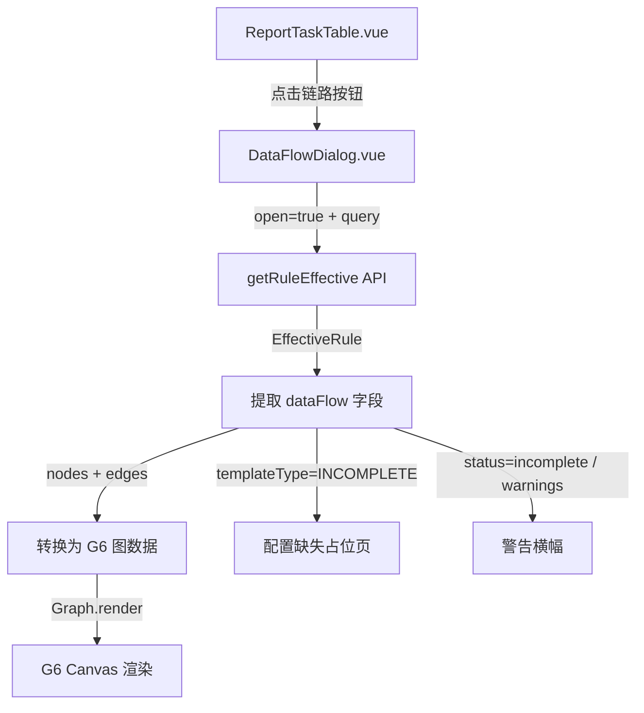

# 数据链路弹窗 (DataFlowDialog) 技术方案

## 1. 背景

[`ReportTaskTable.vue`](../src/views/ChatView/components/ReportTaskTable.vue:62) 中"链路"按钮当前仅复用"口径"弹窗逻辑（[`handleLink`](../src/views/ChatView/components/ReportTaskTable.vue:62) → [`RuleCaliberDialog`](../src/views/ChatView/components/RuleCaliberDialog.vue:1)），未实现数据链路图可视化。

后端接口 `GET /wiki-agent/api/kb/rules/{ruleId}/effective` 返回的 [`EffectiveRule`](../src/types/chat.ts:366) 中已包含 `dataFlow` 字段（当前类型为弱类型 `Record<string, unknown>`），结构完整描述了指标数据的 DAG 有向无环图，详见 [`dataflow-spec.md`](../docs/dataflow-spec.md:1)。

## 2. 技术选型

| 方案 | 结论 |
|------|------|
| **渲染库** | **AntV G6 v5**（用户已确定），通过 npm 安装 `@antv/g6` |
| **布局算法** | G6 内置 `dagre` 布局（自上而下分层），与 dataFlow 的 `sequence` 字段天然匹配 |
| **容器** | 独立 Dialog 组件 `DataFlowDialog.vue`，在 `ReportTaskTable.vue` 中引入 |
| **数据获取** | 复用已有 `getRuleEffective()` API（[`src/services/chat.ts`](../src/services/chat.ts:258)），返回 `EffectiveRule` 后提取 `.dataFlow` |
| **自身框架** | Vue 3 Composition API + Vuetify 4 + TypeScript（与项目一致） |

> **为什么不复用 Vue Flow**：项目已有 `@vue-flow/core` + `dagre`（用于 TraceDagView），但用户明确指定使用 AntV G6。G6 提供更丰富的企业级图可视化能力（节点样式灵活、内置 tooltip、高亮交互开箱即用），更适合数据链路这种静态 DAG 展示场景。

## 3. 架构概览



### 3.1 组件树

```
ReportTaskTable.vue
  ├── RuleCaliberDialog.vue    ← "口径"按钮（已有）
  ├── DataFlowDialog.vue       ← "链路"按钮（新建）
  └── RuleDetailDialog.vue     ← "明细"按钮（已有）
```

### 3.2 弹窗打开流程

1. 用户点击 [`ReportTaskTable.vue`](../src/views/ChatView/components/ReportTaskTable.vue:127) 中某行的"链路"按钮
2. `handleLink(task)` 构造 [`RuleEffectiveQuery`](../src/types/chat.ts:447)（ruleId + profileId + statStart/statEnd），打开 `DataFlowDialog`
3. `DataFlowDialog` 侦听 `open` → 调用 [`getRuleEffective()`](../src/services/chat.ts:258) → 获取 `EffectiveRule`
4. 提取 `dataFlow` 字段（需强类型转换）→ 传给 G6 渲染

## 4. 文件清单与变更说明

| 文件 | 操作 | 说明 |
|------|------|------|
| [`src/types/chat.ts`](../src/types/chat.ts:366) | **修改** | 新增 `DataFlowNode`、`DataFlowEdge`、`DataFlowRoot` 类型；将 `EffectiveRule.dataFlow` 改为强类型 |
| `src/views/ChatView/components/DataFlowDialog.vue` | **新建** | 链路图弹窗组件（G6 渲染） |
| [`src/views/ChatView/components/ReportTaskTable.vue`](../src/views/ChatView/components/ReportTaskTable.vue:1) | **修改** | 接入 `DataFlowDialog`，替换 `handleLink` 逻辑 |
| `package.json` | **修改** | 新增依赖 `@antv/g6`（需 `npm install`） |

## 5. 详细设计

### 5.1 TypeScript 类型定义

在 [`src/types/chat.ts`](../src/types/chat.ts:363) 中新增以下类型，并替换 `EffectiveRule.dataFlow` 的类型声明：

```typescript
// ============ dataFlow 数据链路类型 ============

/** 数据链路节点类型枚举 */
export const DATA_FLOW_NODE_TYPE = {
  TABLE: 'TABLE',
  SOURCE_EXTRACT_SQL: 'SOURCE_EXTRACT_SQL',
  EXTENDED_EVENT_SQL: 'EXTENDED_EVENT_SQL',
  OVERVIEW_SQL: 'OVERVIEW_SQL',
  DEPARTMENT_SQL: 'DEPARTMENT_SQL',
  PATIENT_SQL: 'PATIENT_SQL',
  RESULT: 'RESULT',
  CONFIGURATION: 'CONFIGURATION',
} as const;

export type DataFlowNodeType = (typeof DATA_FLOW_NODE_TYPE)[keyof typeof DATA_FLOW_NODE_TYPE];

/** 数据库角色枚举 */
export const DATA_FLOW_DB_ROLE = {
  BUSINESS: 'BUSINESS',
  SYNC: 'SYNC',
  REAL: 'REAL',
  KNOWLEDGE: 'KNOWLEDGE',
} as const;

export type DataFlowDatabaseRole = (typeof DATA_FLOW_DB_ROLE)[keyof typeof DATA_FLOW_DB_ROLE];

/** 链路模板类型 */
export const DATA_FLOW_TEMPLATE = {
  EVENT_TO_TARGET: 'EVENT_TO_TARGET',
  DIRECT_TO_TARGET: 'DIRECT_TO_TARGET',
  DIRECT_REAL_QUERY: 'DIRECT_REAL_QUERY',
  INCOMPLETE: 'INCOMPLETE',
} as const;

export type DataFlowTemplateType = (typeof DATA_FLOW_TEMPLATE)[keyof typeof DATA_FLOW_TEMPLATE];

/** 数据链路节点对象 */
export interface DataFlowNode {
  id: string;
  sequence: number;
  title: string;
  nodeType: DataFlowNodeType;
  databaseRole: DataFlowDatabaseRole;
  tableNames: string[];
  sqlKind: string;
  sql: string;
  parameters: string[];
  description: string;
  tableDescriptions?: Record<string, string>;
  primaryTables?: string[];
  parameterTables?: string[];
}

/** 数据链路边对象 */
export interface DataFlowEdge {
  from: string;
  to: string;
  label: string;
}

/** dataFlow 顶层结构 */
export interface DataFlow {
  templateType: DataFlowTemplateType;
  templateLabel: string;
  status: 'complete' | 'incomplete';
  warnings: string[];
  primaryTables: string[];
  parameterTables: string[];
  nodes: DataFlowNode[];
  edges: DataFlowEdge[];
}
```

同时修改 `EffectiveRule` 接口中第 393 行：

```typescript
// 修改前
dataFlow?: Record<string, unknown>;

// 修改后
dataFlow?: DataFlow;
```

### 5.2 DataFlowDialog.vue 组件设计

#### 5.2.1 Props / Emits

```typescript
interface Props {
  open: boolean;
  query: RuleEffectiveQuery | null;
}

interface Emits {
  (e: 'update:open', value: boolean): void;
}
```

#### 5.2.2 状态机

```
┌─────────┐  open && query   ┌──────────┐
│  IDLE   │ ───────────────→ │ LOADING  │
└─────────┘                  └────┬─────┘
                                  │
                    ┌─────────────┼─────────────┐
                    ▼             ▼             ▼
              ┌─────────┐  ┌──────────┐  ┌──────────┐
              │ SUCCESS │  │  ERROR   │  │  EMPTY   │
              └────┬────┘  └──────────┘  └──────────┘
                   │
         ┌─────────┼──────────┐
         ▼                    ▼
   ┌───────────┐       ┌─────────────┐
   │ 正常渲染  │       │ INCOMPLETE  │
   │ G6 图     │       │ 占位提示    │
   └───────────┘       └─────────────┘
```

#### 5.2.3 模板结构

```vue
<template>
  <v-dialog
    :model-value="open"
    max-width="960"
    scrollable
    persistent
    @update:model-value="emit('update:open', $event)"
  >
    <v-card rounded="lg">
      <!-- 头部：规则名称 + 口径名 + 模板标签 + 关闭 -->
      <v-toolbar density="comfortable" color="surface">
        <v-toolbar-title>
          {{ ruleName }} - 数据链路
          <v-chip v-if="dataFlow" size="x-small" label class="ml-2">
            {{ dataFlow.templateLabel }}
          </v-chip>
        </v-toolbar-title>
        <v-btn variant="text" icon="mdi-close" @click="emit('update:open', false)" />
      </v-toolbar>

      <v-divider />

      <!-- 警告横幅（status=incomplete 或 warnings 非空） -->
      <v-alert
        v-if="showWarnings"
        type="warning"
        variant="tonal"
        density="compact"
        class="ma-3 mb-0"
      >
        <ul class="mb-0 pl-3">
          <li v-for="w in dataFlow?.warnings" :key="w">{{ w }}</li>
        </ul>
      </v-alert>

      <!-- LOADING -->
      <v-card-text v-if="loading" class="text-center py-8">
        <v-progress-circular indeterminate color="primary" size="32" />
        <div class="text-medium-emphasis mt-3">加载数据链路...</div>
      </v-card-text>

      <!-- ERROR -->
      <v-card-text v-else-if="errorMessage" class="text-center py-8">
        <v-icon icon="mdi-alert-circle" color="error" size="48" />
        <div class="text-error mt-3">{{ errorMessage }}</div>
        <v-btn variant="tonal" color="primary" size="small" class="mt-4" @click="retry">
          重试
        </v-btn>
      </v-card-text>

      <!-- INCOMPLETE 占位 -->
      <v-card-text
        v-else-if="dataFlow?.templateType === DATA_FLOW_TEMPLATE.INCOMPLETE"
        class="text-center py-8"
      >
        <v-icon icon="mdi-graph-outline" color="grey" size="64" />
        <div class="text-h6 text-medium-emphasis mt-4">配置不完整</div>
        <div class="text-body-2 text-medium-emphasis mt-2">
          {{ dataFlow?.nodes?.[0]?.description ?? '当前口径未配置概览 SQL，不能形成可执行统计链路。' }}
        </div>
      </v-card-text>

      <!-- G6 图容器（正常渲染） -->
      <v-card-text v-else-if="dataFlow && dataFlow.nodes.length > 0" class="pa-0">
        <div ref="graphContainer" class="data-flow-graph" />
        <!-- 图例（使用 v-chip tonal 对齐 Vuetify 语义色） -->
        <div class="d-flex flex-wrap ga-2 pa-3">
          <v-chip
            v-for="item in LEGEND_ITEMS"
            :key="item.label"
            size="x-small"
            variant="tonal"
            :color="item.color"
            label
          >
            {{ item.label }}
          </v-chip>
        </div>
      </v-card-text>

      <!-- 空数据 -->
      <v-card-text v-else class="d-flex flex-column align-center py-8 text-medium-emphasis">
        <v-icon icon="mdi-file-document-outline" size="48" class="mb-3" />
        暂无数据链路信息
      </v-card-text>

      <v-divider />
      <v-card-actions class="px-4">
        <v-spacer />
        <v-btn variant="tonal" size="small" @click="emit('update:open', false)">关闭</v-btn>
      </v-card-actions>
    </v-card>
  </v-dialog>
</template>
```

#### 5.2.4 G6 v5 渲染逻辑

```typescript
import { Graph } from '@antv/g6';

// 在 watch(open) 回调中，数据就绪后调用 renderGraph()

function buildGraphData(dataFlow: DataFlow) {
  return {
    nodes: dataFlow.nodes.map((node) => ({
      id: node.id,
      data: node,
      style: {
        ...getNodeStyle(node),    // fill + stroke 来自 Vuetify CSS 变量
        size: [160, 40],
        radius: 6,
        labelText: node.title,
        labelFontSize: 12,
        labelFill: textPrimaryColor, // 运行时读取 --v-theme-on-surface
      },
    })),
    edges: dataFlow.edges.map((edge) => ({
      source: edge.from,
      target: edge.to,
      data: edge,
      style: {
        labelText: edge.label,
        labelFontSize: 10,
        labelFill: secondaryTextColor, // --v-theme-on-surface-variant
      },
    })),
  };
}

// 创建 Graph 实例
const graph = new Graph({
  container: graphContainer.value!,
  width: containerWidth,
  height: 500,
  data: buildGraphData(dataFlow),
  layout: {
    type: 'dagre',
    rankdir: 'TB',       // 自上而下
    nodesep: 30,         // 同层节点间距
    ranksep: 80,         // 层间距
  },
  node: {
    type: 'rect',        // 默认矩形
  },
  edge: {
    type: 'cubic-vertical',
    style: {
      stroke: edgeStroke,       // 运行时读取 --v-theme-outline
      endArrow: true,
    },
  },
  behaviors: ['drag-canvas', 'zoom-canvas', 'hover-activate'],
});

await graph.render();
```

> **关键点**：节点 fill/stroke 和边的颜色在 `buildGraphData` 中逐个设置（通过 `getNodeStyle()`），而非在 G6 全局 `node.style` 中写死。这样每种 `nodeType` 可以映射到不同 Vuetify 语义色。

#### 5.2.5 节点样式映射（对齐 Vuetify 4 + WinDesign Next 色彩体系）

**设计原则**：

- G6 渲染于 Canvas/SVG 层，**无法直接使用 Vuetify CSS 变量**（`rgb(var(--v-theme-primary))`）
- 策略：从 `document.documentElement` 运行时读取 CSS 自定义属性值，转为 G6 可用色值
- 语义映射：每种 `nodeType` 对应 Vuetify 主题中的一个语义色类别
- 同时提供静态 fallback（WinDesign Next 默认色值），确保 CSS 变量读取失败时颜色仍然一致

##### 5.2.5.1 运行时主题色读取工具

```typescript
/**
 * 从 Vuetify CSS 变量读取当前主题的实际色值。
 * Vuetify 4 将主题色写入 document.documentElement 的 CSS 自定义属性：
 *   --v-theme-primary, --v-theme-success, --v-theme-warning, 等
 * 格式为 "R, G, B"（无 # 前缀），需自行拼接为 "#RRGGBB"。
 */
function readThemeColor(varName: string): string {
  const raw = getComputedStyle(document.documentElement)
    .getPropertyValue(varName)
    .trim();
  if (!raw) return '';
  // raw 格式: "45, 90, 250" → "#2D5AFA"
  const rgb = raw.split(',').map((s) => s.trim());
  if (rgb.length !== 3) return raw; // fallback: 原样返回
  const hex = rgb
    .map((c) => {
      const n = parseInt(c, 10);
      return n.toString(16).padStart(2, '0').toUpperCase();
    })
    .join('');
  return `#${hex}`;
}
```

##### 5.2.5.2 nodeType → Vuetify 语义类别映射

每种节点类型对应的语义含义，直接映射到 Vuetify 主题色：

| nodeType | 语义含义 | Vuetify 色系 | 浅色变体来源 |
|----------|----------|-------------|-------------|
| `TABLE` | 数据实体 | `primary`（蓝） | `--v-theme-primary` + 自身变淡 |
| `SOURCE_EXTRACT_SQL` | ETL 抽取 | `warning`（橙） | `--v-theme-warning` + 自身变淡 |
| `EXTENDED_EVENT_SQL` | 事件扩展 | `secondary`（灰紫） | `--v-theme-secondary` + 自身变淡 |
| `OVERVIEW_SQL` | 核心统计 | `success`（绿） | `--v-theme-success` + 自身变淡 |
| `DEPARTMENT_SQL` | 科室统计（可选） | `success`（绿，弱化） | 更浅的 success 变体 |
| `PATIENT_SQL` | 患者明细（可选） | `success`（绿，弱化） | 更浅的 success 变体 |
| `RESULT` | 最终指标 | `primary`（蓝，高亮） | primary 加粗边框 |
| `CONFIGURATION` | 配置缺失 | `surface-variant`（灰） | `--v-theme-surface-variant` |

##### 5.2.5.3 颜色生成逻辑

```typescript
/**
 * 将 Vuetify "R, G, B" 格式的颜色按比例变淡（用于填充色）。
 * @param rgbStr "R, G, B" 格式（来自 CSS 变量）
 * @param factor 淡化因子，0-1，值越大越接近白色（越大越淡）
 */
function lightenRgb(rgbStr: string, factor: number): string {
  const rgb = rgbStr.split(',').map((s) => parseInt(s.trim(), 10));
  if (rgb.length !== 3) return rgbStr;
  const result = rgb.map((c) => Math.round(c + (255 - c) * factor));
  return result.join(', ');
}

/** 获取节点样式（fill + stroke） */
function getNodeStyle(node: DataFlowNode): { fill: string; stroke: string } {
  const roleVar = NODE_TYPE_VUETIFY_COLOR[node.nodeType];
  const baseRgb = getComputedStyle(document.documentElement)
    .getPropertyValue(roleVar)
    .trim();

  // fallback: WinDesign Next 默认色值
  const fallback = NODE_TYPE_FALLBACK[node.nodeType];

  if (!baseRgb) {
    return { fill: fallback.fill, stroke: fallback.stroke };
  }

  const strokeHex = readThemeColor(roleVar) || fallback.stroke;
  const fillRgb = lightenRgb(baseRgb, 0.88); // 极淡，接近白色
  return {
    fill: `rgb(${fillRgb})`,
    stroke: strokeHex,
  };
}

/** nodeType → Vuetify CSS 变量名 */
const NODE_TYPE_VUETIFY_COLOR: Record<DataFlowNodeType, string> = {
  TABLE:              '--v-theme-primary',
  SOURCE_EXTRACT_SQL: '--v-theme-warning',
  EXTENDED_EVENT_SQL: '--v-theme-secondary',
  OVERVIEW_SQL:       '--v-theme-success',
  DEPARTMENT_SQL:     '--v-theme-success',
  PATIENT_SQL:        '--v-theme-success',
  RESULT:             '--v-theme-primary',
  CONFIGURATION:      '--v-theme-surface-variant',
};

/** WinDesign Next fallback 色值（CSS 变量不可用时） */
const NODE_TYPE_FALLBACK: Record<DataFlowNodeType, { fill: string; stroke: string }> = {
  TABLE:              { fill: '#E8EDFE', stroke: '#2D5AFA' },   // primary 淡
  SOURCE_EXTRACT_SQL: { fill: '#FFF3E6', stroke: '#FF8C00' },   // warning 淡
  EXTENDED_EVENT_SQL: { fill: '#F0F0F0', stroke: '#666666' },   // secondary 淡
  OVERVIEW_SQL:       { fill: '#E6F5EC', stroke: '#00AB44' },   // success 淡
  DEPARTMENT_SQL:     { fill: '#EFF9F2', stroke: '#08C955' },   // successHover 淡
  PATIENT_SQL:        { fill: '#EFF9F2', stroke: '#08C955' },   // 同科室 SQL
  RESULT:             { fill: '#E8EDFE', stroke: '#2D5AFA' },   // primary 淡，边框加粗
  CONFIGURATION:      { fill: '#F5F5F5', stroke: '#BABABA' },   // surface-variant + borderPrimary
};
```

##### 5.2.5.4 databaseRole 微调（TABLE 节点细分）

TABLE 节点再根据 `databaseRole` 微调填充色深浅。由于 G6 给每个节点单独设置 style，我们利用上述 `getNodeStyle()` 统一处理：

| databaseRole | 填充策略 | 语义 |
|-------------|---------|------|
| `BUSINESS` | `lightenRgb(baseRgb, 0.90)` 最淡 | 上游数据源 |
| `SYNC` | `lightenRgb(baseRgb, 0.85)` 中等 | ETL/同步 |
| `REAL` | `lightenRgb(baseRgb, 0.80)` 较深 | 数据库实体 |
| `KNOWLEDGE` | 使用 `surface-variant` 色系 | 知识配置 |

##### 5.2.5.5 图例组件对齐 Vuetify

图例不使用裸 `<div>` + inline style，改用 Vuetify 组件：

```vue
<!-- 图例（替换裸 div 方案） -->
<div class="d-flex flex-wrap ga-2 pa-3">
  <v-chip
    v-for="item in LEGEND_ITEMS"
    :key="item.label"
    size="x-small"
    variant="tonal"
    :color="item.color"
    label
  >
    {{ item.label }}
  </v-chip>
</div>
```

其中 `LEGEND_ITEMS` 的 `color` 使用 Vuetify 语义色名（`'primary'`、`'success'`、`'warning'`、`'secondary'`、`undefined` 等），而非硬编码 hex。

```typescript
const LEGEND_ITEMS = [
  { label: '数据表', color: 'primary' },
  { label: '源表抽取', color: 'warning' },
  { label: '拓展事件', color: 'secondary' },
  { label: '概览统计', color: 'success' },
  { label: '科室/患者统计', color: 'success' },
  { label: '指标结果', color: 'primary' },
] as const;
```

##### 5.2.5.6 G6 边（edge）颜色

边使用 Vuetify 的 `outline` / `border` 色系，运行时读取：

```typescript
const edgeStroke = readThemeColor('--v-theme-outline') || '#BABABA';
const edgeLabelColor = readThemeColor('--v-theme-on-surface-variant') || '#666666';

// 在 Graph 配置中使用：
edge: {
  type: 'cubic-vertical',
  style: {
    stroke: edgeStroke,
    labelText: (d) => d.data?.label ?? '',
    labelFontSize: 10,
    labelFill: edgeLabelColor,
    endArrow: true,
  },
},
```

##### 5.2.5.7 样式体系总结

| 层级 | 颜色来源 | 暗色模式 |
|------|----------|----------|
| Dialog 外壳（v-dialog, v-card, v-toolbar, v-alert, v-btn, v-chip） | Vuetify 组件 `color` prop（语义色名） | ✅ Vuetify 自动切换 |
| G6 图节点（Canvas 渲染） | 运行时 `getComputedStyle()` 读取 CSS 变量 | ✅ 跟随 document 主题变量 |
| G6 图边（Canvas 渲染） | 运行时读取 `--v-theme-outline` | ✅ 跟随 document 主题变量 |
| G6 图例（v-chip） | Vuetify `color` prop | ✅ Vuetify 自动切换 |
| Fallback 色值 | WinDesign Next 常量（[`src/plugins/vuetify.ts`](src/plugins/vuetify.ts:20)） | 仅 CSS 变量不可用时使用 |

#### 5.2.6 交互行为

| 交互 | G6 Behavior | 说明 |
|------|-------------|------|
| 拖拽画布 | `drag-canvas` | 大图可平移 |
| 滚轮缩放 | `zoom-canvas` | 缩放查看细节 |
| 悬停高亮 | `hover-activate` | 悬停节点高亮上下游边 |
| 悬停 SQL 节点 Tooltip | 自定义 tooltip 回调 | 展示完整 SQL 文本（代码高亮） |
| 悬停 TABLE 节点 Tooltip | 自定义 tooltip 回调 | 展示 `tableDescriptions` |

> 注：tooltip 在 G6 v5 中通过 `node.style` 的 `tooltip` 属性或 `behaviors: ['hover-activate']` + 自定义 overlay 实现。**简化方案**：使用 G6 内置 tooltip 插件，配置 `getContent` 回调。

### 5.3 ReportTaskTable.vue 变更

仅修改 [`handleLink`](../src/views/ChatView/components/ReportTaskTable.vue:62) 函数和模板：

```typescript
// === script 区变更 ===

// 1. 新增导入
import DataFlowDialog from './DataFlowDialog.vue';

// 2. 新增状态
const dataFlowOpen = ref(false);
const dataFlowQuery = ref<RuleEffectiveQuery | null>(null);

// 3. 重写 handleLink（不再复用 caliberOpen）
function handleLink(task: BatchTaskSnapshot) {
  dataFlowQuery.value = buildEffectiveQuery(task);
  dataFlowOpen.value = true;
}

// handleCaliber 保持不变
```

```vue
<!-- === template 区变更：在 RuleCaliberDialog 下方追加 === -->
<DataFlowDialog v-model:open="dataFlowOpen" :query="dataFlowQuery" />
```

### 5.4 G6 生命周期管理

```typescript
import { Graph } from '@antv/g6';
import { ref, watch, onBeforeUnmount, nextTick } from 'vue';

const graphInstance = ref<Graph | null>(null);
const graphContainer = ref<HTMLElement | null>(null);

// 初始化或重建 G6 实例
async function renderGraph(dataFlow: DataFlow) {
  destroyGraph(); // 先销毁旧实例

  await nextTick();
  if (!graphContainer.value) return;

  const containerWidth = graphContainer.value.clientWidth || 800;
  const graph = new Graph({
    container: graphContainer.value,
    width: containerWidth,
    height: 500,
    data: buildGraphData(dataFlow),
    layout: { type: 'dagre', rankdir: 'TB', nodesep: 30, ranksep: 80 },
    node: { /* ... */ },
    edge: { /* ... */ },
    behaviors: ['drag-canvas', 'zoom-canvas', 'hover-activate'],
  });

  await graph.render();
  graphInstance.value = graph;
}

function destroyGraph() {
  if (graphInstance.value) {
    graphInstance.value.destroy();
    graphInstance.value = null;
  }
}

onBeforeUnmount(() => {
  destroyGraph();
});
```

## 6. 容错与边界情况

| 场景 | 处理方式 |
|------|----------|
| API 请求失败 | 显示错误面板 + 重试按钮 |
| `dataFlow` 为 `undefined` / `null` | 显示"暂无数据链路信息"空状态 |
| `templateType: "INCOMPLETE"` | 显示配置缺失占位页 + 节点 description 文案 |
| `status: "incomplete"` | 顶部显示警告横幅 |
| `warnings` 非空 | 顶部显示警告列表 |
| `nodes` 为空数组 | 显示"暂无节点数据" |
| `edges` 为空数组 | 仅渲染节点，无连线 |
| 窗口 resize | G6 不会自动 resize，Dialog 全屏固定尺寸（960px max-width），通过 `containerWidth` 动态计算适配 |
| 组件卸载 | `onBeforeUnmount` 中 `graph.destroy()` 释放内存 |

## 7. 验证方法

1. **类型检查**：`npm run typecheck` — 确认新增类型无冲突
2. **Lint**：`npm run lint` — 0 warning
3. **格式化**：`npx prettier --write` 变更文件
4. **功能验证**：
   - 在 ChatView 中触发批量指标运算，点击报告表格中某行的"链路"按钮
   - 验证弹窗正确打开，G6 图正常渲染（自上而下分层布局）
   - 验证悬停 SQL 节点能看到 SQL 文本
   - 验证悬停 TABLE 节点能看到表描述
   - 验证 INCOMPLETE 模板显示占位页
   - 验证拖拽和缩放交互正常

## 8. 风险点

1. **G6 v5 API 兼容性风险**：G6 v5 的 API 仍在活跃演进中，部分 behavior/plugin 名称可能与文档有差异；安装后需对照 `node_modules/@antv/g6` 实际导出进行微调。
2. **依赖体积**：`@antv/g6` 包含 Canvas 渲染引擎，体积较大（~500KB gzipped）；由于 Dialog 是懒加载场景（用户点击"链路"才触发），对首屏影响可控。
3. **CSS 变量读取的时序风险**：`getComputedStyle()` 读取 Vuetify CSS 变量的时机必须在 DOM 挂载后。G6 初始化应在 `watch(open)` 回调中 `await nextTick()` 之后执行。若 Dialog 尚未打开（`v-if` 隐藏），`graphContainer` 为 `null`，需做 null 守卫。
4. **暗色模式切换时 G6 图不自动更新**：`getComputedStyle()` 在 `renderGraph()` 调用时一次性读取主题色。若用户在打开 Dialog 后切换暗色模式，G6 图不会自动重绘。解决方案：侦听 Vuetify `useTheme()` 的 `current` 变化，重新调用 `renderGraph()`；或接受此限制（弹窗打开期间极少切换主题）。
5. **Tooltip 交互实现**：G6 v5 的 tooltip 插件 API 与 v4 不同；建议在初始实现中优先使用 `hover-activate` 高亮 + 侧栏详情面板替代复杂 tooltip，降低实现风险。
