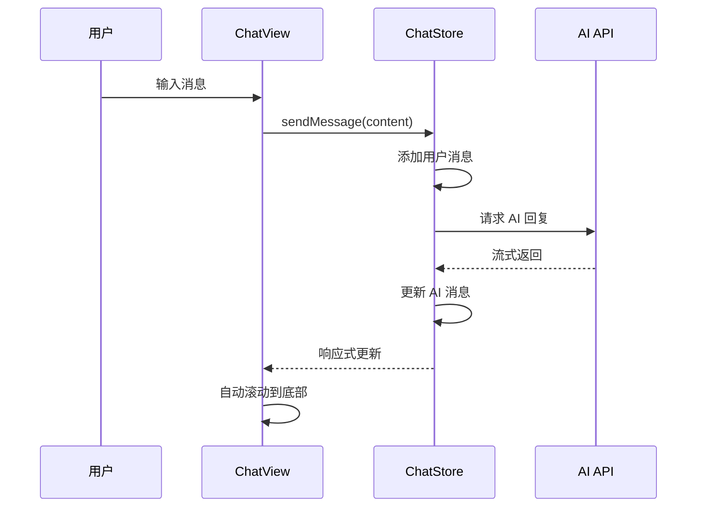

# AI 助手 Web 应用页面布局优化方案

> 版本：v1.0.0 | 日期：2026-07-23 | 技术栈：Vue 3 + win-design-ai + win-design-next + Tailwind CSS

---

## 一、设计目标

### 1.1 核心理念

参考 DeepSeek 和 Kimi 网页版的设计哲学，打造**极简、沉浸式**的对话体验：

- **呼吸感**：充足的留白，避免视觉拥挤
- **聚焦感**：对话内容居中展示，最大宽度限制
- **流畅感**：平滑的动画过渡，自然的交互反馈
- **响应式**：完美适配桌面端、平板、移动端

### 1.2 布局结构

```
┌─────────────────────────────────────────────────────────────┐
│  Header（顶部导航区）                                        │
│  - 模型切换                                                  │
│  - 新建对话                                                  │
│  - 设置入口                                                  │
├─────────────────────────────────────────────────────────────┤
│                                                             │
│  Main（核心对话区）                                          │
│  - 消息流居中展示                                            │
│  - 最大宽度 768px                                            │
│  - 自动滚动                                                  │
│                                                             │
│  ┌─────────────────────────────────────────────────────┐   │
│  │  wi-bubble-list（消息列表）                          │   │
│  │  - 用户消息：右对齐，主色调背景                       │   │
│  │  - AI 消息：左对齐，带头像，支持 Markdown             │   │
│  │  - 思考过程：wi-thinking 组件                        │   │
│  └─────────────────────────────────────────────────────┘   │
│                                                             │
├─────────────────────────────────────────────────────────────┤
│  Footer（底部输入区）                                        │
│  - wi-sender 输入框                                          │
│  - 模型切换下拉                                              │
│  - 语音输入（可选）                                          │
│  - 最大宽度 768px，居中                                      │
└─────────────────────────────────────────────────────────────┘
```

---

## 二、组件选型与配置

### 2.1 核心组件选型

| 功能区域 | 组件 | 来源 | 说明 |
|---------|------|------|------|
| 消息气泡 | `wi-bubble` | win-design-ai | 支持 Markdown、打字效果、悬停操作 |
| 消息列表 | `wi-bubble-list` | win-design-ai | 自动滚动、虚拟滚动优化 |
| 输入框 | `wi-sender` | win-design-ai | 支持模型切换、语音、自定义操作区 |
| 会话列表 | `wi-conversations` | win-design-ai | 左侧会话管理（可选） |
| 思考过程 | `wi-thinking` | win-design-ai | 展示 AI 思考链路 |
| 布局容器 | `w-layout` | win-design-next | 页面整体布局 |
| 按钮 | `w-button` | win-design-next | 操作按钮 |
| 下拉菜单 | `w-dropdown` | win-design-next | 模型切换 |

### 2.2 关键组件配置

#### wi-bubble 配置

```vue
<wi-bubble
  :content="message.content"
  :placement="message.role === 'user' ? 'end' : 'start'"
  :avatar="message.role === 'user' ? userAvatar : aiAvatar"
  :is-markdown="message.role === 'assistant'"
  :typing="message.isStreaming"
  variant="filled"
  shape="round"
  max-width="600px"
/>
```

**关键属性说明**：
- `placement`：用户消息 `end`（右对齐），AI 消息 `start`（左对齐）
- `is-markdown`：AI 消息开启 Markdown 渲染
- `typing`：流式输出时开启打字效果
- `variant`：`filled` 填充样式，`shadow` 阴影样式
- `shape`：`round` 圆角，`corner` 直角

#### wi-sender 配置

```vue
<wi-sender
  v-model="inputText"
  v-model:model="currentModel"
  :models="modelList"
  :loading="isStreaming"
  :auto-size="{ minRows: 1, maxRows: 6 }"
  placeholder="输入消息，Enter 发送..."
  clearable
  @submit="handleSubmit"
  @cancel="handleStop"
  @model-change="handleModelChange"
/>
```

**关键属性说明**：
- `v-model:model`：当前选中的模型
- `models`：模型列表，格式 `[{ label, value, description }]`
- `loading`：流式输出时显示停止按钮
- `auto-size`：输入框自适应高度
- `clearable`：显示清空按钮

#### wi-thinking 配置

```vue
<wi-thinking
  v-model="thinkingExpanded"
  :content="thinkingContent"
  :status="thinkingStatus"
  auto-collapse
  content-max-height="300px"
/>
```

**关键属性说明**：
- `status`：`start` | `thinking` | `end` | `error` | `cancel`
- `auto-collapse`：思考完成后自动收起
- `content-max-height`：内容区最大高度

---

## 三、页面结构代码

### 3.1 主页面 ChatView.vue

```vue
<script setup lang="ts">
/**
 * 对话主页面
 * @description 极简沉浸式对话布局，参考 DeepSeek/Kimi 设计
 */
import { computed, ref } from 'vue';
import { WiBubbleList, WiSender } from 'win-design-ai';
import type { SenderModelOption } from 'win-design-ai';

import { useChatStore } from '@/stores/chatStore';
import { useModelStore } from '@/stores/modelStore';

const chatStore = useChatStore();
const modelStore = useModelStore();

/** 输入内容 */
const inputText = ref('');

/** 当前选中的模型 */
const currentModel = computed({
  get: () => modelStore.activeModel?.id ?? '',
  set: (value) => modelStore.setActiveModel(value as string),
});

/** 模型列表 */
const modelList = computed<SenderModelOption[]>(() =>
  modelStore.modelConfigs.map((m) => ({
    label: m.name,
    value: m.id,
    description: m.provider,
  }))
);

/** 是否正在流式生成 */
const isStreaming = computed(() => chatStore.isStreaming);

/** 消息列表（转换为 wi-bubble-list 格式） */
const messages = computed(() =>
  chatStore.currentMessages.map((msg) => ({
    id: msg.id,
    role: msg.role,
    content: msg.content,
    isStreaming: isStreaming.value && msg.id === chatStore.currentMessages.at(-1)?.id,
  }))
);

/** 提交消息 */
function handleSubmit(value: string): void {
  chatStore.sendMessage(value);
  inputText.value = '';
}

/** 停止生成 */
function handleStop(): void {
  chatStore.stopGeneration();
}

/** 模型切换 */
function handleModelChange(value: string | number): void {
  modelStore.setActiveModel(value as string);
}
</script>

<template>
  <div class="chat-view">
    <!-- 顶部导航区 -->
    <header class="chat-header">
      <div class="header-content">
        <!-- 左侧：Logo + 标题 -->
        <div class="header-left">
          <span class="logo">🤖</span>
          <span class="title">AI 助手</span>
        </div>

        <!-- 右侧：操作按钮 -->
        <div class="header-right">
          <w-button type="primary" @click="chatStore.createConversation">
            新建对话
          </w-button>
          <w-button @click="$router.push({ name: 'Settings' })">
            设置
          </w-button>
        </div>
      </div>
    </header>

    <!-- 核心对话区 -->
    <main class="chat-main">
      <div class="chat-container">
        <!-- 消息列表 -->
        <wi-bubble-list
          :items="messages"
          class="message-list"
          auto-scroll
        >
          <!-- 自定义用户消息 -->
          <template #user="{ item }">
            <wi-bubble
              :content="item.content"
              placement="end"
              variant="filled"
              shape="round"
              max-width="600px"
            />
          </template>

          <!-- 自定义 AI 消息 -->
          <template #assistant="{ item }">
            <wi-bubble
              :content="item.content"
              placement="start"
              avatar="/icons/ai-avatar.svg"
              :is-markdown="true"
              :typing="item.isStreaming"
              variant="borderless"
              shape="round"
              max-width="600px"
            />
          </template>
        </wi-bubble-list>

        <!-- 空状态 -->
        <div v-if="messages.length === 0" class="empty-state">
          <div class="empty-icon">💬</div>
          <div class="empty-title">开始对话</div>
          <div class="empty-desc">输入消息开始与 AI 助手交流</div>
        </div>
      </div>
    </main>

    <!-- 底部输入区 -->
    <footer class="chat-footer">
      <div class="footer-content">
        <wi-sender
          v-model="inputText"
          v-model:model="currentModel"
          :models="modelList"
          :loading="isStreaming"
          :auto-size="{ minRows: 1, maxRows: 6 }"
          placeholder="输入消息，Enter 发送..."
          clearable
          @submit="handleSubmit"
          @cancel="handleStop"
          @model-change="handleModelChange"
        />
      </div>
    </footer>
  </div>
</template>

<style lang="scss" scoped>
/* 主容器：全屏高度，flex 纵向布局 */
.chat-view {
  display: flex;
  flex-direction: column;
  height: 100vh;
  background: var(--bg);
}

/* 顶部导航区 */
.chat-header {
  flex-shrink: 0;
  border-bottom: 1px solid var(--border);
  background: var(--bg);
  backdrop-filter: blur(8px);
}

.header-content {
  display: flex;
  align-items: center;
  justify-content: space-between;
  max-width: 1200px;
  height: 56px;
  margin: 0 auto;
  padding: 0 1.5rem;
}

.header-left {
  display: flex;
  align-items: center;
  gap: 0.75rem;
}

.logo {
  font-size: 1.5rem;
}

.title {
  font-size: 1.125rem;
  font-weight: 600;
  color: var(--text-h);
}

.header-right {
  display: flex;
  align-items: center;
  gap: 0.75rem;
}

/* 核心对话区 */
.chat-main {
  flex: 1;
  overflow: hidden;
  display: flex;
  justify-content: center;
}

.chat-container {
  width: 100%;
  max-width: 768px;
  height: 100%;
  display: flex;
  flex-direction: column;
  padding: 1.5rem;
}

.message-list {
  flex: 1;
  overflow-y: auto;
}

/* 空状态 */
.empty-state {
  display: flex;
  flex-direction: column;
  align-items: center;
  justify-content: center;
  height: 100%;
  gap: 0.75rem;
  color: var(--text);
  opacity: 0.6;
}

.empty-icon {
  font-size: 3rem;
}

.empty-title {
  font-size: 1.25rem;
  font-weight: 600;
  color: var(--text-h);
}

.empty-desc {
  font-size: 0.875rem;
}

/* 底部输入区 */
.chat-footer {
  flex-shrink: 0;
  border-top: 1px solid var(--border);
  background: var(--bg);
  backdrop-filter: blur(8px);
}

.footer-content {
  max-width: 768px;
  margin: 0 auto;
  padding: 1rem 1.5rem;
}

/* 响应式适配 */
@media (max-width: 768px) {
  .header-content {
    padding: 0 1rem;
  }

  .chat-container {
    padding: 1rem;
  }

  .footer-content {
    padding: 0.75rem 1rem;
  }

  .title {
    display: none;
  }
}

@media (max-width: 480px) {
  .header-right {
    gap: 0.5rem;
  }
}
</style>
```

### 3.2 带侧边栏的完整布局（可选）

如果需要左侧会话列表，可以使用 `wi-conversations` 组件：

```vue
<script setup lang="ts">
import { WiConversations, WiBubbleList, WiSender } from 'win-design-ai';

const activeConversationId = ref('');

const conversations = computed(() =>
  chatStore.conversations.map((c) => ({
    key: c.id,
    label: c.title,
  }))
);
</script>

<template>
  <div class="chat-layout">
    <!-- 左侧会话列表 -->
    <aside class="sidebar">
      <wi-conversations
        :items="conversations"
        v-model:active-key="activeConversationId"
        @select="handleSelectConversation"
      />
    </aside>

    <!-- 右侧主内容 -->
    <main class="main-content">
      <!-- ... 同上述 ChatView 结构 ... -->
    </main>
  </div>
</template>

<style lang="scss" scoped>
.chat-layout {
  display: flex;
  height: 100vh;
}

.sidebar {
  width: 260px;
  flex-shrink: 0;
  border-right: 1px solid var(--border);
  background: var(--bg);
}

.main-content {
  flex: 1;
  display: flex;
  flex-direction: column;
  min-width: 0;
}

/* 移动端侧边栏可收起 */
@media (max-width: 768px) {
  .sidebar {
    position: fixed;
    left: 0;
    top: 0;
    bottom: 0;
    z-index: 100;
    transform: translateX(-100%);
    transition: transform 0.3s ease;

    &.open {
      transform: translateX(0);
    }
  }
}
</style>
```

---

## 四、样式设计系统

### 4.1 CSS 变量主题

项目已使用 CSS 变量实现主题切换，关键变量：

```css
:root {
  /* 背景色 */
  --bg: #ffffff;
  --bg-secondary: #f5f5f5;
  
  /* 文字色 */
  --text: #333333;
  --text-h: #1a1a1a;
  --text-secondary: #666666;
  
  /* 边框色 */
  --border: #e5e5e5;
  
  /* 强调色 */
  --accent: #007bff;
  --accent-bg: #e7f3ff;
  --accent-border: #007bff;
  
  /* 代码块背景 */
  --code-bg: #f8f8f8;
}

/* 暗色主题 */
[data-theme="dark"] {
  --bg: #1a1a1a;
  --bg-secondary: #2a2a2a;
  --text: #e5e5e5;
  --text-h: #ffffff;
  --border: #3a3a3a;
  --code-bg: #2a2a2a;
}
```

### 4.2 间距系统

采用 8px 基础单位：

| 级别 | 值 | 用途 |
|------|-----|------|
| xs | 0.25rem (4px) | 图标间距 |
| sm | 0.5rem (8px) | 紧凑元素间距 |
| md | 0.75rem (12px) | 默认间距 |
| lg | 1rem (16px) | 区块间距 |
| xl | 1.5rem (24px) | 大区块间距 |
| 2xl | 2rem (32px) | 页面边距 |

### 4.3 响应式断点

```scss
// 移动端
@media (max-width: 480px) { ... }

// 平板
@media (max-width: 768px) { ... }

// 桌面
@media (max-width: 1024px) { ... }

// 大屏
@media (min-width: 1025px) { ... }
```

---

## 五、交互逻辑与状态管理

### 5.1 状态管理架构

```
stores/
├── chatStore.ts      # 对话状态：消息列表、会话管理、流式状态
├── modelStore.ts     # 模型状态：模型列表、当前模型
└── settingsStore.ts  # 设置状态：主题、快捷键等
```

### 5.2 核心交互流程



### 5.3 自动滚动逻辑

使用现有的 `useAutoScroll` composable：

```typescript
// composables/useAutoScroll.ts
export function useAutoScroll() {
  const containerRef = ref<HTMLElement | null>(null);
  const isAutoScroll = ref(true);

  function scrollToBottom() {
    if (!containerRef.value || !isAutoScroll.value) return;
    containerRef.value.scrollTop = containerRef.value.scrollHeight;
  }

  function handleScroll() {
    if (!containerRef.value) return;
    const { scrollTop, scrollHeight, clientHeight } = containerRef.value;
    isAutoScroll.value = scrollHeight - scrollTop - clientHeight < 50;
  }

  return {
    bindContainer: (el: HTMLElement | null) => { containerRef.value = el; },
    handleScroll,
    scrollToBottom,
  };
}
```

---

## 六、关键优化点

### 6.1 消息气泡优化

| 优化项 | 实现方式 |
|--------|----------|
| Markdown 渲染 | `wi-bubble` 的 `is-markdown` 属性 |
| 打字效果 | `wi-bubble` 的 `typing` 属性 |
| 代码高亮 | 集成 `highlight.js` |
| 悬停操作 | `wi-bubble` 的 `show-actions` 属性 |

### 6.2 输入框优化

| 优化项 | 实现方式 |
|--------|----------|
| 模型切换 | `wi-sender` 的 `models` 属性 |
| 自适应高度 | `auto-size` 属性 |
| 语音输入 | `allow-speech` 属性 |
| 快捷键 | `submit-type` 属性 |

### 6.3 性能优化

| 优化项 | 实现方式 |
|--------|----------|
| 虚拟滚动 | `wi-bubble-list` 内置支持 |
| 流式节流 | 使用 `useStreamThrottle` composable |
| 懒加载 | 消息按需渲染 |

---

## 七、实施步骤

### 阶段一：核心布局重构

1. 重构 `ChatView.vue`，采用新的三段式布局
2. 替换 `MessageList` 为 `wi-bubble-list`
3. 替换 `ChatInput` 为 `wi-sender`

### 阶段二：组件迁移

1. 迁移 `MessageItem` 逻辑到 `wi-bubble` 插槽
2. 迁移 `ThinkingBlock` 到 `wi-thinking`
3. 迁移 `ToolCallBlock` 到 `wi-thought-chain`

### 阶段三：样式优化

1. 实现响应式布局
2. 优化间距与留白
3. 添加过渡动画

### 阶段四：功能完善

1. 集成模型切换
2. 完善空状态
3. 优化移动端体验

---

## 八、风险点与注意事项

### ⚠️ 风险点

1. **组件兼容性**：`win-design-ai` 组件 API 可能与文档有差异，需实际测试验证
2. **样式覆盖**：`wi-bubble` 等组件的默认样式可能需要通过 `:deep()` 覆盖
3. **流式渲染**：`typing` 属性与现有流式逻辑的集成需要调试
4. **移动端适配**：侧边栏在移动端的交互需要额外处理

### 验证方法

1. 在浏览器控制台检查组件渲染是否正确
2. 测试流式输出时打字效果是否正常
3. 验证响应式布局在不同屏幕尺寸下的表现
4. 检查主题切换后样式是否正确应用

---

## 九、总结

本方案采用 `win-design-ai` 组件库重构页面布局，实现：

- ✅ 极简沉浸式对话体验
- ✅ 三段式清晰布局结构
- ✅ 响应式完美适配
- ✅ 组件化可维护架构
- ✅ 符合现代设计美学

下一步建议切换到 Code 模式进行实际代码实现。
