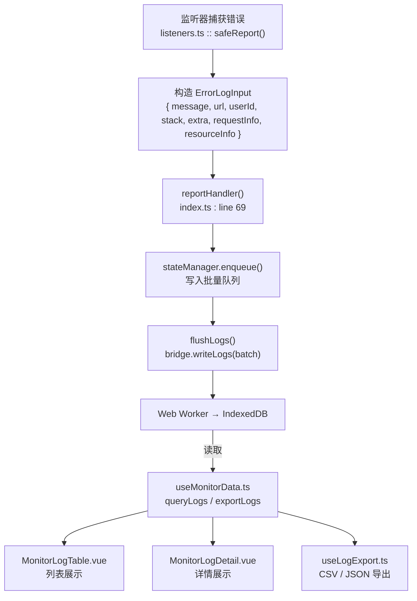
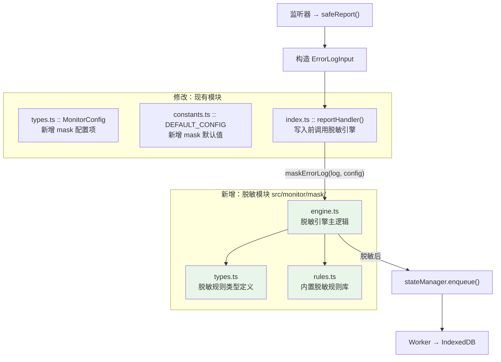

# MonitorSDK 数据脱敏方案

> **版本**：v1.0
> **日期**：2026-08-01
> **状态**：设计评审完成，待实现

---

## 目录

- [MonitorSDK 数据脱敏方案](#monitorsdk-数据脱敏方案)
  - [目录](#目录)
  - [1. 背景与目标](#1-背景与目标)
    - [目标](#目标)
  - [2. 数据流与敏感字段分析](#2-数据流与敏感字段分析)
    - [当前数据流（关键路径）](#当前数据流关键路径)
    - [敏感字段清单](#敏感字段清单)
  - [3. 核心设计决策](#3-核心设计决策)
  - [4. 架构设计](#4-架构设计)
  - [5. 目录与文件结构](#5-目录与文件结构)
  - [6. 类型定义](#6-类型定义)
    - [`mask/types.ts` — 脱敏规则类型](#masktypests--脱敏规则类型)
    - [`types.ts` — MonitorConfig 新增 mask 字段](#typests--monitorconfig-新增-mask-字段)
  - [7. 内置脱敏规则库](#7-内置脱敏规则库)
    - [`mask/rules.ts`](#maskrulests)
  - [8. 脱敏引擎实现](#8-脱敏引擎实现)
    - [`mask/engine.ts`](#maskenginets)
  - [9. MonitorSDK 集成](#9-monitorsdk-集成)
    - [`index.ts` 修改点](#indexts-修改点)
    - [`constants.ts` 修改点](#constantsts-修改点)
    - [`types.ts` 修改点](#typests-修改点)
  - [10. 配置示例](#10-配置示例)
    - [最小配置（仅开启内置常用规则）](#最小配置仅开启内置常用规则)
    - [全局脱敏（最安全）](#全局脱敏最安全)
    - [精细控制](#精细控制)
  - [11. 内置规则与字段推荐映射](#11-内置规则与字段推荐映射)
  - [12. 扩展机制](#12-扩展机制)
    - [自定义规则注入](#自定义规则注入)
    - [使用示例](#使用示例)
  - [13. 边界情况与注意事项](#13-边界情况与注意事项)
  - [14. 实现步骤](#14-实现步骤)
  - [15. 风险点](#15-风险点)

---

## 1. 背景与目标

MonitorSDK 当前在日志上报过程中未对敏感数据进行脱敏处理。`message`、`url`、`userId`、`requestInfo.url` 等字段可能包含用户手机号、身份证号、邮箱、Token 等敏感信息，存在数据泄露风险。

### 目标

- 提供**可配置、可扩展**的数据脱敏机制
- **写入前脱敏**，确保落盘数据即安全
- 内置常见敏感数据的脱敏规则（手机号、身份证、邮箱、Token 等）
- 支持用户自定义规则，适配业务特殊场景
- 默认关闭，保持向后兼容

---

## 2. 数据流与敏感字段分析

### 当前数据流（关键路径）



### 敏感字段清单

| 字段路径 | 来源 | 敏感风险 | 示例 |
|----------|------|----------|------|
| `message` | JS Error / 手动上报 | 可能包含用户输入的数据 | `"搜索关键词 '张三的身份证号 110101199001011234' 未找到结果"` |
| `url` | `location.href` | URL 可能含 token、session 等 query 参数 | `"https://app.com/page?token=eyJhb..."` |
| `userId` | `getUserIdentity()` | 用户标识符，需按业务需求决定是否脱敏 | `"zhangsan"` / `"13800138000"` |
| `requestInfo.url` | fetch 劫持 | API 请求 URL 可能含敏感参数 | `"/api/user?phone=13800138000"` |
| `requestInfo.statusText` | fetch 响应 | 少数情况服务端状态文本可能泄露信息 | `"Invalid phone 13800138000"` |
| `resourceInfo.src` | 资源加载错误 | 资源 URL 可能含 token | `"https://cdn.com/img?token=abc"` |
| `resourceInfo.outerHTML` | 资源加载错误 | HTML 片段可能含内联数据 | `""` |
| `extra` | 业务代码手动上报 | 完全由调用方控制，任意内容均可 | `{ input: '用户输入的手机号 138...' }` |
| `stack` | Error 堆栈 | 通常不敏感，但可能含文件名路径 | 风险较低 |
| `pageSnapshot.title` | 页面标题 | 极少数情况含个人信息 | 风险较低 |

---

## 3. 核心设计决策

| 决策点 | 选择 | 理由 |
|--------|------|------|
| **脱敏时机** | **写入前脱敏**（SDK 层 `reportHandler` 中） | 数据落盘即安全；一次处理，所有消费方受益；符合数据最小化原则 |
| **脱敏策略** | 正则匹配 + 函数替换，可配置、可扩展 | 兼顾内置规则的便捷性和业务定制的灵活性 |
| **规则粒度** | 按字段 + 按模式组合配置 | 不同字段可能需要不同规则（如 `url` 只脱敏 query 参数，`message` 全面脱敏） |
| **性能** | 同步执行，仅处理字符串字段 | 脱敏操作发生在批量刷新之前，不阻塞主线程关键路径；正则匹配在短字符串上开销极小 |
| **开关** | 默认关闭，通过配置显式开启 | 保持向后兼容；写入脱敏不可逆，需用户明确确认后才生效 |

---

## 4. 架构设计



---

## 5. 目录与文件结构

```
src/monitor/
├── mask/                          # 新增：脱敏子模块
│   ├── types.ts                   # 脱敏规则类型定义
│   ├── rules.ts                   # 内置脱敏规则库
│   └── engine.ts                  # 脱敏引擎（应用规则到 ErrorLogInput）
├── types.ts                       # 修改：MonitorConfig 新增 mask 字段
├── constants.ts                   # 修改：DEFAULT_CONFIG 新增 mask 默认值
├── index.ts                       # 修改：reportHandler 中集成脱敏调用
└── DOCUMENTATION.md               # 修改：更新数据脱敏章节
```

---

## 6. 类型定义

### `mask/types.ts` — 脱敏规则类型

```typescript
/**
 * 脱敏策略
 */
export const MASK_STRATEGY = {
  /** 替换为固定字符（如 ***) */
  REPLACE: 'replace',
  /** 保留首尾字符，中间替换为 *** */
  KEEP_ENDS: 'keep-ends',
  /** 完全移除 */
  REMOVE: 'remove',
  /** 自定义函数 */
  CUSTOM: 'custom',
} as const;

export type MaskStrategy = (typeof MASK_STRATEGY)[keyof typeof MASK_STRATEGY];

/**
 * 单条脱敏规则
 */
export interface MaskRule {
  /** 规则名称（用于调试和日志） */
  name: string;
  /** 匹配模式：正则表达式，必须带 g 标志 */
  pattern: RegExp;
  /** 脱敏策略 */
  strategy: MaskStrategy;
  /** 
   * REPLACE: 替换字符串（默认 '***'）
   * KEEP_ENDS: 保留首尾字符数 { head: number, tail: number }
   * CUSTOM: 自定义替换函数 (match, ...captures) => maskedString
   */
  replaceValue?:
    | string
    | { head: number; tail: number }
    | ((match: string, ...captures: string[]) => string);
  /** 规则是否启用 */
  enabled?: boolean;
}

/**
 * 可脱敏的 ErrorLog 字段（支持嵌套路径）
 */
export type ErrorLogMaskableField =
  | 'message'
  | 'url'
  | 'userId'
  | 'stack'
  | 'requestInfo.url'
  | 'requestInfo.statusText'
  | 'resourceInfo.src'
  | 'resourceInfo.outerHTML';

/**
 * 字段级脱敏配置
 */
export interface FieldMaskConfig {
  /** 要脱敏的字段路径 */
  field: ErrorLogMaskableField | ErrorLogMaskableField[];
  /** 应用的规则名称列表 */
  rules: string[];
}

/**
 * 完整的脱敏配置（挂载在 MonitorConfig 下）
 */
export interface MaskConfig {
  /** 是否启用脱敏（默认 false） */
  enabled: boolean;
  /** 字段级脱敏规则配置 */
  fields: FieldMaskConfig[];
  /** 全局规则（应用于所有可脱敏字段） */
  globalRules: string[];
}
```

### `types.ts` — MonitorConfig 新增 mask 字段

```typescript
import type { MaskConfig } from './mask/types';

export interface MonitorConfig {
  // ... 现有字段保持不变 ...

  /** 数据脱敏配置 */
  mask: MaskConfig;
}
```

---

## 7. 内置脱敏规则库

### `mask/rules.ts`

```typescript
import type { MaskRule } from './types';
import { MASK_STRATEGY } from './types';

/**
 * 内置脱敏规则注册表
 */
export const BUILTIN_MASK_RULES: Record<string, MaskRule> = {
  /** 手机号码（中国大陆）：保留前3后4 */
  phone: {
    name: 'phone',
    pattern: /1[3-9]\d{9}/g,
    strategy: MASK_STRATEGY.KEEP_ENDS,
    replaceValue: { head: 3, tail: 4 },
  },

  /** 身份证号（18位）：保留前4后4 */
  idCard: {
    name: 'idCard',
    pattern: /\d{6}(19|20)\d{2}(0[1-9]|1[0-2])(0[1-9]|[12]\d|3[01])\d{3}[\dXx]/g,
    strategy: MASK_STRATEGY.KEEP_ENDS,
    replaceValue: { head: 4, tail: 4 },
  },

  /** 电子邮箱：保留首字符和域名 */
  email: {
    name: 'email',
    pattern: /[a-zA-Z0-9._%+-]+@[a-zA-Z0-9.-]+\.[a-zA-Z]{2,}/g,
    strategy: MASK_STRATEGY.CUSTOM,
    replaceValue: (match: string) => {
      const atIndex = match.indexOf('@');
      if (atIndex <= 1) return match;
      const local = match.substring(0, atIndex);
      const domain = match.substring(atIndex);
      return local[0] + '***' + domain;
    },
  },

  /** JWT Token / Bearer Token */
  token: {
    name: 'token',
    pattern: /(eyJ[a-zA-Z0-9_-]{10,}\.[a-zA-Z0-9_-]{10,}\.[a-zA-Z0-9_-]{10,})/g,
    strategy: MASK_STRATEGY.REPLACE,
    replaceValue: '[TOKEN]',
  },

  /** URL 查询参数中的 token / authorization / secret / password 等 */
  urlSecretParam: {
    name: 'urlSecretParam',
    pattern: /([?&](token|authorization|secret|password|apiKey|api_key|apikey|accessToken|access_token|refreshToken|refresh_token|sessionId|session_id|credential))=([^&\s#]+)/gi,
    strategy: MASK_STRATEGY.CUSTOM,
    replaceValue: (_match: string, prefix: string, paramName: string) => {
      return `${prefix}${paramName}=***`;
    },
  },

  /** IPv4 地址：保留前两段 */
  ipv4: {
    name: 'ipv4',
    pattern: /\b(\d{1,3})\.(\d{1,3})\.(\d{1,3})\.(\d{1,3})\b/g,
    strategy: MASK_STRATEGY.CUSTOM,
    replaceValue: (_match: string, a: string, b: string) => {
      return `${a}.${b}.*.*`;
    },
  },

  /** 银行卡号（16-19位数字）：保留后4位 */
  bankCard: {
    name: 'bankCard',
    pattern: /\b\d{16,19}\b/g,
    strategy: MASK_STRATEGY.KEEP_ENDS,
    replaceValue: { head: 0, tail: 4 },
  },
};
```

---

## 8. 脱敏引擎实现

### `mask/engine.ts`

```typescript
import type { ErrorLogInput } from '../types';
import type { MaskConfig, MaskRule, FieldMaskConfig } from './types';
import { MASK_STRATEGY } from './types';
import { BUILTIN_MASK_RULES } from './rules';

// ---- 工具函数 ----

/** 获取嵌套字段值（如 'requestInfo.url'） */
function getFieldValue(log: ErrorLogInput, fieldPath: string): unknown {
  const parts = fieldPath.split('.');
  // eslint-disable-next-line @typescript-eslint/no-explicit-any
  let current: any = log;
  for (const part of parts) {
    if (current === null || current === undefined) return undefined;
    current = current[part];
  }
  return current;
}

/** 设置嵌套字段值 */
function setFieldValue(log: ErrorLogInput, fieldPath: string, value: unknown): void {
  const parts = fieldPath.split('.');
  const lastPart = parts.pop()!;
  // eslint-disable-next-line @typescript-eslint/no-explicit-any
  let current: any = log;
  for (const part of parts) {
    if (current === null || current === undefined) return;
    current = current[part];
  }
  if (current && typeof current === 'object') {
    current[lastPart] = value;
  }
}

/** 应用单条脱敏规则到字符串 */
function applyRule(value: string, rule: MaskRule): string {
  const { pattern, strategy, replaceValue } = rule;

  switch (strategy) {
    case MASK_STRATEGY.REPLACE: {
      const replacement = typeof replaceValue === 'string' ? replaceValue : '***';
      return value.replace(pattern, replacement);
    }

    case MASK_STRATEGY.KEEP_ENDS: {
      const opts = replaceValue as { head: number; tail: number } | undefined;
      const head = opts?.head ?? 3;
      const tail = opts?.tail ?? 4;
      return value.replace(pattern, (match) => {
        if (match.length <= head + tail) return '*'.repeat(match.length);
        return match.slice(0, head) + '***' + match.slice(-tail);
      });
    }

    case MASK_STRATEGY.REMOVE:
      return value.replace(pattern, '');

    case MASK_STRATEGY.CUSTOM: {
      const fn = replaceValue as ((match: string, ...captures: string[]) => string) | undefined;
      if (typeof fn !== 'function') return value;
      return value.replace(pattern, (...args) => {
        // args: [match, ...captures, offset, fullString]
        return fn(args[0], ...(args.slice(1, args.length - 2) as string[]));
      });
    }

    default:
      return value;
  }
}

/** 对 ErrorLogInput 的指定字段应用脱敏规则（原地修改） */
function maskField(log: ErrorLogInput, fieldPath: string, rule: MaskRule): void {
  const value = getFieldValue(log, fieldPath);
  if (typeof value !== 'string' || value.length === 0) return;

  const masked = applyRule(value, rule);
  if (masked !== value) {
    setFieldValue(log, fieldPath, masked);
  }
}

// ---- 公开 API ----

/**
 * 脱敏引擎：对 ErrorLogInput 应用所有配置的脱敏规则
 *
 * @param log - 待脱敏的日志对象（原地修改）
 * @param config - 脱敏配置
 * @param customRules - 用户自定义规则（可选，会合并到内置规则中）
 */
export function maskErrorLog(
  log: ErrorLogInput,
  config: MaskConfig,
  customRules?: Record<string, MaskRule>,
): void {
  if (!config.enabled) return;

  // 合并内置规则与自定义规则
  const allRules = new Map(Object.entries({ ...BUILTIN_MASK_RULES, ...customRules }));

  // 1. 应用字段级规则
  for (const fieldConfig of config.fields) {
    const fieldNames = Array.isArray(fieldConfig.field)
      ? fieldConfig.field
      : [fieldConfig.field];

    for (const fieldName of fieldNames) {
      for (const ruleName of fieldConfig.rules) {
        const rule = allRules.get(ruleName);
        if (rule) {
          maskField(log, fieldName, rule);
        }
      }
    }
  }

  // 2. 应用全局规则
  const globalFields = [
    'message', 'url', 'userId', 'stack',
    'requestInfo.url', 'requestInfo.statusText',
    'resourceInfo.src', 'resourceInfo.outerHTML',
  ] as const;

  for (const ruleName of config.globalRules) {
    const rule = allRules.get(ruleName);
    if (!rule) continue;

    for (const field of globalFields) {
      maskField(log, field, rule);
    }
  }
}
```

---

## 9. MonitorSDK 集成

### `index.ts` 修改点

在 `reportHandler` 函数中，`enqueue` 之前插入脱敏调用：

```typescript
// 新增 import
import { maskErrorLog } from './mask/engine';

/** 上报日志到批量队列 */
function reportHandler(log: ErrorLogInput): void {
  if (!stateManager.isEnabled()) return;

  const cfg = getConfig();

  // ★ 新增：脱敏处理（写入前）
  if (cfg.mask?.enabled) {
    safeExecutor.run(() => {
      maskErrorLog(log, cfg.mask);
    }, 'mask-log');
  }

  if (cfg.debug || sessionStorage.getItem(CONSOLE_OUTPUT_KEY) === 'true') {
    console.error(`[MonitorSDK] ${log.type}: ${log.message}`, log.stack ?? '', log);
  }

  safeExecutor.run(() => {
    stateManager.enqueue(log);
    scheduleFlush();
  }, 'report-handler');
}
```

> **注意**：脱敏在 debug 控制台输出**之前**执行，确保即使在调试模式下也不会泄露敏感信息。

### `constants.ts` 修改点

在 `DEFAULT_CONFIG` 中新增 `mask` 默认值：

```typescript
export const DEFAULT_CONFIG: MonitorConfig = {
  // ... 现有字段保持不变 ...
  mask: {
    enabled: false,   // 默认关闭，需显式开启
    fields: [],
    globalRules: [],
  },
};
```

### `types.ts` 修改点

在 `MonitorConfig` 接口中新增 `mask` 字段（见第 6 节）。

---

## 10. 配置示例

### 最小配置（仅开启内置常用规则）

```typescript
import { monitorSDK } from '@/monitor';

monitorSDK.init({
  mask: {
    enabled: true,
    fields: [
      {
        field: ['message', 'url', 'requestInfo.url'],
        rules: ['phone', 'idCard', 'email', 'token', 'urlSecretParam'],
      },
    ],
    globalRules: [],
  },
});
```

### 全局脱敏（最安全）

```typescript
monitorSDK.init({
  mask: {
    enabled: true,
    fields: [],
    globalRules: ['phone', 'idCard', 'token', 'urlSecretParam', 'email'],
  },
});
```

### 精细控制

```typescript
monitorSDK.init({
  mask: {
    enabled: true,
    fields: [
      {
        field: 'message',
        rules: ['phone', 'idCard', 'email', 'bankCard'],
      },
      {
        field: ['url', 'requestInfo.url', 'resourceInfo.src'],
        rules: ['token', 'urlSecretParam'],
      },
      {
        field: 'userId',
        rules: ['phone'],   // 如果 userId 可能是手机号
      },
    ],
    globalRules: [],
  },
});
```

---

## 11. 内置规则与字段推荐映射

| 规则名 | 推荐应用字段 | 说明 |
|--------|-------------|------|
| `phone` | `message`, `url`, `requestInfo.url` | 手机号是最常见的敏感数据 |
| `idCard` | `message` | 身份证号 |
| `email` | `message` | 邮箱地址 |
| `token` | `url`, `requestInfo.url`, `resourceInfo.src` | JWT token，URL 中出现概率高 |
| `urlSecretParam` | `url`, `requestInfo.url`, `resourceInfo.src` | URL 中的 token/secret 参数 |
| `ipv4` | `message` | IPv4 地址，按需开启 |
| `bankCard` | `message` | 银行卡号，医疗场景不常见，按需 |

---

## 12. 扩展机制

### 自定义规则注入

在 `MonitorConfig.mask` 中新增 `customRules` 字段：

```typescript
export interface MaskConfig {
  enabled: boolean;
  fields: FieldMaskConfig[];
  globalRules: string[];
  /** 用户自定义的额外规则（会合并到内置规则中，同名覆盖） */
  customRules?: Record<string, MaskRule>;
}
```

### 使用示例

```typescript
import { monitorSDK } from '@/monitor';
import type { MaskRule } from '@/monitor/mask/types';
import { MASK_STRATEGY } from '@/monitor/mask/types';

const medicalRecordRule: MaskRule = {
  name: 'medicalRecordNo',
  pattern: /MR\d{10,}/g,
  strategy: MASK_STRATEGY.KEEP_ENDS,
  replaceValue: { head: 2, tail: 4 },
};

monitorSDK.init({
  mask: {
    enabled: true,
    fields: [
      { field: 'message', rules: ['medicalRecordNo', 'phone', 'idCard'] },
    ],
    globalRules: [],
    customRules: { medicalRecordRule },
  },
});
```

---

## 13. 边界情况与注意事项

| 边界情况 | 处理方案 |
|----------|----------|
| **脱敏后数据不可逆** | 默认 `mask.enabled = false`；文档中明确说明开启后历史数据不会回溯脱敏 |
| **正则 ReDoS 风险** | 内置规则的正则均不包含嵌套量词，经过安全审查；自定义规则在文档中提醒风险 |
| **性能影响** | 脱敏在入队前同步执行，单次处理 < 10ms（7 条规则 × 5-8 个字段） |
| **Worker 模式兼容** | 脱敏在主线程完成后再传给 Worker，Worker 无需感知脱敏逻辑 |
| **MonitorView 显示** | 写入前已脱敏，MonitorView 读到的就是脱敏后数据，无需视图层额外处理 |
| **导出文件** | CSV/JSON 导出自动包含脱敏后数据，无需额外处理 |
| **safeExecutor 容错** | 脱敏逻辑被 `safeExecutor.run()` 包裹，异常不会泄漏到全局 |
| **`null` / `undefined` 字段** | `getFieldValue()` 对不存在的嵌套字段返回 `undefined`，跳过脱敏 |

---

## 14. 实现步骤

| 步骤 | 文件 | 操作 |
|------|------|------|
| 1 | `src/monitor/mask/types.ts` | 新增：脱敏规则类型定义 |
| 2 | `src/monitor/mask/rules.ts` | 新增：7 条内置脱敏规则 |
| 3 | `src/monitor/mask/engine.ts` | 新增：脱敏引擎主逻辑 |
| 4 | `src/monitor/types.ts` | 修改：`MonitorConfig` 新增 `mask` 字段 |
| 5 | `src/monitor/constants.ts` | 修改：`DEFAULT_CONFIG` 新增 `mask` 默认值 |
| 6 | `src/monitor/index.ts` | 修改：`reportHandler` 中集成 `maskErrorLog()` |
| 7 | `src/monitor/DOCUMENTATION.md` | 修改：更新"9. 安全与权限 → 数据脱敏"章节 |

---

## 15. 风险点

1. **兼容性风险**：`MonitorConfig` 新增 `mask` 字段后，所有引用 `MonitorConfig` 类型的位置需要确保类型兼容。由于新增的是可选字段且有默认值，现有调用方无需修改。

2. **正则性能风险**：`idCard` 和 `email` 的正则较复杂，在大量短字符串上连续执行可能有微小性能开销。建议集成后通过 `performance.now()` 埋点验证单次 `maskErrorLog()` 耗时。

3. **extra 字段脱敏**：当前方案未处理 `extra` 字段（因为其值是 `Record<string, unknown>`，非固定结构）。如需要，可在后续迭代中增加对 `extra` 对象内字符串值的递归脱敏，但需注意避免循环引用。
