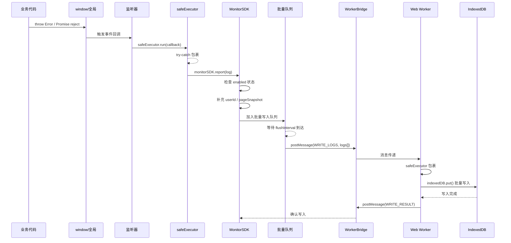

# 前端全局监控 SDK 架构设计方案

> **项目**：winning-webui-mras-aima（指标助手）
> **技术栈**：Vue 3.5 + TypeScript 6.0 + Vite 8 + Pinia + Vue Router 4 + Vuetify 4 + Tailwind CSS 4
> **日期**：2026-07-27

---

## 一、设计目标

| 目标 | 说明 |
|------|------|
| **无侵入** | 业务代码零改动，仅通过全局自动监听完成捕获 |
| **易插拔** | `enable()`/`disable()` API 随时开关，关闭后完全释放资源 |
| **绝对容错** | 监控自身任何异常绝不抛出到全局，不导致业务中断/白屏 |
| **性能优先** | IndexedDB 写操作委托给 Web Worker，主线程零阻塞 |

---

## 二、整体架构

```
┌─────────────────────────────────────────────────────────────┐
│                        Main Thread                           │
│                                                              │
│  ┌───────────┐  ┌───────────┐  ┌───────────┐  ┌─────────┐  │
│  │ onerror   │  │ unhandled │  │ resource  │  │ fetch   │  │
│  │ listener  │  │ rejection │  │  error    │  │ hijack  │  │
│  └─────┬─────┘  └─────┬─────┘  └─────┬─────┘  └────┬────┘  │
│        │              │              │             │        │
│        └──────────┬───┴──────────────┴─────────────┘        │
│                   ▼                                          │
│          ┌─────────────────┐                                 │
│          │  safeExecutor   │  ← 所有回调经 try-catch 包裹    │
│          └────────┬────────┘                                 │
│                   ▼                                          │
│          ┌─────────────────┐                                 │
│          │  MonitorSDK     │  ← 统一入口，检查 enable/disable │
│          │  .report(log)   │                                 │
│          └────────┬────────┘                                 │
│                   │ postMessage (Transferable)                │
│                   ▼                                          │
│          ┌─────────────────┐                                 │
│          │  WorkerBridge   │  ← 与 Web Worker 双向通信       │
│          └────────┬────────┘                                 │
└───────────────────┼──────────────────────────────────────────┘
                    │
┌───────────────────┼──────────────────────────────────────────┐
│                   ▼               Web Worker                  │
│          ┌─────────────────┐                                 │
│          │  WorkerEntry    │  ← 消息路由，safeExecutor 包裹   │
│          └────────┬────────┘                                 │
│                   ▼                                          │
│          ┌─────────────────┐                                 │
│          │  IndexedDB      │  ← idb 库封装，CRUD + 清理      │
│          │  (DB: __monitor) │                                 │
│          └────────┬────────┘                                 │
│                   ▼                                          │
│          ┌─────────────────┐                                 │
│          │  GarbageCollect │  ← 定期清理（过期/FIFO）        │
│          └─────────────────┘                                 │
└──────────────────────────────────────────────────────────────┘
```

### 关键设计决策

| 决策 | 选择 | 理由 |
|------|------|------|
| **IndexedDB 封装库** | `idb` (Jake Archibald) | ~1.5KB，Promise 风格 API，社区广泛使用，ISC 协议（功能等价 MIT） |
| **Worker 策略** | 主线程监听 + Worker 写库 | 监听必须访问 `window`/DOM；写库可在 Worker 完成，避免阻塞 |
| **fetch 监控方式** | 全局劫持 `window.fetch` | 项目使用原生 fetch，非 XHR；仅记录失败请求 |
| **日志上限** | 1000 条 或 50MB | 按 FIFO 淘汰 + 7 天过期自动清理 |

---

## 三、目录结构

```
src/monitor/
├── index.ts                  # SDK 入口，导出 MonitorSDK 单例
├── types.ts                  # 所有 TypeScript 类型定义
├── constants.ts              # 常量（ErrorType 枚举、默认配置）
├── config.ts                 # 配置合并与校验
├── core/
│   ├── listeners.ts          # 全局监听器绑定/解绑
│   ├── safe-executor.ts      # 安全执行器（绝对容错核心）
│   └── state.ts              # 内部状态（enabled/disabled）
├── db/
│   ├── schema.ts             # IndexedDB 数据库 schema
│   ├── bridge.ts             # 主线程端 Worker 通信桥
│   ├── worker.ts             # Web Worker 入口文件
│   └── worker-db.ts          # Worker 内 IndexedDB 操作
├── components/
│   └── ErrorBoundary.vue     # Vue 3 错误边界组件
└── utils/
    ├── page-snapshot.ts      # 页面状态快照采集
    └── user-identity.ts      # 用户标识解析
```

---

## 四、核心模块设计

### 4.1 MonitorSDK（入口模块）

**文件**：[`src/monitor/index.ts`](src/monitor/index.ts)

对外暴露的 API：

```typescript
interface MonitorSDK {
  /** 初始化（自动调用，也可手动调用以覆盖默认配置） */
  init(config?: Partial<MonitorConfig>): void;
  /** 启用监控（绑定所有监听器、启动 Worker） */
  enable(): void;
  /** 禁用监控（移除所有监听器、终止 Worker、清理定时器） */
  disable(clearLogs?: boolean): void;
  /** 手动上报一条日志 */
  report(error: ErrorLogInput): void;
  /** 查询日志（异步，通过 Worker） */
  queryLogs(filter: QueryFilter): Promise<ErrorLog[]>;
  /** 导出所有日志为 JSON */
  exportLogs(): Promise<ErrorLog[]>;
  /** 清空所有日志 */
  clearLogs(): Promise<void>;
  /** 获取当前状态 */
  isEnabled(): boolean;
  /** 获取日志数量 */
  getLogCount(): Promise<number>;
}
```

**插件式安装**（在 [`main.ts`](src/main.ts) 中）：

```typescript
// src/main.ts
import { createApp } from 'vue';
import { monitorSDK } from '@/monitor';

const app = createApp(App);
// ... pinia, router, vuetify ...

// 一行初始化，零侵入
monitorSDK.init({
  userId: () => localStorage.getItem('hospital_user_id') ?? undefined,
  capturePageSnapshot: false,  // 可选，默认关闭
  debug: import.meta.env.DEV,
});

app.mount('#app');
```

### 4.2 配置管理

**文件**：[`src/monitor/config.ts`](src/monitor/config.ts)

```typescript
interface MonitorConfig {
  /** 是否启用（默认 true） */
  enabled: boolean;
  /** 用户标识获取函数 */
  userId: () => string | undefined;
  /** 是否捕获页面状态快照（默认 false，性能优化） */
  capturePageSnapshot: boolean;
  /** 数据库名称（默认 '__mras_aima_monitor_db__'） */
  dbName: string;
  /** 日志最大条数（默认 1000） */
  maxLogCount: number;
  /** 日志最大总大小，字节（默认 50MB） */
  maxLogSize: number;
  /** 日志过期天数（默认 7） */
  expireDays: number;
  /** 批量写入 debounce 时间，毫秒（默认 1000） */
  flushInterval: number;
  /** 批量写入最大条数（默认 50） */
  flushMaxCount: number;
  /** 是否开启 debug 日志输出到 console（默认 false） */
  debug: boolean;
  /** 错误类型白名单（默认全部捕获） */
  captureTypes: ErrorType[];
  /** fetch 监控的 URL 过滤（默认全部监控） */
  fetchUrlFilter: (url: string) => boolean;
}
```

### 4.3 监听器模块

**文件**：[`src/monitor/core/listeners.ts`](src/monitor/core/listeners.ts)

#### 4.3.1 JavaScript 运行时错误

```typescript
// window.onerror — 捕获同步 JS 错误
window.addEventListener('error', (event: ErrorEvent) => {
  // 过滤：只处理 JS 错误，资源加载错误单独处理
  if (event.target !== window) return;
  safeExecutor.run(() => {
    monitorSDK.report({
      type: 'js_error',
      message: event.message,
      stack: event.error?.stack ?? '',
      timestamp: Date.now(),
      url: location.href,
      extra: {
        filename: event.filename,
        lineno: event.lineno,
        colno: event.colno,
      },
    });
  });
});
```

#### 4.3.2 未处理的 Promise 拒绝

```typescript
// unhandledrejection — 捕获异步 Promise 错误
window.addEventListener('unhandledrejection', (event: PromiseRejectionEvent) => {
  safeExecutor.run(() => {
    const reason = event.reason;
    monitorSDK.report({
      type: 'promise_rejection',
      message: reason instanceof Error ? reason.message : String(reason),
      stack: reason instanceof Error ? reason.stack ?? '' : '',
      timestamp: Date.now(),
      url: location.href,
    });
  });
});
```

#### 4.3.3 资源加载失败

```typescript
// 捕获阶段监听 — 捕获 <script>、<link>、 等资源加载失败
// 注：资源加载错误不冒泡，必须在捕获阶段监听
window.addEventListener('error', (event: Event) => {
  const target = event.target as HTMLElement;
  // 过滤：只处理资源元素，JS 错误已由 onerror 处理
  if (!target || !('src' in target || 'href' in target)) return;
  safeExecutor.run(() => {
    const tagName = target.tagName.toLowerCase();
    const src = (target as HTMLScriptElement).src
      || (target as HTMLLinkElement).href
      || (target as HTMLImageElement).src;
    monitorSDK.report({
      type: 'resource_error',
      message: `资源加载失败: ${tagName} — ${src}`,
      timestamp: Date.now(),
      url: location.href,
      resourceInfo: { tagName, src, outerHTML: target.outerHTML?.slice(0, 200) },
    });
  });
}, true); // 第三个参数 true = 捕获阶段
```

#### 4.3.4 fetch 请求异常

```typescript
// 劫持 window.fetch — 记录失败的请求
const originalFetch = window.fetch;

window.fetch = async function (...args: Parameters<typeof fetch>) {
  const startTime = Date.now();
  try {
    const response = await originalFetch(...args);
    // 仅记录 HTTP 4xx/5xx 错误响应
    if (!response.ok) {
      safeExecutor.run(() => {
        const [url, options] = args;
        monitorSDK.report({
          type: 'http_error',
          message: `HTTP ${response.status}: ${response.statusText}`,
          timestamp: Date.now(),
          url: location.href,
          requestInfo: {
            method: options?.method ?? 'GET',
            url: typeof url === 'string' ? url : url.toString(),
            status: response.status,
            statusText: response.statusText,
            duration: Date.now() - startTime,
          },
        });
      });
    }
    return response;
  } catch (error) {
    // 网络错误（fetch 本身抛出）
    safeExecutor.run(() => {
      const [url, options] = args;
      monitorSDK.report({
        type: 'http_error',
        message: `网络请求失败: ${error instanceof Error ? error.message : String(error)}`,
        timestamp: Date.now(),
        url: location.href,
        requestInfo: {
          method: options?.method ?? 'GET',
          url: typeof url === 'string' ? url : url.toString(),
          duration: Date.now() - startTime,
        },
      });
    });
    throw error; // 仍然抛出，不改变 fetch 原有行为
  }
};
```

### 4.4 安全执行器（绝对容错核心）

**文件**：[`src/monitor/core/safe-executor.ts`](src/monitor/core/safe-executor.ts)

```typescript
/**
 * 安全执行器 — 监控模块的"防爆墙"
 *
 * 所有监听回调、IndexedDB 操作、Worker 通信都必须经过 safeExecutor 包裹。
 * 任何内部异常都不会泄漏到全局作用域。
 */
export const safeExecutor = {
  /**
   * 安全执行同步函数
   * @returns 执行成功返回结果，失败返回 undefined
   */
  run<T>(fn: () => T): T | undefined {
    try {
      return fn();
    } catch (error) {
      this.logInternalError('safeExecute sync', error);
      return undefined;
    }
  },

  /**
   * 安全执行异步函数
   * @returns 总是 resolve 的 Promise（失败时返回 undefined）
   */
  async runAsync<T>(fn: () => Promise<T>): Promise<T | undefined> {
    try {
      return await fn();
    } catch (error) {
      this.logInternalError('safeExecute async', error);
      return undefined;
    }
  },

  /**
   * 安全包裹 Promise — 不会 reject，失败时静默返回默认值
   */
  async safePromise<T>(promise: Promise<T>, fallback: T): Promise<T> {
    try {
      return await promise;
    } catch (error) {
      this.logInternalError('safePromise', error);
      return fallback;
    }
  },

  /**
   * 内部错误日志（仅 debug 模式下输出到 console.debug，绝不用 console.error）
   */
  logInternalError(context: string, error: unknown): void {
    if (import.meta.env.DEV) {
      // eslint-disable-next-line no-console
      console.debug(`[MonitorSDK] 内部异常已捕获 [${context}]:`, error);
    }
    // 生产环境下完全静默，不输出任何内容
  },
};
```

**隔离原理**：

| 层级 | 隔离措施 |
|------|----------|
| **事件监听器** | 每个事件回调内部包裹 `safeExecutor.run()`，回调中任何异常不会冒泡到 window |
| **IndexedDB 操作** | Worker 内所有 DB 操作包裹 `safeExecutor.runAsync()`，异常降级为静默失败 |
| **Worker 通信** | `postMessage` 前后的序列化/反序列化包裹 try-catch |
| **Worker 自身** | Worker 的 `onmessage` 包裹 try-catch，Worker 内未捕获异常通过 `onerror` 事件通知主线程（但主线程收到后仅静默记录） |

### 4.5 IndexedDB 设计

**文件**：[`src/monitor/db/schema.ts`](src/monitor/db/schema.ts)

#### 数据库结构

```typescript
// 数据库名（可配置）
const DB_NAME = '__mras_aima_monitor_db__';
const DB_VERSION = 1;

// 对象存储：error_logs
// keyPath: 'id' (自增主键)
// 索引:
//   - 'by_type'       → errorLog.type（按错误类型查询）
//   - 'by_timestamp'   → errorLog.timestamp（按时间范围查询）
//   - 'by_user_id'     → errorLog.userId（按用户查询）

const schema = {
  [DB_NAME]: {
    error_logs: {
      keyPath: 'id',
      autoIncrement: true,
      indexes: [
        { name: 'by_type', keyPath: 'type', options: { unique: false } },
        { name: 'by_timestamp', keyPath: 'timestamp', options: { unique: false } },
        { name: 'by_user_id', keyPath: 'userId', options: { unique: false } },
      ],
    },
  },
};
```

#### 日志数据结构

```typescript
interface ErrorLog {
  /** 自增主键（IndexedDB 自动生成） */
  id?: number;
  /** 错误类型 */
  type: ErrorType;
  /** 错误消息 */
  message: string;
  /** 堆栈信息 */
  stack?: string;
  /** 发生时间 (Unix ms) */
  timestamp: number;
  /** 页面 URL */
  url: string;
  /** 用户标识（可配置获取函数） */
  userId?: string;
  /** 页面状态快照（可选） */
  pageSnapshot?: PageSnapshot;
  /** fetch 请求错误附加信息 */
  requestInfo?: RequestInfo;
  /** 资源加载错误附加信息 */
  resourceInfo?: ResourceInfo;
  /** 扩展字段 */
  extra?: Record<string, unknown>;
}
```

### 4.6 Web Worker 方案

**核心思路**：Worker 只负责 IndexedDB 操作，所有业务逻辑和监听器在主线程。

#### Vite 中创建 Worker

```typescript
// src/monitor/db/bridge.ts
const worker = new Worker(
  new URL('./worker.ts', import.meta.url),
  { type: 'module' }
);
```

#### 通信协议

主线程 → Worker：

```typescript
type WorkerMessage =
  | { type: 'WRITE_LOGS'; payload: ErrorLogInput[] }
  | { type: 'QUERY_LOGS'; payload: QueryFilter; requestId: string }
  | { type: 'EXPORT_LOGS'; requestId: string }
  | { type: 'CLEAR_LOGS' }
  | { type: 'GET_COUNT'; requestId: string }
  | { type: 'PING' };  // 心跳检测
```

Worker → 主线程：

```typescript
type WorkerResponse =
  | { type: 'WRITE_RESULT'; success: boolean; error?: string }
  | { type: 'QUERY_RESULT'; requestId: string; data: ErrorLog[] }
  | { type: 'EXPORT_RESULT'; requestId: string; data: ErrorLog[] }
  | { type: 'CLEAR_RESULT'; success: boolean }
  | { type: 'COUNT_RESULT'; requestId: string; count: number }
  | { type: 'PONG' }
  | { type: 'INTERNAL_ERROR'; context: string; error: string };
```

#### Worker 内清理策略

```typescript
// Worker 内定期清理逻辑
// 1. 每次写入后检查：如超出 maxLogCount，FIFO 删除最旧日志
// 2. 每 5 分钟检查：删除 timestamp 超出 expireDays 的日志
// 3. 初始化时检查：删除过期日志

async function garbageCollect(): Promise<void> {
  await safeExecutor.runAsync(async () => {
    const db = await openDB();
    const tx = db.transaction('error_logs', 'readwrite');
    const store = tx.objectStore('error_logs');
    const index = store.index('by_timestamp');

    // 1. 删除过期日志
    const expireTime = Date.now() - config.expireDays * 24 * 60 * 60 * 1000;
    const expireRange = IDBKeyRange.upperBound(expireTime);
    let cursor = await index.openCursor(expireRange);
    while (cursor) {
      cursor.delete();
      cursor = await cursor.continue();
    }

    // 2. 检查总数，FIFO 删除
    const count = await store.count();
    if (count > config.maxLogCount) {
      const deleteCount = count - config.maxLogCount;
      let deleted = 0;
      cursor = await index.openCursor();
      while (cursor && deleted < deleteCount) {
        cursor.delete();
        deleted++;
        cursor = await cursor.continue();
      }
    }

    await tx.done;
  });
}
```

#### 降级方案

当 Worker 不可用或初始化失败时，降级为主线程直接操作 IndexedDB：

```typescript
class BridgeClient {
  private worker: Worker | null = null;
  private fallback = false;

  async init(): Promise<void> {
    try {
      this.worker = new Worker(/* ... */);
      await this.ping(); // 验证 Worker 可用
    } catch {
      // eslint-disable-next-line no-console
      console.debug('[MonitorSDK] Web Worker 不可用，降级到主线程模式');
      this.fallback = true;
      this.worker = null;
    }
  }
}
```

### 4.7 Vue 错误边界组件

**文件**：[`src/monitor/components/ErrorBoundary.vue`](src/monitor/components/ErrorBoundary.vue)

```vue
<script setup lang="ts">
import { ref, onErrorCaptured } from 'vue';
import { monitorSDK } from '@/monitor';

/**
 * Vue 3 错误边界组件
 *
 * 用法：
 * <ErrorBoundary>
 *   <template #default>
 *     <YourComponent />
 *   </template>
 *   <template #fallback="{ error }">
 *     <div>出错了：{{ error.message }}</div>
 *   </template>
 * </ErrorBoundary>
 */

const hasError = ref(false);
const errorInfo = ref<Error | null>(null);

onErrorCaptured((error, instance, info) => {
  hasError.value = true;
  errorInfo.value = error;

  // 上报到 MonitorSDK
  safeExecutor.run(() => {
    monitorSDK.report({
      type: 'vue_error',
      message: error.message,
      stack: error.stack ?? '',
      timestamp: Date.now(),
      url: location.href,
      extra: {
        componentName: instance?.$.type?.__name ?? 'Unknown',
        hookInfo: info,
      },
    });
  });

  // 返回 false 阻止错误继续向上传播
  return false;
});
</script>

<template>
  <slot v-if="!hasError" name="default" />
  <slot v-else name="fallback" :error="errorInfo">
    <!-- 默认降级 UI -->
    <div class="p-4 text-center text-gray-500">
      页面发生错误，请刷新重试
    </div>
  </slot>
</template>
```

### 4.8 开关机制

**文件**：[`src/monitor/core/state.ts`](src/monitor/core/state.ts)

```typescript
/**
 * 启用 → 绑定所有全局监听器、创建 Worker、启动批量写入定时器
 * 禁用 → 移除所有全局监听器、终止 Worker、清除定时器
 *
 * 监听器通过具名函数引用，enable/disable 使用同一引用进行 add/remove
 */

class ListenerManager {
  private handlers: Map<string, EventListener> = new Map();
  private fetchHijacked = false;
  private originalFetch: typeof window.fetch | null = null;

  enable(): void {
    // 1. 绑定 window.onerror
    this.addListener('error', this.onJsError);
    // 2. 绑定 unhandledrejection
    this.addListener('unhandledrejection', this.onPromiseRejection);
    // 3. 绑定资源加载错误（捕获阶段）
    this.addListener('error', this.onResourceError, true);
    // 4. 劫持 fetch
    if (!this.fetchHijacked) {
      this.originalFetch = window.fetch;
      window.fetch = this.hijackedFetch;
      this.fetchHijacked = true;
    }
    // 5. 启动 Worker
    workerBridge.start();
    // 6. 启动批量写入定时器
    this.startFlushTimer();
  }

  disable(): void {
    // 1. 移除所有事件监听
    this.removeAllListeners();
    // 2. 恢复 fetch
    if (this.fetchHijacked && this.originalFetch) {
      window.fetch = this.originalFetch;
      this.fetchHijacked = false;
    }
    // 3. 终止 Worker
    workerBridge.terminate();
    // 4. 清除定时器
    this.stopFlushTimer();
    // 5. 清空待刷新队列
    this.flushQueue = [];
  }
}
```

---

## 五、数据流与错误生命周期



---

## 六、Vue 框架集成说明

### 6.1 与 Vue 错误边界的配合

1. **全局错误**（未被任何组件捕获的）→ `window.onerror` / `unhandledrejection` 自动捕获
2. **组件级错误**（被 [`onErrorCaptured`](https://vuejs.org/api/composition-api-lifecycle.html#onerrorcaptured) 捕获的）→ 通过 [`ErrorBoundary`](src/monitor/components/ErrorBoundary.vue) 组件主动上报
3. **Vue 渲染/生命周期错误**→ 被 Vue 默认错误处理器捕获（可通过 [`app.config.errorHandler`](https://vuejs.org/api/application.html#app-config-errorhandler) 统一上报）

### 6.2 app.config.errorHandler 集成

在 `main.ts` 初始化时，`MonitorSDK.init()` 自动覆盖 `app.config.errorHandler`：

```typescript
app.config.errorHandler = (error, instance, info) => {
  safeExecutor.run(() => {
    monitorSDK.report({
      type: 'vue_error',
      message: error instanceof Error ? error.message : String(error),
      stack: error instanceof Error ? error.stack ?? '' : '',
      timestamp: Date.now(),
      url: location.href,
      extra: {
        componentName: instance?.$.type?.__name ?? 'Unknown',
        hookInfo: info,
      },
    });
  });
  // 仍然输出到 console.error（保留 Vue 默认行为）
  // eslint-disable-next-line no-console
  console.error(error);
};
```

### 6.3 推荐使用 ErrorBoundary 的位置

路由级包裹（防止单个页面错误导致整个应用白屏）：

```vue
<!-- src/App.vue -->
<template>
  <ErrorBoundary>
    <template #default>
      <router-view />
    </template>
  </ErrorBoundary>
</template>
```

---

## 七、性能影响分析

| 优化点 | 措施 | 预期影响 |
|--------|------|----------|
| **主线程零阻塞** | IndexedDB 写操作委托给 Worker | 页面帧率无影响 |
| **批量写入** | 1 秒/50 条批量发送，减少 Worker 通信次数 | Worker 消息频率低 |
| **按需采集** | `pageSnapshot` 默认关闭；`stack` 仅 Error 实例采集 | 内存和序列化开销可控 |
| **Debounce** | 高频错误（如循环中报错）会被批量 debounce | 防止日志风暴 |
| **fetch 劫持代价** | 仅添加一层 try-catch + 状态判断 | 对每次 fetch 增加微秒级延迟 |
| **Worker 体积极小** | Worker 仅包含 idb 库 + 清理逻辑，~3KB | 初始化几乎无感知 |
| **错误上限** | 1000 条/50MB 硬上限 | 存储增长可控 |

---

## 八、风险点与缓解

### ⚠️ 风险点

1. **浏览器兼容性风险**：Web Worker 在旧浏览器（IE、旧 Android WebView）不可用。缓解：自动降级到主线程模式（见 4.6 降级方案）。

2. **Worker 序列化限制**：`Error` 对象不可结构化克隆（structured clone），`stack` 等属性在 postMessage 时会丢失。缓解：主线程将 Error 序列化为纯对象后再传递。

3. **IndexedDB 容量限制**：浏览器对 IndexedDB 有配额限制（通常为可用磁盘的 50%-60%）。缓解：内置 50MB 强制上限，远超实际需求（1000 条日志约 1-3MB）。

4. **fetch 劫持副作用**：如果业务代码也劫持了 `window.fetch`，可能与监控 SDK 冲突。缓解：`MonitorSDK.disable()` 时恢复原始 fetch 引用；劫持时保存引用链。

5. **安全执行器掩盖真实问题**：safeExecutor 静默吞掉异常可能导致调试困难。缓解：`debug: true` 模式下输出到 `console.debug`，开发环境默认开启；生产环境可选择性开启。

---

## 九、实现 TODO 列表

| # | 任务 | 文件 | 状态 |
|---|------|------|------|
| 1 | 类型与常量定义 | [`src/monitor/types.ts`](src/monitor/types.ts) + [`src/monitor/constants.ts`](src/monitor/constants.ts) | ⬜ |
| 2 | 安全执行器 | [`src/monitor/core/safe-executor.ts`](src/monitor/core/safe-executor.ts) | ⬜ |
| 3 | 配置管理 | [`src/monitor/config.ts`](src/monitor/config.ts) | ⬜ |
| 4 | 内部状态管理 | [`src/monitor/core/state.ts`](src/monitor/core/state.ts) | ⬜ |
| 5 | 监听器模块 | [`src/monitor/core/listeners.ts`](src/monitor/core/listeners.ts) | ⬜ |
| 6 | IndexedDB Schema | [`src/monitor/db/schema.ts`](src/monitor/db/schema.ts) | ⬜ |
| 7 | Worker 内 DB 操作 | [`src/monitor/db/worker-db.ts`](src/monitor/db/worker-db.ts) | ⬜ |
| 8 | Worker 入口 | [`src/monitor/db/worker.ts`](src/monitor/db/worker.ts) | ⬜ |
| 9 | 主线程 Bridge | [`src/monitor/db/bridge.ts`](src/monitor/db/bridge.ts) | ⬜ |
| 10 | SDK 入口 | [`src/monitor/index.ts`](src/monitor/index.ts) | ⬜ |
| 11 | Vue ErrorBoundary | [`src/monitor/components/ErrorBoundary.vue`](src/monitor/components/ErrorBoundary.vue) | ⬜ |
| 12 | 页面快照工具 | [`src/monitor/utils/page-snapshot.ts`](src/monitor/utils/page-snapshot.ts) | ⬜ |
| 13 | 用户标识工具 | [`src/monitor/utils/user-identity.ts`](src/monitor/utils/user-identity.ts) | ⬜ |
| 14 | 集成到 main.ts | [`src/main.ts`](src/main.ts) | ⬜ |
| 15 | 安装 idb 依赖 | `npm install idb` | ⬜ |

---

## 十、依赖安装

```bash
npm install idb
```

> `idb` — Jake Archibald（Google Chrome 团队）维护，ISC 协议（功能等价 MIT，商业友好），~1.5KB gzipped。仅提供 IndexedDB 的 Promise 风格 API 封装。

---

## 十一、集成后的 main.ts 效果预览

```typescript
// src/main.ts
import { createApp } from 'vue';
import { createPinia } from 'pinia';
import './style.css';
import App from './App.vue';
import router from './router';
import vuetify from './plugins/vuetify';
import { monitorSDK } from '@/monitor';

const app = createApp(App);
const pinia = createPinia();

app.use(pinia);
app.use(router);
app.use(vuetify);

// [MonitorSDK] 一行初始化，零侵入业务代码
monitorSDK.init({
  userId: () => localStorage.getItem('hospital_user_id') ?? undefined,
  debug: import.meta.env.DEV,
});

app.mount('#app');

// [MonitorSDK] Vue 全局错误处理器（自动注册到 app.config.errorHandler）
// [MonitorSDK] window.onerror / unhandledrejection / 资源加载 / fetch 全部自动监听
```
