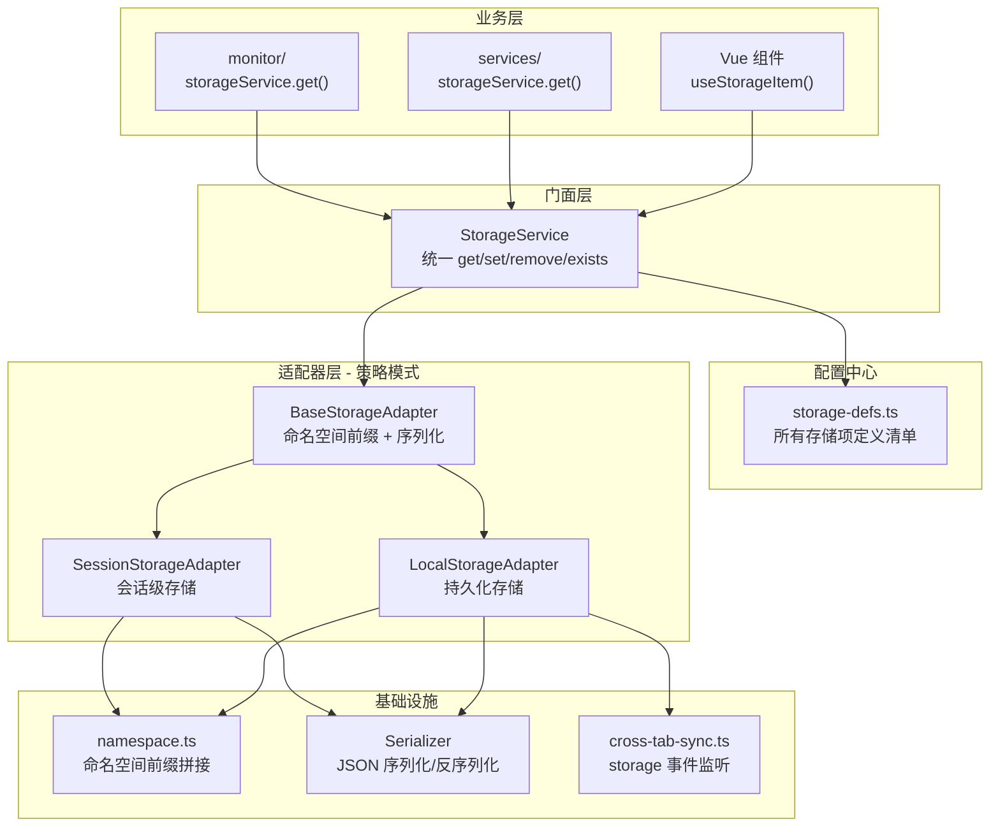

# 统一浏览器存储管理方案 — 架构设计文档

> **项目**: winning-webui-mras-aima（指标助手）  
> **日期**: 2026-07-28  
> **状态**: 待评审  
> **范围**: localStorage + sessionStorage（含命名空间隔离）

---

## 目录

1. [现状分析](#1-现状分析)
2. [第三方方案评估](#2-第三方方案评估)
3. [设计目标回顾](#3-设计目标回顾)
4. [整体架构](#4-整体架构)
5. [核心模块设计](#5-核心模块设计)
   - [类型定义](#51-类型定义)
   - [存储项定义清单](#52-存储项定义清单)
   - [命名空间工具](#53-命名空间工具)
   - [适配器基类](#54-适配器基类)
   - [具体适配器](#55-具体适配器)
   - [门面服务层](#56-门面服务层)
   - [响应式 Composable](#57-响应式-composable)
   - [跨标签页同步](#58-跨标签页同步)
   - [模块索引](#59-模块索引)
6. [使用示例](#6-使用示例)
7. [迁移路径](#7-迁移路径)
8. [风险与注意事项](#8-风险与注意事项)

---

## 1. 现状分析

### 1.1 当前存储使用情况

项目中 `localStorage` 直接调用的位置共 **5 处**：

| 位置 | Key | 用途 |
|------|-----|------|
| [`src/utils/sse.ts:59`](../src/utils/sse.ts:59) | `hospital_token` | SSE 连接鉴权 |
| [`src/services/chat.ts:24`](../src/services/chat.ts:24) | `hospital_token` | HTTP 请求鉴权 |
| [`src/services/chat.ts:129`](../src/services/chat.ts:129) | `hospital_token` | HTTP 请求鉴权 |
| [`src/main.ts:67`](../src/main.ts:67) | `hospital_user_id` | MonitorSDK 初始化 |
| [`src/monitor/index.ts:12`](../src/monitor/index.ts:12) | `user_id` | MonitorSDK 用户标识 |

**问题总结**：

- `hospital_token` 作为同一业务概念，在 3 处通过硬编码字符串直接访问
- `hospital_user_id` 与 `user_id` 可能是同一数据的不同命名
- 无命名空间隔离、无过期机制、无读写审计、无统一入口

### 1.2 项目技术上下文

| 类别 | 技术 | 备注 |
|------|------|------|
| 运行时 | Vue 3.5 + TypeScript 6.0 + Vite 8.1 | |
| 状态管理 | Pinia 4.0.2 | |
| 工具集 | @vueuse/core 14.3.0 | `useStorage` 仅做单一 key 绑定，无中心化配置 |
| IndexedDB | idb 8.0.3 | monitor SDK 专用，不在本次统一存储范围内 |

---

## 2. 第三方方案评估

按照项目"避免重复造轮子"规范，对候选方案进行评估：

### 2.1 候选方案

| 方案 | 说明 |
|------|------|
| **store2** | localStorage 增强封装（命名空间、TTL、序列化） |
| **@vueuse/core useStorage** | 已安装，单一 key 的响应式绑定 |
| **自研 StorageService** | 基于原生 API 的薄封装层 |

### 2.2 评估矩阵

| 需求维度 | store2 | useStorage | 自研 |
|----------|:------:|:----------:|:----:|
| localStorage + sessionStorage 统一封装 | ✅ | ✅ | ✅ |
| 中心化配置清单（所有存储项一处声明） | ❌ | ❌ | ✅ |
| 按数据项路由不同存储后端 | ❌ | ❌ | ✅ |
| 只读访问控制 | ❌ | ❌ | ✅ |
| 命名空间隔离（localStorage & sessionStorage 均支持） | ✅ | ❌ | ✅ |
| TTL 过期 | ✅ | ❌ | ✅ |
| 跨标签页同步 | ❌ | ✅ | ✅ |
| 自定义序列化 | ✅ | ✅ | ✅ |
| 错误降级（隐私模式/存储满） | ❌ | ❌ | ✅ |
| 包体积（min+gzip） | ~3KB | 0（已安装） | ~1.5KB |
| 新增依赖 | 是 | 否 | 否 |

### 2.3 结论：推荐自研薄封装层

- `store2` 提供了命名空间和 TTL，但缺少中心化配置和只读控制，且需新增依赖
- `useStorage` 功能过于单一，只能绑定单个 key
- **自研方案 ~200 行代码、零新增依赖**，底层直接调用 `localStorage.getItem` 等原生 API，同时覆盖全部需求

---

## 3. 设计目标回顾

1. **业务方零感知底层细节**：语义化名称访问，不暴露 key 和存储类型
2. **中心化配置与可维护性**：一处声明所有存储项，改 key/类型只需改配置
3. **差异化存储与访问控制**：不同数据使用 localStorage 或 sessionStorage，支持只读控制
4. **命名空间隔离**：localStorage 和 sessionStorage 均通过前缀实现命名空间隔离，避免与其他系统 key 冲突
5. **可扩展与健壮性**：异常处理（隐私模式/存储满）、TTL 过期、跨标签同步、序列化扩展

---

## 4. 整体架构

### 4.1 架构全景图



### 4.2 设计模式映射

| 模式 | 应用位置 | 作用 |
|------|----------|------|
| **门面模式** | `StorageService` | 对外暴露统一 API，屏蔽底层适配器细节 |
| **策略模式** | `LocalStorageAdapter` / `SessionStorageAdapter` | 各适配器实现相同接口，按配置切换后端 |
| **模板方法** | `BaseStorageAdapter` | 公共逻辑（序列化、命名空间前缀）在基类实现 |

### 4.3 文件清单

```
src/storage/
├── index.ts                      # 对外导出（storageService + composable）
├── types.ts                      # 所有类型定义
├── storage-defs.ts               # ★ 中心化存储项定义清单
├── storage-service.ts            # 门面层实现
├── namespace.ts                  # 命名空间工具
├── adapters/
│   ├── base-adapter.ts           # 适配器抽象基类
│   ├── local-storage-adapter.ts  # localStorage 适配器
│   └── session-storage-adapter.ts# sessionStorage 适配器
├── composables/
│   ├── useStorageItem.ts         # 响应式存储 composable
│   └── useCrossTabWatch.ts       # 跨标签页监听 composable
└── utils/
    ├── serializer.ts             # JSON 序列化器
    └── cross-tab-sync.ts         # 跨标签页同步工具
```

---

## 5. 核心模块设计

### 5.1 类型定义

[`src/storage/types.ts`]

```typescript
// ============ 存储后端 ============

/** 支持的存储后端类型 */
export type StorageBackend = 'localStorage' | 'sessionStorage';

// ============ 访问权限 ============

/** 数据项访问权限 */
export type AccessPermission = 'readonly' | 'readwrite';

// ============ 序列化器 ============

/** 序列化器接口 */
export interface StorageSerializer {
  /** JS 值 → 存储字符串 */
  serialize(value: unknown): string;
  /** 存储字符串 → JS 值 */
  deserialize(raw: string): unknown;
}

// ============ 适配器 ============

/** 存储适配器接口 */
export interface StorageAdapter {
  readonly backend: StorageBackend;
  readonly namespace: string;
  /** 读取（key 已加命名空间前缀） */
  getItem(prefixedKey: string): string | null;
  /** 写入（key 已加命名空间前缀） */
  setItem(prefixedKey: string, rawValue: string): void;
  /** 删除（key 已加命名空间前缀） */
  removeItem(prefixedKey: string): void;
  /** 探针：检测存储是否可用（隐私模式 / 存储满） */
  isAvailable(): boolean;
}

// ============ 存储项定义 ============

/** 过期配置 */
export interface StorageExpiry {
  /** 过期模式：none = 永不过期，ttl = 相对过期 */
  mode: 'none' | 'ttl';
  /** TTL 毫秒数（从写入时间起算）, Time To Live */
  durationMs?: number;
}

/** 校验函数：返回 true 表示有效 */
export type ValidateFn = (value: unknown) => boolean;

/** 版本迁移函数 */
export type MigrateFn = (oldValue: unknown) => unknown;

/**
 * ★ 核心：单个存储项定义
 *
 * 每新增一项存储数据，只需在此添加一条配置
 */
export interface StorageItemDef<T = unknown> {
  /** 语义化名称（业务方调用时使用） */
  name: string;
  /** 底层存储 key（会自动拼接命名空间前缀） */
  key: string;
  /** 存储后端 */
  backend: StorageBackend;
  /** 访问权限 */
  permission: AccessPermission;
  /** 默认值（不存在时返回） */
  defaultValue?: T;
  /** 过期配置 */
  expiry?: StorageExpiry;
  /** 自定义序列化器（默认 JSON） */
  serializer?: StorageSerializer;
  /** 写入前校验器 */
  validate?: ValidateFn;
  /** 版本号（变更时触发迁移） */
  version?: number;
  /** 版本迁移函数 */
  migrate?: MigrateFn;
}

// ============ 对外接口 ============

/** 存储服务只读部分 */
export interface StorageReader {
  get<T = unknown>(name: string): T | undefined;
  exists(name: string): boolean;
}

/** 存储服务完整接口 */
export interface StorageService extends StorageReader {
  set<T = unknown>(name: string, value: T): boolean;
  remove(name: string): boolean;
  /** 获取存储项原始定义（调试用） */
  getDef(name: string): Readonly<StorageItemDef> | undefined;
  /** 列出所有注册的存储项语义化名称 */
  listNames(): string[];
}

// ============ 存储变化事件 ============

/** 跨标签页同步事件载荷 */
export interface StorageChangeEvent {
  /** 语义化名称 */
  name: string;
  /** 实际 key（含命名空间前缀） */
  key: string;
  /** 新值 */
  newValue: unknown | null;
  /** 旧值 */
  oldValue: unknown | null;
  /** 所属后端 */
  backend: StorageBackend;
}
```

### 5.2 存储项定义清单

[`src/storage/storage-defs.ts`] — **整个方案的唯一配置入口**

```typescript
import type { StorageItemDef } from './types';

// ============ 语义化数据名称常量 ============

export const STORAGE_KEYS = {
  /** 用户认证 Token */
  AUTH_TOKEN: 'authToken',
  /** 当前用户 ID */
  USER_ID: 'userId',
  /** 应用偏好设置 */
  APP_CONFIG: 'appConfig',
  /** 最后选中的模型 ID（跨会话保持） */
  LAST_MODEL_ID: 'lastModelId',
  /** 侧边栏折叠状态（会话级，不跨标签） */
  SIDEBAR_COLLAPSED: 'sidebarCollapsed',
} as const;

/** 语义化名称的联合类型 */
export type StorageKeyName = (typeof STORAGE_KEYS)[keyof typeof STORAGE_KEYS];

// ============ ★ 中心化存储项定义清单 ★ ============

export const STORAGE_ITEMS: readonly StorageItemDef[] = [
  // ---- 持久化数据（localStorage）----

  {
    name: STORAGE_KEYS.AUTH_TOKEN,
    key: 'hospital_token',
    backend: 'localStorage',
    permission: 'readwrite',
    expiry: { mode: 'ttl', durationMs: 24 * 60 * 60 * 1000 }, // 24h
  },

  {
    name: STORAGE_KEYS.USER_ID,
    key: 'hospital_user_id',
    backend: 'localStorage',
    permission: 'readonly', // ★ 业务方不可写入/删除
    defaultValue: '',
  },

  {
    name: STORAGE_KEYS.APP_CONFIG,
    key: 'app_config',
    backend: 'localStorage',
    permission: 'readwrite',
    version: 1,
    defaultValue: { theme: 'light', language: 'zh-CN' },
  },

  // ---- 会话级数据（sessionStorage）----

  {
    name: STORAGE_KEYS.LAST_MODEL_ID,
    key: 'last_model_id',
    backend: 'sessionStorage',
    permission: 'readwrite',
    defaultValue: null,
  },

  {
    name: STORAGE_KEYS.SIDEBAR_COLLAPSED,
    key: 'sidebar_collapsed',
    backend: 'sessionStorage',
    permission: 'readwrite',
    defaultValue: false,
  },
] as const;

// ============ 快速查找映射（内部使用） ============

/** 构建 name → StorageItemDef 的 Map，避免 O(n) 查找 */
function buildDefMap(): Map<string, StorageItemDef> {
  const map = new Map<string, StorageItemDef>();
  for (const def of STORAGE_ITEMS) {
    map.set(def.name, def);
  }
  return map;
}

/** 只读 Map，供 StorageService 内部使用 */
export const storageDefMap: ReadonlyMap<string, StorageItemDef> = buildDefMap();
```

### 5.3 命名空间工具

[`src/storage/namespace.ts`]

```typescript
/**
 * 命名空间工具
 *
 * @description
 * 通过统一前缀实现命名空间隔离。
 * 项目配置 `NAMESPACE_PREFIX = 'wma'`（winning-webui-mras-aima 缩写），
 * 最终存储 key 格式为 `{namespace}:{itemKey}`，例如 `wma:hospital_token`。
 *
 * 优点：
 * - 与同域其他系统（如 TFS 自带的 Web 界面）的 localStorage 隔离
 * - 便于调试时一眼识别出自有系统的存储项
 * - 未来可通过修改前缀实现多实例部署共存
 */

/** 命名空间前缀 */
export const NAMESPACE_PREFIX = 'wma';

/**
 * 构建带命名空间前缀的完整 key
 * @param key 存储项配置中的原始 key
 * @returns 带命名空间前缀的完整 key，如 `wma:hospital_token`
 */
export function buildStorageKey(key: string): string {
  return `${NAMESPACE_PREFIX}:${key}`;
}
```

### 5.4 适配器基类

[`src/storage/adapters/base-adapter.ts`]

```typescript
import type { StorageAdapter, StorageSerializer } from '../types';
import { buildStorageKey } from '../namespace';
import { jsonSerializer } from '../utils/serializer';

/**
 * 存储适配器抽象基类
 *
 * 模板方法模式：
 * - doGetItem / doSetItem / doRemoveItem / doIsAvailable 由子类实现
 * - getItem / setItem / removeItem 由基类包装命名空间前缀处理
 */
export abstract class BaseStorageAdapter implements StorageAdapter {
  abstract readonly backend: StorageAdapter['backend'];

  constructor(private readonly nsPrefix: string, protected serializer: StorageSerializer = jsonSerializer) {}

  // ============ 子类必须实现 ============

  /** 底层读取（key 已带前缀） */
  protected abstract doGetItem(prefixedKey: string): string | null;
  /** 底层写入（key 已带前缀） */
  protected abstract doSetItem(prefixedKey: string, rawValue: string): void;
  /** 底层删除（key 已带前缀） */
  protected abstract doRemoveItem(prefixedKey: string): void;

  abstract isAvailable(): boolean;

  // ============ 模板方法（命名空间前缀由基类统一处理） ============

  get namespace(): string {
    return this.nsPrefix;
  }

  getItem(key: string): string | null {
    return this.doGetItem(buildStorageKey(key));
  }

  setItem(key: string, rawValue: string): void {
    this.doSetItem(buildStorageKey(key), rawValue);
  }

  removeItem(key: string): void {
    this.doRemoveItem(buildStorageKey(key));
  }
}
```

### 5.5 具体适配器

[`src/storage/adapters/local-storage-adapter.ts`]

```typescript
import { BaseStorageAdapter } from './base-adapter';
import type { StorageSerializer } from '../types';

/**
 * localStorage 适配器
 *
 * 支持：
 * - 命名空间前缀（继承自 BaseStorageAdapter）
 * - 可用性探针（隐私模式下写入测试+回滚）
 * - 存储满异常捕获
 */
export class LocalStorageAdapter extends BaseStorageAdapter {
  readonly backend = 'localStorage';

  /** 可用性探针结果缓存（避免每次 getItem 都写入测试） */
  private availabilityCache: boolean | null = null;

  constructor(nsPrefix: string, serializer?: StorageSerializer) {
    super(nsPrefix, serializer);
  }

  protected doGetItem(prefixedKey: string): string | null {
    try {
      return localStorage.getItem(prefixedKey);
    } catch {
      console.warn(`[Storage:localStorage] 读取失败: ${prefixedKey}`);
      return null;
    }
  }

  protected doSetItem(prefixedKey: string, rawValue: string): void {
    localStorage.setItem(prefixedKey, rawValue);
    // 注意：setItem 的 QuotaExceededError 在 StorageService 层统一捕获
  }

  protected doRemoveItem(prefixedKey: string): void {
    try {
      localStorage.removeItem(prefixedKey);
    } catch {
      console.warn(`[Storage:localStorage] 删除失败: ${prefixedKey}`);
    }
  }

  /**
   * 检测 localStorage 是否可用
   *
   * 策略：写入一个探针 key，读取确认后立即删除。
   * 隐私模式下写入会抛异常；存储满时写入也会失败。
   */
  isAvailable(): boolean {
    if (this.availabilityCache !== null) {
      return this.availabilityCache;
    }

    const probeKey = buildStorageKey('__probe__');
    try {
      localStorage.setItem(probeKey, '1');
      localStorage.removeItem(probeKey);
      this.availabilityCache = true;
    } catch {
      this.availabilityCache = false;
    }
    return this.availabilityCache;
  }
}
```

[`src/storage/adapters/session-storage-adapter.ts`]

```typescript
import { BaseStorageAdapter } from './base-adapter';
import type { StorageSerializer } from '../types';

/**
 * sessionStorage 适配器
 *
 * 与 LocalStorageAdapter 结构完全对称，仅底层 API 不同。
 */
export class SessionStorageAdapter extends BaseStorageAdapter {
  readonly backend = 'sessionStorage';

  private availabilityCache: boolean | null = null;

  constructor(nsPrefix: string, serializer?: StorageSerializer) {
    super(nsPrefix, serializer);
  }

  protected doGetItem(prefixedKey: string): string | null {
    try {
      return sessionStorage.getItem(prefixedKey);
    } catch {
      console.warn(`[Storage:sessionStorage] 读取失败: ${prefixedKey}`);
      return null;
    }
  }

  protected doSetItem(prefixedKey: string, rawValue: string): void {
    sessionStorage.setItem(prefixedKey, rawValue);
  }

  protected doRemoveItem(prefixedKey: string): void {
    try {
      sessionStorage.removeItem(prefixedKey);
    } catch {
      console.warn(`[Storage:sessionStorage] 删除失败: ${prefixedKey}`);
    }
  }

  isAvailable(): boolean {
    if (this.availabilityCache !== null) {
      return this.availabilityCache;
    }

    const probeKey = buildStorageKey('__probe__');
    try {
      sessionStorage.setItem(probeKey, '1');
      sessionStorage.removeItem(probeKey);
      this.availabilityCache = true;
    } catch {
      this.availabilityCache = false;
    }
    return this.availabilityCache;
  }
}
```

> **注**：上面的适配器代码中引用了 `buildStorageKey`，但由于该函数定义在 `namespace.ts` 中，适配器使用时需从 namespace 导入。为保持适配器内部紧凑，也可将 `buildStorageKey` 内联为基类的静态方法。推荐保持独立导入以确保单一职责。

### 5.6 门面服务层

[`src/storage/storage-service.ts`]

```typescript
import type { StorageService, StorageItemDef, StorageSerializer } from './types';
import { storageDefMap } from './storage-defs';
import { NAMESPACE_PREFIX } from './namespace';
import { jsonSerializer } from './utils/serializer';
import { LocalStorageAdapter } from './adapters/local-storage-adapter';
import { SessionStorageAdapter } from './adapters/session-storage-adapter';
import type { StorageAdapter } from './types';

/**
 * 统一存储服务实现
 *
 * 门面模式：对外暴露 get/set/remove/exists 四个核心方法
 */
export class StorageServiceImpl implements StorageService {
  /** 适配器实例（懒初始化，按后端类型缓存） */
  private readonly adapters = new Map<string, StorageAdapter>();

  /** 默认序列化器 */
  private readonly defaultSerializer: StorageSerializer = jsonSerializer;

  // ============ 公开方法 ============

  /**
   * 读取存储项
   * @param name 语义化名称（如 'authToken'）
   * @returns 反序列化后的值，不存在/过期/异常时返回 defaultValue
   */
  get<T = unknown>(name: string): T | undefined {
    const def = this.getDefSafe(name);
    if (!def) return undefined;

    const adapter = this.getAdapter(def.backend);

    // 可用性检查
    if (!adapter.isAvailable()) {
      console.warn(`[StorageService] ${def.backend} 不可用，返回默认值: ${def.name}`);
      return def.defaultValue as T | undefined;
    }

    // 读取
    const raw = adapter.getItem(def.key);
    if (raw === null) {
      return def.defaultValue as T | undefined;
    }

    // 反序列化
    const serializer = def.serializer ?? this.defaultSerializer;
    let value: unknown;
    try {
      value = serializer.deserialize(raw);
    } catch (error) {
      console.error(`[StorageService] 反序列化失败: ${def.name}`, error);
      return def.defaultValue as T | undefined;
    }

    // 过期检查
    if (this.checkExpiry(def, value)) {
      adapter.removeItem(def.key);
      return def.defaultValue as T | undefined;
    }

    return value as T;
  }

  /**
   * 写入存储项
   * @param name 语义化名称
   * @returns 是否写入成功
   */
  set<T = unknown>(name: string, value: T): boolean {
    const def = this.getDefSafe(name);
    if (!def) return false;

    // 只读检查
    if (def.permission === 'readonly') {
      console.warn(`[StorageService] 拒绝写入只读项: ${def.name}`);
      return false;
    }

    // 自定义校验
    if (def.validate && !def.validate(value)) {
      console.warn(`[StorageService] 校验失败，拒绝写入: ${def.name}`, value);
      return false;
    }

    const adapter = this.getAdapter(def.backend);
    if (!adapter.isAvailable()) {
      console.warn(`[StorageService] ${def.backend} 不可用: ${def.name}`);
      return false;
    }

    // 包装过期元数据
    const payload = this.wrapExpiry(def, value);

    // 序列化
    const serializer = def.serializer ?? this.defaultSerializer;
    let raw: string;
    try {
      raw = serializer.serialize(payload);
    } catch (error) {
      console.error(`[StorageService] 序列化失败: ${def.name}`, error);
      return false;
    }

    // 写入
    try {
      adapter.setItem(def.key, raw);
      return true;
    } catch (error) {
      console.error(`[StorageService] 写入失败（可能存储已满）: ${def.name}`, error);
      return false;
    }
  }

  /**
   * 删除存储项
   * @returns 是否删除成功
   */
  remove(name: string): boolean {
    const def = this.getDefSafe(name);
    if (!def) return false;

    if (def.permission === 'readonly') {
      console.warn(`[StorageService] 拒绝删除只读项: ${def.name}`);
      return false;
    }

    const adapter = this.getAdapter(def.backend);
    if (!adapter.isAvailable()) return false;

    try {
      adapter.removeItem(def.key);
      return true;
    } catch (error) {
      console.error(`[StorageService] 删除失败: ${def.name}`, error);
      return false;
    }
  }

  /**
   * 检查存储项是否存在
   */
  exists(name: string): boolean {
    const def = this.getDefSafe(name);
    if (!def) return false;

    const adapter = this.getAdapter(def.backend);
    if (!adapter.isAvailable()) return false;

    return adapter.getItem(def.key) !== null;
  }

  /** 获取存储项原始定义（调试用） */
  getDef(name: string): Readonly<StorageItemDef> | undefined {
    return storageDefMap.get(name);
  }

  /** 列出所有已注册的存储项名称 */
  listNames(): string[] {
    return Array.from(storageDefMap.keys());
  }

  // ============ 内部方法 ============

  /** 安全获取定义，不存在时打印警告 */
  private getDefSafe(name: string): StorageItemDef | undefined {
    const def = storageDefMap.get(name);
    if (!def) {
      console.warn(
        `[StorageService] 未注册的存储项: "${name}"，请在 storage-defs.ts 中声明`,
      );
    }
    return def;
  }

  /** 懒初始化适配器并缓存 */
  private getAdapter(backend: string): StorageAdapter {
    const cached = this.adapters.get(backend);
    if (cached) return cached;

    let adapter: StorageAdapter;
    switch (backend) {
      case 'localStorage':
        adapter = new LocalStorageAdapter(NAMESPACE_PREFIX);
        break;
      case 'sessionStorage':
        adapter = new SessionStorageAdapter(NAMESPACE_PREFIX);
        break;
      default:
        // 防御性：未注册的后端降级为 localStorage
        console.warn(`[StorageService] 未知后端类型 "${backend}"，降级为 localStorage`);
        adapter = new LocalStorageAdapter(NAMESPACE_PREFIX);
    }

    this.adapters.set(backend, adapter);
    return adapter;
  }

  /** 过期检查：检查解包后的 __expiry 字段 */
  private checkExpiry(def: StorageItemDef, value: unknown): boolean {
    if (!def.expiry || def.expiry.mode === 'none') return false;
    if (typeof value === 'object' && value !== null && '__expiry' in value) {
      const expiry = (value as Record<string, unknown>).__expiry;
      return typeof expiry === 'number' && Date.now() > expiry;
    }
    return false;
  }

  /** 包装过期元数据：{ __value: T, __expiry: number } */
  private wrapExpiry(def: StorageItemDef, value: unknown): unknown {
    if (!def.expiry || def.expiry.mode === 'none' || !def.expiry.durationMs) {
      return value;
    }
    return {
      __value: value,
      __expiry: Date.now() + def.expiry.durationMs,
    };
  }
}

/**
 * 全局单例 — 应用唯一入口
 *
 * 使用方式：
 *   import { storageService } from '@/storage';
 *   const token = storageService.get<string>(STORAGE_KEYS.AUTH_TOKEN);
 */
export const storageService: StorageService = new StorageServiceImpl();
```

### 5.7 响应式 Composable

[`src/storage/composables/useStorageItem.ts`]

```typescript
import { ref, watch, onMounted, onUnmounted } from 'vue';
import { storageService } from '../storage-service';
import type { StorageKeyName } from '../storage-defs';

/**
 * Vue 3 Composable：将存储项绑定为响应式 ref
 *
 * 特性：
 * - 初始化时从存储读取值
 * - 修改 ref 值时自动同步写入存储
 * - 监听 localStorage 的 storage 事件，跨标签页自动更新
 *
 * @example
 * ```typescript
 * const sidebarCollapsed = useStorageItem<boolean>(STORAGE_KEYS.SIDEBAR_COLLAPSED);
 * // 读取：sidebarCollapsed.value
 * // 写入：sidebarCollapsed.value = true
 * ```
 */
export function useStorageItem<T = unknown>(name: StorageKeyName) {
  const def = storageService.getDef(name);
  const initialValue = (def?.defaultValue as T | undefined);
  const state = ref<T | undefined>(initialValue) as ReturnType<typeof ref<T | undefined>>;

  /** 从存储加载当前值 */
  function loadFromStorage(): void {
    const stored = storageService.get<T>(name);
    state.value = stored !== undefined ? stored : initialValue;
  }

  /** 同步变化到存储 */
  watch(
    state,
    (newVal) => {
      if (newVal === undefined || newVal === null) {
        storageService.remove(name);
      } else {
        // 避免写入与存储中相同的值（减少不必要的 I/O）
        const stored = storageService.get<T>(name);
        if (JSON.stringify(stored) !== JSON.stringify(newVal)) {
          storageService.set(name, newVal);
        }
      }
    },
    { deep: true },
  );

  // ============ 跨标签页同步 ============

  function handleStorageEvent(event: StorageEvent): void {
    if (!def) return;
    // 检查 key 是否匹配当前存储项
    if (event.key && event.key.includes(def.key)) {
      loadFromStorage();
    }
  }

  onMounted(() => {
    loadFromStorage();
    window.addEventListener('storage', handleStorageEvent);
  });

  onUnmounted(() => {
    window.removeEventListener('storage', handleStorageEvent);
  });

  return state;
}
```

### 5.8 跨标签页同步

[`src/storage/utils/cross-tab-sync.ts`]

```typescript
/**
 * 跨标签页存储变化监听
 *
 * 原理：浏览器原生 `storage` 事件
 * 当一个标签页修改 localStorage 时，同源其他标签页会收到该事件。
 *
 * 注意：
 * - sessionStorage 的修改不会跨标签触发 storage 事件
 * - storage 事件在触发修改的标签页本身不会收到
 */

export type StorageChangeHandler = (
  key: string,
  newValue: string | null,
  oldValue: string | null,
) => void;

/**
 * 注册跨标签页存储变化监听
 * @param handler 变化回调
 * @returns 取消监听的函数
 */
export function onStorageChange(handler: StorageChangeHandler): () => void {
  const listener = (event: StorageEvent) => {
    handler(event.key ?? '', event.newValue, event.oldValue);
  };
  window.addEventListener('storage', listener);
  return () => window.removeEventListener('storage', listener);
}
```

### 5.9 模块索引

[`src/storage/index.ts`] — 统一导出入口

```typescript
// 服务单例
export { storageService } from './storage-service';

// 类型
export type {
  StorageService,
  StorageItemDef,
  StorageBackend,
  AccessPermission,
  StorageExpiry,
} from './types';

// 配置常量
export { STORAGE_KEYS } from './storage-defs';
export type { StorageKeyName } from './storage-defs';

// Composables
export { useStorageItem } from './composables/useStorageItem';
export { onStorageChange } from './utils/cross-tab-sync';
export type { StorageChangeHandler } from './utils/cross-tab-sync';
```

---

## 6. 使用示例

### 6.1 基础读写（services / utils 中替换现状）

**改造前** ([`src/services/chat.ts:24`](../src/services/chat.ts:24))：
```typescript
const token = localStorage.getItem('hospital_token');
```

**改造后**：
```typescript
import { storageService } from '@/storage';
import { STORAGE_KEYS } from '@/storage';

const token = storageService.get<string>(STORAGE_KEYS.AUTH_TOKEN);
```

### 6.2 响应式使用（Vue 组件中）

**改造前**：手动 `ref(localStorage.getItem(...))` + `watch` 同步
**改造后**：
```vue
<script setup lang="ts">
import { useStorageItem, STORAGE_KEYS } from '@/storage';

const sidebarCollapsed = useStorageItem<boolean>(STORAGE_KEYS.SIDEBAR_COLLAPSED);
// sidebarCollapsed.value 自动响应式 + 自动同步 + 跨标签页更新
</script>
```

### 6.3 只读保护

```typescript
// 以下调用会打印 console.warn 并静默失败
storageService.set(STORAGE_KEYS.USER_ID, '123');   // ❌ 只读
storageService.remove(STORAGE_KEYS.USER_ID);        // ❌ 只读

// 读取正常工作
const userId = storageService.get<string>(STORAGE_KEYS.USER_ID);  // ✅
```

### 6.4 新增存储项

只需在 [`storage-defs.ts`](#52-存储项定义清单) 中添加一条配置，例如新增"用户主题偏好"：

```typescript
{
  name: 'themePreference',
  key: 'theme_pref',
  backend: 'localStorage',
  permission: 'readwrite',
  defaultValue: 'system',
}
```

然后 `storageService.get('themePreference')` 和 `useStorageItem('themePreference')` 立即可用。

### 6.5 调整已有存储项

仅修改配置，引用处零变更：

```typescript
// 把 AUTH_TOKEN 从 localStorage 迁移到 sessionStorage
// 只需改这一行，全部 storageService.get('authToken') 自动路由到 sessionStorage
backend: 'sessionStorage',
```

### 6.6 命名空间效果

配置中的 `key: 'hospital_token'` 经过命名空间前缀 `'wma:'` 后，实际读写的是 `'wma:hospital_token'`。

在浏览器 DevTools > Application > Local Storage 中看到的将是：
```
wma:hospital_token        "eyJ0eXAiOiJKV1Q..."
wma:hospital_user_id      "12345"
wma:app_config            {"theme":"light","language":"zh-CN"}
```

---

## 7. 迁移路径

### 7.1 迁移步骤

| 阶段 | 内容 | 影响范围 |
|------|------|----------|
| **Phase 1** | 创建 `src/storage/` 全部文件，零副作用 | 无（新增代码） |
| **Phase 2** | 按现有 key（如 `hospital_token`）配置 `storage-defs.ts`，保持 key 名一致确保平滑过渡 | 无 |
| **Phase 3** | 逐一替换 5 处 `localStorage.getItem` 为 `storageService.get` | 低风险，每处改动为一行 |
| **Phase 4** | Vue 组件中选择性引入 `useStorageItem` | 低风险 |
| **Phase 5** | 代码审查确认无直接 `localStorage` 调用残留 | CI/Lint 检查 |

### 7.2 兼容过渡

`storage-defs.ts` 中直接复用现有 key 名（`hospital_token`、`hospital_user_id`），确保 Phase 2 不会导致存储数据丢失。命名空间前缀 `wma:` 附加后，实际的完整 key 变为 `wma:hospital_token`。**如果希望真正的零风险过渡**，可以在第一阶段不对 key 加命名空间前缀（`NAMESPACE_PREFIX = ''`），等全部迁移完成后再统一启用前缀。

### 7.3 需要改造的文件清单

| 文件 | 行号 | 改造内容 |
|------|------|----------|
| [`src/services/chat.ts`](../src/services/chat.ts) | 24, 129 | `localStorage.getItem('hospital_token')` → `storageService.get(STORAGE_KEYS.AUTH_TOKEN)` |
| [`src/utils/sse.ts`](../src/utils/sse.ts) | 59 | 同上 |
| [`src/main.ts`](../src/main.ts) | 67 | `localStorage.getItem('hospital_user_id')` → `storageService.get(STORAGE_KEYS.USER_ID)` |
| [`src/monitor/index.ts`](../src/monitor/index.ts) | 12 | 同上（建议统一使用 STORAGE_KEYS.USER_ID） |

---

## 8. 风险与注意事项

### ⚠️ 风险点

1. **命名空间前缀导致现有数据不可读**：启用命名空间前缀后，之前存储的裸 key（如 `hospital_token`）和新的 `wma:hospital_token` 不互通。建议按照 §7.2 的渐进策略：Phase 2 时 `NAMESPACE_PREFIX = ''`，全部迁移完成后再改为 `'wma'`。

2. **sessionStorage 命名空间**：命名空间对 sessionStorage 同样生效，实际 key 为 `wma:last_model_id`。与其他系统共存时不会冲突。

3. **JSON.stringify 深比较的性能影响**：`useStorageItem` 中的值比较使用了 `JSON.stringify`，对于当前项目的小型配置/Token 数据无影响。`[推测]` 若未来存储大型 JSON 对象（> 10KB），可改为浅比较或使用 `useDebounceFn`。

4. **storage 事件仅对 localStorage 起效**：跨标签页同步依赖 `storage` 事件，sessionStorage 的修改不会触发跨标签同步。符合预期（sessionStorage 本身就是会话级隔离）。

5. **项目规范**：新增文件需遵守项目编码规范（禁止魔法字符串、import 风格、Prettier 格式化）。Vue 组件中使用 `useStorageItem` 不会增加组件行数（composable 已独立）。

### 📋 实施前确认清单

- [ ] 用户确认方案后按 Phase 1→5 顺序实施
- [ ] `STORAGE_KEYS` 常量中的名称和分类是否准确
- [ ] 是否需要添加额外存储项（如暗色模式偏好等）
- [ ] 命名空间前缀 `'wma'` 是否符合项目惯例
- [ ] 迁移策略选择：立即启用前缀 vs. 渐进过渡
