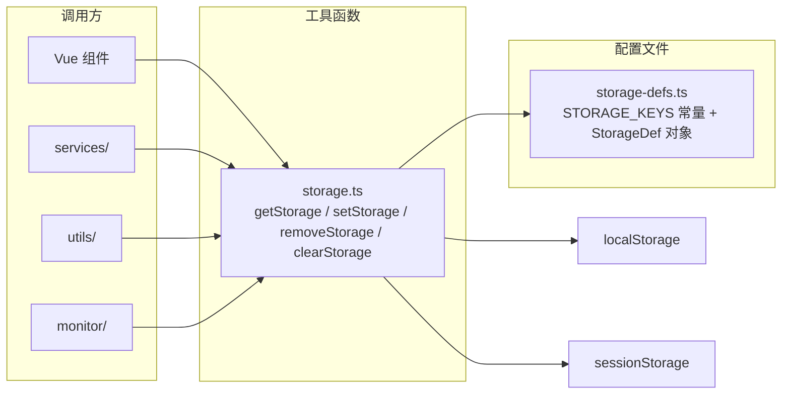

# 轻量化前端存储管理方案

> **项目**: winning-webui-mras-aima（指标助手）
> **日期**: 2026-07-28
> **状态**: 待评审
> **定位**: 替代 [`storage-management-architecture.md`](storage-management-architecture.md) 的重架构方案，采用最简纯函数设计

---

## 目录

1. [与原方案对比](#1-与原方案对比)
2. [整体设计](#2-整体设计)
3. [文件一：存储键配置](#3-文件一存储键配置)
4. [文件二：工具函数](#4-文件二工具函数)
5. [使用示例](#5-使用示例)
6. [风险与注意事项](#6-风险与注意事项)

---

## 1. 与原方案对比

| 维度 | 原方案（重型） | 新方案（轻量） |
|------|:-------------:|:-------------:|
| 文件数 | 10+ | **2** |
| 代码行数 | ~650 行 | **~80 行** |
| 设计模式 | 门面 + 策略 + 模板方法 | 纯函数 |
| 类/实例 | 6 个 class | **0 个 class** |
| TTL 过期 | ✅ | ❌（项目中无此需求） |
| 只读权限控制 | ✅ | ❌（项目中无此需求） |
| 跨标签页同步 | ✅ | ❌（必要时用 @vueuse/core） |
| 自定义序列化器 | ✅ | ❌（统一 JSON） |
| 版本迁移 | ✅ | ❌（项目中无此需求） |
| 命名空间隔离 | ✅ | ✅ |
| 集中管理存储键 | ✅ | ✅ |
| 按 key 指定存储类型 | ✅ | ✅ |
| 自动序列化/反序列化 | ✅ | ✅ |
| undefined → null 安全兜底 | ❌ | ✅ |
| TypeScript 类型安全 | ✅ | ✅（更简洁） |
| 错误处理 | ✅ | ✅ |
| 零依赖 | ✅ | ✅ |

> **裁剪原则**：只保留当前项目实际需要的特性，去掉"可能会用到"的一切。

---

## 2. 整体设计

### 架构图



### 文件清单

```
src/storage/
├── storage-defs.ts    # 存储键配置（唯一配置入口）
└── storage.ts         # 纯函数工具（getStorage / setStorage / removeStorage / clearStorage）
```

原有的 `adapters/`、`composables/`、`utils/` 空目录可以删除（方案实施时处理）。

---

## 3. 文件一：存储键配置

[`src/storage/storage-defs.ts`]

```typescript
// ============ 命名空间前缀 ============

/** 全局命名空间前缀，所有 key 自动添加此前缀 */
export const NS = 'wma';

// ============ 存储类型 ============

export type StorageType = 'localStorage' | 'sessionStorage';

// ============ 存储项定义 ============

export interface StorageDef<T = unknown> {
  /** 底层存储 key（不含前缀） */
  key: string;
  /** 存储后端 */
  storage: StorageType;
  /** 默认值（读取不存在时返回） */
  defaultValue: T;
  /**
   * 是否添加命名空间前缀，默认 true
   * - true：实际读写 key 为 `wma:xxx`
   * - false：直接使用原始 key（适用于与其他系统共享的存储项）
   */
  namespace?: boolean;
  /**
   * 是否进行 JSON 序列化/反序列化，默认 false
   * - true：自动 JSON.stringify / JSON.parse（适用于对象、数组等结构化数据）
   * - false：原样读写字符串（默认，兼容其他系统写入的纯文本值）
   */
  serialize?: boolean;
}

// ============ ★ 所有存储项集中定义 ★ ============

export const STORAGE_DEFS = {
  /** 用户认证 Token */
  AUTH_TOKEN: {
    key: 'hospital_token',
    storage: 'localStorage',
    defaultValue: '',
  } as StorageDef<string>,

  /** 当前用户 ID */
  USER_ID: {
    key: 'hospital_user_id',
    storage: 'localStorage',
    defaultValue: '',
  } as StorageDef<string>,
} as const;

// ============ 存储键常量（调用方使用，避免魔法字符串） ============

/**
 * 存储键名称常量
 *
 * 使用方式：
 *   import { STORAGE_KEYS } from '@/storage/storage-defs';
 *   getStorage(STORAGE_KEYS.AUTH_TOKEN)     // ✅ 禁用 getStorage('AUTH_TOKEN')
 */
export const STORAGE_KEYS = {
  AUTH_TOKEN: 'AUTH_TOKEN',
  USER_ID: 'USER_ID',
} as const;

// ============ 类型工具：从配置推导值类型 ============

/** 所有存储 key 名称的联合类型 */
export type StorageKey = keyof typeof STORAGE_DEFS;

/** 根据 key 名称推导对应的值类型 */
export type StorageValue<K extends StorageKey> = (typeof STORAGE_DEFS)[K]['defaultValue'];
```

> **新增存储项示例**：只需在 `STORAGE_DEFS` 对象中添加一条即可，如：
> ```typescript
> SIDEBAR_COLLAPSED: {
>   key: 'sidebar_collapsed',
>   storage: 'sessionStorage',
>   defaultValue: false,
> } as StorageDef<boolean>,
> ```

---

## 4. 文件二：工具函数

[`src/storage/storage.ts`]

```typescript
import { NS, STORAGE_DEFS, type StorageKey, type StorageValue } from './storage-defs';

// ============ 内部工具 ============

/** 构建存储 key（按配置决定是否添加命名空间前缀） */
function resolveKey(def: { key: string; namespace?: boolean }): string {
  return def.namespace === false ? def.key : `${NS}:${def.key}`;
}

/** 根据配置获取对应的 Storage 对象 */
function getStore(type: 'localStorage' | 'sessionStorage'): Storage {
  return type === 'localStorage' ? localStorage : sessionStorage;
}

// ============ 公开 API ============

/**
 * 读取存储值
 * @param name 存储项名称（使用 STORAGE_KEYS 常量，如 STORAGE_KEYS.AUTH_TOKEN）
 * @returns 反序列化后的值，异常时返回配置的 defaultValue
 */
export function getStorage<K extends StorageKey>(name: K): StorageValue<K> {
  const def = STORAGE_DEFS[name];
  const store = getStore(def.storage);
  const key = resolveKey(def);
  const shouldSerialize = def.serialize === true;

  try {
    const raw = store.getItem(key);
    if (raw === null) return def.defaultValue;
    return shouldSerialize ? (JSON.parse(raw) as StorageValue<K>) : (raw as StorageValue<K>);
  } catch {
    console.warn(`[storage] 读取 "${name}" 失败，返回默认值`);
    return def.defaultValue;
  }
}

/**
 * 写入存储值
 * @param name 存储项名称
 * @param value 要存储的值
 * @returns 是否写入成功
 */
export function setStorage<K extends StorageKey>(name: K, value: StorageValue<K>): boolean {
  const def = STORAGE_DEFS[name];
  const store = getStore(def.storage);
  const key = resolveKey(def);
  const shouldSerialize = def.serialize === true;

  try {
    const raw = shouldSerialize ? JSON.stringify(value ?? null) : String(value);
    store.setItem(key, raw);
    return true;
  } catch (error) {
    console.error(`[storage] 写入 "${name}" 失败（可能存储已满）`, error);
    return false;
  }
}

/**
 * 删除存储值
 * @param name 存储项名称
 */
export function removeStorage(name: StorageKey): void {
  const def = STORAGE_DEFS[name];
  const store = getStore(def.storage);
  const key = resolveKey(def);

  try {
    store.removeItem(key);
  } catch {
    console.warn(`[storage] 删除 "${name}" 失败`);
  }
}

/**
 * 清除当前命名空间下的所有存储项
 *
 * 注意：清除所有 STORAGE_DEFS 中已注册的 key，
 * 包括有命名空间和无命名空间的。
 */
export function clearStorage(): void {
  for (const name of Object.keys(STORAGE_DEFS) as StorageKey[]) {
    removeStorage(name);
  }
}
```

---

## 5. 使用示例

### 5.1 基础读写（替换现有的 localStorage 直接调用）

**改造前** ([`src/services/chat.ts:24`](../src/services/chat.ts:24))：
```typescript
const token = localStorage.getItem('hospital_token');
```

**改造后**：
```typescript
import { getStorage } from '@/storage/storage';
import { STORAGE_KEYS } from '@/storage/storage-defs';

const token = getStorage(STORAGE_KEYS.AUTH_TOKEN); // 类型自动推导为 string
```

### 5.2 写入 + 删除

```typescript
import { getStorage, setStorage, removeStorage } from '@/storage/storage';
import { STORAGE_KEYS } from '@/storage/storage-defs';

// 写入（类型安全：第二个参数类型由 key 自动推导）
setStorage(STORAGE_KEYS.AUTH_TOKEN, 'new-token-value');

// 删除
removeStorage(STORAGE_KEYS.AUTH_TOKEN);
```

### 5.3 在 Vue 组件中使用（配合 @vueuse/core）

```vue
<script setup lang="ts">
import { getStorage, setStorage } from '@/storage/storage';
import { STORAGE_KEYS } from '@/storage/storage-defs';
import { useStorage } from '@vueuse/core';

// 方式一：直接调用（非响应式）
const token = getStorage(STORAGE_KEYS.AUTH_TOKEN);

// 方式二：响应式绑定（使用已有的 @vueuse/core）
const sidebarCollapsed = useStorage('wma:sidebar_collapsed', false, sessionStorage);
</script>
```

### 5.4 TypeScript 类型安全

```typescript
import { getStorage, setStorage, type StorageKey, type StorageValue } from '@/storage/storage';
import { STORAGE_KEYS } from '@/storage/storage-defs';

// ✅ 类型正确：AUTH_TOKEN 的 defaultValue 是 string，所以 value 类型为 string
const token: string = getStorage(STORAGE_KEYS.AUTH_TOKEN);

// ✅ 类型正确：set 的第二个参数自动约束为 string
setStorage(STORAGE_KEYS.AUTH_TOKEN, 'my-token');

// ❌ 编译错误：不能传入 number
// setStorage(STORAGE_KEYS.AUTH_TOKEN, 123);

// 获取某个 key 的值类型（工具类型）
type TokenType = StorageValue<typeof STORAGE_KEYS.AUTH_TOKEN>; // string
```

### 5.5 跨系统共享存储项（禁用命名空间 + 禁用序列化）

当存储项由其他系统写入、需要共享读取时，可配置 `namespace: false` + `serialize: false`：

**配置**：
```typescript
// storage-defs.ts 中新增
SHARED_TOKEN: {
  key: 'hospital_token',
  storage: 'localStorage',
  defaultValue: '',
  namespace: false,   // 不加 wma: 前缀，直接读写 'hospital_token'
  serialize: false,   // 不进行 JSON 序列化，原样读写字符串
} as StorageDef<string>,
```

**调用**：
```typescript
const token = getStorage(STORAGE_KEYS.SHARED_TOKEN); // 直接返回原始字符串
setStorage(STORAGE_KEYS.SHARED_TOKEN, 'new-token');   // 直接写入原始字符串
```

### 5.6 典型场景对照表

| 存储项性质 | namespace | serialize | 示例 |
|-----------|:---------:|:---------:|------|
| 本项目私有、结构化数据 | `true`（默认） | `true`（默认） | 用户偏好设置对象 |
| 本项目私有、纯字符串 | `true`（默认） | `false`（默认） | 简单 token（仅本项目写入） |
| 跨系统共享、纯字符串 | `false` | `false` | `hospital_token`（TFS 注入） |
| 跨系统共享、结构化数据 | `false` | `true` | 极少见场景 |

### 5.7 DevTools 中的存储效果

```
localStorage:
  hospital_token           "eyJ0eXAiOiJKV1Q..."    ← namespace: false, serialize: false
  wma:hospital_user_id     "12345"                 ← namespace: true, serialize: false
  wma:app_config           {"theme":"light"}       ← namespace: true, serialize: true

sessionStorage:
  wma:sidebar_collapsed    "false"
```

---

## 6. 风险与注意事项

### ⚠️ 风险点

1. **命名空间导致现有数据不可读**：启用 `wma:` 前缀后，之前存储的裸 key `hospital_token` 和新的 `wma:hospital_token` 不互通。建议实施时先不加前缀（`NS = ''`），等业务稳定后再启用 `'wma'`，或者一次性迁移旧数据。

2. **与 @vueuse/core 的 useStorage 共存**：项目已安装 `@vueuse/core`，其 `useStorage` 可直接用于需要响应式绑定的场景。本方案的 `getStorage`/`setStorage` 更适合 services/utils 等非组件场景。

3. **`clearStorage()` 仅清除已注册 key**：如果通过其他方式写入了 `wma:` 前缀的 key 但未在 `STORAGE_DEFS` 中注册，`clearStorage()` 不会清除它们。这是有意设计，避免误删。

4. **无 TTL 过期**：原方案中的 AUTH_TOKEN 配置了 24h 过期，但实际上当前代码中并没有过期检查逻辑。如果未来需要，可以在 `getStorage()` 中扩展，或使用 `@vueuse/core` 的 `useStorage` 配合 `watch` 实现。

### 📋 迁移步骤

| 阶段 | 内容 |
|------|------|
| **Phase 1** | 创建 `storage-defs.ts` 和 `storage.ts`，`NS = ''`（先不加前缀） |
| **Phase 2** | 替换 5 处 `localStorage.getItem` 为 `getStorage(STORAGE_KEYS.xxx)` 调用 |
| **Phase 3** | 确认功能正常后，将 `NS` 改为 `'wma'`，同时执行一次性数据迁移 |
| **Phase 4** | 清理 `src/storage/` 下的空目录（adapters/、composables/、utils/） |
