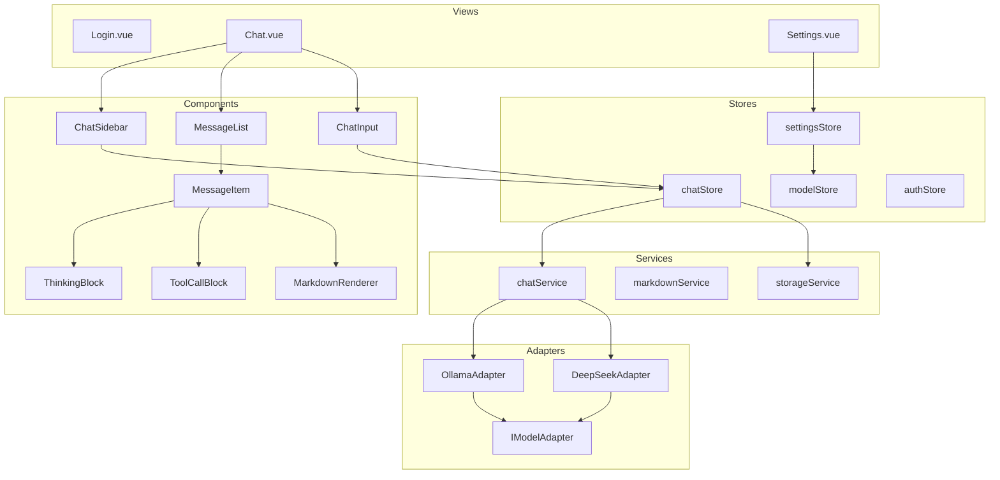
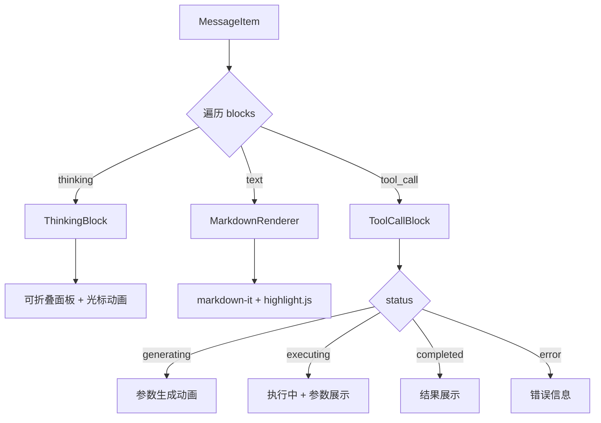
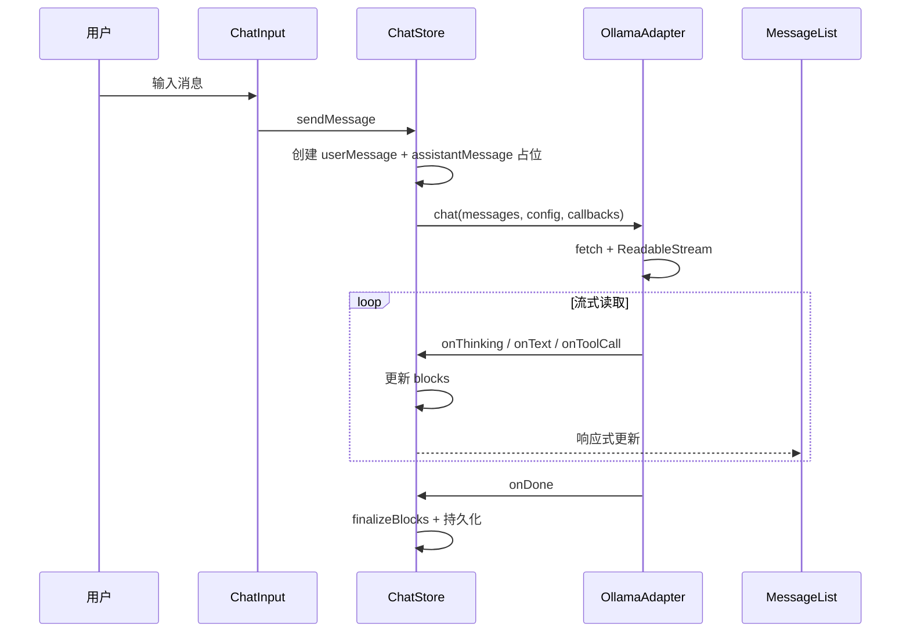

# AI 助手 Web 应用 — 前端技术方案

> **相关文档**：[开发计划](./development-plan.md)

## 1. 项目概述

### 1.1 产品定位

类 DeepSeek / Kimi 网页版的 AI 助手 Web 应用，作为本地和云端大语言模型的统一交互入口。

### 1.2 核心需求

| 需求 | 说明 |
|------|------|
| 模型兼容 | 完美兼容 Ollama 本地模型，预留 DeepSeek 等线上模型接入能力 |
| 对话模式 | 支持流式（SSE）与非流式对话的平滑切换 |
| 思考过程 | 对具备推理能力的模型，独立渲染并可折叠/展开思考过程 |
| 工具调用 | 实时可视化工具调用完整生命周期（参数生成 → 执行中 → 结果返回） |
| 功能模块 | 登录、对话（主界面）、设置，可增减 |

### 1.3 当前项目现状

- **技术栈**：Vue 3.5 + TypeScript 6 + Vite 8
- **已有结构**：基本路由（Login / Chat / Settings 三个页面骨架）
- **依赖**：仅 `vue` 和 `vue-router`，无状态管理、UI 库等

---

## 2. 技术栈选型

### 2.1 核心依赖

| 类别 | 选型 | 版本 | 理由 |
|------|------|------|------|
| 框架 | Vue 3 | ^3.5 | 已确定，Composition API + `<script setup>` |
| 语言 | TypeScript | ~6.0 | 已确定 |
| 构建 | Vite | ^8.1 | 已确定 |
| 路由 | Vue Router | ^4.6 | 已确定 |
| 状态管理 | Pinia | ^3.x | Vue 3 官方推荐，轻量、TS 友好 |
| HTTP | 原生 fetch + ReadableStream | — | 零依赖，原生支持流式读取 |
| Markdown | markdown-it | ^14.x | 轻量、插件生态丰富 |
| 代码高亮 | highlight.js | ^11.x | 按需加载语言包，体积小 |
| 图标 | unplugin-icons | 最新 | 按需引入，支持多种图标集 |
| CSS 方案 | Tailwind CSS | ^4.x | 原子化 CSS，生态成熟，社区资源丰富 |

### 2.2 开发依赖

| 类别 | 选型 | 理由 |
|------|------|------|
| 代码规范 | ESLint + @antfu/eslint-config | 统一代码风格 |
| 格式化 | Prettier | 代码格式化 |
| 类型检查 | vue-tsc | 已配置 |

### 2.3 选型理由详述

**为什么用原生 fetch 而不是 axios / ofetch？**
- Ollama API 的流式响应基于 `ReadableStream`，原生 `fetch` 直接支持，无需额外封装
- 零依赖，不增加打包体积
- 如果后续需要更高级的拦截/重试能力，可再引入 ofetch 作为增强

**为什么用 Pinia 而不是 Vuex？**
- Pinia 是 Vue 3 官方推荐的状态管理方案
- 完整的 TypeScript 支持，无需模块/命名空间
- API 更简洁，学习成本低

**为什么用 markdown-it + highlight.js？**
- markdown-it 插件生态丰富，可扩展支持数学公式、脚注等
- highlight.js 支持按需加载语言包，避免打包体积过大
- 两者组合成熟稳定，社区广泛使用

---

## 3. 架构设计

### 3.1 整体架构



### 3.2 分层职责

| 层级 | 职责 | 关键目录 |
|------|------|----------|
| **视图层** | 页面路由、布局编排 | `src/views/` |
| **组件层** | 可复用 UI 组件 | `src/components/` |
| **状态层** | 全局状态管理（Pinia） | `src/stores/` |
| **服务层** | 业务逻辑封装 | `src/services/` |
| **适配层** | 模型 API 差异屏蔽 | `src/adapters/` |
| **类型层** | TypeScript 类型定义 | `src/types/` |
| **工具层** | 通用工具函数 | `src/utils/` |
| **常量层** | 命名常量定义 | `src/constants/` |

---

## 4. 核心模块设计

### 4.1 模型适配层（Adapter Pattern）

这是系统的核心抽象层，用于屏蔽不同模型 API 的差异。

#### 4.1.1 核心类型定义

```typescript
// src/types/model.ts

/** 消息角色 */
export type MessageRole = 'system' | 'user' | 'assistant' | 'tool';

/** 思考块 */
export interface ThinkingBlock {
  type: 'thinking';
  content: string;
  status: 'streaming' | 'completed';
}

/** 工具调用块 */
export interface ToolCallBlock {
  type: 'tool_call';
  id: string;
  name: string;
  arguments: string;       // JSON 字符串，流式拼接
  result?: string;
  status: 'generating' | 'executing' | 'completed' | 'error';
  error?: string;
}

/** 文本块 */
export interface TextBlock {
  type: 'text';
  content: string;
  status: 'streaming' | 'completed';
}

/** 内容块联合类型 */
export type ContentBlock = TextBlock | ThinkingBlock | ToolCallBlock;

/** 聊天消息 */
export interface ChatMessage {
  id: string;
  role: MessageRole;
  content: string;
  blocks: ContentBlock[];
  model?: string;
  createdAt: number;
  updatedAt: number;
}

/** 对话会话 */
export interface Conversation {
  id: string;
  title: string;
  messages: ChatMessage[];
  modelId: string;
  createdAt: number;
  updatedAt: number;
}

/** 模型提供商 */
export type ModelProvider = 'ollama' | 'deepseek' | 'openai';

/** 模型配置 */
export interface ModelConfig {
  id: string;
  name: string;
  provider: ModelProvider;
  baseUrl: string;
  apiKey?: string;
  defaultParams?: ModelParams;
  capabilities: ModelCapabilities;
}

/** 模型参数 */
export interface ModelParams {
  temperature?: number;
  topP?: number;
  maxTokens?: number;
  stop?: string[];
}

/** 模型能力声明 */
export interface ModelCapabilities {
  streaming: boolean;
  thinking: boolean;
  toolCall: boolean;
  vision: boolean;
}

/** 流式响应回调 */
export interface StreamCallbacks {
  onThinking?: (chunk: string) => void;
  onText?: (chunk: string) => void;
  onToolCallStart?: (toolCall: ToolCallBlock) => void;
  onToolCallArgs?: (id: string, chunk: string) => void;
  onToolCallResult?: (id: string, result: string) => void;
  onDone?: () => void;
  onError?: (error: Error) => void;
}

/** 模型适配器接口 */
export interface IModelAdapter {
  readonly provider: string;
  chat(
    messages: ChatMessage[],
    config: ModelConfig,
    callbacks: StreamCallbacks,
    options?: { stream?: boolean }
  ): Promise<void>;
  listModels(baseUrl: string): Promise<ModelConfig[]>;
  abort(): void;
}
```

#### 4.1.2 Ollama 适配器实现要点

```
Ollama API 端点：POST {baseUrl}/api/chat

流式响应格式（NDJSON，每行一个 JSON）：
  - message.thinking  → 思考过程（deepseek-r1 等推理模型）
  - message.content   → 正文内容
  - message.tool_calls → 工具调用
  - done: true        → 流结束

非流式响应：单个 JSON 对象，message 字段包含完整内容
```

#### 4.1.3 适配器工厂

```typescript
// src/adapters/index.ts
// 根据 provider 字符串创建对应适配器实例
// 新增模型提供商时只需：1. 实现 IModelAdapter  2. 在 adapterMap 中注册
```

### 4.2 对话状态管理（ChatStore）

```
状态：
  - conversations: Conversation[]     会话列表
  - currentConversationId: string     当前会话 ID
  - isStreaming: boolean              是否正在流式生成
  - streamMode: boolean               流式/非流式开关

核心 Action：
  - createConversation()              创建新对话
  - sendMessage(content, modelConfig) 发送消息并获取回复
  - stopGeneration()                  停止生成
  - deleteConversation(id)            删除对话
  - switchConversation(id)            切换对话
```

### 4.3 消息渲染架构



### 4.4 Markdown 渲染服务

- 基于 markdown-it，禁止 HTML 标签（XSS 安全）
- highlight.js 代码高亮，按需加载常用语言
- 代码块增加复制按钮（通过 markdown-it 插件或渲染后 DOM 操作）

### 4.5 存储服务

- 会话列表和消息历史 → localStorage（初期），后续可迁移 IndexedDB
- 模型配置 → localStorage
- 用户设置 → localStorage
- 所有存储 key 统一定义在 `src/constants/storage.ts`

---

## 5. 目录结构

```
src/
├── adapters/
│   ├── index.ts                 # 适配器工厂
│   ├── OllamaAdapter.ts         # Ollama 适配器
│   └── DeepSeekAdapter.ts       # DeepSeek 适配器（预留）
├── components/
│   ├── chat/
│   │   ├── ChatInput.vue        # 输入区域（含流式/非流式切换）
│   │   ├── ChatSidebar.vue      # 侧边栏（会话列表）
│   │   ├── MessageItem.vue      # 单条消息
│   │   ├── MessageList.vue      # 消息列表（含自动滚动）
│   │   ├── ThinkingBlock.vue    # 思考过程（可折叠）
│   │   └── ToolCallBlock.vue    # 工具调用可视化
│   ├── common/
│   │   ├── MarkdownRenderer.vue # Markdown 渲染
│   │   └── CodeBlock.vue        # 代码块（含复制）
│   └── settings/
│       ├── ModelConfigForm.vue  # 模型配置表单
│       └── GeneralSettings.vue  # 通用设置
├── composables/
│   ├── useAutoScroll.ts         # 自动滚动到底部
│   └── useLocalStorage.ts       # localStorage 响应式封装
├── constants/
│   ├── model.ts                 # 模型相关常量
│   └── storage.ts               # 存储 key 常量
├── mocks/
│   └── chatMock.ts              # Mock 流式响应
├── services/
│   ├── markdownService.ts       # Markdown 渲染
│   └── storageService.ts        # 存储服务
├── stores/
│   ├── chatStore.ts             # 对话状态
│   ├── modelStore.ts            # 模型配置状态
│   ├── settingsStore.ts         # 全局设置状态
│   └── authStore.ts             # 认证状态
├── types/
│   ├── model.ts                 # 模型、消息、会话类型
│   └── settings.ts              # 设置相关类型
├── utils/
│   └── id.ts                    # ID 生成
├── views/
│   ├── Chat.vue
│   ├── Login.vue
│   └── Settings.vue
├── App.vue
├── main.ts
└── style.css
```

---

## 6. 接口对接方案

### 6.1 Ollama 本地 API

```
POST {baseUrl}/api/chat

请求体（流式）:
{
  "model": "deepseek-r1",
  "messages": [{ "role": "user", "content": "你好" }],
  "stream": true,
  "options": { "temperature": 0.7 }
}

流式响应（NDJSON）:
{"model":"deepseek-r1","message":{"role":"assistant","thinking":"...","content":""},"done":false}
{"model":"deepseek-r1","message":{"role":"assistant","content":"你好！"},"done":false}
{"model":"deepseek-r1","done":true}
```

### 6.2 CORS 处理

方案一：设置 Ollama 环境变量 `OLLAMA_ORIGINS=http://localhost:5173`
方案二：Vite 开发代理（推荐，对用户透明）

```typescript
// vite.config.ts
server: {
  proxy: {
    '/api/ollama': {
      target: 'http://localhost:11434',
      changeOrigin: true,
      rewrite: (path) => path.replace(/^\/api\/ollama/, ''),
    },
  },
}
```

### 6.3 Mock 方案

提供 `src/mocks/chatMock.ts`，模拟流式响应（含思考过程、工具调用），用于无 Ollama 环境时的开发调试。通过设置页面的开关切换 Mock/真实模式。

---

## 7. 关键交互流程

### 7.1 流式对话时序



### 7.2 思考过程交互

- 默认折叠，点击标题展开
- 流式时显示闪烁光标
- 完成后显示思考耗时
- 思考内容与正文在视觉上明确区分（不同背景色/边框）

### 7.3 工具调用生命周期

```
状态机：generating → executing → completed / error

generating:  蓝色脉冲动画 + "正在生成参数..."
executing:   橙色旋转加载 + 参数 JSON 展示
completed:   绿色对勾 + 参数 + 结果 JSON
error:       红色叉号 + 错误信息
```

---

## 8. 样式方案

### 8.1 整体风格

参考 DeepSeek / Kimi 设计语言：
- 简洁现代的对话界面
- 左侧边栏（240px）+ 右侧主内容区
- 浅色/深色主题支持（CSS 变量 + Tailwind dark: 前缀）
- 用户消息右对齐（蓝色背景），助手消息左对齐（无背景）

### 8.2 布局

```
┌──────────────────────────────────────────────┐
│                 Chat 页面                     │
├─────────┬────────────────────────────────────┤
│ Sidebar │  MessageList                       │
│ 240px   │  ┌──────────────────────────────┐  │
│         │  │ 用户消息                      │  │
│ +新建   │  ├──────────────────────────────┤  │
│ 会话列表 │  │ 助手消息                      │  │
│         │  │ ┌─ 思考过程 [折叠] ──────┐   │  │
│         │  │ └───────────────────────┘   │  │
│         │  │ 正文内容（Markdown）         │  │
│         │  │ ┌─ 工具调用 ────────────┐   │  │
│         │  │ │ get_weather [执行中]   │   │  │
│         │  │ └───────────────────────┘   │  │
│         │  ├──────────────────────────────┤  │
│         │  │ 用户消息                      │  │
│         │  └──────────────────────────────┘  │
│         │  ┌──────────────────────────────┐  │
│         │  │ ChatInput                     │  │
│         │  │ [流式开关] [模型选择] [发送]   │  │
│         │  └──────────────────────────────┘  │
└─────────┴────────────────────────────────────┘
```

---

## 9. 风险点

### ⚠️ 风险点

1. **Ollama API 兼容性风险**：Ollama 不同版本的 API 响应格式可能存在差异（如 thinking 字段是近期版本才加入的），需要做好版本检测和降级处理。
2. **流式渲染性能风险**：高频的流式 chunk 更新可能导致 Vue 响应式系统频繁触发重渲染，需要使用 `requestAnimationFrame` 节流或 `shallowRef` 优化。
3. **CORS 与部署风险**：开发环境可通过 Vite 代理解决 CORS，但生产环境部署时需要后端配合配置反向代理或 Ollama 的 `OLLAMA_ORIGINS` 环境变量。
