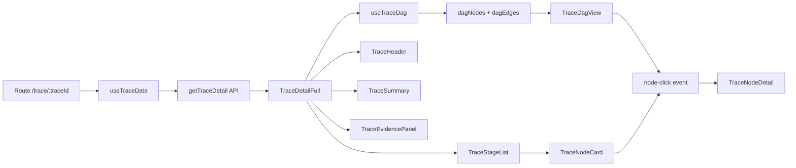

# 链路追踪页 (TraceView) 详细设计方案

## 1. 概述

基于 API [`GET /api/agent/runs/{traceId}`](../src/views/TraceView/api-agent-runs-traceId.md) 的响应数据，构建面向开发者调试的完整链路追踪页面。

**核心功能**：
- DAG 图形化展示 Agent 执行流向（节点按 6 阶段着色 + 4 种边类型区分）
- 阶段分组列表（按 `flow_stage` 展开/折叠）
- 节点详情面板（input/output data、error info、tokens、capability_readiness）
- Evidence 证据链展示
- 耗时汇总可视化

---

## 2. 页面布局

```
┌─────────────────────────────────────────────────────┐
│ ← 返回对话 | TraceHeader                            │
│ trace_id · final_status · user_query · error_count   │
├─────────────────────────────────────────────────────┤
│ TraceSummary                                         │
│ [总耗时 8234ms] [LLM 3200ms ████████░░] [Tool ...]  │
├─────────────────────────────────────────────────────┤
│ Tabs: [DAG视图] [阶段列表] [Evidence证据]            │
├─────────────────────────────────────────────────────┤
│                                                      │
│ DAG Tab:                                             │
│ ┌────────────────────────────────────────────────┐  │
│ │           Vue Flow Canvas                      │  │
│ │  ┌──────┐   ┌──────┐   ┌──────┐              │  │
│ │  │Stage1 │──▶│Stage2 │──▶│Stage3 │──▶ ...     │  │
│ │  │nodes  │   │nodes  │   │nodes  │              │  │
│ │  └──────┘   └──────┘   └──────┘              │  │
│ │  绿色区      蓝色区      紫色区                │  │
│ └────────────────────────────────────────────────┘  │
│                                                      │
│ Node List Tab:                                       │
│ ┌─ Stage 1: 上下文与指标识别 ─────────────────────┐  │
│ │  ├─ NodeCard: memory_load (12ms ✓)               │  │
│ │  └─ NodeCard: indicator_rule_match (45ms ✓)      │  │
│ ├─ Stage 2: 规划与目标校验 ────────────────────────┤  │
│ │  └─ NodeCard: planner_llm (3200ms ✓)             │  │
│ └─ ... ───────────────────────────────────────────┘  │
│                                                      │
│ Evidence Tab:                                        │
│ ┌─ Evidence 列表 ─────────────────────────────────┐  │
│ │  EVID_xxx: sql_execution_result, HXZD-012-003  │  │
│ │  统计周期: 2026-06-01 ~ 2026-06-30             │  │
│ └─────────────────────────────────────────────────┘  │
│                                                      │
└─────────────────────────────────────────────────────┘

节点详情：点击节点后以右侧 Drawer (v-navigation-drawer) 滑出
```

---

## 3. 文件结构

```
src/views/TraceView/
├── api-agent-runs-traceId.md   # [已有] API 文档
├── index.vue                    # [重写] 主页面容器
├── types.ts                     # [新建] 完整 TypeScript 类型
├── constants.ts                 # [新建] flow_stage/node_type/status 映射配置
├── composables/
│   ├── useTraceData.ts          # [新建] 数据获取 + 状态管理
│   └── useTraceDag.ts           # [新建] DAG 节点/边计算
└── components/
    ├── TraceHeader.vue          # [新建] 页面头部信息
    ├── TraceSummary.vue         # [新建] 耗时汇总卡片
    ├── TraceDagView.vue         # [新建] DAG 图形展示 (Vue Flow)
    ├── TraceStageList.vue       # [新建] 阶段分组列表
    ├── TraceNodeCard.vue        # [新建] 节点卡片
    ├── TraceEvidencePanel.vue   # [新建] Evidence 面板
    └── TraceNodeDetail.vue      # [新建] 节点详情 Drawer
```

---

## 4. 组件设计

### 4.1 TraceView/index.vue — 主页面

**职责**：路由参数解析、全局 Loading/Error 状态、Tab 切换、节点详情 Drawer 控制。

```
状态：
- traceId: string (from route.params)
- activeTab: 'dag' | 'list' | 'evidence'
- selectedNode: TraceNode | null (控制详情 Drawer)

Props: 无（自身从路由获取 traceId）

依赖：
- useTraceData(traceId) → { data, loading, error, refresh }
- useTraceDag(data) → { dagNodes, dagEdges }

模板结构：
<script setup lang="ts">
<template>
  <v-container fluid>
    <!-- Loading / Error 状态 -->
    <TraceHeader :data="data" @back="goBack" />
    <TraceSummary :summary="data.timing_summary" :duration="data.duration_ms" />
    <v-tabs v-model="activeTab"> ... </v-tabs>
    <v-tabs-window v-model="activeTab">
      <v-tabs-window-item value="dag">
        <TraceDagView :nodes="dagNodes" :edges="dagEdges" @node-click="openDetail" />
      </v-tabs-window-item>
      <v-tabs-window-item value="list">
        <TraceStageList :nodes="data.nodes" @node-click="openDetail" />
      </v-tabs-window-item>
      <v-tabs-window-item value="evidence">
        <TraceEvidencePanel :evidence="data.evidence" />
      </v-tabs-window-item>
    </v-tabs-window>
    <TraceNodeDetail v-model="selectedNode" />
  </v-container>
```

> **行数预估**：~80 行（符合 ≤200 规范）

---

### 4.2 types.ts — 类型定义

**职责**：补全 API 响应中所有字段的 TypeScript 类型，替换现有 `TraceDetailResponse`（`src/types/chat.ts`）中不全的定义。

关键类型：

```typescript
// 节点类型（更完整，包含所有 API 字段）
export interface TraceNodeFull {
  // 数据库原始字段
  id: number;
  trace_id: string;
  node_id: string;
  node_name: string;
  node_type: 'llm' | 'tool' | 'database' | 'code' | 'storage';
  status: 'success' | 'failed' | 'error';
  input_summary: string | null;
  output_summary: string | null;
  error_code: string | null;
  error_message: string | null;
  tool_name: string | null;
  db_source: string | null;
  sql_id: string | null;
  run_id: string | null;
  rule_id: string | null;
  llm_model: string | null;
  model_id: string | null;
  started_at: string;
  ended_at: string | null;
  duration_ms: number;
  parent_node_id: string | null;
  subtask_id: string;
  sequence: number;
  started_offset_ms: number;
  exclusive_duration_ms: number;
  capability: string | null;
  failure_class: string | null;
  input_tokens: number | null;
  output_tokens: number | null;
  cache_reused: number;
  retry_count: number;
  created_at: string;
  // 服务端增强字段
  node_title: string;
  processing_summary: string;
  flow_stage: FlowStage;
  flow_stage_title: string;
  flow_stage_order: number;
  input_data: Record<string, unknown> | null;
  output_data: Record<string, unknown> | null;
  capability_readiness: CapabilityReadiness | null;
}

// 边
export interface TraceEdge {
  from_node_id: string;
  to_node_id: string;
  edge_type: 'parent' | 'sequence' | 'replan' | 'failure';
  label: string;
}

// Evidence
export interface TraceEvidence {
  evidence_id: string;
  fact_type: string;
  rule_id: string;
  rule_version: string;
  stat_start: string;
  stat_end: string;
  source_tool: string;
  source_object_id: string;
  created_at: string;
  expires_at: string;
}

// 顶层响应
export interface TraceDetailFull {
  id: number;
  trace_id: string;
  session_id: string | null;
  hospital_id: string;
  user_id: string;
  user_query: string;
  intent: string;
  final_status: 'running' | 'success' | 'failed' | 'incomplete';
  final_answer_summary: string;
  error_count: number;
  fallback_count: number;
  started_at: string;
  ended_at: string | null;
  duration_ms: number;
  created_at: string;
  nodes: TraceNodeFull[];
  flow_edges: TraceEdge[];
  evidence: TraceEvidence[];
  trace_version: string;
  timing_summary: TimingSummary;
}

export type FlowStage = 'context' | 'planning' | 'compilation' | 'execution' | 'verification' | 'answer';

export interface TimingSummary {
  llm_ms: number;
  tool_ms: number;
  code_ms: number;
  storage_ms: number;
}

export interface CapabilityReadiness {
  '知识治理状态': string;
  'SQL展示能力': boolean;
  '双库概览试算能力': boolean;
  '科室明细诊断能力': boolean;
  '患者明细诊断能力': boolean;
}
```

> **行数预估**：~120 行

---

### 4.3 constants.ts — 常量映射

**职责**：所有映射表，禁止魔法字符串。

```typescript
// flow_stage → 颜色、中文名
export const FLOW_STAGE_CONFIG = {
  context:    { title: '上下文与指标识别',   color: 'green',  order: 1 },
  planning:   { title: '规划与目标校验',     color: 'blue',   order: 2 },
  compilation:{ title: 'IR编译与能力选择',   color: 'purple', order: 3 },
  execution:  { title: '工具与数据库执行',   color: 'orange', order: 4 },
  verification:{title: 'Evidence验证与安全检查', color: 'red', order: 5 },
  answer:     { title: '回答组织与会话保存', color: 'teal',   order: 6 },
} as const;

// node_type → 图标
export const NODE_TYPE_ICON = {
  llm:      'mdi-brain',
  tool:     'mdi-wrench',
  database: 'mdi-database',
  code:     'mdi-code-braces',
  storage:  'mdi-folder',
} as const;

// node_type → 颜色
export const NODE_TYPE_COLOR = {
  llm:      'primary',
  tool:     'success',
  database: 'warning',
  code:     'info',
  storage:  'grey',
} as const;

// status → 颜色
export const NODE_STATUS_COLOR = {
  success: 'success',
  failed:  'error',
  error:   'error',
} as const;

// edge_type → 样式（虚线/实线/颜色）
export const EDGE_TYPE_STYLE = {
  parent:   { stroke: '#999', animated: false },
  sequence: { stroke: '#666', animated: false },
  replan:   { stroke: '#ff9800', animated: true },
  failure:  { stroke: '#f44336', animated: true, dashed: true },
} as const;

// final_status → 标签
export const FINAL_STATUS_MAP = {
  running:    { label: '运行中',  color: 'info' },
  success:    { label: '成功',    color: 'success' },
  failed:     { label: '失败',    color: 'error' },
  incomplete: { label: '需澄清',  color: 'warning' },
} as const;
```

> **行数预估**：~80 行

---

### 4.4 composables/useTraceData.ts

**职责**：调用 API、管理 loading/error/data 状态。

```typescript
// 入参: traceId (string)
// 返回: { data, loading, error, refresh }
// 逻辑：
// 1. onMounted 或 watch traceId 变化时调用 getTraceDetail(traceId)
// 2. 处理 404 → error = 'TRACE_NOT_FOUND'
// 3. 处理 401 → 自动跳转登录（由 request.ts 统一处理）
```

> **行数预估**：~50 行

---

### 4.5 composables/useTraceDag.ts

**职责**：将 API 的 `nodes` + `flow_edges` 转换为 Vue Flow 可用的节点/边格式。

```typescript
// 入参: TraceNodeFull[], TraceEdge[]
// 返回: { dagNodes: VueFlowNode[], dagEdges: VueFlowEdge[] }

// 计算逻辑：
// 1. 将 TraceNodeFull → VueFlowNode：
//    - id = node.node_id
//    - position = { x, y } (初始为 0，由 dagre 布局计算)
//    - data = { node: TraceNodeFull }
//    - type = 'trace-node' (自定义节点类型)
//
// 2. 将 TraceEdge → VueFlowEdge：
//    - id = `${edge.from_node_id}->${edge.to_node_id}`
//    - source = edge.from_node_id
//    - target = edge.to_node_id
//    - style/marker = 根据 edge_type 区分
//
// 3. 使用 dagre 计算布局：
//    - 构建 dagre 图
//    - 按 flow_stage 分层分层排列
//    - 设置 node.position = { x, y }
```

> **行数预估**：~80 行

---

### 4.6 TraceHeader.vue

**职责**：页面顶部信息栏。

```
布局：
┌──────────────────────────────────────────────┐
│ ← 返回    TRACE_xxx                          │
│           [success] [error:0] [fallback:0]    │
│ 用户问题: "查询我院上月四级手术..."            │
│ 意图: indicator_diagnosis                    │
│ 时间: 2026-07-28 14:30:00 ~ 14:30:08 (8.2s)  │
└──────────────────────────────────────────────┘
```

**Props**: `data: TraceDetailFull`

> **行数预估**：~70 行

---

### 4.7 TraceSummary.vue

**职责**：耗时汇总可视化。

```
布局：
┌──────────────────────────────────────────────┐
│ 总耗时                                   8,234ms│
│ LLM      ████████████████████████░░░  3,200ms │
│ Tool     ██████████████████████████████ 4,800ms │
│ Code     ██░░░░░░░░░░░░░░░░░░░░░░░░░░   210ms │
│ Storage  ░░░░░░░░░░░░░░░░░░░░░░░░░░░░    24ms │
└──────────────────────────────────────────────┘
```

每条进度条宽度 = `(该类型耗时 / max(timing_summary各项)) * 100%`。
进度条颜色与 `node_type` 颜色对应。

**Props**: `summary: TimingSummary`, `totalDuration: number`

> **行数预估**：~60 行

---

### 4.8 TraceDagView.vue

**职责**：Vue Flow DAG 可视化。

```
┌─────────────────────────────────────────────┐
│ [Zoom:100%] [+] [-] [适合屏幕]  [图例]       │
│                                              │
│ ┌────┐   ┌────┐   ┌────┐                    │
│ │ N1 │──▶│ N2 │──▶│ N3 │                    │
│ └────┘   └────┘   └────┘                    │
│ 绿色     蓝色     紫色                       │
│                                              │
│ 实线=sequence  虚线=parent                  │
│ 橙色虚线=replan  红色=失败                   │
└─────────────────────────────────────────────┘
```

**自定义节点 (TraceFlowNode)**：
- 小方块（120×60），背景色 = flow_stage 颜色
- 显示：node_title（截断 12 字）+ duration_ms
- 状态图标（✓ / ✗）
- hover 显示 tooltip（完整 node_title + node_name）
- 点击 → emit('node-click', node)

**Props**: `nodes: VueFlowNode[]`, `edges: VueFlowEdge[]`
**Emits**: `node-click(node: TraceNodeFull)`

> **行数预估**：~120 行

---

### 4.9 TraceStageList.vue

**职责**：按 flow_stage 分组的节点列表。

```
┌─ Stage 1: 上下文与指标识别 ─ [2 个节点] ────────┐
│  ▼                                                   │
│  ┌──────────────────────────────────────────────┐   │
│  │ 🗄 memory_load          12ms  ✓              │   │
│  │ 读取会话上下文                                │   │
│  └──────────────────────────────────────────────┘   │
│  ┌──────────────────────────────────────────────┐   │
│  │ 📝 indicator_rule_match  45ms  ✓             │   │
│  │ 规则精确识别指标                               │   │
│  └──────────────────────────────────────────────┘   │
├─ Stage 2: 规划与目标校验 ─ [3 个节点] ──────────────┤
│  ▶ (折叠)                                            │
...
```

使用 Vuetify `v-expansion-panels` 实现阶段折叠。
每组内节点按 `sequence` 排序。
阶段标题旁显示节点数量和该阶段总耗时。

**Props**: `nodes: TraceNodeFull[]`
**Emits**: `node-click(node: TraceNodeFull)`

> **行数预估**：~90 行

---

### 4.10 TraceNodeCard.vue

**职责**：节点摘要卡片。

```
┌──────────────────────────────────────────┐
│ [icon] memory_load                12ms ✓ │
│ 读取会话上下文                           │
│ capacity: resolve_indicator              │
│ tokens: in=152 out=0 | cache:0 retry:0   │
└──────────────────────────────────────────┘
```

**Props**: `node: TraceNodeFull`
**Emits**: `click(node: TraceNodeFull)`

> **行数预估**：~80 行

---

### 4.11 TraceEvidencePanel.vue

**职责**：Evidence 证据链列表。

```
┌─────────────────────────────────────────────┐
│ 共 3 条 Evidence                             │
│                                              │
│ ┌─────────────────────────────────────────┐ │
│ │ EVID_a1b2c3d4                           │ │
│ │ 事实类型: sql_execution_result           │ │
│ │ 规则: HXZD-012-003 (v2.1)               │ │
│ │ 统计周期: 2026-06-01 ~ 2026-06-30       │ │
│ │ 来源工具: dbhub_query                    │ │
│ │ 来源对象: SQL_xyz                        │ │
│ │ 创建: 2026-07-28 14:30:05               │ │
│ │ 过期: 2026-08-28 14:30:05               │ │
│ └─────────────────────────────────────────┘ │
```

**Props**: `evidence: TraceEvidence[]`

> **行数预估**：~80 行

---

### 4.12 TraceNodeDetail.vue

**职责**：节点详情右侧抽屉。

```
┌─────────────────────────────────────┐
│ 节点详情                    [关闭]   │
│─────────────────────────────────────│
│ node_title: 规划业务目标             │
│ node_name: planner_llm              │
│ node_type: llm  flow_stage: planning│
│ status: ✓ success                   │
│                                      │
│ 耗时                                 │
│ duration: 3,200ms                    │
│ started_offset: 57ms                │
│ exclusive_duration: 3,150ms         │
│                                      │
│ 开始: 2026-07-28 14:30:00.057      │
│ 结束: 2026-07-28 14:30:03.257      │
│                                      │
│ LLM 信息                             │
│ model_id: gpt-4                     │
│ input_tokens: 1,250                 │
│ output_tokens: 380                  │
│ cache_reused: 0                     │
│ retry_count: 0                      │
│                                      │
│ capability: resolve_indicator        │
│                                      │
│ ┌─ 输入数据 ──────────────────────┐ │
│ │ { ... JSON formatted ... }      │ │
│ └─────────────────────────────────┘ │
│                                      │
│ ┌─ 输出数据 ──────────────────────┐ │
│ │ { ... JSON formatted ... }      │ │
│ └─────────────────────────────────┘ │
│                                      │
│ capability_readiness (如有):         │
│  知识治理状态: 已发布                │
│  SQL展示能力: ✓                     │
│  双库概览试算能力: ✓                │
│  ...                                │
└─────────────────────────────────────┘
```

**实现方式**: 使用 Vuetify `v-navigation-drawer` (right, temporary)。
**Props**: `modelValue: TraceNodeFull | null`
**Emits**: `update:modelValue`

> **行数预估**：~150 行

---

## 5. 数据流



---

## 6. 依赖清单

### 需新增 npm 依赖

| 包名 | 用途 | 大小 |
|------|------|------|
| `@vue-flow/core` | DAG 流程图核心 | ~80KB |
| `@vue-flow/background` | 画布背景/网格 | ~5KB |
| `@vue-flow/controls` | 缩放/适配控制 | ~5KB |
| `dagre` | DAG 分层布局算法 | ~20KB |
| `@types/dagre` | dagre 类型定义 | devDeps |

安装命令：
```bash
npm install @vue-flow/core @vue-flow/background @vue-flow/controls dagre
npm install -D @types/dagre
```

### 已有依赖（无需新增）

| 包名 | 用途 |
|------|------|
| `vue-router` | 路由参数获取 |
| `vuetify` | UI 组件库 |
| `tailwindcss` | 原子化 CSS |
| `date-fns` | 日期格式化 |
| `@vueuse/core` | 组合式工具 |

---

## 7. 构建顺序（Todo List）

| # | 文件 | 说明 |
|---|------|------|
| 1 | 安装依赖 | `npm install @vue-flow/core @vue-flow/background @vue-flow/controls dagre && npm install -D @types/dagre` |
| 2 | `types.ts` | 补全 API 响应的完整 TS 类型 |
| 3 | `constants.ts` | flow_stage/node_type/status/edge 映射配置 |
| 4 | `composables/useTraceData.ts` | 数据获取与状态管理 |
| 5 | `composables/useTraceDag.ts` | 将 nodes + edges → Vue Flow 格式 + dagre 布局 |
| 6 | `components/TraceNodeCard.vue` | 节点摘要卡片 |
| 7 | `components/TraceHeader.vue` | 页面头部 |
| 8 | `components/TraceSummary.vue` | 耗时汇总 |
| 9 | `components/TraceDagView.vue` | DAG 图形展示 |
| 10 | `components/TraceStageList.vue` | 阶段分组列表 |
| 11 | `components/TraceEvidencePanel.vue` | Evidence 面板 |
| 12 | `components/TraceNodeDetail.vue` | 节点详情 Drawer |
| 13 | `index.vue` | 组装主页面 |
| 14 | 格式化 + ESLint 检查 | `npx prettier --write` + `npm run lint` |

---

## 8. 边界情况处理

| 场景 | 处理方式 |
|------|----------|
| traceId 不存在 (404) | 显示空状态提示 + "返回"按钮 |
| 未授权 (401) | 自动跳转登录（request.ts 统一处理） |
| nodes 为空数组 | 显示"暂无链路数据" |
| node 的 flow_stage 未知 | 按 node_type 降级归类（llm→planning，storage→answer，其他→execution） |
| input_data / output_data 为 null | 显示 "无数据" |
| capability_readiness 为 null | 不渲染该区块 |
| flow_edges 为空 | 仅按 stage + sequence 排序展示节点 |
| final_answer_summary 截断 | 标注"已截断至 2000 字符" |

---

## 9. ⚠️ 风险点

1. **依赖风险**：`@vue-flow/core` 需确认与当前 Vue 3.5.39 版本兼容（[推测] 最新版支持 Vue 3.3+，需安装后验证）
2. **性能风险**：如果节点数超过 50，DAG Canvas 渲染可能变慢，需考虑虚拟化或节点折叠
3. **项目规范风险**：现有 `src/types/chat.ts` 中的 `TraceDetailResponse` 类型与 API 文档不完全一致（缺少 `flow_edges`、`id`、`trace_version` 等字段），新 `types.ts` 定义后将与旧类型并存，需确认是否要统一替换
