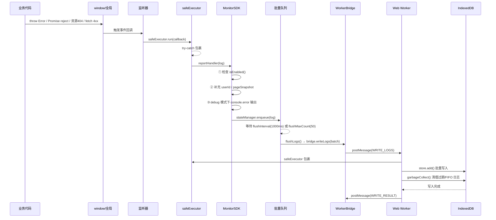
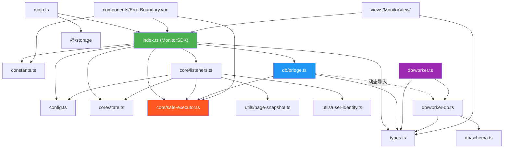
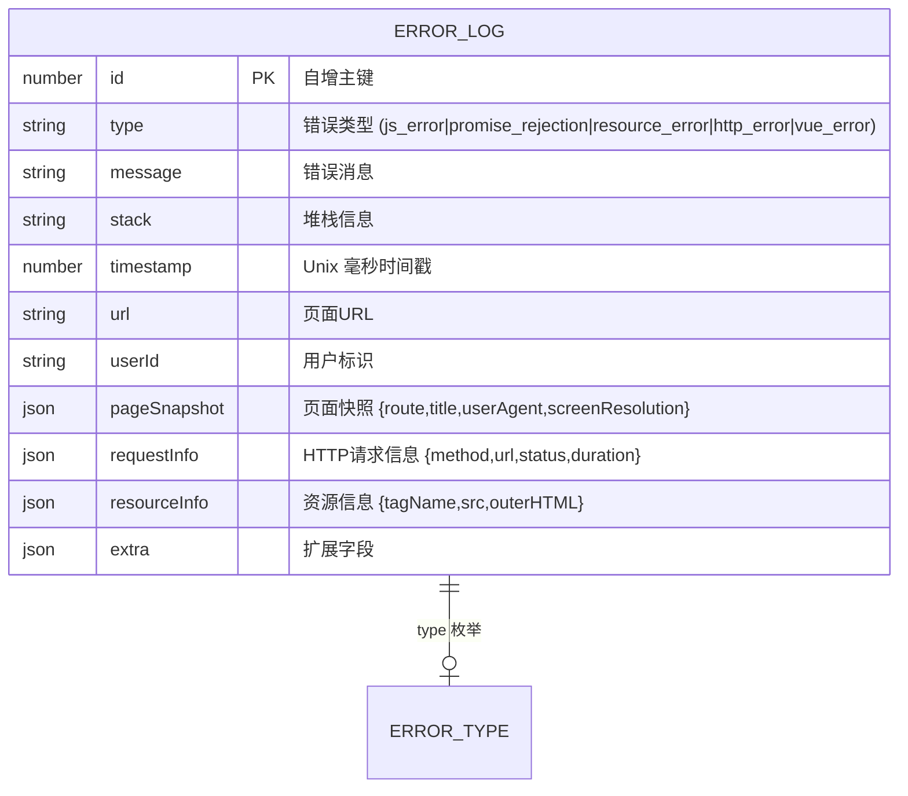

# MonitorSDK — 前端全局运行时错误监控

> **模块路径**：[`src/monitor/`](./)
> **版本**：v1.0.0（当前版本号见根目录 [`package.json`](../../package.json)）
> **技术栈**：TypeScript 6.0 + IndexedDB + Web Worker + Vue 3.5
> **依赖**：`idb` ^8.0.3（IndexedDB Promise 封装）、`date-fns` ^4.4.0（MonitorView 导出用）
> **最后更新**：2026-08-01

---

## 目录

- [MonitorSDK — 前端全局运行时错误监控](#monitorsdk--前端全局运行时错误监控)
  - [目录](#目录)
  - [1. 概述与架构设计](#1-概述与架构设计)
    - [1.1 模块定位与核心目标](#11-模块定位与核心目标)
    - [1.2 整体架构](#12-整体架构)
    - [1.3 核心数据流](#13-核心数据流)
    - [1.4 关键设计决策](#14-关键设计决策)
  - [2. 目录结构与模块划分](#2-目录结构与模块划分)
    - [2.1 完整目录树](#21-完整目录树)
    - [2.2 模块依赖关系](#22-模块依赖关系)
  - [3. 数据库设计](#3-数据库设计)
    - [3.1 数据库概览](#31-数据库概览)
    - [3.2 表结构](#32-表结构)
    - [3.3 索引设计](#33-索引设计)
    - [3.4 数据清理策略](#34-数据清理策略)
    - [3.5 实体关系图](#35-实体关系图)
  - [4. 配置说明](#4-配置说明)
    - [4.1 完整配置项列表](#41-完整配置项列表)
    - [4.2 推荐配置示例](#42-推荐配置示例)
  - [5. 接入与使用方式](#5-接入与使用方式)
    - [5.1 基础接入（一行初始化）](#51-基础接入一行初始化)
    - [5.2 ErrorBoundary 错误边界](#52-errorboundary-错误边界)
    - [5.3 手动上报自定义错误](#53-手动上报自定义错误)
    - [5.4 运行时开关控制](#54-运行时开关控制)
    - [5.5 查询与导出日志](#55-查询与导出日志)
    - [5.6 MonitorView 可视化面板](#56-monitorview-可视化面板)
    - [5.7 调试模式](#57-调试模式)
  - [6. API 说明](#6-api-说明)
    - [6.1 MonitorSDK 公开接口](#61-monitorsdk-公开接口)
      - [`init(config?)`](#initconfig)
      - [`report(error)`](#reporterror)
      - [`queryLogs(filter)`](#querylogsfilter)
      - [`exportLogs()`](#exportlogs)
      - [`clearLogs()`](#clearlogs)
    - [6.2 Worker 通信协议（内部）](#62-worker-通信协议内部)
    - [6.3 ErrorBoundary 组件接口](#63-errorboundary-组件接口)
    - [6.4 配置 API](#64-配置-api)
  - [7. 监控指标与告警](#7-监控指标与告警)
    - [内置监控指标](#内置监控指标)
    - [告警规则与通知](#告警规则与通知)
    - [添加自定义指标](#添加自定义指标)
  - [8. 运维与排障](#8-运维与排障)
    - [8.1 日志级别与输出](#81-日志级别与输出)
    - [8.2 常见问题排查](#82-常见问题排查)
      - [问题 1：监控数据没有写入 IndexedDB](#问题-1监控数据没有写入-indexeddb)
      - [问题 2：性能问题（页面卡顿）](#问题-2性能问题页面卡顿)
      - [问题 3：Worker 降级模式](#问题-3worker-降级模式)
      - [问题 4：日志数据丢失](#问题-4日志数据丢失)
      - [问题 5：CSV 导出中文乱码](#问题-5csv-导出中文乱码)
    - [8.3 健康检查](#83-健康检查)
  - [9. 安全与权限](#9-安全与权限)
    - [API 鉴权](#api-鉴权)
    - [数据脱敏](#数据脱敏)
    - [访问控制](#访问控制)
  - [10. 版本历史与兼容性](#10-版本历史与兼容性)
    - [当前版本](#当前版本)
    - [向前/向后兼容性](#向前向后兼容性)
    - [升级迁移指南](#升级迁移指南)
  - [附录 A：ErrorLog 完整字段说明](#附录-aerrorlog-完整字段说明)
  - [附录 B：相关文档索引](#附录-b相关文档索引)

---

## 1. 概述与架构设计

### 1.1 模块定位与核心目标

MonitorSDK 是 **winning-webui-mras-aima（指标助手）** 项目的前端全局运行时错误监控模块。它提供无侵入的自动错误捕获能力，将异常日志持久化到浏览器本地 IndexedDB，并通过内置的 MonitorView 页面提供日志查看、筛选、导出等运维功能。

| 目标         | 说明                                                                                             |
| ------------ | ------------------------------------------------------------------------------------------------ |
| **无侵入**   | 业务代码零改动，初始化后自动监听全局错误事件                                                     |
| **易插拔**   | `enable()` / `disable()` API 随时开关，关闭后完全释放资源（移除监听器、终止 Worker、清除定时器） |
| **绝对容错** | 监控 SDK 自身任何异常绝不抛出到全局作用域，不导致业务中断或白屏                                  |
| **性能优先** | IndexedDB 写操作委托给 Web Worker，主线程零阻塞；批量写入减少通信频率                            |

### 1.2 整体架构

```
┌──────────────────────────────────────────────────────────────────┐
│                         Main Thread                               │
│                                                                   │
│  ┌────────────┐  ┌──────────────┐  ┌────────────┐  ┌──────────┐ │
│  │  onerror   │  │ unhandled    │  │  resource  │  │  fetch   │ │
│  │  listener  │  │ rejection   │  │   error    │  │  hijack  │ │
│  └─────┬──────┘  └──────┬───────┘  └─────┬──────┘  └────┬─────┘ │
│        │                │                │              │        │
│        └──────────┬─────┴────────────────┴──────────────┘        │
│                   ▼                                               │
│          ┌──────────────────┐                                     │
│          │   safeExecutor   │  ← 所有回调经 try-catch 包裹        │
│          │   (防爆墙)        │     任何异常不会泄漏到全局           │
│          └────────┬─────────┘                                     │
│                   ▼                                               │
│          ┌──────────────────┐                                     │
│          │   MonitorSDK     │  ← 统一入口：检查 enabled 状态、     │
│          │   .report(log)   │     补充 userId / pageSnapshot       │
│          └────────┬─────────┘                                     │
│                   │                                               │
│          ┌────────▼─────────┐                                     │
│          │   批量队列        │  ← flushInterval=1000ms 或          │
│          │   (state.ts)     │     flushMaxCount=50 触发刷新        │
│          └────────┬─────────┘                                     │
│                   │ postMessage                                    │
│                   ▼                                               │
│          ┌──────────────────┐                                     │
│          │  WorkerBridge    │  ← 双向通信 + 降级模式               │
│          │  (bridge.ts)     │     请求/响应通过 requestId 匹配      │
│          └────────┬─────────┘                                     │
└───────────────────┼───────────────────────────────────────────────┘
                    │
┌───────────────────┼───────────────────────────────────────────────┐
│                   ▼                    Web Worker                  │
│          ┌──────────────────┐                                     │
│          │  WorkerEntry     │  ← 消息路由 + safeExecutor 包裹      │
│          │  (worker.ts)     │                                     │
│          └────────┬─────────┘                                     │
│                   ▼                                               │
│          ┌──────────────────┐                                     │
│          │   worker-db.ts   │  ← IndexedDB CRUD 封装              │
│          │                  │     写入后自动触发垃圾回收            │
│          └────────┬─────────┘                                     │
│                   ▼                                               │
│          ┌──────────────────┐                                     │
│          │   IndexedDB      │  ← 浏览器本地数据库                  │
│          │   error_logs     │     keyPath: id (自增主键)           │
│          └──────────────────┘                                     │
└───────────────────────────────────────────────────────────────────┘
```

**架构分层：**

| 层         | 模块                                                                | 职责                                                        |
| ---------- | ------------------------------------------------------------------- | ----------------------------------------------------------- |
| **监听层** | [`listeners.ts`](./core/listeners.ts)                               | 绑定/解绑 4 类全局错误监听器（JS、Promise、资源、fetch）    |
| **安全层** | [`safe-executor.ts`](./core/safe-executor.ts)                       | 所有回调包裹 try-catch，异常静默降级，绝不上抛              |
| **编排层** | [`index.ts`](./index.ts)                                            | SDK 入口，管理生命周期（init/enable/disable），批量写入调度 |
| **状态层** | [`state.ts`](./core/state.ts)                                       | 内部状态管理（enabled 标志、批量队列、定时器）              |
| **通信层** | [`bridge.ts`](./db/bridge.ts)                                       | 主线程 ↔ Worker 双向通信，支持降级模式                      |
| **持久层** | [`worker-db.ts`](./db/worker-db.ts) + [`schema.ts`](./db/schema.ts) | IndexedDB 的 CRUD、查询、垃圾回收                           |
| **工具层** | [`utils/`](./utils/)                                                | 页面快照采集、用户标识解析                                  |
| **组件层** | [`ErrorBoundary.vue`](./components/ErrorBoundary.vue)               | Vue 3 错误边界，捕获子组件渲染异常                          |

### 1.3 核心数据流



### 1.4 关键设计决策

| 决策                 | 选择                                | 理由                                                                                                                              |
| -------------------- | ----------------------------------- | --------------------------------------------------------------------------------------------------------------------------------- |
| **IndexedDB 封装库** | `idb` v8 (Jake Archibald)           | ~1.5KB gzipped，Promise 风格 API，ISC 协议（商业友好），Google Chrome 团队维护                                                    |
| **Worker 策略**      | 主线程监听 + Worker 写库            | 监听必须访问 `window` / DOM 对象；IndexedDB 写操作可在 Worker 中完成，避免阻塞主线程 UI 渲染                                      |
| **fetch 监控方式**   | 全局劫持 `window.fetch`             | 项目统一使用原生 `fetch`（经 [`src/utils/request.ts`](../utils/request.ts) 封装），非 XHR；仅记录失败的请求（4xx/5xx 或网络异常） |
| **批量写入策略**     | 时间驱动（1s）+ 数量驱动（50 条）   | 减少 Worker 通信次数，防止日志风暴时频繁 postMessage                                                                              |
| **存储上限**         | 1000 条 + 50MB（均可配置）          | 按 FIFO 淘汰 + 7 天过期自动清理，存储增长可控                                                                                     |
| **Worker 降级**      | 自动降级到主线程模式                | 当 Web Worker 不可用（旧浏览器、安全策略限制）时，自动在主线程直接操作 IndexedDB，保证功能不中断                                  |
| **错误序列化**       | 主线程将 Error 序列化为纯对象后传递 | `Error` 对象不可结构化克隆，必须提前提取 `message`、`stack` 等属性                                                                |

---

## 2. 目录结构与模块划分

### 2.1 完整目录树

```
src/monitor/
├── index.ts                       # SDK 入口，导出 monitorSDK 单例
├── types.ts                       # 所有 TypeScript 类型定义
├── constants.ts                   # 常量（ErrorType 枚举、默认配置）
├── config.ts                      # 配置合并与读取
│
├── core/                          # 核心逻辑（无外部依赖）
│   ├── listeners.ts               # 全局监听器绑定/解绑（4 类错误源）
│   ├── safe-executor.ts           # 安全执行器——"防爆墙"，所有回调的 try-catch 包裹层
│   └── state.ts                   # 内部状态管理（enabled 标志、批量队列、定时器）
│
├── db/                            # 持久化层（IndexedDB + Web Worker）
│   ├── schema.ts                  # IndexedDB 数据库 Schema 定义（store、索引）
│   ├── bridge.ts                  # 主线程端 Worker 通信桥（生命周期、请求/响应匹配、降级）
│   ├── worker.ts                  # Web Worker 入口文件（消息路由、安全包裹）
│   └── worker-db.ts               # Worker 内 IndexedDB 操作封装（CRUD + 垃圾回收）
│
├── components/                    # Vue 组件
│   └── ErrorBoundary.vue          # Vue 3 错误边界组件（onErrorCaptured）
│
└── utils/                         # 工具函数
    ├── page-snapshot.ts           # 页面状态快照采集（路由、标题、UA、分辨率）
    └── user-identity.ts           # 用户标识解析（从配置的 userId 函数获取）
```

### 2.2 模块依赖关系



**依赖方向约束：**

- [`core/`](./core/) 子模块不依赖 [`db/`](./db/) 和 [`utils/`](./utils/)，保持纯逻辑
- [`db/schema.ts`](./db/schema.ts) 和 [`db/worker-db.ts`](./db/worker-db.ts) 不导入任何主线程模块，确保可在 Worker 上下文独立运行
- [`utils/`](./utils/) 子模块仅依赖 [`types.ts`](./types.ts)，不依赖其他模块
- 循环依赖通过"回调注入"模式打破：监听器模块的 `report` 回调由 SDK 入口通过 [`setReportCallback()`](./core/listeners.ts:19) 注入

---

## 3. 数据库设计

### 3.1 数据库概览

| 属性           | 值                                                       |
| -------------- | -------------------------------------------------------- |
| **数据库类型** | IndexedDB（浏览器内置）                                  |
| **封装库**     | `idb` ^8.0.3                                             |
| **数据库名称** | `__mras_aima_monitor_db__`（可通过 `dbName` 配置项修改） |
| **当前版本**   | `1`                                                      |
| **对象存储**   | `error_logs`（仅一个 store）                             |

### 3.2 表结构

**对象存储：`error_logs`**

| 字段           | 类型                      | 约束           | 默认值   | 说明                                                  |
| -------------- | ------------------------- | -------------- | -------- | ----------------------------------------------------- |
| `id`           | `number`                  | **主键**，自增 | 自动生成 | 日志唯一标识                                          |
| `type`         | `ErrorType`               | NOT NULL       | —        | 错误类型（见下方枚举）                                |
| `message`      | `string`                  | NOT NULL       | —        | 错误消息                                              |
| `stack`        | `string`                  | 可选           | —        | 错误堆栈信息                                          |
| `timestamp`    | `number`                  | NOT NULL       | —        | 发生时间（Unix 毫秒时间戳）                           |
| `url`          | `string`                  | NOT NULL       | —        | 发生错误的页面 URL                                    |
| `userId`       | `string`                  | 可选           | —        | 用户标识（通过配置的 `userId()` 函数获取）            |
| `pageSnapshot` | `PageSnapshot`            | 可选           | —        | 页面状态快照（仅 `capturePageSnapshot: true` 时采集） |
| `requestInfo`  | `RequestInfo`             | 可选           | —        | HTTP 请求错误附加信息                                 |
| `resourceInfo` | `ResourceInfo`            | 可选           | —        | 资源加载错误附加信息                                  |
| `extra`        | `Record<string, unknown>` | 可选           | —        | 扩展字段（Vue 组件名、文件名、行号等）                |

**`ErrorType` 枚举值**（定义于 [`constants.ts`](./constants.ts:8-14)）：

| 常量                           | 值                    | 触发场景                                                                    |
| ------------------------------ | --------------------- | --------------------------------------------------------------------------- |
| `ERROR_TYPE.JS_ERROR`          | `'js_error'`          | `window.onerror` 捕获的同步 JS 运行时错误                                   |
| `ERROR_TYPE.PROMISE_REJECTION` | `'promise_rejection'` | `unhandledrejection` 事件捕获的未处理 Promise 拒绝                          |
| `ERROR_TYPE.RESOURCE_ERROR`    | `'resource_error'`    | `<script>` / `<link>` / `` 等资源加载失败                              |
| `ERROR_TYPE.HTTP_ERROR`        | `'http_error'`        | `fetch` 返回 4xx/5xx 或网络请求异常                                         |
| `ERROR_TYPE.VUE_ERROR`         | `'vue_error'`         | Vue 组件渲染/生命周期错误（通过 `ErrorBoundary` 或 `onErrorCaptured` 捕获） |

**嵌套类型详情**（定义于 [`types.ts`](./types.ts)）：

```typescript
// 页面状态快照
interface PageSnapshot {
  route: string; // 当前路由路径（含 query string）
  title: string; // 页面标题
  userAgent: string; // 浏览器 UA
  screenResolution: string; // 屏幕分辨率（如 "1920x1080"）
}

// HTTP 请求错误附加信息
interface RequestInfo {
  method: string; // HTTP 方法（GET/POST/...）
  url: string; // 请求 URL
  status?: number; // HTTP 状态码（仅 HTTP 错误时有值）
  statusText?: string; // HTTP 状态文本
  duration: number; // 请求耗时（毫秒）
}

// 资源加载错误附加信息
interface ResourceInfo {
  tagName: string; // 标签名（script/link/img）
  src: string; // 资源 URL
  outerHTML: string; // 元素 HTML（截断至 200 字符）
}
```

### 3.3 索引设计

**索引定义**（创建逻辑见 [`schema.ts`](./db/schema.ts:17-33)）：

```typescript
// 1. 按错误类型查询
store.createIndex('by_type', 'type', { unique: false });

// 2. 按时间范围查询
store.createIndex('by_timestamp', 'timestamp', { unique: false });

// 3. 按用户标识查询
store.createIndex('by_user_id', 'userId', { unique: false });
```

| 索引名         | 字段        | 唯一性 | 查询场景                           | 设计理由                                           |
| -------------- | ----------- | ------ | ---------------------------------- | -------------------------------------------------- |
| `by_type`      | `type`      | 非唯一 | 按错误类型筛选（如"只看 JS 错误"） | MonitorView 统计面板的核心查询                     |
| `by_timestamp` | `timestamp` | 非唯一 | 按时间范围筛选 + 垃圾回收范围删除  | 支持时间范围游标遍历，是过期清理和 FIFO 淘汰的关键 |
| `by_user_id`   | `userId`    | 非唯一 | 按用户筛选日志                     | 支持多用户场景下的问题定位                         |

**查询策略**（[`worker-db.ts`](./db/worker-db.ts:56-96)）：

查询时优先选择最合适的索引以减少全表扫描：

1. 有 `startTime` / `endTime` → 使用 `by_timestamp` 索引 + `IDBKeyRange.bound()`
2. 仅单一 `type` 过滤 → 使用 `by_type` 索引 + `IDBKeyRange.only()`
3. 有 `userId` 过滤 → 使用 `by_user_id` 索引
4. 否则 → 全量扫描 `store.getAll()`

多 `types` 过滤在内存中完成二次过滤，结果按时间倒序排列后分页返回。

### 3.4 数据清理策略

垃圾回收在**每次批量写入完成后**自动触发（[`worker-db.ts`](./db/worker-db.ts:142-168)），包含两个阶段：

**阶段 1：过期日志清理**

```typescript
// 删除所有 timestamp 早于 (now - expireDays 天) 的日志
const expireTime = Date.now() - config.expireDays * 24 * 60 * 60 * 1000;
// 默认：删除 7 天前的日志
```

**阶段 2：FIFO 容量淘汰**

```typescript
// 如果日志条数超过 maxLogCount，按时间从旧到新删除多余记录
const count = await store.count();
if (count > config.maxLogCount) {
  const deleteCount = count - config.maxLogCount;
  // 默认：保留最新 1000 条
}
```

> **注意**：`maxLogSize`（50MB）配置项当前已在类型定义和默认配置中声明，但在垃圾回收实现中暂未启用基于字节大小的清理逻辑。当前仅使用条数上限（`maxLogCount`）和时间过期（`expireDays`）两种策略。基于存储空间大小的清理功能计划在后续版本中实现。

**存储估算：**

| 指标              | 估算值  | 说明                            |
| ----------------- | ------- | ------------------------------- |
| 单条日志平均大小  | ~2-5 KB | 含 message、stack、extra 等字段 |
| 1000 条日志总大小 | ~2-5 MB | 远低于 50MB 上限                |
| 默认过期天数      | 7 天    | —                               |

### 3.5 实体关系图



---

## 4. 配置说明

### 4.1 完整配置项列表

所有配置项定义于 [`constants.ts`](./constants.ts:26-39) 的 `DEFAULT_CONFIG` 对象和 [`types.ts`](./types.ts:7-32) 的 `MonitorConfig` 接口。

| 配置项                | 类型                        | 默认值                              | 说明                                                                               |
| --------------------- | --------------------------- | ----------------------------------- | ---------------------------------------------------------------------------------- |
| `enabled`             | `boolean`                   | `true`                              | 初始化后是否自动启用监控                                                           |
| `userId`              | `() => string \| undefined` | `() => undefined`                   | 用户标识获取函数，返回值会附加到每条日志                                           |
| `capturePageSnapshot` | `boolean`                   | `false`                             | 是否采集页面状态快照（路由、标题、UA、分辨率）。开启后每条日志附加当前页面快照     |
| `dbName`              | `string`                    | `'__mras_aima_monitor_db__'`        | IndexedDB 数据库名称。多项目共存时建议修改以隔离数据                               |
| `maxLogCount`         | `number`                    | `1000`                              | 日志最大保留条数（FIFO 淘汰）                                                      |
| `maxLogSize`          | `number`                    | `52428800`（50 MB）                 | 日志最大总大小（字节）。**当前版本仅声明，垃圾回收未实际使用此配置**               |
| `expireDays`          | `number`                    | `7`                                 | 日志过期天数（超过此天数的日志自动清理）                                           |
| `flushInterval`       | `number`                    | `1000`                              | 批量写入 debounce 间隔（毫秒）。日志不清空时，每隔此时间自动刷新到 IndexedDB       |
| `flushMaxCount`       | `number`                    | `50`                                | 批量写入最大条数。队列达到此数量时立即刷新，不等待 `flushInterval`                 |
| `debug`               | `boolean`                   | `false`                             | 是否开启调试模式。开启后内部异常信息输出到 `console.debug`                         |
| `captureTypes`        | `ErrorType[]`               | `[...ALL_ERROR_TYPES]`（全部 5 种） | 错误类型白名单。仅捕获列表中指定的错误类型                                         |
| `fetchUrlFilter`      | `(url: string) => boolean`  | `() => true`                        | fetch 监控的 URL 过滤器。返回 `false` 的请求不监控。可用于排除静态资源、健康检查等 |

### 4.2 推荐配置示例

**开发环境**（详细日志输出，便于调试）：

```typescript
// src/main.ts
import { monitorSDK } from '@/monitor';
import { getStorage } from '@/storage/storage';
import { STORAGE_KEYS } from '@/storage/storage-defs';

monitorSDK.init({
  userId: () => getStorage(STORAGE_KEYS.USER_INFO)?.userId || undefined,
  debug: true, // 开发环境开启调试日志
  capturePageSnapshot: true, // 开发时采集页面快照便于排查
  flushInterval: 500, // 更快的写入频率
  expireDays: 1, // 开发环境仅保留 1 天
});
```

**生产环境**（性能优先，静默运行）：

```typescript
monitorSDK.init({
  userId: () => getStorage(STORAGE_KEYS.USER_INFO)?.userId || undefined,
  debug: false, // 生产环境完全静默
  capturePageSnapshot: false, // 关闭快照以提升性能
  maxLogCount: 2000, // 增大存储上限
  expireDays: 30, // 延长保留时间
  captureTypes: ['js_error', 'promise_rejection', 'vue_error'], // 仅关注关键错误
  fetchUrlFilter: (url) => !url.includes('/health'), // 排除健康检查请求
});
```

**自定义错误类型过滤**（仅监控 JS 错误和 HTTP 异常）：

```typescript
import { ERROR_TYPE } from '@/monitor/constants';

monitorSDK.init({
  userId: () => getStorage(STORAGE_KEYS.USER_INFO)?.userId || undefined,
  captureTypes: [ERROR_TYPE.JS_ERROR, ERROR_TYPE.HTTP_ERROR],
});
```

---

## 5. 接入与使用方式

### 5.1 基础接入（一行初始化）

在 [`src/main.ts`](../main.ts) 中，Vue 应用挂载前调用 `monitorSDK.init()`：

```typescript
// src/main.ts
import { createApp } from 'vue';
import { createPinia } from 'pinia';
import './style.scss';
import App from './App.vue';
import router from './router';
import vuetify from './plugins/vuetify';
import { monitorSDK } from '@/monitor';
import { getStorage } from '@/storage/storage';
import { STORAGE_KEYS } from '@/storage/storage-defs';

const app = createApp(App);
const pinia = createPinia();

app.use(pinia);
app.use(router);
app.use(vuetify);

// ===== MonitorSDK 初始化 =====
monitorSDK.init({
  userId: () => getStorage(STORAGE_KEYS.USER_INFO)?.userId || undefined,
  debug: import.meta.env.DEV,
});
// ==============================

app.mount('#app');
```

初始化完成后，以下错误将**自动**被捕获（无需额外配置）：

1. **JS 运行时错误** — `window.addEventListener('error')` 捕获
2. **未处理的 Promise 拒绝** — `window.addEventListener('unhandledrejection')` 捕获
3. **资源加载失败**（`<script>`、`<link>`、`` 等）— `window.addEventListener('error', handler, true)` 捕获阶段监听
4. **HTTP 请求异常**（4xx/5xx 及网络错误）— 劫持 `window.fetch` 记录

### 5.2 ErrorBoundary 错误边界

[`ErrorBoundary.vue`](./components/ErrorBoundary.vue) 是一个 Vue 3 错误边界组件，通过 [`onErrorCaptured`](https://vuejs.org/api/composition-api-lifecycle.html#onerrorcaptured) 钩子捕获子组件渲染/生命周期中的错误，上报到 MonitorSDK 并展示降级 UI。

**推荐在 `App.vue` 中包裹 `<router-view />`**，防止单个页面错误导致整个应用白屏：

```vue
<!-- src/App.vue -->
<script setup lang="ts">
import ErrorBoundary from '@/monitor/components/ErrorBoundary.vue';
</script>

<template>
  <ErrorBoundary>
    <template #default>
      <router-view />
    </template>
  </ErrorBoundary>
</template>
```

**自定义降级 UI：**

```vue
<ErrorBoundary>
  <template #default>
    <YourComponent />
  </template>
  <template #fallback="{ error }">
    <div class="error-container">
      <h2>页面发生错误</h2>
      <p>{{ error.message }}</p>
      <v-btn @click="handleRetry">重试</v-btn>
    </div>
  </template>
</ErrorBoundary>
```

> **注意**：`ErrorBoundary` 仅捕获其**子组件树**中的错误。全局未被任何 ErrorBoundary 包裹的错误仍会被 `window.onerror` 捕获。

### 5.3 手动上报自定义错误

对于业务逻辑中需要主动上报的错误（如 API 返回的业务错误、数据校验失败等），使用 `monitorSDK.report()`：

```typescript
import { monitorSDK } from '@/monitor';
import { ERROR_TYPE } from '@/monitor/constants';

// 上报自定义错误
monitorSDK.report({
  type: ERROR_TYPE.JS_ERROR,
  message: '数据校验失败：用户名不能为空',
  timestamp: Date.now(),
  url: location.href,
  extra: {
    module: 'UserForm',
    field: 'username',
  },
});
```

**典型场景示例：**

```typescript
// 场景 1：API 调用失败时附带上下文
try {
  const res = await fetchUserList();
  // ...
} catch (error) {
  monitorSDK.report({
    type: ERROR_TYPE.JS_ERROR,
    message: `获取用户列表失败: ${error instanceof Error ? error.message : String(error)}`,
    stack: error instanceof Error ? error.stack : '',
    timestamp: Date.now(),
    url: location.href,
    extra: { api: '/api/users', params: { page: 1 } },
  });
}

// 场景 2：定时任务异常
setInterval(() => {
  try {
    syncData();
  } catch (error) {
    monitorSDK.report({
      type: ERROR_TYPE.JS_ERROR,
      message: `定时同步失败: ${error instanceof Error ? error.message : String(error)}`,
      timestamp: Date.now(),
      url: location.href,
      extra: { task: 'dataSync', interval: '30s' },
    });
  }
}, 30_000);
```

### 5.4 运行时开关控制

```typescript
import { monitorSDK } from '@/monitor';

// 查询当前状态
const isOn = monitorSDK.isEnabled(); // → boolean

// 暂停监控（移除所有监听器、终止 Worker、清除定时器、刷新残留队列）
monitorSDK.disable();

// 暂停并清除已存储的日志
monitorSDK.disable(true);

// 重新开启监控（重新绑定监听器、重建 Worker）
monitorSDK.enable();
```

**`disable()` 的资源释放清单：**

1. 刷新队列中残留的日志到 IndexedDB
2. 移除所有事件监听器（`window.removeEventListener`）
3. 恢复原始的 `window.fetch`
4. 终止 Web Worker
5. 清理内部状态（`enabled` 标志、批量队列、定时器）
6. 可选：清除已存储的日志（`disable(true)`）

### 5.5 查询与导出日志

```typescript
import { monitorSDK } from '@/monitor';
import { ERROR_TYPE } from '@/monitor/constants';

// 按类型和时间范围查询
const logs = await monitorSDK.queryLogs({
  types: [ERROR_TYPE.JS_ERROR, ERROR_TYPE.HTTP_ERROR],
  startTime: Date.now() - 24 * 60 * 60 * 1000, // 最近 24 小时
  limit: 50,
  offset: 0,
});

// 按用户查询
const userLogs = await monitorSDK.queryLogs({
  userId: 'user_123',
  limit: 20,
});

// 导出全部日志（JSON 格式，含 id 字段）
const allLogs = await monitorSDK.exportLogs();

// 获取日志总数
const count = await monitorSDK.getLogCount(); // → number

// 清空全部日志
await monitorSDK.clearLogs();
```

### 5.6 MonitorView 可视化面板

项目内置了 MonitorView 可视化面板（[`src/views/MonitorView/`](../views/MonitorView/)），提供以下功能：

- **统计面板**：按错误类型展示数量分布，支持点击筛选
- **日志表格**：分页展示所有日志，支持按类型、关键词、时间范围筛选
- **日志详情**：点击行查看完整错误信息、堆栈和 JSON 原始数据
- **导出功能**：支持导出为 JSON 或 CSV（含 UTF-8 BOM，兼容 Excel）
- **SDK 开关**：一键启用/暂停监控
- **清空日志**：带二次确认的清空操作

MonitorView 通过 Vue Router 配置的路由路径访问（具体路径见 [`src/router/index.ts`](../router/index.ts)）。

### 5.7 调试模式

**方式 1：初始化时配置**

```typescript
monitorSDK.init({
  debug: true, // 开启后 monitor 内部异常信息输出到 console.debug
});
```

**方式 2：生产环境运行时开启控制台输出**

在浏览器控制台执行：

```javascript
sessionStorage.setItem('__mras_aima_monitor_console__', 'true');
```

设置后每条上报的错误都会同时输出到 `console.error`，方便在生产环境排查问题。关闭方式：

```javascript
sessionStorage.removeItem('__mras_aima_monitor_console__');
```

> 该 key 定义于 [`constants.ts`](./constants.ts:17) 的 `CONSOLE_OUTPUT_KEY` 常量。

---

## 6. API 说明

### 6.1 MonitorSDK 公开接口

MonitorSDK 作为单例通过 `monitorSDK` 导出（[`index.ts`](./index.ts:84)），所有方法均为异步安全（内部经 `safeExecutor` 包裹）。

| 方法          | 签名                                           | 说明                                                                                                  |
| ------------- | ---------------------------------------------- | ----------------------------------------------------------------------------------------------------- |
| `init`        | `(config?: Partial<MonitorConfig>) => void`    | 初始化 SDK。可多次调用以更新配置。首次调用后若 `enabled: true` 则自动启用。重复调用不会重复绑定监听器 |
| `enable`      | `() => void`                                   | 启用监控：绑定所有监听器、标记状态为已启用。已在启用状态时调用无效果                                  |
| `disable`     | `(clearLogs?: boolean) => void`                | 禁用监控：刷新残留日志、移除监听器、终止 Worker、清理状态。`clearLogs=true` 时额外清空 IndexedDB      |
| `report`      | `(error: ErrorLogInput) => void`               | 手动上报一条错误日志。如果 SDK 已禁用则静默忽略                                                       |
| `queryLogs`   | `(filter: QueryFilter) => Promise<ErrorLog[]>` | 按条件查询日志。返回结果含 `id` 字段，按时间倒序排列                                                  |
| `exportLogs`  | `() => Promise<ErrorLog[]>`                    | 导出全量日志（含 `id` 字段），按时间倒序                                                              |
| `clearLogs`   | `() => Promise<void>`                          | 清空 IndexedDB 中所有日志                                                                             |
| `isEnabled`   | `() => boolean`                                | 查询当前 SDK 启用状态                                                                                 |
| `getLogCount` | `() => Promise<number>`                        | 获取当前日志总数                                                                                      |

#### `init(config?)`

**参数：** `Partial<MonitorConfig>` — 需要覆盖的配置项（与默认配置深度合并）

**示例：**

```typescript
monitorSDK.init({
  userId: () => getStorage(STORAGE_KEYS.USER_INFO)?.userId || undefined,
  debug: import.meta.env.DEV,
  maxLogCount: 2000,
});
```

#### `report(error)`

**参数：** `ErrorLogInput`

```typescript
interface ErrorLogInput {
  type: ErrorType; // 必填：错误类型
  message: string; // 必填：错误消息
  stack?: string; // 可选：堆栈信息
  timestamp: number; // 必填：Unix 毫秒时间戳
  url: string; // 必填：发生错误的页面 URL
  userId?: string; // 可选：用户标识（SDK 会自动补充）
  pageSnapshot?: PageSnapshot; // 可选：页面快照（SDK 按配置自动补充）
  requestInfo?: RequestInfo; // 可选：HTTP 请求附加信息
  resourceInfo?: ResourceInfo; // 可选：资源加载附加信息
  extra?: Record<string, unknown>; // 可选：扩展字段
}
```

**示例：**

```typescript
monitorSDK.report({
  type: ERROR_TYPE.VUE_ERROR,
  message: '组件渲染失败',
  stack: 'Error: ...\n    at ...',
  timestamp: Date.now(),
  url: location.href,
  extra: { componentName: 'UserTable', userId: '123' },
});
```

#### `queryLogs(filter)`

**参数：** `QueryFilter`

```typescript
interface QueryFilter {
  types?: ErrorType[]; // 错误类型过滤（多选）
  startTime?: number; // 起始时间 (Unix ms)
  endTime?: number; // 结束时间 (Unix ms)
  userId?: string; // 用户标识过滤
  offset?: number; // 分页偏移量（默认 0）
  limit?: number; // 分页条数（默认 100）
}
```

**返回：** `Promise<ErrorLog[]>` — 含 `id` 字段的日志数组，按时间倒序

**示例：**

```typescript
// 查询最近 1 小时的所有 JS 错误
const logs = await monitorSDK.queryLogs({
  types: [ERROR_TYPE.JS_ERROR],
  startTime: Date.now() - 3600_000,
  limit: 20,
});

// logs 示例输出：
// [
//   {
//     id: 42,
//     type: 'js_error',
//     message: 'Uncaught TypeError: Cannot read properties of undefined',
//     stack: 'TypeError: ...\n    at UserTable.vue:23:15',
//     timestamp: 1722508800000,
//     url: 'https://example.com/users',
//     userId: 'user_123',
//     extra: { filename: 'UserTable.vue', lineno: 23, colno: 15 }
//   }
// ]
```

#### `exportLogs()`

**返回：** `Promise<ErrorLog[]>` — 全量日志，按时间倒序

#### `clearLogs()`

**返回：** `Promise<void>`

### 6.2 Worker 通信协议（内部）

主线程与 Web Worker 之间通过 `postMessage` 进行结构化克隆通信。协议类型定义见 [`types.ts`](./types.ts:98-115)。

**主线程 → Worker：**

```typescript
type WorkerMessage =
  | { type: 'SET_CONFIG'; payload: { dbName: string; maxLogCount: number; expireDays: number } }
  | { type: 'WRITE_LOGS'; payload: ErrorLogInput[]; requestId: string }
  | { type: 'QUERY_LOGS'; payload: QueryFilter; requestId: string }
  | { type: 'EXPORT_LOGS'; requestId: string }
  | { type: 'CLEAR_LOGS' }
  | { type: 'GET_COUNT'; requestId: string }
  | { type: 'PING' };
```

**Worker → 主线程：**

```typescript
type WorkerResponse =
  | { type: 'WRITE_RESULT'; success: boolean; error?: string; requestId: string }
  | { type: 'QUERY_RESULT'; requestId: string; data: ErrorLog[] }
  | { type: 'EXPORT_RESULT'; requestId: string; data: ErrorLog[] }
  | { type: 'CLEAR_RESULT'; success: boolean }
  | { type: 'COUNT_RESULT'; requestId: string; count: number }
  | { type: 'PONG' }
  | { type: 'INTERNAL_ERROR'; context: string; error: string };
```

**协议特性：**

- **请求/响应匹配**：通过递增 `requestId`（格式 `req_{counter}_{timestamp}`）匹配请求和响应
- **心跳检测**：`PING` / `PONG` 机制，用于 Bridge 初始化时验证 Worker 可用性（2 秒超时）
- **错误上报**：Worker 内部异常通过 `INTERNAL_ERROR` 消息通知主线程，主线程静默记录
- **降级兼容**：降级模式下跳过 Worker，Bridge 直接调用 `worker-db.ts` 的函数，`sendToWorker()` 内部自动路由

### 6.3 ErrorBoundary 组件接口

**Props：** 无

**Slots：**

| Slot       | 作用域                     | 说明                                             |
| ---------- | -------------------------- | ------------------------------------------------ |
| `default`  | —                          | 正常渲染的子组件内容                             |
| `fallback` | `{ error: Error \| null }` | 发生错误时展示的降级 UI。不提供时使用内置默认 UI |

**Events：** 无

**行为：**

- 通过 [`onErrorCaptured`](https://vuejs.org/api/composition-api-lifecycle.html#onerrorcaptured) 捕获子组件树中的错误
- 上报 `vue_error` 类型日志到 MonitorSDK
- 返回 `false` 阻止错误继续向上传播
- 始终输出错误信息到 `console.error`（无论 SDK 是否启用）

### 6.4 配置 API

[`config.ts`](./config.ts) 提供了三个内部函数，一般用户无需直接调用：

| 函数            | 签名                                           | 说明                               |
| --------------- | ---------------------------------------------- | ---------------------------------- |
| `getConfig()`   | `() => Readonly<MonitorConfig>`                | 获取当前只读配置                   |
| `mergeConfig()` | `(userConfig: Partial<MonitorConfig>) => void` | 合并用户配置（引用类型字段深拷贝） |
| `resetConfig()` | `() => void`                                   | 重置为默认配置                     |

---

## 7. 监控指标与告警

### 内置监控指标

MonitorSDK 当前内置以下 5 类错误指标，每类均自动采集：

| 指标名称            | 类型   | 采集方式                            | 标签                                  | 含义                                    |
| ------------------- | ------ | ----------------------------------- | ------------------------------------- | --------------------------------------- |
| `js_error`          | 计数器 | `window.onerror`                    | `url`, `userId`                       | JS 运行时错误次数                       |
| `promise_rejection` | 计数器 | `unhandledrejection`                | `url`, `userId`                       | 未处理 Promise 拒绝次数                 |
| `resource_error`    | 计数器 | 捕获阶段 `error` 事件               | `tagName`, `src`, `url`               | 资源加载失败次数                        |
| `http_error`        | 计数器 | `window.fetch` 劫持                 | `method`, `status`, `url`, `duration` | HTTP 请求异常次数（4xx/5xx + 网络错误） |
| `vue_error`         | 计数器 | `ErrorBoundary` / `onErrorCaptured` | `componentName`, `url`                | Vue 组件渲染/生命周期错误次数           |

> **聚合方式**：所有指标以原始日志形式存储于 IndexedDB，MonitorView 面板按错误类型对全量数据进行前端聚合统计。**当前版本不支持将指标上报到外部监控系统（如 Prometheus、Grafana）或后端服务**。

### 告警规则与通知

**当前版本暂未实现自动告警和通知功能。** 监控数据完全存储在浏览器本地 IndexedDB，不具备以下能力：

- 阈值触发告警
- 邮件/短信/企业微信通知
- 与外部告警系统集成

### 添加自定义指标

通过 `monitorSDK.report()` 可手动上报自定义错误，配合 `extra` 字段携带业务自定义维度：

```typescript
monitorSDK.report({
  type: ERROR_TYPE.JS_ERROR,
  message: '自定义业务异常',
  timestamp: Date.now(),
  url: location.href,
  extra: {
    customMetric: 'user_signup_failure',
    step: 'sms_verification',
    errorCode: 'SMS_001',
  },
});
```

如需自动化上报自定义指标，可以在业务代码中使用 try-catch 包裹关键逻辑并通过 `report()` 上报，实现类似自定义埋点的效果。

---

## 8. 运维与排障

### 8.1 日志级别与输出

MonitorSDK 使用以下日志输出策略：

| 级别            | 触发条件                                 | 输出目标     | 说明                                               |
| --------------- | ---------------------------------------- | ------------ | -------------------------------------------------- |
| `console.error` | `debug: true` 或 sessionStorage 开关开启 | 浏览器控制台 | 每条上报的错误信息、消息、堆栈和完整日志对象       |
| `console.debug` | `debug: true`                            | 浏览器控制台 | SDK 内部异常（已被安全执行器捕获的）、状态变更通知 |
| **静默**        | `debug: false` 且未开启开关              | 无           | 生产环境默认不输出任何内容到控制台                 |

**关键日志示例：**

```javascript
// debug: true 时，状态变更输出
console.debug('[MonitorSDK] 监控已启用');
console.debug('[MonitorSDK] 监控已禁用');

// debug: true 时，内部异常输出
console.debug('[MonitorSDK] 内部异常已捕获 [listener-js_error]:', error);

// debug: true 或 sessionStorage 开关开启时，错误上报输出
console.error(`[MonitorSDK] js_error: Uncaught TypeError: ...`, stackTrace, fullLogObject);

// Worker 异常（仅 debug: true）
console.debug('[MonitorSDK] Web Worker 不可用，降级到主线程模式');
console.debug('[MonitorSDK] Worker 内部异常:', context, error);
```

### 8.2 常见问题排查

#### 问题 1：监控数据没有写入 IndexedDB

**排查步骤：**

1. 确认 SDK 已启用：
   ```javascript
   monitorSDK.isEnabled(); // 应为 true
   ```
2. 检查 `captureTypes` 配置是否包含了对应的错误类型：
   ```javascript
   // 确认当前配置
   import { getConfig } from '@/monitor/config';
   console.log(getConfig().captureTypes);
   ```
3. 检查 `fetchUrlFilter` 是否过滤掉了目标请求：
   ```javascript
   getConfig().fetchUrlFilter('https://your-api.com/endpoint'); // 应为 true
   ```
4. 开启 `debug` 模式查看日志：
   ```typescript
   monitorSDK.init({ debug: true });
   ```
5. 确认 IndexedDB 是否可用（私密模式可能限制 IndexedDB）：
   ```javascript
   // 在控制台执行
   const req = indexedDB.open('test', 1);
   req.onsuccess = () => console.log('IndexedDB 可用');
   req.onerror = () => console.log('IndexedDB 不可用');
   ```

#### 问题 2：性能问题（页面卡顿）

**原因分析：**

- `capturePageSnapshot: true` 每次错误都采集 DOM 信息
- 高频错误（如循环中报错）导致大量写入

**解决方案：**

```typescript
// 关闭页面快照
monitorSDK.init({ capturePageSnapshot: false });

// 增大批量写入阈值，减少 DB 操作频率
monitorSDK.init({
  flushMaxCount: 200, // 默认 50
  flushInterval: 5000, // 默认 1000ms
});

// 限制监控的错误类型
monitorSDK.init({
  captureTypes: [ERROR_TYPE.JS_ERROR, ERROR_TYPE.PROMISE_REJECTION],
});
```

#### 问题 3：Worker 降级模式

**现象：** 控制台显示 `[MonitorSDK] Web Worker 不可用，降级到主线程模式`

**原因：** 浏览器不支持 Web Worker 或安全策略限制（如某些 CSP 配置、file:// 协议）

**影响：** IndexedDB 操作将在主线程执行。对于少量日志（<1000 条），性能影响可以忽略。

**无需处理**：降级模式是自动的、透明的，功能完全一致。

#### 问题 4：日志数据丢失

**可能原因：**

1. 日志数达到 `maxLogCount` 上限，触发了 FIFO 淘汰
2. 日志超过 `expireDays` 天数被自动清理
3. `disable(true)` 被调用（带清空参数）
4. 浏览器清除站点数据

**排查方法：**

```javascript
// 检查当前日志总数
const count = await monitorSDK.getLogCount();
console.log('当前日志数:', count);

// 检查最早的日志时间
const logs = await monitorSDK.exportLogs();
if (logs.length > 0) {
  const oldest = logs[logs.length - 1]; // 按时间倒序
  console.log('最早日志:', new Date(oldest.timestamp));
}
```

#### 问题 5：CSV 导出中文乱码

MonitorView 的 CSV 导出已添加 UTF-8 BOM（`\uFEFF`），兼容 Excel。如果仍出现乱码：

1. 使用记事本或其他支持 UTF-8 的编辑器打开
2. Excel：使用"数据 → 从文本/CSV 导入"，选择 UTF-8 编码

### 8.3 健康检查

**当前版本未实现独立的健康检查端点。** SDK 自身状态可通过以下方式检查：

```typescript
// 检查 SDK 是否启用
monitorSDK.isEnabled(); // → boolean

// 检查 Worker 是否正常（通过读取日志数间接验证）
monitorSDK
  .getLogCount()
  .then((count) => {
    console.log('MonitorSDK Worker 正常，日志数:', count);
  })
  .catch(() => {
    console.warn('MonitorSDK Worker 异常');
  });
```

---

## 9. 安全与权限

### API 鉴权

MonitorSDK 运行在浏览器端，所有数据存储在**客户端本地 IndexedDB**，不涉及服务端 API 鉴权。日志不会自动上报到后端服务。

### 数据脱敏

**当前版本未实现自动数据脱敏功能。** 以下字段可能包含敏感信息，接入方需自行注意：

| 字段      | 风险                                | 建议                                       |
| --------- | ----------------------------------- | ------------------------------------------ |
| `message` | 可能包含用户输入数据                | 业务代码中上报前进行脱敏处理               |
| `url`     | 可能包含 URL 参数中的 token/session | 注意不要在 URL query string 中传递敏感信息 |
| `userId`  | 用户标识符                          | 使用脱敏后的用户 ID                        |
| `stack`   | 堆栈信息仅含代码路径                | 通常不包含敏感数据                         |
| `extra`   | 自定义扩展字段                      | 上报前过滤敏感字段                         |

**使用 `fetchUrlFilter` 排除含敏感参数的请求：**

```typescript
monitorSDK.init({
  fetchUrlFilter: (url) => {
    // 排除含 token 参数的请求（URL 会被记录在日志中）
    return !url.includes('token=') && !url.includes('password=');
  },
});
```

### 访问控制

由于数据存储在浏览器本地 IndexedDB，访问控制取决于浏览器自身的安全模型：

- 同源策略限制：仅同一域名下的页面可访问该 IndexedDB
- 浏览器私密模式：IndexedDB 可能不可用或数据在会话结束后清除
- 清除浏览器数据：用户手动清除站点数据会删除所有日志

---

## 10. 版本历史与兼容性

### 当前版本

- **v1.0.0**（初始版本）— 实现前端运行时错误监控的完整链路：错误捕获 → Worker 异步持久化 → MonitorView 可视化面板。

### 向前/向后兼容性

| 兼容性维度           | 说明                                                                                                                   |
| -------------------- | ---------------------------------------------------------------------------------------------------------------------- |
| **浏览器兼容**       | Web Worker + IndexedDB 是现代浏览器标准特性。Worker 不可用时自动降级到主线程模式，保证功能兼容 IE 之外的所有现代浏览器 |
| **向后兼容**         | `init()` 可多次调用来更新配置（增量合并）。新增配置项均有默认值，旧代码不加新字段即可正常运行                          |
| **IndexedDB Schema** | 当前版本 v1，未来升级时需在 [`schema.ts`](./db/schema.ts) 的 `onupgradeneeded` 回调中处理版本迁移                      |
| **Vue 版本**         | `ErrorBoundary` 组件基于 Vue 3 `onErrorCaptured` 钩子，不兼容 Vue 2                                                    |

### 升级迁移指南

**从无监控到接入 MonitorSDK：**

1. 确认 `idb` 依赖已安装（`npm list idb`，项目已包含）
2. 在 [`main.ts`](../main.ts) 中添加 `monitorSDK.init()` 调用
3. （推荐）在 `App.vue` 中用 `<ErrorBoundary>` 包裹 `<router-view />`
4. 重启开发服务器验证：`npm run dev`，触发一个错误后检查 MonitorView 页面是否有记录

> 接入 MonitorSDK 对现有业务代码**零侵入**，不影响任何现有功能的运行。

---

## 附录 A：ErrorLog 完整字段说明

```typescript
/**
 * 日志实体（从 IndexedDB 读取时的完整结构）
 */
interface ErrorLog extends ErrorLogInput {
  /** IndexedDB 自增主键 */
  id: number;
}

/**
 * 日志输入（上报时使用的结构）
 */
interface ErrorLogInput {
  /** 错误类型：js_error | promise_rejection | resource_error | http_error | vue_error */
  type: ErrorType;
  /** 错误消息 */
  message: string;
  /** 错误堆栈信息 */
  stack?: string;
  /** 发生时间（Unix 毫秒时间戳） */
  timestamp: number;
  /** 发生错误的页面 URL */
  url: string;
  /** 用户标识 */
  userId?: string;
  /** 页面状态快照（仅 capturePageSnapshot=true 时填充） */
  pageSnapshot?: PageSnapshot;
  /** HTTP 请求错误附加信息（仅 http_error 类型） */
  requestInfo?: RequestInfo;
  /** 资源加载错误附加信息（仅 resource_error 类型） */
  resourceInfo?: ResourceInfo;
  /** 扩展字段（组件名、文件名、行号、列号等） */
  extra?: Record<string, unknown>;
}
```

## 附录 B：相关文档索引

| 文档                | 路径                                                                                   | 说明                                 |
| ------------------- | -------------------------------------------------------------------------------------- | ------------------------------------ |
| MonitorSDK 架构设计 | [`plans/monitor-sdk-architecture.md`](../../plans/monitor-sdk-architecture.md)         | 原始架构设计方案                     |
| 前端架构总览        | [`docs/frontend-architecture.md`](../../docs/frontend-architecture.md)                 | 项目整体前端架构                     |
| 项目约定            | [`.roo/rules/A00-project-conventions.md`](../../.roo/rules/A00-project-conventions.md) | 项目总体约定与架构地图               |
| 存储规范            | [`.roo/rules/B07-storage-guidelines.md`](../../.roo/rules/B07-storage-guidelines.md)   | localStorage/sessionStorage 操作规范 |
| 项目 README         | [`README.md`](../../README.md)                                                         | 项目整体说明                         |

---

> **文档维护说明**：本文档基于 `src/monitor/` 目录下实际代码编写（代码版本截至 2026-08-01）。如发现文档与代码不一致，请以源代码为准，并提交 PR 更新本文档。
